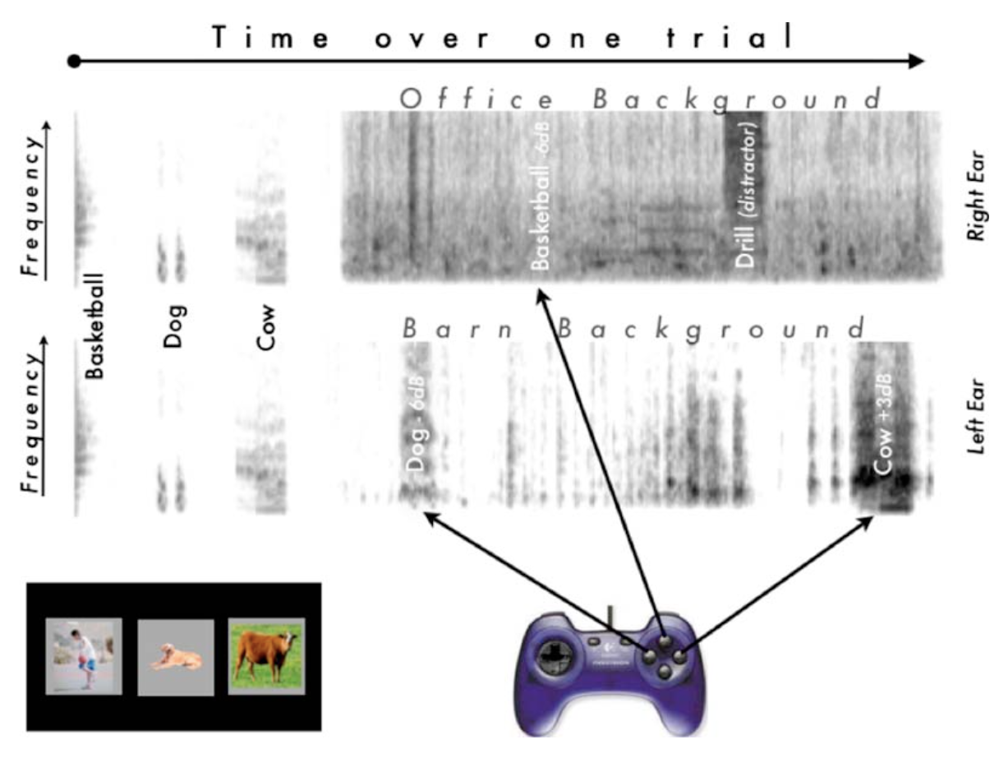

---
output:
  #bookdown::html_document2: default
  #bookdown::word_document2: default
  bookdown::pdf_document2:
    template: templates/brief_template.tex
    latex_engine: xelatex
  header-includes:
    - \usepackage{float}
    - \floatplacement{figure}{H}
    - \usepackage[defaultlines=3,all]{nowidow} 
documentclass: book
bibliography: references.bib
---

# APD study {#APD-study}

\chaptermark{APD study}

\minitoc <!-- this will include a mini table of contents-->

## Introduction

- APD definition: "unexplained idiopathic (spontanous) listening difficulty (LiD) is often termed auditory processing disorder (APD) in children who have symptoms of difficulty hearing and understanding speech, and abnormal results on more complex auditory tests, despite having normal pure-tone hearing sensitivity (Jerger & Musiek 2000; Musiek et al., 2017)" [Hunter et al., 2020]

- Prevalance of LiD ~ 10% (Sharma et al., 2009). Prevalence of LiD complaints with measured NH, complying with APD definition is estimated at ~0.5 to 1% of the general population (Hind et al., 2011; Halliday et al., 2017)

- Association with other developmental disorders and lack of understanding of the underlying auditory deficits of APD.

- "Hearing involves both "bottom-up" (ear to brain) and "top-down" (cortical to subcortical) pathways through simultaneous and sequatial processing (Moore & Hunter, 2013)" [Hunter et al., 2020]

- Two general mechanistic hypotheses of APD: 
  (1) **Sensory processing difficulties (bottom-up)**: involving the central auditory nervous system, are based on animal and human lesion studies (Snow et al., 1997). Supporters of this hypothesis suggested this can be assessed using low-redundancy (simple) speech tests (e.g., using added noise, filtering, rapid speech,..) to "stress" the highly redundant central auditory pathways to reveal deficits (Keith 1995, 2000; Cameron et al., 2014).
  (2) **Higher-level cognition or attention (top-down)**: especially in children with language disorders (Rees, 1973; Moore et al., 2010). 
  
Individuals may have a combination of both.

- There is no accepted consensus or gold standard diagnosis of APD (Wilson & Arnott 2013)

- Possible link between OME (+ grommets) or EHF HL and APD in a sub-group of children.

- OME related HL has been shown to persist after recovery at frequencies above 4 kHz (Hunter et al., 2020; REFs..) 

- OME or EHF HL can potentially be a basis for poorer speech perception, especially in noise. Findings are not consistent. Studies that tested both TD and APD with OME or EHF HL found that they are predictors of measurable peripheral damage in both groups. 

  - Besser et al. (2015) and Levy et al. (2015) found that better thresholds between 6 to 12.5 kHz were associated with better reception of speech in noise (adult studies).
  - Motlagh Zadeh et al. (2019): impairment in higher frequency regions could negatively impact speech perception.
  
  Conductive loss results in impaired spatial processing (Cameron et al., 2014) and binaural interaction (Hall et al., 1995; Hogan et al., 1996)
  
## Methods

### Participants
```{r, include=FALSE}
if(!require(ggplot2)){install.packages("ggplot2")}
if(!require(plyr)){install.packages("plyr")}
if(!require(dplyr)){install.packages("dplyr")}
if(!require(psych)){install.packages("psych")}
if(!require(english)){install.packages("english")}
if(!require(stringr)){install.packages("stringr")}
if(!require(nparLD)){install.packages("nparLD")}
if(!require(apa)){install.packages("apa")}

require(ggplot2)
require(ggbeeswarm)
require(psych)
require(english)
require(stringr)
require(knitr)
require(kableExtra)
require(lme4)
require(sjPlot)
require(car)
require(ggpubr)
require(patchwork)
require(coin)
require(effsize)
require(rstatix)
require(graphics)
require(nparLD)
require(apa)
require(tidyr)
library(conflicted)
require(plyr)
library(dplyr)

# fix conflicts:
conflict_prefer("filter", "dplyr")
conflict_prefer("arrange", "dplyr")
conflict_prefer("mutate", "dplyr")
conflict_prefer("select", "dplyr")
conflict_prefer("plot_grid", "cowplot")
conflict_prefer("summarise", "dplyr")
conflict_prefer("%>%", "magrittr")

## Initialisation ----------------------------------------------------------------------------------------------------
date <- Sys.Date()
FileDir <- getwd()

# deviance level for abnormal z-score
CutOff <- 1.96

# Filter buttons------------------------------------------------------------------------------------------------------
# 1. Remove NA's and observations with bad adaptive tracks 
CleanData <- 0 # On=1/Off=0 button

# 2. Remove specifc subjects 
RmvSubj <- 1 # On=1/Off=0 button
Subj2Remove <-c("APD14")  #"TD11"

# 3. Remove subjects based on their quality evaluation made by the examiner on the testing day 
QualityCtrl <- 0 # On=1/Off=0 button
rmvEval <- c("Bad") #  "Good" / "Maybe" / "Bad"

# 4. Remove APD subjects based on their diagnosis 
DiagCtrl <- 0 # On=1/Off=0 button
rmvDiag <- c("LiD","susAPD") #  "APD" / "LiD" (i.e., AP deficit and not a DISORDER) / "susAPD"

# 5. Removce APD subjects WITHOUT SPD patterns 
APDsubTypCtrl <- 0 # On=1/Off=0 button
rmvAPDType <- c(NA, "MissingReoprt") #  "SPD"

# 6. Remove outliers |z| > 2 
rmvOutlrs_z = 0
# 7. Remove outliers Cook's distance D
rmvOutlrs_D <- 0
# --------------------------------------------------------------------------------------------------------------------

# get demographics ---------------------------------------------------------------------------------------------------
d <- read.csv(file.path(FileDir,'Files','AllListenersDemographics_SK.csv'),header=T) 

# Clean data
d[is.na(d),]
d <- na.omit(d) # remove rows with missing data

# calculate age from DOB and testing day
if(!require(eeptools)){install.packages("eeptools")}
library(eeptools)

d$Age <- age_calc(as.Date(d$DOB,"%d/%m/%Y"),
                   as.Date(d$TestDate,"%d/%m/%Y"),
                   units = "years", precise = TRUE)
d$Age <- round(d$Age,1)

#unique(d$listener)
#length(unique(d$listener))

# get additional demographics -------------------------------------------------------------------------------------- 
d_Info <- read.csv(file.path(FileDir,'Files','BackgroundInfo.csv'),header=T)
d_Info <- d_Info[,-match(c("DOB", "TestingDay","Age", "Sex","Group"),names(d_Info))]

# merge data frames  -----------------------------------------------------------------------------------------------
d <- merge(d_Info,d,by=c("listener"))
cols <- c("AuditoryTraining","EarProblems","EarProblemsDur","SLT","Grommets","MusicalTraining","FMuse","Otoscopy","NrmlSpchUnderstanding")
d[cols] <- lapply(d[cols], factor)

d$Group <- as.factor(d$Group)
d$Group2 <- ifelse(d$Group=="APD","APD",ifelse(d$APDsibling<1,"TD_0","TD_1"))
d$Group2 <- as.factor(d$Group2)

# Filter data by groups  -------------------------------------------------------------------------------------------
TD <- d %>% filter(Group=="TD") %>% droplevels() 
APD <- d %>% filter(Group=="APD") %>% droplevels()
SexFreq_APD <- plyr::count(APD,"Sex")
DiagFreq <- plyr::count(APD,"Diagnosis")
SPDFreq <- plyr::count(APD,"SPD")
ClinicFreq <- plyr::count(APD,"Clinic")

TD_Age <- psych::describe(TD$Age)
APD_Age <- psych::describe(APD$Age)

Age_min <- ifelse(TD_Age$min >APD_Age$min,TD_Age$min,APD_Age$min)
Age_max <- ifelse(TD_Age$max >APD_Age$max,TD_Age$max,APD_Age$max)

## ------------------------------------------------------------------------------------------------------------------
# Some filtering: 
## ------------------------------------------------------------------------------------------------------------------
# Remove certain subjects 
if (RmvSubj==1){d <- d[ ! d$listener %in% Subj2Remove, ] %>% droplevels()}

# Quality control: Include / Subjects based on the quality of their testing 
if (QualityCtrl==1){d <- d[ ! d$ExpEval %in% rmvEval, ] %>% droplevels()}

# Remove APD subjects based on their diagnosis
if (DiagCtrl==1){d <- d[ ! d$Diagnosis %in% rmvDiag, ] %>% droplevels()}

# Include only APD subjects with SPD patterns 
if (APDsubTypCtrl==1){d <- d[ ! d$Subtype %in% rmvAPDType, ] %>% droplevels()}

# -------------------------------------------------------------------------------------------------------------------

# Filter data by groups  -------------------------------------------------------------------------------------------
Clean.TD <- d %>% filter(Group=="TD") %>% droplevels() 
Clean.APD <- d %>% filter(Group=="APD") %>% droplevels() 

Clean.TD_Age <- psych::describe(Clean.TD$Age)
Clean.APD_Age <- psych::describe(Clean.APD$Age)

SexFreq_Clean.APD <- plyr::count(Clean.APD,"Sex")
DiagFreq.Clean <- plyr::count(Clean.APD,"Diagnosis")
SPDFreq.Clean <- plyr::count(Clean.APD,"SPD")
ClinicFreq.Clean <- plyr::count(Clean.APD,"Clinic")


SexFreq_Clean.TD <- plyr::count(Clean.TD,"Sex")
SiblingsFreq.Clean <- plyr::count(Clean.TD,"APDsibling")
# Test for age difference between the groups
# use Welch approximation t-test due to the uneven sample size

# Age.t_test <- t.test(Age~ Group, data=d, conf.level = 0.95, paired = FALSE)
Age.t_test <- MKinfer::boot.t.test(Age~ Group, data=d, paired = FALSE,conf.level = 0.95, R = 9999)
# Results: t = 3.43, df = 40.955, p-value = 0.00139
# There is a significant difference between the groups, with APD children on average ~2 years older than the TD children.

Age.lm <- lm(Age~ Group, data=d)
Age.1wayANOVA <- anova(Age.lm)

########################### Test assumptions #########################################

# Normality: met
# homoscedasticity: met

#### normality (shapiro-wilk) ###########
# Do all the points fall approximately along the reference line? If YES we can assume normality.
# ggqqplot(residuals(w1))


# Option 1:
# linearity is met if p>.05
shapiro.test(residuals(Age.lm))
# W = 0.94461, p-value = 1.375e-11 --> NOT normaly distr.

# plot & test the residual
qqnorm(resid(Age.lm))
qqline(resid(Age.lm))

#### Homogeneity of variance (Levene's test) ###########
# homogeneity is met if p>.05

# Option 1: Is the lm model fully covered here?
leveneTest(residuals(Age.lm) ~ Group, data = d)
# -> homogeneity of the full model is met
```
<!-- `r as.english(sum(APD_Age$n),english.UK = TRUE)` -->
<!-- r round(Clean.APD_Age$mean,1)` -->

`r  Hmisc::capitalize(as.character(as.english(sum(TD_Age$n,APD_Age$n),english.UK = TRUE)))` primary school children who were native British English speakers with normal hearing acuity participated in the study. Amongst them twenty-one  belonged to the APD clinical group (`r SexFreq_APD[1,2]` females) with an average age of 11.0 $\pm$ `r round(Clean.APD_Age$sd,1)` years (range: `r round(Clean.APD_Age$min,1)` - `r round(Clean.APD_Age$max,1)` years). The remaining twenty-three (12 females) comprised of typically developing control children (TD) with no reported concerns or diagnosis of an auditory, language or other cognitive developmental disorder. The TD group average age was 9.5 ± 1.6 years and ranged between 7.0 to 12.1 years. Since not all the measurement equipment was easily portable and in order to maintain the same environment during the assessment across the complete sample, the children and their caregivers were required to travel to central London for the testing. In order to maximise the number of children taking part in the study, 8 out of the 23 TD children (35\%) had an APD sibling (TD$_{sib}$) which took part in a parallel study that took place on the same day of testing. All the children who participated in the study were required to have normal hearing acuity, defined as thresholds $\leq$ 25 dB HL at the octave frequency bands between 0.25 to 8 kHz and their eardrum had to be visible, healthy and intact in both ears following otoscopic inspection. One APD participant was excluded from the analysis due to raised thresholds predominantly in the right ear, ranging between 30 to 45 dB HL (PTA$_{Right}$ = 36.25 dB HL; PTA$_{Left}$ = 13.75 dB HL), thus resulting in a final APD group size of twenty[^Chapt3-1]. Otoscopic inspection of the child's ear canal revealed a large accumulation of cerumen in both ears with an occluded right ear. Two additional children (x1 APD, x1 TD) had slightly raised thresholds at 8 kHz in one ear of 35 and 30 dB HL, respectively. However, since thresholds at all other frequency bands were well within the $\leq$ 25 dB HL criteria they were not excluded.\

[^Chapt3-1]: PTAs were calculated by averaging the individual's thresholds at the frequencies 0.5, 1, 2 and 4 kHz separately for the right and left ear (PTA$_{Right}$, PTA$_{Left}$).


APD children were recruited in two ways. Children diagnosed with APD at Great Ormond Street Hospital (GOSH) or at the London Hearing and Balance Centre (LHBC), London, UK, were identified based on their clinical records and were contacted by a clinical team member. The caregivers were provided with information about the study and means of contact to express interest in participation. Others, including the TD group were recruited by advertisements on social networks (e.g., APD Support UK Facebook group), science events, local information boards and UCL staff newsletter email, where parents were requested to fill-out an online interest form with short screening questions to ensure that the child met the participation requirements. Most of the children in the APD group (85\%, 17/20) were reported to undergo an APD assessment at GOSH, about a third were directly recruited from the clinic. The remaining three were reported to be assessed at the LHBC, at the University of Southampton Auditory Implant Service or the Chime Audiology Royal Devon & Exeter Hospital (screening only).\

Our initial aim was to take a conservative stance on inclusion criteria by including only those who met a clinical APD criteria (2 SD below the norms on two or more tests during the assessment). Moreover, being aware of the high prevalence of APD children with additional co-occurring developmental disorders, we strived to recruit children who displayed a "pure" form of APD without reported diagnosis or concerns for additional developmental disorder/s. However, very few APD children met these strict criteria. Only 75\% (15/20) met the clinical criteria of APD, out of which 60\% (9/15) were diagnosed with spatial processing disorder (SPD) due to abnormal SRM in the LiSN-S task (see Table \@ref(tab:Background-Tab) for descriptives of the APD group). Of the remaining children in the APD group, four did not meet the diagnostic criteria for various reasons (e.g., young age, lack of psychological educational evaluation report and the need to exclude other deficits), however their assessment report acknowledged some "auditory processing difficulties", whereas the fifth child awaited an APD assessment following an APD screening. Due to the small sample-size these children were included in the APD group for the analysis. Nevertheless, they were subdivided as children with Listening Difficulties (LiD) and differences in performance LiD and APD children were later explored. Furthermore, half of the APD group (10/20) were reported for being diagnosed with one or more secondary developmental disorder/s (x6 Dyslexia, x3 HF-ASD, x3 DLD, x1 ADHD, x1 ADD, x1 Dyspraxia, x1 visual stress, x1 sensory integration disorder, and x1 poor short-term working-memory). Nonetheless, several caregivers reported that their motivation for seeking additional diagnosis was to get more help from the school, rather than a real concern, after feeling that their support for their child's APD was lacking.\
  
  
  
```{r,label='Background-Tab', echo=FALSE, message=FALSE}
BackgroundTab <- read.csv(file.path(FileDir,'Files','BackgroundStats.csv'),header=F) 
colnames(BackgroundTab)[1:2] <- c(" "," ")

kbl(BackgroundTab, booktabs = T,escape = F, linesep = "\\addlinespace",caption = "APD group demographics and APD-related history background.",
    align = c("ll"),format = "latex") %>%
  # kable_styling(font_size = 9,latex_options = c("scale_down")) %>%
  add_footnote(c("MEHx: History of middle ear problem","PET: Pressure equalisation tube"), notation = "none") %>%
    column_spec(1, bold = T ,width = "10em")  %>%
    column_spec(2 ,width = "20em")
```

Caregivers from both groups completed a comprehensive background questionnaire, similar to the one that is typically given prior to an APD assessment, concerning the caregiver/s educational level, child and family history of hearing, listening problems and developmental disorders, child history of otitis media with effusion (OME), pressure-equalisation tubes (PET / grommets), pregnancy-related questions (e.g., complications, prematurity, etc.), APD-related (e.g., date of diagnosis, location, use of FM device and auditory training), any diagnosis or concerns regarding the child's speech, language, educational and/or cognitive skills, speech and language therapy, medication taken, musical training and the type of school the child attends.\

Children in the APD group were on average 1.5 years older than children in the TD group. Difference in age between the two groups was tested with a
one-way ANOVA using *anova()* function (parametric assumption of normal distribution and homoscedasticity were met). The test revealed a significant 
difference in age between the groups [F(1,41) = 11.58, p\ \<\ 0.01]. Nonetheless, since age is often reported as a strong predictor for performance in other similar behavioural studies, analysis of the results obtained in the current study was conducted for age-independent scaled scores and should not affect the comparison between the two groups. The project was approved by the UCL Research Ethics Committee (Project ID Number 0544/006) and the NHS Health Research Authority (REC reference: 18/LO/0250). The testing commenced once an informed consent was given by both the caregiver and the child.

<!-- t-test with Welch degrees of freedom correction for uneven sample-size [independent-samples with bootstrapping n=9999; MKinfer package; @MKinferPackageR], showing a significant difference in age between the groups [t(`r round(Age.t_test$parameter,2)`) = `r  round(Age.t_test$statistic,2)`, p = `r round(Age.t_test$p.value,3)`]. -->

### Measurements
The test battery used in the present study is described in the following section and summarised in Table\ \@ref(tab:Methods-Tab). 

```{r,label='Methods-Tab', echo=FALSE, message=FALSE, eval=TRUE}
MethodsTab <- read.csv(file.path(FileDir,'Files','Methods.csv'),header=T) 

kbl(MethodsTab, booktabs = T,escape = F, linesep = "\\addlinespace",caption = "Summary of the study test battery.",
    align = c("lll"),format = "latex") %>%
  row_spec(0,bold=TRUE) %>%
  kable_styling(font_size = 9,latex_options = c("scale_down")) %>%
    column_spec(1, bold = F ,width = "12em") %>%
    column_spec(2 ,width = "24em") %>%
    column_spec(3 ,width = "10em")

```

#### Auditory evaluation

##### Standard & extended high-frequency (EHF) audiometry {.unnumbered}
\
Otoscopic inspection was performed prior to the audiometric test to ensure the ear was clear from cerumen and to avoid harming the eardrum when inserting the ear probe. Both standard and extended high-frequency (EHF) audiometry thresholds were measured using the Hughson-Westlake manual procedure, starting from 1\ kHz. Standard air conduction pure-tone audiometry was carried out at six octave frequency bands ranging between 0.25 to 8 kHz using a standard clinical manual audiometer via headphones.\

Extended high-frequency pure-tone detection thresholds were manually measured at four frequencies 8, 11, 16, \& 20 kHz using locally written MATLAB based software which generated the stimuli and recorded the data. Target tones were pulsed (3 repetitions) with a duration of 700 ms and 50 ms rise/fall time. EHF measurements took place in a sound attenuated chamber with the child sitting in the centre of the chamber while the examiner was situated outside. Communication during the testing was carried out via a video-audio intercom system. The child was instructed to raise his/her hand each time s/he heard a tone. The MATLAB script was executed using a Windows PC which which was connected via USB to an RME FireFace UC sound card (Audio AG, Haimhausen Germany) and an ER10X Extended-Bandwidth Acoustic Probe System (Etym$\bar{o}$tic Research, Elk Grove Village, IL, USA). Stimuli were presented via an otoacoustic emission probe with silicon tips in variable sizes (between 8 to 13 mm), depending on the size of the child's ear.\


Standing waves in the ear canal produces spatially non-uniform sound pressure at frequencies above 2-3 kHz, introducing calibration errors when estimating the sound pressure level arriving at the eardrum [@Siegel1994; @Richmond2011; @Lee2012]. Together with other factors such as individual variations in the ear canal length and differences in depth in which the ear probe is inserted into the ear canal, these factors can introduce up to 20 dB calibration error [@Siegel1994]. To account for that, a sound pressure level calibration was applied using ARLas MATLAB-based software package [@ARLas], using a similar technique as described by @Lee2012. [*accurate??*]{.correction} The first half-wave resonance of the ear canal was measured for each frequency using chirp noise, estimating the distance between the ear-probe and the eardrum. The target stimulus was then set to the desired output level that corresponds to 0 dB HL using the in-situ calibration forward-pressure level data (FPL) and EHF-specific weighting thresholds (in dB SPL) measured across 84 NH listeners aged 10 to 21 years [see Table 1 in @Lee2012]. 

##### Switching task (ST)
\
Estimating the effect of IM while minimising peripheral EM on speech perception was measured using the switching task (ST) which is believed to assess the listeners ability to switch attention and integrate of binaural information. The same test procedure and equipment was used as described in Chapter\ \@ref(Chpt1). Listeners were presented with both test versions using the ASL and the CCRM speech material. As for the stimuli, the ASL target sentences, spoken by a single male talker, were taken from the final sentences selected following the normalisation study. In addition, a level correction was applied to each sentence using the sentence-specific weighing factors estimated in the normalisation study (see Chapter\ \@ref(Chpt2)). The first five test lists out of the eight phonetically-balanced normalised test lists (25 sentences each) were used, whereby their order was quasi-randomised to account for order, masker combinations, and fatigue effects. The target CCRM sentences were the same as described in Chapter\ \@ref(Chpt1), spoken by three different male talkers. These were selected at random every trial and always began with the priming animal 'dog'. The target speech material was presented either without a distractor (Quiet), with and without switching (NoAlt / Alt) or with a distractor. A selection of four distractors were used (see Chapter\ \@ref(Chpt1) for detailed description): English (ENG_F) and Mandarin (MDR_F) unrelated connected-speech, each spoken by ten different female talkers, and a non-speech amplitude-modulated speech-spectrum-noise (AMSSN) with the envelope of a single talker out of 40 talkers (20 females). The fourth distractor was presented only with the CCRM speech material and comprised of CCRM target-like sentences (CCRM_F) with a different priming animal, colour and digit, spoken by ten different female talkers. Each participant was presented with a total of 11 runs, one for each test condition, with 5 conditions for the ASL (Quiet-NoAlt,Quiet-Alt, MDR_F-Alt, ENG_F-Alt), and 6 for the CCRM (with the additional CCRM_F-Alt condition). 

```{block type='correction'}
The starting DC was 0.97 (i.e., signal is almost entirely present) which the SRdT upper limit. Subsequently, the DC varied depending on the listeners response, with an initial step-size of 0.12 which decreased gradually over the first three (practice) reversals to 0.05. Nonetheless, as in the adult studies (see Chapter\ \@ref(Chpt1)), the minimum step-size for the ASL conditions ENG_F and MDR_F was set to 0.1. This is because of a pilot data suggested that the psychometric functions of these conditions were shallower. 
```

Testing started following a practice phase, where four trials of each of the eleven test conditions were presented. Practice runs started at an easy-to-moderate DC of 0.8 in order to expose the listeners to the adaptive procedure. In addition, every test run started with two practice sentences (initial DC = 0.97) to orient the listeners to the test condition that was about to be presented.\

<!-- *repetative? refer to Chapter to instead and list only the stimuli that is used?* -->
<!-- The switching task (ST) is a novel speech-on-speech listening task that involves perception of interrupted and periodically segmented speech that is switched between the two ears out-of-phase with an interrupted distractor. Since segments of the target and of the distractor are never presented in the same ear at the same time, it enables to eliminate peripheral (EM) masking, while maintaining high IM for speech distractors. The task assesses the ability to switch attention and integration of binaural information. -->

##### Listening in Spatialised Noise Sentences UK (LiSNS-UK)  
\
The locally developed Listening in Spatialised Noise Sentences UK (LiSNS-UK) assesses the ability to use binaural cues in speech-on-speech listening conditions. The test development, speech material normalisation, and norms standardisation followed @Cameron2007 and are described in detail in Chapter\ \@ref(Chpt2). The test uses virtualisation techniques to create a spatial distribution of sound sources in space for headphone presentation where target sentences [ASL; @MacLeod1990] are presented in two simultaneous speech distractors (unrelated children's stories spoken by the target talker). The LiSNS-UK comprises two main listening conditions, differing in their availability of spatial cues. The target sentences are configured to always appear in front of the listener at 0$^{\circ}$ azimuth on the horizontal plane, with the two streams of speech distractors either collocated in space with the target (S0N0), resulting in relatively poor speech perception, or offset in space, with one distractor to either side of the target at $\pm$ 90$^{\circ}$. The spatial separation in the latter condition results in an improvement in speech perception of circa 13 dB [@Cameron2011], typically termed as spatial release from masking (SRM). This SRM advantage is calculated by taking the difference between performance in the collocated and the separated condition.\

Speech distractors were presented continuously throughout a run at a fixed 65 dB SPL output level and comprised of a combination of two out of three available passages. A 1-up/1-down adaptive procedure was used, varying the level of the target talker relative to the distractors depending on the listener's response to measure their speech reception threshold (SRT), i.e., the signal-to-noise-ratio (SNR) yielding 50\% speech intelligibility. A 200 ms long reference cue (1 kHz pure-tone) was presented 500 ms before the target sentence onset at 65 dB SPL. The initial target output level was 75 dB SPL for the collocated condition and 70\ dB\ SPL for the separated condition with an initial step-size of 4 dB SNR. The step-size was reduced after the first three reversals, reaching a minimum step-size of 2 dB SNR. The adaptive procedure ended once all 25 test trials were presented and stopped in case a maximal output level of 89\ dB\ SPL was reached more than three times. Nonetheless, such an event did not occur in the present study. Since each listener was only presented once with each condition, it was decided not to introduce any other stopping rules that could have expedited the testing time but may as well have introduced an estimation error for the SRTs in some cases. The SRT was calculated by averaging the test reversals SNRs, whereby test reversals were defined as any reversals following three practice reversals.\

The order of the listening condition, test lists, sentences within a run, and distractor combinations was fixed across all the participants and started with the collocated condition. Each test list consisted of 25 sentences taken from the 8-phonetically-balanced ASL test lists which were constructed following the normalisation study with a sentence-specific level corrections (see Chapter\ \@ref(Chpt2)). Spatialisation was applied by convolving each stimuli with head-related transfer functions (HRTFs) at the corresponding azimuthal direction separately for the left and the right channel. The HRTFs were measured with a Knowles Electronics Manikin for Acoustic Research (KEMAR) with a small pinnae taken from the CIPIC HRTF database[^Chapt3-2] [see @Algazi2001, "special" HRTF data]. A post-equalisation step was applied in order to flatten the magnitude of the headphone frequency response. Headphone-to-ear Transfer Functions (HpTFs) measured with a KEMAR manikin for HD-25 supraaural headphones were extracted from the @Wierstorf2011 HRTF database. The final mixed stimulus was filtered with the inverse HpTFs separately for the left and the right channel before being combined together as a final step. Every participant was presented with two runs, one for each listening condition (collocated / separated). Testing started following a practice phase of two runs, one for each of the test conditions with five BKB sentences each [@Bench1979]. Listeners were instructed to verbally repeat the target sentences to the experimenter who was situated alongside in a sound treated chamber. The experimenter scored the response by selecting the correctly repeated keywords on the screen. Listeners were encouraged to guess if unsure while no feedback was given at any time. A loose keyword scoring method was used, whereby errors of case or declension were considered as correct responses, e.g., a repetition of the keywords '$<$clown**s**$>$ $<$funny$>$ $<$face**s**$>$' to the stimulus 'The $<$clown$>$ had a $<$funny$>$ $<$face$>$'.

[^Chapt3-2]: The database is available online in: <https://www.ece.ucdavis.edu/cipic/spatial-sound/hrtf-data/>

##### Speech-spectrum-noise (SSN)  
\
A speech-in-noise test was used as a more conventional listening task that is widely used in the clinic as opposed to the more complex listening conditions measured by the ST or the LiSNS-UK. The normalised ASL sentences were presented in a speech-spectrum-noise (SSN) with spectrum matched to the ASL corpus. The SSN onset was 500 ms before the target sentence began. The same adaptive procedure as for the LiSNS-UK was used with the same stopping-rules and SRT calculation. Each listener was presented with a single run of 25 sentences following a practice phase with seven BKB sentences. The same test list and sentences order was used across all the listeners.

##### The Environmental Auditory Scene Analysis task (ENVASA)  
\
In analogy to the classic 'cocktail-party' scenario, ENVASA is a non-linguistic paradigm [@Leech2009] that measures detection of everyday environmental sounds presented in naturalistic auditory scenes and can be used to asses IM effects as well as sustained selective auditory attention skills. In the task, short environmental target sounds (e.g., a dog's bark, a door knock, or a bouncing ball) were presented in a dichotic background scene (i.e., the target sound is presented only in one ear), consisting of either a single background scene, presented in both ears, or two background scenes, each presented in a different ear. The number of targets, the onset time and the ear of presentation varied across trials. Four SNRs were employed split into two categories 'low' (-6 and -3 dB) and 'high' (0 and +3 dB). Target-background contextual agreement was manipulated by embedding the target sound in a *congruent* background scene that is in agreement with the listener's expectations (e.g., a cow's 'moo' in a farmyard scene) or in an *incongruent* background scene which violate these expectations (e.g., a cow's 'moo' in a traffic scene). A schematic illustration of a single test sequence is shown in Figure \@ref(fig:ENVASA).\

The experiment was carried out using the original setup as described by @Leech2009. Sounds were presented via Sennheiser HD-25 headphones (Wedemark, Germany) and the participants response was recorded using ???? gamepad. The output level was adjusted to a comfortable level before the test started. The participants were situated in front of a laptop and were instructed to hold the gamepad. Prior to the test, the listeners were presented with a short child-friendly demonstration video with audio instructions. Next, a short recap was given verbally by the examiner and an exemplary trial was simulated together with the child to ensure that the child fully understood the task's instructions. The task began with three short practice trials with provided feedback, while no further feedback was given during the test phase.\

Every trial was made of two parts, starting with a target audio and visual familiarisation phase before the main target detection phase. Target identification was recorded by pressing one of the three buttons on the gamepad which corresponded to the location of the target objects on the screen. A response was counted as correct only if the participants pushed the corresponding button within 2 seconds, 300 ms after the target onset. The outcome measure was calculated as the percentage of target sounds correctly identified within a condition (%-correct). In total there were 115 target sounds presented over 40 trials, where 46 target sounds were presented in a single background condition and another 46 in a dual-background condition. The 23 remaining target sounds served as foil items which were played at 0 dB SNR without a corresponding picture on the screen. The order of the foil items was quasi-randomised and was used to estimate the quality of the participants performance.\

(ref:Leech2009) Schematic of the ENVASA experimental paradigm [taken from @Leech2009]

```{r, label='ENVASA', fig.cap="(ref:Leech2009)", out.width='75%', fig.align='center', echo=FALSE}


```

##### CELF-RS  
\
The Recalling Sentences (RS) sub-test of the Clinical Evaluation of Language Fundamentals UK fifth edition [CELF-5-UK; @HWiig2017] was administered to assess the listeners expressive language skills, measuring the ability to repeat in verbatim sentences with varying length and complexity. Standardised norms are available for children aged 5 to 16 years. The CELF-RS is simple and quick to administer and has been shown to be a good psycholinguistic marker for children with Developmental Language Disorder (DLD) and to provide high levels of sensitivity and specificity [@Conti-Ramsden2001], thus making it a good screening tool. Scoring was done by hand by the examiner as instructed by the test manual. The sentences were presented using a local MATLAB program via headphones using the same experimental equipment as listed above at a comfortable output level of 70 dB HL. The sentences were spoken by a female speaker with a standard southern British English accent and were recorded in a sound-treated recording booth at the Speech, Hearing and Phonetics Sciences (SHaPS), UCL laboratory, London. The task began with two practice sentences while the number of test items varied depending on the child's age and performance. No repetitions or feedback were given during the testing and the test was discontinued in case the child failed to score any points for four consecutive items. Age-scaled scores were calculated based on the test norms with a mean score of 10 and SD of 3. Scaled scores within $\pm$ 1 SD from the norms mean (between 7 to 13) are classified as average scores, whereas performance beyond $\pm$ 1 SD are classified as above / below the average score, with scaled-scores \<\ 7 considered as abnormally poor.\

#### Questionnaires

##### The Evaluation of Children's Listening and Processing Skills (ECLiPS)  
\
The ECLiPS questionnaire [@Barry2014] comprises 38 items, where the respondents are asked to express their agreement on simple statements about the child's listening and other related skills or behaviours using a five-point Likert scale (from "strongly agree" to "strongly disagree"). The ECLiPS was designed to identify listening and communication difficulties in children aged 6 to 11 years. Nonetheless, in their evaluation study, @Barry2014 found little to no age effect in many of the scale items, suggesting that testing age could be extended below and beyond the population used for the development. Based on factor analysis the items were grouped into five subcategories: 1. Speech & Auditory Processing (SAP), assessing ability to interpret speech and non-speech input, 2. Environmental & Auditory Sensitivity (EAS), estimating the ability to cope with environmentally challenging conditions, 3. Language, literacy & laterality (L/L/L), assessing different abilities that are known to be coupled with language and literacy difficulties, 4. Memory & Attention (M&A), covering short-term and serial memory as well as attention, 5. Pragmatic & Social skills (PSS), assessing pragmatic language or non-normative social behaviours. Aggregated measures were calculated for *Listening* (SAP, M\&A, \& PSS), *Language* (L/L/L \& M\&A), *Social* (PSS \& EAS), and a *Total* aggregate, calculated by taking the mean of scores across all the sub-scales. Individual age- and sex-scaled scores were computed using the test Excel-based scorer. A score below the 10$^{th}$ percentile (corresponding to a scale score of circa 6) is generally considered clinically significant.\

##### The Children's Communication Checklist 2$^{nd}$ edition (CCC-2)  
\
Communication abilities were assessed using the Children's Communication Checklist second edition questionnaire [CCC-2; @Bishop2003] which is designed to screen communication problems in children aged 4 to 16 years. It comprises 70 checklist items each consisting of a behaviour statement, like "*Mixes up words of similar meaning*". The respondents are asked to judge how often the behaviours occur using a four-point Likert rating scale: 0. *less than once a week (or never)*, 1. *at least once a week, but not every day*, 2. *once or twice a day*, 3. *several times (more than twice) a day (or always)*. The items are grouped into ten sub-scales of behaviours tapping into different skills (A. Speech, B. Syntax, C. Semantics, D. Coherence, E. Inappropriate initiation, F. Stereotyped language, G. Use of context, H. Non-verbal communication, I. Social relations, J. Interests). Taking the sum of scores for the sub-scales A to H are used to derive the General Communication Composite (GCC) which is used to identify clinically abnormal communication competence. A GCC score \< 55 was found to distinguish well between control and clinical groups, using a criterion of scores in the bottom 10\% [@Norbury2005]. Another proposed composite is the SIDC (Social-Interaction Deviance Composite) which is calculated by taking the difference in the sum of subscales E, H, I, and J (tapping into pragmatic language and social skills) from the sum of scales of A to D (describing structural language skills). Abnormal GCC (\< 55) combined with a negative SIDC score has been shown to be indicative of an autistic spectrum disorder profile [@Bishop2003]. The CCC-2 scaled and composite scores were computed using the test scorer.\

### Procedure
Testing took place at the SHaPS laboratory (UCL, London) in a sound-attenuated chamber. Unfortunately, since many of the APD children had to travel from outside London and because of difficulties in recruitment, all the testing had to be completed in a single session, lasting in total circa 2.5 to 3 hours (including breaks). To minimise possible fatigue effect, the session was carefully designed to ensure several planned and unplanned breaks The participants were encouraged to request a break between test runs whenever they required and were observed for any signs of fatigue by the examiner. The different tasks were gathered into short blocks and different measures were scattered throughout the session to keep the session fun and engaging for the child. At the end of the session, each child received a certificate and an Amazon voucher as a token of appreciation for taking part in the study. Travel costs of the family were reimbursed.\

Participants from both the TD and the APD group completed the same test battery in the below listed order (see Table \@ref(tab:Study-Procedure)). The ECliPS, CCC-2 and the locally compiled background questionnaire were completed by the caregiver during the testing day. The session started with a standard pure-tone audiogram and otoscopy to ensure that detection thresholds fulfilled the study criteria and that there were no abnormalities in the ear canal and the eardrum. Next, the switching task was conducted. Since performance in the task was one of the main focuses in the study, and because little is known about any possible learning effect in the task, presentation of the two speech materials (ASL and CCRM) was counterbalanced within each group, where about half of the children started with the ASL and the other half with the CCRM speech material. In between the two ST versions, each child completed the CELF-RS and the SSN task, whereby again, the order of presentation was counterbalanced within each group. Since both CELF-RS and SSN test duration are relatively short, they served as a short informal break between the ST test versions and kept the child engaged. Next, about half-way through the session, with a fixed order, all the participants were presented with the EHF audiometry, and the ENVASA task. The session was concluded with the LiSNS-UK, in-line with typical clinical assessment where the test is often presented last.\

```{r,label='Study-Procedure',echo=FALSE,warning=FALSE, message=FALSE}
ProcedureTab <- read.csv(file.path(FileDir,'Files','APD_procedure.csv'),header=T) 

colnames(ProcedureTab)[2:5] <- c("Group A","Group B","Group C","Group D")

kbl(ProcedureTab, booktabs = T,escape = F, linesep = "",caption = "Experimental design and measurements order.",
    align = c("lllll"),format = "latex") %>%
    kable_styling(font_size = 8, latex_options = c("scale_down"))
```

### Data Analysis
All the data extraction, management and analysis in the present study was computed in an R environment [Version 4.0.3; @RCore] using RStudio [Version 1.4.938; @RStudio].\

#### Age-scaled scores {#z-scores}
Age-independent scores were estimated using a linear regression model. The model was fitted per condition separately for each measure (ST-ASL, ST-CCRM, LiSNS-UK, SSN, & ENVASA) and was based on the control group data only with the respective test raw scores (e.g., SRdT, SRT or \%-correct) as a dependent variable and age as a predictor. A two-step model comparison was performed to test the assumption that performance displayed a monotonic linear relationship with age versus a non-monotonic (segmented) linear relationship, implying an asymptote in performance with age (e.g., for a task in which children did not improve after a given age). Extreme outliers were initially trimmed from the TD group to reduce noise in the data and to improve the model fit. In the first step, both models were computed and the best model was selected based on an F-statistic model comparison based on analysis of variance ANOVA, using the *anova()* function. Standardised residuals were next calculated for each TD listener, based on the selected model prediction. Since age was included in the model, the standardised residuals are age-independent and are comparable to z-scores for data with a normal distribution, with a mean and SD of approximately 0 and 1. Since the main goal of the study was to find a measure that is able to well separate between the APD group and the typically developing control group, individual differences and group differences were explored using a deviance analysis procedure proposed by @Ramus2003. Abnormal scores were defined by a two-tailed deviance cut-off of $\pm$ 1.96 SD from the TD group mean. Thus, circa 95% of the normal population residuals are expected to be within the deviance range of $\pm$ 1.96. Occasional occurrence of abnormal scores in the normal population is not unusual in behavioural measures. Therefore, since the prediction of the residuals is based on the control data, such outliers may skew the TD group true mean or SD and thus may introduce an error in the model prediction. Therefore, in the second step, additional TD outliers (with standardised residuals below/above TD mean $\pm$ 1.96) were trimmed from the data and the two models were refitted and compared again. Finally, the model with the best fit was selected and was used to calculate the standardised residuals for all the listeners, including the trimmed TD observations and the APD group.

#### Statistical analyses
Residual analysis was performed separately for each measure to determine whether the data fulfils parametric methods assumptions of normal distribution using the Shapiro-Wilk test [*shapiro.test()*, @RCore] and homogeneity of variance using Levene's test [*leveneTest()*; @carPackageR]. Consequently, statistical analyses for factorial design data that met these requirement was performed using linear mixed-effects regression models (LMEMs). LMEMs was fitted using the *lmer()* function [lme4 package; @lme4PackageR]. A Backward model selection procedure was applied to find the model that gives the best fit using a likelihood ratio test ($\chi^2$). Main effects and interaction terms were tested by comparing predictions of the full model to a reduced model where each fixed term was separately removed, starting with the interaction terms. When applicable, post-hoc paired-comparison t-tests were performed on the fitted model and included adjusted least-squared-mean for the random intercepts (subjects) using the *lsmeans()* function from the emmeans R package [@emmeansPackageR]. In addition, group differences for a single parametric measure such as in the CELF-RS and the CCC-2 total score were examined using a one-way analysis of variance using the *anova()* function. Post-hoc pairwise comparison t-tests with Bonferroni correction were computed using the *pairwise_t_test()* function [rstatix package; @rstatixPackageR].\

<!-- In addition, group differences for single parametric measures such as CELF-RS and CCC-2 total score were examined using *boot.t.test()* function [MKinfer package; @MKinferPackageR] which performs independent-samples t-test with bootstrapping (n=9999).\ -->

Nonparametric data were analysed using the *nparLD()* function [nparLD package; @nparLDPackageR] which is a robust rank-based method for analysis of skewed data or for data with outliers or from a small sample size [see @Feys2016 for a good introduction to robust nonparametric techniques]. This function enables different types of nonparametric tests for factorial design data with repeated measures with variable between-/within-subjects factors. The results reported in the present study were based on the ANOVA-type statistic test (ATS) output. Inspection of the ENVASA task age-independent z-scores revealed that the assumption of sphericity (Mauchly's test) was violated. Therefore, analysis was performed using the *npIntFactRep* package [@npIntFactRepPackageR], which is another robust aligned-rank technique that enables sphericity correction (Greenhouse-Geisser). When applicable, post-hoc pairwise comparisons were computed using a Wilcoxon rank-sum test which is a t-test equivalent for nonparametric data using the *wilcox_test()* function either from the rstatix package [@rstatixPackageR] or the coin package which also enables permutation [@CoinPackageR]. Group differences for the ECLiPS total score were examined using a robust one-way ANOVA with trimming means (20\%) and bootstrapping (N = 2000) using the *t1waybt()* function from the WRS2 package [@WRS2PackageR], followed with a corresponding post-hoc tests with the same trimming and bootstrapping using the *mcppb20()* function from the same package.\

```{block type='correction'}
Perhaps the way I use *wilcox_test()* needs a further examination. 

- I can't get *coin::wilcox_test()* function to run for groups with 3 levels, so used *rstatix::wilcox_test()* instead.
- On the other hand, only *coin::wilcox_test()* worked for 2-way interaction.
```

<!-- Whereby TD children with an APD sibling were were classified as 1 and TD children without APD siblings were classified as 0 -->

## Results

### Standard audiometry
The listeners' detection thresholds for the left and the right ear are plotted in Figure \@ref(fig:PTA). The shaded grey area represents the TD group's range of thresholds and the white line represents the group mean at each frequency. The black lines mark the individual thresholds in the APD group and the group mean is marked by the bold black line. The dashed line indicates the maximal threshold criterion of $\leq$ 25 dB HL for participation in the study.\

```{r, label='PTA', fig.cap="Standard audiometry: APD participants pure-tone detection thresholds plotted seperately for the left and the right ear (black lines). The shaded grey area represents the TD group thresholds range and the white line represents the TD group mean at each frequency. The dashed line represents the threshold criterion of hearing level $\\leq$ 25\ dB\ HL.", echo=FALSE, fig.align='center', figures-side, out.width='85%',fig.width=12, fig.height=6}

# Define axes
# xaxis=c(1:8) # number of frequencies tested
# 250	500	1000	2000	4000	6000	8000
FreqAxis=c("0.25","0.5","1","2","4","8")
frqs=c(0.25,0.5,1,2,4,8)

# min and max of y axis
max	=	max((d[1:nrow(d),27:38]),na.rm=T) + 17
min	=	min(d[1:nrow(d),27:38],na.rm=T) - 10

# Plot overlapping individual audiograms of test group, mean of test group, and mean +/- 1 sd of control group
# Assumes test group and control group are in same .csv file (different columns)

TD = d[grep("TD", d[,1]),] 	 #control group
APD = d[grep("APD", d[,1]),] #test group

# plot left and right ear
#layout(matrix(c(1:2), 1, 2, byrow = TRUE))
par(mfrow=c(1,2),mar=c(0,0,0,1.5),oma=c(7,7,1,1))

for (j in 1:2){
  
  # create empty plot
  plot(frqs,xlim=c(frqs[1],max(frqs)),type="n",axes=FALSE,ann=FALSE,ylim=rev(range(c(min,max))),log = "x")
  box()
  
  mtext(outer=T,side=1,line=3,text="Frequency (kHz)",cex=1.5)		
  mtext(outer=T,side=2,line=3,text="Hearing threshold (dB HL)",cex=1.5)	
  
  if (j<=1){
    axis(2,col="black",cex.axis=1.5)
    text(5,-14,"Left",cex=1.5)
  }  else {
    text(5,-14,"Right",cex=1.5)
  }
  
  axis(1,at=frqs,lab=FreqAxis,cex.axis=1.5)
  
  # Left ear
  if (j<=1) {
    numCol = 33:38
  } else {
    # Right ear
    numCol = 27:32
  }
  # calculate mean for test group
  avg<-vector()
  for (i in numCol){
    avg[i-(numCol[1]-1)]<-mean(APD[1:length(APD[,1]),i])
  }
  
  ## calculate mean and sd for control group
  stdev <- vector()
  mn <- vector()
  for (i in numCol){
    stdev[i-(numCol[1]-1)]<-sd(TD[1:length(TD[,1]),i],na.rm=T)
    mn[i-(numCol[1]-1)]<-mean(TD[1:length(TD[,1]),i],na.rm=T)
  }
  
  # calculate min and max for control group
  mnn <- vector()
  mx <- vector()
  for (i in numCol){
    mnn[i-(numCol[1]-1)]<-min(TD[1:length(TD[,1]),i],na.rm=T)
    mx[i-(numCol[1]-1)]<-max(TD[1:length(TD[,1]),i],na.rm=T)
  }
  
  # calculate upper and lower boundaries of shaded area
  upper <- mnn
  lower <- mx
  
  # plot shaded area (mean +/- 1 sd)
  xx <- c(frqs, rev(frqs))
  yy <- c(lower,rev(upper))
  polygon(xx, yy, col="lightgrey",border=NA)
  
  # plot mean control group
  lines(frqs,mn,col="white",lwd=3)
  
  # plot individual audiograms test group
  for (i in 1:length(APD[,1])){
    lines(frqs,APD[i,numCol])
  }
  
  # plot mean test group
  lines(frqs,avg,lwd=4, col="black")
  
  # plot exclusion criteria line
  #lines(c(0:9), seq(25,25,length=10),lty=2,lwd=3)
  lines(c(0.25, 0.50, 1.00, 2.00, 4.00, 8.00, 8.00, 4.00, 2.00, 1.00, 0.50, 0.25), seq(25,25,length=12),lty=2,lwd=3)
  
  if (j<=1){
    yplot <- 35
    # plot legend
    legend(0.24,yplot, c("Mean APD","Individual APD","Mean and range TD","NH criteria"),
           lty=c(1,1,1,2),lwd=c(3,2,8,2),col=c("black","black","lightgrey","black"),cex=0.8,bty=0,box.col="white")

    # Add white line to legend for mean
    segments(x0 = .24, y0 = 42.8, x1 = .33, y1 = 42.8,col = "white", lwd = 3)   
  }
}

```

Boxplots of listeners' pure-tone detection thresholds measured at six frequencies between 0.25 to 8 kHz and their corresponding pure-tone-average (PTA) are shown in Figure \@ref(fig:RegAud-fig) A-B. Individual PTAs were calculated by averaging thresholds at the frequencies 0.5, 1, 2 and 4 kHz separately for the left and right ear (PTA$_{Left}$, PTA$_{Right}$) and by taking the grand mean for thresholds in both ears (denoted as PTA), whereas the listeners' PTA at the better-ear is denoted as BE. Threshold descriptives by frequency and ear split by the two groups are given in Table \@ref(tab:RegAud-Tab1), as well as Table \@ref(tab:RegAud-LMEMpost) for PTAs and BE with additional statistics.\

```{r,label='stdAud', include=FALSE, warning=FALSE}
# ---------------------------------------------------------------------------------------------
# get thresholds by frequencies
# -- Change data layout from Wide2Long -----------------------

keycol <- "Freq"
valuecol <- "dBHL"
gathercols <- c("R250","R500","R1000","R2000", "R4000", "R8000",
                "L250","L500","L1000","L2000", "L4000", "L8000")
d_L <- tidyr::gather_(d, keycol, valuecol, gathercols)

# get ear information as a new column
library(stringr)
d_L$Ear <- ifelse(str_detect(d_L$Freq,"R"),"R","L")
d_L$Ear <- factor(d_L$Ear,levels=c("L","R"))
# d_L$APDsibling <- factor(d_L$APDsibling,levels=c("1","0"))
d_L$listener <- factor(d_L$listener)
# d_L$Freq <- transform(str_replace_all(d_L$Freq,c("R"="","L"="")))
d_L$Freq  <- as.factor(revalue(d_L$Freq, c("R250"="250","R500"="500","R1000"="1000","R2000"="2000",
                                           "R4000"="4000","R8000"="8000","L250"="250","L500"="500",
                                           "L1000"="1000","L2000"="2000","L4000"="4000","L8000"="8000")))
d_L$Freq <- factor(d_L$Freq,levels=c("250","500","1000","2000","4000","8000"))
# ---------------------------------------------------------------------------------------------

# get PTAs (0.5 + 1 + 2 + 4 kHz /4):
d <- d %>% group_by(listener) %>%
  dplyr::mutate(
    PTA_R = round(mean(c(R500,R1000,R2000,R4000),na.rm=TRUE),2),
    PTA_L = round(mean(c(L500,L1000,L2000,L4000),na.rm=TRUE),2),
    PTA_RL = round(mean(c(R500,R1000,R2000,R4000,L500,L1000,L2000,L4000),na.rm=TRUE),2)) %>%
  ungroup()

d <- data.frame(d)

# get PTA in the better ear
d$PTA_BE <- ifelse((d$PTA_R <= d$PTA_L),d$PTA_R,d$PTA_L)

# -- Change data layout from Wide2Long -----------------------

keycol <- "PTA"
valuecol <- "dBHL"
gathercols <- c("PTA_R","PTA_L","PTA_RL","PTA_BE")
d_PTA_L <- tidyr::gather_(d, keycol, valuecol, gathercols)

d_PTA_L$PTA <- factor(d_PTA_L$PTA,levels=c("PTA_L","PTA_R","PTA_RL","PTA_BE"))

# --------------------------------------------------------------------------------------------------
# get table:

### For frequencies ###
PTA_tab1 <- d_L %>% ddply(.,~Freq*Ear*Group,summarise,N=length(dBHL),median=round(median(dBHL,na.rm=TRUE),2),sd=round(sd(dBHL,na.rm=TRUE),2), min=round(min(dBHL,na.rm=TRUE),2),max=round(max(dBHL,na.rm=TRUE),2))  %>% 
  arrange(., group_by = Group,Ear)
PTA_tab1 <- PTA_tab1[,-grep("Group",colnames(PTA_tab1))]
# APD first then TD
PTA_tab1 <- cbind(PTA_tab1[1:12,1:ncol(PTA_tab1)],PTA_tab1[13:nrow(PTA_tab1),3:ncol(PTA_tab1)])

### For PTA ###
# PTA_tab <-  d_PTA_L %>% ddply(.,~PTA*Group,summarise,Ear = "", N=length(dBHL),median=round(median(dBHL,na.rm=TRUE),2),sd=round(sd(dBHL,na.rm=TRUE),2), min=round(min(dBHL,na.rm=TRUE),2),max=round(max(dBHL,na.rm=TRUE),2))  %>% 
#   arrange(., group_by = Group)
PTA_tab <-  d_PTA_L %>% ddply(.,~PTA*Group,summarise, N=length(dBHL),median=round(median(dBHL,na.rm=TRUE),2),sd=round(sd(dBHL,na.rm=TRUE),2), min=round(min(dBHL,na.rm=TRUE),2),max=round(max(dBHL,na.rm=TRUE),2))  %>% 
  arrange(., group_by = Group)
PTA_tab <- PTA_tab[,-grep("Group",colnames(PTA_tab))]
PTA_tab <- cbind(PTA_tab[1:4,1:ncol(PTA_tab)],PTA_tab[5:nrow(PTA_tab),2:ncol(PTA_tab)])
# PTA_tab$Ear <- c("R", "L","","")
PTA_tab$PTA <- c("PTA$_{Left}$","PTA$_{Right}$","PTA","BE")

# --------------------------------------------------------------------------------------------------
# combine table
colnames(PTA_tab1)[1] = "Frequency"
```

```{r, label='RegAud-fig', echo=FALSE,fig.cap="Standard audiometry: Pure-tone detection thresholds by frequency between 0.25 to 8 kHz (A), and averaged thresholds (B). Individual scores are indicated by circles. The boxes show the data interquartile range (25th-75th percentile) and the horizontal line indicate the median (i.e., 50th percentile). Values that fall within 1.5 times the interquartile range are indicated by the whiskers.",fig.align='center', fig.width=12, fig.asp=0.5, out.width='100%', message=FALSE, error=FALSE}
### Frequencies ###
# New facet label names for Ear variable
Ear.labs <- c("Left", "Right")
names(Ear.labs) <- c("L","R")

t1 <- ggplot(d_L, aes(x=Freq,y=dBHL,fill=Group2))+ 
  geom_hline(yintercept=0, linetype="dashed",color = "black", size=0.5)+
  geom_boxplot(position=position_dodge(width=0.8),outlier.shape=NA)+ 
  geom_quasirandom(dodge.width=0.9,colour="blue", shape=1)+
  scale_y_reverse(limits = c(40,-10),breaks=seq(40,-10,-5))+
  #geom_text(label=d_HF_Cmpr_L$listener)+
  scale_fill_discrete(name = "Group", labels = c("APD", "TD",bquote(bold(TD[sib]))))+
  scale_x_discrete(labels=c("250"="0.25","500"="0.5","1000"="1","2000"="2","4000"="4","8000"="8"))+
  labs(y = "Hearing thresholds (dB HL)",x = "Frequency (kHz)")+ 
  theme_bw()+
  theme(axis.text = element_text(size = 11, face="bold",colour = "black"),
        axis.title.x = element_text(size=11, face="bold"),
        axis.title.y = element_text(size=11, face="bold"),
        legend.title = element_text(size=11, face="bold"),
        legend.text  = element_text(size=11, face="bold"),
        legend.position = "none")

t1 <- t1 + facet_grid(. ~ Ear, scales = "free", switch = "y", labeller = labeller(Ear = Ear.labs))+
    theme(panel.spacing.x = unit(0,"line"),
          strip.background = element_rect(fill="white", color="white"),
          strip.text = element_text(face = "bold", size = 11))

### PTA ###
t2 <- ggplot(d_PTA_L, aes(x=PTA, y=dBHL, fill=Group),show.legend=FALSE) +
  geom_hline(yintercept=0, linetype="dashed",color = "black", size=0.5)+
  geom_boxplot(position=position_dodge(width=0.8),outlier.shape=NA)+ 
  geom_quasirandom(dodge.width=0.9,colour="blue", shape=1)+
  scale_y_reverse(limits = c(15,-5),breaks=seq(15,-5,-5))+
  labs(y = "dB HL",x = "") + 
  scale_fill_discrete(name = "Group", labels = c("APD", "TD"))+
  scale_x_discrete(labels=c("PTA_R"=expression(bold(PTA[Right])),"PTA_L"=expression(bold(PTA[Left])),
                            "PTA_RL"=expression(bold("PTA")),"PTA_BE"=expression(bold("BE"))))+
  # scale_x_discrete(position = "top")+
  theme_bw()+
  theme(axis.text = element_text(size = 11, face="bold",colour = "black"),
        axis.title.x = element_text(size=11, face="bold"),
        axis.title.y = element_text(size=11, face="bold"),
        legend.title = element_text(size=11, face="bold"),
        legend.text  = element_text(size=11, face="bold"),
        axis.text.x = element_text(size=11, face="bold"),
        axis.ticks.x = element_line(colour = "transparent"),
        legend.position = "none")

(t1 + t2) + plot_layout(ncol = 2, nrow = 1, heights = c(1, 1), widths = c(1,0.4)) + plot_annotation(tag_levels = 'A') + plot_layout(guides='keep') &
  theme(legend.position='bottom',        
        legend.direction = "horizontal",
        legend.background = element_blank(),
        legend.box.background = element_rect(colour = "black"),
        plot.tag = element_text(face = 'bold'))
```

```{r, label='RegAud-Tab1', echo=FALSE}
# prepare table using kbl()
# for more options see: https://cran.r-project.org/web/packages/kableExtra/vignettes/awesome_table_in_pdf.pdf

# mark all the significant p's
# HL_tab$p = ifelse(HL_tab$p<.05,sprintf("\\textbf{%.02f}",HL_tab$p),HL_tab$p)

PTA_tab1$Frequency <- c("0.25","0.5","1","2","4","8","0.25","0.5","1","2","4","8")

kbl(PTA_tab1, booktabs = T, escape = F, linesep = "", caption = "Standard audiometry: Descriptives for pure-tone detection thresholds (dB HL) by frequency (kHz) and ear split by the two groups.",
    align = c("lccccccccccc"),format = "latex",digits = 3) %>%
  kable_styling(latex_options = c("scale_down")) %>%
  add_header_above(c(" "=2, "APD" = 5, "TD" = 5)) %>%
  row_spec(6,hline_after = 8) %>%
  column_spec(c(8),border_left = T)
```

Differences between groups (APD, and TD children with/without an APD sibling) for detection thresholds across frequencies and ears were statistically tested with a three-way 6 x 2 x 3 factorial design with repeated measures. Inspection of the data for linear model residuals revealed that the assumption of normality and homoscedasticity were violated. Therefore, a non-parametric approach was adopted, using a rank-based ANOVA-type statistic test (ATS) with the *nparLD()* function [nparLD package; @nparLDPackageR]. The ATS test results are given in Table \@ref(tab:RegAud-TabnparLD). There was no significant three-way or two-way interaction between the three predictors, nor a significant main effect of Ear or Group (all p's\ \>\ 0.05), whereas there was a highly significant main effect of Frequency (p \< 0.001).\

<!-- Group differences for detection thresholds across frequency bands and ears was statistically tested with a three-way 6 x 2 x 2 factorial design with repeated measures. Inspection of the data by groups revealed that the assumption of normality and homoscedasticity were violated. Therefore, a non-parametric approach was adopted, using an rank-based ANOVA-type statistic test (ATS) with the *nparLD()* function [nparLD package; @nparLDPackageR]. The ATS test results are given in Table \@ref(tab:RegAud-TabnparLD). There was no significant three-way or two-way interaction between the three factors Group, Frequency and Ear (p \> 0.05), albeit Group x Ear interaction reached significance level (p = 0.062). There was a significant main effect for group difference (p \< 0.05) as well as a highly significant difference in detection thresholds across frequencies (p \< 0.001), however no significant main effect for Ear was found (p\ =\ 0.827).\ -->

```{r, label='RegAud-nparLD-OLD', message=FALSE,warning=FALSE, echo=FALSE, results='hide', eval=FALSE}

stdrdHL.nparLD <- nparLD(dBHL ~ Freq * Ear * Group, data = d_L, subject = "listener", description = TRUE, plot.CI=FALSE)

stdrdHL.nparLD <- data.frame(round(stdrdHL.nparLD$ANOVA.test,3))

stdrdHL.nparLD$p.value = ifelse(stdrdHL.nparLD$p.value<.05,sprintf("\\textbf{%0.3f}",stdrdHL.nparLD$p.value),
                                stdrdHL.nparLD$p.value)
colnames(stdrdHL.nparLD)[3] <- "p-value"


row.names(stdrdHL.nparLD) <- c("Group","Frequency","Ear","Group:Frequency",
                               "Ear:Frequency","Group:Ear","Group:Frequency:Ear")
colnames(stdrdHL.nparLD)[3] <- "p-value"
```

```{r, label='RegAud-nparLD', message=FALSE,warning=FALSE, echo=FALSE, results='hide'}

stdrdHL.nparLD <- nparLD(dBHL ~ Freq * Ear * Group2, data = d_L, subject = "listener", description = TRUE, plot.CI=FALSE)

stdrdHL.nparLD <- data.frame(round(stdrdHL.nparLD$ANOVA.test,3))

stdrdHL.nparLD$p.value = ifelse(stdrdHL.nparLD$p.value<.001,"\\textbf{< 0.001}", ifelse(stdrdHL.nparLD$p.value<.05, sprintf("\\textbf{%.03f}",stdrdHL.nparLD$p.value),stdrdHL.nparLD$p.value))
  
colnames(stdrdHL.nparLD)[3] <- "p-value"

row.names(stdrdHL.nparLD) <- c("Group","Frequency","Ear","Group:Frequency",
                               "Ear:Frequency","Group:Ear","Group:Frequency:Ear")
colnames(stdrdHL.nparLD)[3] <- "p-value"


########################### Test assumptions #########################################
## thresholds by ear and group:

# Normality: not met
# homoscedasticity: ~ not met

# linear model
w1 <- lm(dBHL ~ Freq * Ear * Group2, data = d_L)

#### normality (shapiro-wilk) ###########
# Do all the points fall approximately along the reference line? If YES we can assume normality.
# ggqqplot(residuals(w1))

# Option 1:
# linearity is met if p>.05
shapiro.test(residuals(w1))
# W = 0.97797, p-value = 5.039e-07 --> NOT normally distr.

# Option 2: by fixed factors: --> mostly NOT normal..
NormTest <- d_L %>%
  group_by(Freq, Ear, Group2) %>%
  rstatix::shapiro_test(dBHL)

#### Homogeneity of variance (Levene's test) ###########
# homogeneity is met if p>.05

# Option 1: Is the lm model fully covered here?
car::leveneTest(residuals(w1) ~ Freq * Ear * Group2, data = d_L)
# -> homogeneity of the full model is NOT met

# Levene's Test for Homogeneity of Variance (center = median)
#        Df F value   Pr(>F)   
# group  23  1.9232 0.006466 **
#       492     

# Option 2: by fixed factors
# per condition
# d_L$Group <- as.factor(d_L$Group)
# VarTest <- d_L %>% 
#   group_by(Group) %>%
#   levene_test(dBHL ~ Freq*Ear)

# TD group data variance is not homogeneous 
```

```{r, label='RegAud-TabnparLD', echo=FALSE}
kbl(stdrdHL.nparLD,booktabs = T, escape = F, linesep = "",caption = "Standard audiometry: Statistical analysis for the effects of Frequency (0.25 - 8 kHz), Ear (left/right) and Group (APD, and TD with/without an APD sibling) and their interaction (6x2x3 factorial design with repeated measures) tested with a robust rank-based method for analysis of nonparametric data using nparLD package (Noguchi et al., 2012). Analysis was based on a f1-ld-f2 design ANOVA-type statistic (ATS) test, whereby f1 refers to an experimental design with a single between-subjects factor (Group) and f2 refers to two within-subjects factors (Frequency and Ear).",
    align = c("lccc"),format = "latex",digits = 3) %>%
  add_footnote(c("significant p-values (p < 0.05) are shown in bold."), notation = "symbol") %>%
  column_spec(4, italic = T)

# use this if you want to fore latex to print the table in an exact location!
# latex_options = c("hold_position")
```

Group differences for PTAs and BE were examined using a 4 x 2 LMEM model (parametric model assumptions were met). Detection measures (PTA$_{Left}$, PTA$_{Right}$, PTA and BE) and Group (APD/TD) were set as fixed factors (reference levels: PTA$_{Left}$, APD group) and detection threshold (in dB HL) as dependent variable, as well as random intercepts for subjects. Note that the TD children were considered as a single group, since there was no significant difference in thresholds across the TD children with or without an APD sibling. A model with an interaction term was found to give the best fit, showing a significant interaction between the calculated detection measures and Group [$\chi^2$(3) = 12.27, p \< 0.05]. Post-hoc paired-comparison t-tests based on the fitted model were computed using the *lsmeans()* function (*emmeans* package, @emmeansPackageR; see Table \@ref(tab:RegAud-LMEMpost)) which revealed a significant difference between the groups for PTA measured in the left ear (p \< 0.05). However, a group difference of 2.5\ dB is rather small and clinically negligible, and is likely to occur due to sampling error. No significant difference was found in the remaining measures (all p's \> 0.05).\

```{r,label='RegAud-PTALMEM', message=FALSE, warning=FALSE, include=FALSE, echo=FALSE,results='hide'}

# Normality: met
# homoscedasticity: met

######## lmer model ##########################################
## Find Best fit 
# start with a saturated model (3-way interaction)

model1 <- lmer(dBHL~PTA*Group+(1|listener), data=d_PTA_L, REML=FALSE)

summary(model1)

(model2<-update(model1,  ~ . - PTA:Group))
anova(model1,model2)
summary(model2)
# model2: dBHL ~ PTA + Group + (1 | listener)
# model1: dBHL ~ PTA * Group + (1 | listener)
#        npar    AIC    BIC  logLik deviance  Chisq Df Pr(>Chisq)   
# model2    7 725.44 747.48 -355.72   711.44                        
# model1   10 719.17 750.65 -349.59   699.17 12.269  3   0.006516 **

# best mode --> model 1: dBHL~PTA*Group+(1|listener)
tab_model(model1)

# ---------------------------------------------------------------------------------
# test main effects:
BestModel <- model1

# Freq:Group
(BestModel.1 <- update(model1,  . ~ . -PTA:Group))
PTAGroup.LMEM <- anova(BestModel,BestModel.1)
summary(BestModel.1)

# The significant interaction between PTA and group implies a significant main effect of both factors. 

# ------------------------------------------------------------------------------
# Post-hoc paired comparison
# -----------------------------------------------------------------------------------------------------
# PTA x Group:
(ref1 <- emmeans::lsmeans(BestModel,~ PTA+Group))
comps <- emmeans::contrast(ref1,alpha=0.05,method="pairwise",adjust=NULL) #,adjust=NULL) adjust="bonferroni"
summary(comps)
# contrast                  estimate     SE  df t.ratio p.value
 # PTA_R APD - PTA_R TD       0.799 0.942  59.8  0.848  0.4000 
 # PTA_L APD - PTA_L TD       2.682 0.942  59.8  2.846  0.0061 
 # PTA_RL APD - PTA_RL TD     1.740 0.942  59.8  1.846  0.0699
 # PTA_BE APD - PTA_BE TD     1.242 0.942  59.8  1.318  0.1927

PTAGroup.postLMEM <- data.frame(comps[c(4,11,17,22)])
PTAGroup.CI <- confint(comps[c(4,11,17,22)])

PTAGroup.CI <- PTAGroup.CI  %>% mutate( CI = sprintf("%s - %s",
          round(lower.CL,2),
          round(upper.CL,2)))

PTAGroup.postLMEM <- cbind(PTAGroup.postLMEM,PTAGroup.CI$CI)
colnames(PTAGroup.postLMEM)[1:7] <- c("Contrasts","Estimate","SE","Df","t-value","p-value",sprintf("95\\%%-CI"))
row.names(PTAGroup.postLMEM) <- NULL

PTAGroup.postLMEM$`p-value` <- round(PTAGroup.postLMEM$`p-value`,3)


PTAGroup.postLMEM$`p-value` = ifelse(PTAGroup.postLMEM$`p-value`<.05,sprintf("\\textbf{%0.3f}",PTAGroup.postLMEM$`p-value`),
                                     PTAGroup.postLMEM$`p-value`)

RegAud_tab2 <- cbind(PTA_tab, PTAGroup.postLMEM[,2:7])
colnames(RegAud_tab2)[1] = ""
# -------------------------------------------------------------------------

########################### Test assumptions #########################################

## By PTA #######################

# Normality: met
# homoscedasticity: met

# linear model
w1 <- lm(dBHL ~ PTA * Group, data = d_PTA_L)

#### normality (shapiro-wilk) ###########

# Option 1:
# linearity is met if p>.05
shapiro.test(residuals(w1))
# W = 0.99106, p-value = 0.3599 --> normally distr.

# Option 2: by fixed factors: --> ALL normal..
NormTest <- d_PTA_L %>%
  group_by(PTA,Group) %>%
  rstatix::shapiro_test(dBHL)

#### Homogeneity of variance (Levene's test) ###########
# homogeneity is met if p>.05

# Option 1: Is the lm model fully covered here?
leveneTest(residuals(w1) ~ PTA * Group, data = d_PTA_L)
# -> homogeneity of the full model is met

# Levene's Test for Homogeneity of Variance (center = median)
#        Df F value Pr(>F)
# group   7  0.8126  0.578
#       164    

# Option 2: by fixed factors
# per condition
# VarTest <- d_PTA_L %>%
#   rstatix::group_by(Group) %>%
#   levene_test(dBHL ~ PTA)

# Homogeneity of variance is met

```

```{r,label='RegAud-PTALMEM2', message=FALSE, warning=FALSE, include=FALSE, echo=FALSE,results='hide',eval=FALSE}

# Normality: met
# homoscedasticity: met

######## lmer model ##########################################
## Find Best fit 
# start with a saturated model (3-way interaction)

model1 <- lmer(dBHL~PTA*Group2+(1|listener), data=d_PTA_L, REML=FALSE)

summary(model1)

(model2<-update(model1,  ~ . - PTA:Group2))
anova(model1,model2)
summary(model2)
# model2: dBHL ~ PTA + Group2 + (1 | listener)
# model1: dBHL ~ PTA * Group2 + (1 | listener)
#        npar    AIC    BIC  logLik deviance  Chisq Df Pr(>Chisq)  
# model2    8 727.37 752.55 -355.68   711.37                       
# model1   14 726.32 770.39 -349.16   698.32 13.045  6    0.04233 *

# best mode --> model 1: dBHL~PTA*Group+(1|listener)
tab_model(model1)

# ---------------------------------------------------------------------------------
# test main effects:
BestModel <- model1

rstatix::Anova(BestModel,type="II",test.statistic="Chisq")

# PTA:Group2
# Freq:Group
(BestModel.1 <- update(BestModel,  . ~ . -PTA:Group2))
PTAGroup.LMEM <- anova(BestModel,BestModel.1)

summary(BestModel.1)
# BestModel.1: dBHL ~ PTA + Group2 + (1 | listener)
# BestModel: dBHL ~ PTA * Group2 + (1 | listener)
#             npar    AIC    BIC  logLik deviance  Chisq Df Pr(>Chisq)  
# BestModel.1    8 727.37 752.55 -355.68   711.37                       
# BestModel     14 726.32 770.39 -349.16   698.32 13.045  6    0.04233 *

# The significant interaction between PTA and group implies a significant main effect of both factors. 

# ------------------------------------------------------------------------------
# Post-hoc paired comparison
# -----------------------------------------------------------------------------------------------------
# PTA x Group:
(ref1 <- emmeans::lsmeans(BestModel,~ PTA+Group2))
comps <- emmeans::contrast(ref1,alpha=0.05,method="pairwise",adjust=NULL) #,adjust=NULL) adjust="bonferroni"
summary(comps)
comps %>% data.frame(comps) %>% filter(p.value<=0.05) %>% mutate_if(is.numeric, round, 3)

# contrast                  estimate     SE  df t.ratio p.value
 # PTA_R APD - PTA_R TD       0.799 0.942  59.8  0.848  0.4000 
 # PTA_L APD - PTA_L TD       2.682 0.942  59.8  2.846  0.0061 
 # PTA_RL APD - PTA_RL TD     1.740 0.942  59.8  1.846  0.0699
 # PTA_BE APD - PTA_BE TD     1.242 0.942  59.8  1.318  0.1927

PTAGroup.postLMEM <- data.frame(comps[c(4,11,17,22)])
PTAGroup.CI <- confint(comps[c(4,11,17,22)])

PTAGroup.CI <- PTAGroup.CI  %>% mutate( CI = sprintf("%s - %s",
          round(lower.CL,2),
          round(upper.CL,2)))

PTAGroup.postLMEM <- cbind(PTAGroup.postLMEM,PTAGroup.CI$CI)
colnames(PTAGroup.postLMEM)[1:7] <- c("Contrasts","Estimate","SE","Df","t-value","p-value",sprintf("95\\%%-CI"))
row.names(PTAGroup.postLMEM) <- NULL

PTAGroup.postLMEM$`p-value` <- round(PTAGroup.postLMEM$`p-value`,3)


PTAGroup.postLMEM$`p-value` = ifelse(PTAGroup.postLMEM$`p-value`<.001,"\\textbf{< 0.001}", ifelse(PTAGroup.postLMEM$`p-value`<.05, sprintf("\\textbf{%.03f}",PTAGroup.postLMEM$`p-value`),PTAGroup.postLMEM$`p-value`))

RegAud_tab2 <- cbind(PTA_tab, PTAGroup.postLMEM[,2:7])
colnames(RegAud_tab2)[1] = ""
# -------------------------------------------------------------------------

########################### Test assumptions #########################################

## By PTA #######################

# Normality: met
# homoscedasticity: met

# linear model
w1 <- lm(dBHL ~ PTA * Group2, data = d_PTA_L)

#### normality (shapiro-wilk) ###########

# Option 1:
# linearity is met if p>.05
shapiro.test(residuals(w1))
# W = 0.99106, p-value = 0.3599 --> normally distr.

# Option 2: by fixed factors: --> ALL normal..
NormTest <- d_PTA_L %>%
  group_by(PTA,Group2) %>%
  rstatix::shapiro_test(dBHL)

#### Homogeneity of variance (Levene's test) ###########
# homogeneity is met if p>.05

# Option 1: Is the lm model fully covered here?
leveneTest(residuals(w1) ~ PTA * Group2, data = d_PTA_L)
# -> homogeneity of the full model is met

# Levene's Test for Homogeneity of Variance (center = median)
#        Df F value Pr(>F)
# group   7  0.8126  0.578
#       164    

# Option 2: by fixed factors
# per condition
# VarTest <- d_PTA_L %>%
#   rstatix::group_by(Group) %>%
#   levene_test(dBHL ~ PTA)

# Homogeneity of variance is met
```

(ref:tabCap1) Post-hoc paired-comparison t-tests for PTA x Group. The test was performed on the fitted LMEM model and included adjusted least-squared-mean for the random intercepts (subjects) using lsmeans package [@emmeansPackageR].

```{r, label='RegAud-LMEMpost', echo=FALSE}
kbl(RegAud_tab2,booktabs = T, escape = F, linesep = "",caption = '(ref:tabCap1)',
    align = c("lcccccccccccccccc"),format = "latex",digits = 2) %>%
    kable_styling(latex_options = c("scale_down")) %>%
    add_header_above(c(" "=1, "APD" = 5, "TD" = 5,"post-hoc paired t-tests" = 6)) %>%
  add_footnote(c("significant p-values (p < 0.05) are shown in bold."), notation = "symbol") %>%
 add_footnote(c("PTA: average detection threshold (dB HL) at 0.5, 1, 2, & 4 kHz.","BE: PTA at the better ear."), notation = "none")%>%
  column_spec(c(7,12),border_left = T) %>%
  column_spec(16, italic = T)

# use this if you want to fore latex to print the table in an exact location!
# latex_options = c("hold_position")
```

```{r eval=FALSE, fig.align='center', fig.asp=0.5, fig.cap="Add caption here.", fig.width=12, message=FALSE, warning=FALSE, include=FALSE, label='stdAud-PTA', out.width='100%'}
# PTAs by age
t1 <- ggplot(d_PTA_L, aes(x=Age, y=dBHL, color=Group)) +
  geom_point(size=2) +
  geom_smooth(aes(group=Group,colour=Group),method=lm , fill="#69b3a2", se=TRUE) +
  stat_cor(method = "kendall", cor.coef.name = "tau", aes(color = Group), label.x = 8, label.y = c(5,3.5), 
na.rm = TRUE) +
  stat_regline_equation(label.y = c(-14.2,-15))+
  scale_y_reverse() +
  labs(y = "dB HL",x = "Age (in years)") + 
  # scale_y_continuous(limits = c(-15,12),breaks=seq(-15,12,2)) +
  #scale_y_continuous(limits = c(-15,5),breaks=seq(-15,5,2)) +
  #scale_x_continuous(limits = c(min(AgeNum)-2,max(AgeNum)+2),breaks=seq(min(AgeNum)-2,max(AgeNum)+2,1)) +
  theme_bw() +
  theme(axis.text = element_text(size = 10, face="bold",colour = "black"),
        axis.title.x = element_text(size=11, face="bold"),
        axis.title.y = element_text(size=11, face="bold"),
        legend.title = element_text(size=11, face="bold"),
        legend.text  = element_text(size=10, face="bold"),
        legend.position = "bottom")

t1 <- t1 + facet_grid(. ~ PTA, scales = "free", switch = "y") +
    theme(panel.spacing.x = unit(0,"line"),
          strip.background = element_rect(fill="white", color="white"),
          strip.text = element_text(face = "bold", size = 11))
t1
```

```{r,label='stdAud-AgeLMEM',eval=FALSE,include=FALSE}
# Age effect?

model1 <- lmer(dBHL~Freq * Ear * Group * Age +(1|listener), data=d_L, REML=FALSE)
summary(model1)

# 4-way interaction
(model2<-update(model1,  ~ . - Freq:Ear:Group:Age))
anova(model1,model2)
summary(model2)
# model2: dBHL ~ Freq + Ear + Group + Age + (1 | listener) + Freq:Ear + 
# model2:     Freq:Group + Ear:Group + Freq:Age + Ear:Age + Group:Age + 
# model2:     Freq:Ear:Group + Freq:Ear:Age + Freq:Group:Age + Ear:Group:Age
# model1: dBHL ~ Freq * Ear * Group * Age + (1 | listener)
#        npar    AIC    BIC  logLik deviance Chisq Df Pr(>Chisq)
# model2   45 3131.6 3322.7 -1520.8   3041.6                    
# model1   50 3136.9 3349.3 -1518.5   3036.9 4.688  5     0.4551

# Ear:Group:Age interaction
(model3<-update(model2,  ~ . - Ear:Group:Age))
anova(model2,model3)
summary(model3)
# model3: dBHL ~ Freq + Ear + Group + Age + (1 | listener) + Freq:Ear + 
# model3:     Freq:Group + Ear:Group + Freq:Age + Ear:Age + Group:Age + 
# model3:     Freq:Ear:Group + Freq:Ear:Age + Freq:Group:Age
# model2: dBHL ~ Freq + Ear + Group + Age + (1 | listener) + Freq:Ear + 
# model2:     Freq:Group + Ear:Group + Freq:Age + Ear:Age + Group:Age + 
# model2:     Freq:Ear:Group + Freq:Ear:Age + Freq:Group:Age + Ear:Group:Age
#        npar    AIC    BIC  logLik deviance  Chisq Df Pr(>Chisq)  
# model3   44 3132.4 3319.2 -1522.2   3044.4                       
# model2   45 3131.6 3322.7 -1520.8   3041.6 2.7603  1    0.09663 .

# Freq:Group:Age interaction
(model4<-update(model3,  ~ . - Freq:Group:Age))
anova(model3,model4)
summary(model4)
# model4: dBHL ~ Freq + Ear + Group + Age + (1 | listener) + Freq:Ear + 
# model4:     Freq:Group + Ear:Group + Freq:Age + Ear:Age + Group:Age + 
# model4:     Freq:Ear:Group + Freq:Ear:Age
# model3: dBHL ~ Freq + Ear + Group + Age + (1 | listener) + Freq:Ear + 
# model3:     Freq:Group + Ear:Group + Freq:Age + Ear:Age + Group:Age + 
# model3:     Freq:Ear:Group + Freq:Ear:Age + Freq:Group:Age
#        npar    AIC    BIC  logLik deviance  Chisq Df Pr(>Chisq)
# model4   39 3125.2 3290.8 -1523.6   3047.2                     
# model3   44 3132.4 3319.2 -1522.2   3044.4 2.7839  5     0.7333

# Freq:Ear:Age interaction
(model5<-update(model4,  ~ . - Freq:Ear:Age))
anova(model4,model5)
summary(model5)
# model5: dBHL ~ Freq + Ear + Group + Age + (1 | listener) + Freq:Ear + 
# model5:     Freq:Group + Ear:Group + Freq:Age + Ear:Age + Group:Age + 
# model5:     Freq:Ear:Group
# model4: dBHL ~ Freq + Ear + Group + Age + (1 | listener) + Freq:Ear + 
# model4:     Freq:Group + Ear:Group + Freq:Age + Ear:Age + Group:Age + 
# model4:     Freq:Ear:Group + Freq:Ear:Age
#        npar    AIC    BIC  logLik deviance  Chisq Df Pr(>Chisq)
# model5   34 3120.0 3264.4 -1526.0   3052.0                     
# model4   39 3125.2 3290.8 -1523.6   3047.2 4.8457  5      0.435

# Freq:Ear:Group interaction
(model6<-update(model5,  ~ . - Freq:Ear:Group))
anova(model5,model6)
summary(model6)
# model6: dBHL ~ Freq + Ear + Group + Age + (1 | listener) + Freq:Ear + 
# model6:     Freq:Group + Ear:Group + Freq:Age + Ear:Age + Group:Age
# model5: dBHL ~ Freq + Ear + Group + Age + (1 | listener) + Freq:Ear + 
# model5:     Freq:Group + Ear:Group + Freq:Age + Ear:Age + Group:Age + 
# model5:     Freq:Ear:Group
#        npar    AIC    BIC  logLik deviance  Chisq Df Pr(>Chisq)
# model6   29 3115.4 3238.6 -1528.7   3057.4                     
# model5   34 3120.0 3264.4 -1526.0   3052.0 5.3969  5     0.3694

# Group:Age interaction
(model7<-update(model6,  ~ . - Group:Age))
anova(model6,model7)
summary(model7)
# model7: dBHL ~ Freq + Ear + Group + Age + (1 | listener) + Freq:Ear + 
# model7:     Freq:Group + Ear:Group + Freq:Age + Ear:Age
# model6: dBHL ~ Freq + Ear + Group + Age + (1 | listener) + Freq:Ear + 
# model6:     Freq:Group + Ear:Group + Freq:Age + Ear:Age + Group:Age
#        npar    AIC    BIC  logLik deviance  Chisq Df Pr(>Chisq)
# model7   28 3113.6 3232.5 -1528.8   3057.6                     
# model6   29 3115.4 3238.6 -1528.7   3057.4 0.1536  1     0.6952

# Ear:Age interaction
(model8<-update(model7,  ~ . - Ear:Age))
anova(model7,model8)
summary(model8)
# model8: dBHL ~ Freq + Ear + Group + Age + (1 | listener) + Freq:Ear + 
# model8:     Freq:Group + Ear:Group + Freq:Age
# model7: dBHL ~ Freq + Ear + Group + Age + (1 | listener) + Freq:Ear + 
# model7:     Freq:Group + Ear:Group + Freq:Age + Ear:Age
#        npar    AIC    BIC  logLik deviance  Chisq Df Pr(>Chisq)
# model8   27 3111.6 3226.2 -1528.8   3057.6                     
# model7   28 3113.6 3232.5 -1528.8   3057.6 0.0145  1     0.9042

# Freq:Age interaction
(model9<-update(model8,  ~ . - Freq:Age))
anova(model8,model9)
summary(model9)
# model9: dBHL ~ Freq + Ear + Group + Age + (1 | listener) + Freq:Ear + 
# model9:     Freq:Group + Ear:Group
# model8: dBHL ~ Freq + Ear + Group + Age + (1 | listener) + Freq:Ear + 
# model8:     Freq:Group + Ear:Group + Freq:Age
#        npar    AIC    BIC  logLik deviance  Chisq Df Pr(>Chisq)
# model9   22 3110.7 3204.2 -1533.4   3066.7                     
# model8   27 3111.6 3226.2 -1528.8   3057.6 9.1431  5     0.1035

# Ear:Group interaction
(model10<-update(model9,  ~ . - Ear:Group))
anova(model9,model10)
summary(model10)
# model10: dBHL ~ Freq + Ear + Group + Age + (1 | listener) + Freq:Ear + 
# model10:     Freq:Group
# model9: dBHL ~ Freq + Ear + Group + Age + (1 | listener) + Freq:Ear + 
# model9:     Freq:Group + Ear:Group
#         npar    AIC    BIC  logLik deviance Chisq Df Pr(>Chisq)   
# model10   21 3115.6 3204.7 -1536.8   3073.6                       
# model9    22 3110.7 3204.2 -1533.4   3066.7 6.807  1    0.00908 **

# best mode --> model 1: dBHL~PTA*Group+(1|listener)
tab_model(model10)

# ---------------------------------------------------------------------------------
# test main effects:
BestModel <- model10
# report::report(model10)

# ---------------------------------------------------------------------------------
# test main effects:
rstatix::Anova(BestModel,type="II",test.statistic="Chisq")

# Freq:Group
(BestModel.1 <- update(BestModel,  . ~ . -Freq:Group))
FreqGroup.LMEM <- anova(BestModel,BestModel.1)
summary(BestModel.1)
# p=0.4319

# Freq:Ear
(BestModel.2 <- update(BestModel,  . ~ . -Freq:Ear))
FreqEar.LMEM <- anova(BestModel,BestModel.2)
summary(BestModel.2)
# p=0.498

# Age
(BestModel.3 <- update(BestModel,  . ~ . -Age))
Age.LMEM <- anova(BestModel,BestModel.3)
summary(BestModel.3)
# p=0.0594

# Age
(BestModel.3 <- update(BestModel,  . ~ . -Age))
Group.LMEM <- anova(BestModel,BestModel.3)
summary(BestModel.3)
# p=0.0594

```

### EHF audiometry

```{r,label='EHF-getData', include=FALSE, warning=FALSE}
d_HF<- read.csv(file.path(FileDir,'Files','EHF_Audiogram_12082020.csv'),header=T) 

d_HF <- merge(d_Info,d_HF,by=c("listener"))
#d_HF <- d_HF[,-match(c("Group.y"),names(d_HF))]
#colnames(d_HF)[2] = "Group"
d_HF$Group <- factor(d_HF$Group,levels=c("TD","APD"))
cols <- c("AuditoryTraining","EarProblems","EarProblemsDur","SLT","Grommets","MusicalTraining","FMuse","NrmlSpchUnderstanding")
d_HF[cols] <- lapply(d_HF[cols], factor)

# Include only HF thresholds ---------------------------------------------------------------------------------------------------

# add Age to the dataframe
d_HF <- d %>%
  dplyr::select(listener, Age, APDsibling,Group2) %>%
  left_join(d_HF, ToAdd, by = "listener")


# Remove missing data
# EHF_Rmv <- c("APD08","TD22","APD21")
EHF_Rmv <- c("APD08")
d_HF <- d_HF[ ! d_HF$listener %in% EHF_Rmv, ] %>% droplevels()

# -- Change data layout from Wide2Long -----------------------

keycol <- "Freq"
valuecol <- "dBHL"
gathercols <- c("R8000","R11000","R16000","L8000","L11000","L16000")
d_HF_L <- gather_(d_HF, keycol, valuecol, gathercols)
# -------------------------------------------------------------- 
# get ear information as a new column
library(stringr)
d_HF_L$Ear <- ifelse(str_detect(d_HF_L$Freq,"R"),"R","L")
d_HF_L$Ear <- factor(d_HF_L$Ear,levels=c("L","R"))

# set levels
d_HF_L$Freq <- factor(d_HF_L$Freq,levels=c("R8000","R11000","R16000","L8000","L11000","L16000"))
d_HF_L$Freq  <- revalue(d_HF_L$Freq , c("R8000"="8000","R11000"="11000", "R16000"="16000",
                                        "L8000"="8000","L11000"="11000", "L16000"="16000"))
d_HF_L$Freq <- factor(d_HF_L$Freq,levels=c("8000","11000","16000"))
d_HF_L$Group <- factor(d_HF_L$Group,levels=c("APD","TD"))
d_HF_L <- drop_na(d_HF_L, Group) %>% droplevels()

# -------------------------------------------------------------- 
# get PTAs:
# -------------------------------------------------------------- 
# EHF
# d_HF <- d_HF %>% group_by(listener) %>%
#   dplyr::mutate(
#     PTA_R = round(mean(c(R11000,R16000),na.rm=TRUE),2),
#     PTA_L = round(mean(c(L11000,L16000),na.rm=TRUE),2),
#     PTA_RL = round(mean(c(R11000,R16000,L11000,L16000),na.rm=TRUE),2)) %>%
#   ungroup()

d_HF <- d_HF %>% group_by(listener) %>%
  dplyr::mutate(
    PTA_R = round(median(c(R8000,R11000,R16000),na.rm=TRUE),2),
    PTA_L = round(median(c(L8000,L11000,L16000),na.rm=TRUE),2),
    PTA_RL = round(median(c(R8000,R11000,R16000,L11000,L16000,L8000),na.rm=TRUE),2)) %>%
  ungroup()

# get PTA in the better ear
d_HF$PTA_BE <- ifelse((d_HF$PTA_R <= d_HF$PTA_L),d_HF$PTA_R,d_HF$PTA_L)

# -- Change data layout from Wide2Long -----------------------

keycol <- "PTA"
valuecol <- "dBHL"
gathercols <- c("PTA_R","PTA_L","PTA_RL","PTA_BE")
d_HF_PTA_L <- gather_(d_HF, keycol, valuecol, gathercols)

d_HF_PTA_L <- drop_na(d_HF_PTA_L, dBHL) %>% droplevels()
d_HF_PTA_L$PTA <- factor(d_HF_PTA_L$PTA,levels=c("PTA_L","PTA_R","PTA_RL","PTA_BE"))
d_HF_PTA_L$Group <- factor(d_HF_PTA_L$Group,levels=c("APD","TD"))

d_HF_PTA_L <- data.frame(d_HF_PTA_L)
```
The listeners pure-tone detection thresholds measured at the frequencies of 8, 11 and 16 kHz are plotted in Figure \@ref(fig:EHF) separately for the left and the right ear. In many cases it was not possible to recored a reliable response for thresholds measured at 20\ kHz, resulting in a large portion of missing data points in both groups. This was because the maximum level possible at 20\ kHz was at relatively low HL levels. 

```{block type='correction'}
*What was the maximal presentation level?? *
The maximal presentation level was limited by the software to 50\ dB HL to avoid exposing the listeners to potentially harmfull levels. 
A presentation level of 20\ kHz tone at 0 dB HL corresponds to circa 93 dB SPL. 
```

Therefore, thresholds measured at 20\ kHz were not included in the analysis. A comparison of the group means reveals relatively small differences in thresholds between the groups, with a relatively larger difference in the left ear, where APD thresholds at 11 and 16 kHz were on average 5\ dB higher (i.e., poorer). Boxplots of the listeners thresholds by frequency and ear as well as their calculated PTAs and BE are shown in Figure \@ref(fig:EHF-Boxplot) A-B. Descriptives of the groups' detection thresholds are given in Table \@ref(tab:EHF-tab).\

```{r, label='EHF', fig.cap="EHF audiometry: Pure-tone detection thresholds for the extended high-frequencies measured in the left and the right ear. The thin black lines represent the individual thresholds in the APD group and the group mean is marked by the bold black line. The shaded grey area represents the TD group threshold range and the white line represents the TD group mean at each frequency.", echo=FALSE, fig.align='center', figures-side, out.width='85%',fig.width=12, fig.height=6, message=FALSE, error=FALSE}

d_HF <- data.frame(d_HF)
# Define axes
# xaxis=c(1:4) # number of frequencies tested
# 8000, 11000, 16000
FreqAxis = c("8","11","16")
frqs=c(8,11,16)

# min and max of y axis
max	=	max((d_HF[1:nrow(d_HF),35:37]),na.rm=T) + 17
min	=	min(d_HF[1:nrow(d_HF),35:37],na.rm=T) - 10

# Plot overlapping individual audiograms of test group, mean of test group, and mean +/- 1 sd of control group
# Assumes test group and control group are in same .csv file (different columns)

TD = d_HF[grep("TD", d_HF[,"Group"]),] 	#control group (Group is in column 29)
APD = d_HF[grep("APD", d_HF[,"Group"]),] #test group

# plot left and right ear
#layout(matrix(c(1:2), 1, 2, byrow = TRUE))
par(mfrow=c(1,2),mar=c(0,0,0,1.5),oma=c(7,7,1,1))

for (j in 1:2){
  
  # create empty plot
  plot(frqs,xlim=c(frqs[1],max(frqs)),type="n",axes=FALSE,ann=FALSE,ylim=rev(range(c(min,max))),log = "x")
  box()
  
  mtext(outer=T,side=1,line=3,text="Frequency (kHz)",cex=1.5)		
  mtext(outer=T,side=2,line=3,text="Hearing thresholds (dB HL)",cex=1.5)	
  
  if (j<=1){
    axis(2,col="black",cex.axis=1.5)
    text(14,-8,"Left",cex=1.5)
  }  else {
    text(14,-8,"Right",cex=1.5)
  }
  
  axis(1,at=frqs,lab=FreqAxis,cex.axis=1.5)
  
  # if (j<=1){
  #   axis(2,at=c(0,10,20,30,40,50,60),cex.axis=1.5)
  # }
  
  # if (j<=1) {
  #   numCol = 14:21
  # } else {
  #   numCol = 6:13
  # }
  
  if (j<=1) {
    numCol = 35:37
  } else {
    numCol = 44:46
  }
  # calculate mean for test group
  avg<-vector()
  for (i in numCol){
    avg[i-(numCol[1]-1)]<-mean(APD[1:length(APD[,1]),i],na.rm=T)
  }
  
  ## calculate mean and sd for control group
  stdev <- vector()
  mn <- vector()
  for (i in numCol){
    stdev[i-(numCol[1]-1)]<-sd(TD[1:length(TD[,1]),i],na.rm=T)
    mn[i-(numCol[1]-1)]<-mean(TD[1:length(TD[,1]),i],na.rm=T)
  }
  
  # calculate min and max for control group
  mnn <- vector()
  mx <- vector()
  for (i in numCol){
    mnn[i-(numCol[1]-1)]<-min(TD[1:length(TD[,1]),i],na.rm=T)
    mx[i-(numCol[1]-1)]<-max(TD[1:length(TD[,1]),i],na.rm=T)
  }
  
  # calculate upper and lower boundaries of shaded area
  upper <- mnn
  lower <- mx
  
  # plot shaded area (mean +/- 1 sd)
  xx <- c(frqs, rev(frqs))
  yy <- c(lower,rev(upper))
  polygon(xx, yy, col="lightgrey",border=NA)
  
  # plot individual audiograms test group
  for (i in 1:length(APD[,1])){
    lines(frqs,APD[i,numCol])
  }
  
  # plot mean control group
  lines(frqs,mn,col="white",lwd=4)
  
  # plot mean test group
  lines(frqs,avg,lwd=4, col="black")
  
  if (j<=1){
    yplot <- 50
    # plot legend
    legend(8,yplot, c("Mean APD","Individual APD","Mean and range TD"),lty=c(1,1,1),lwd=c(3,1,8),col=c("black","black","lightgrey"),cex=0.8,bty=0,box.col="white")
    #legend(.25,yplot, c("Mean older adults","Individual older adults","Mean and range young adults"),lty=c(1,1,1),lwd=c(3,1,1),col=c("black","black","white"),cex=1.3,box.col="white")
    
    segments(x0 = 8, y0 = 58.5, x1 = 8.5, y1 = 58.5,col = "white", lwd = 3)
  }
}

```
  
```{r,label='EHF-Boxplot', echo=FALSE, error=FALSE, fig.align='center', fig.asp=0.5, fig.cap="EHF audiometry: Boxplots for pure-tone detection thresholds measured at the extended high-frequencies split by ear and groups (A). Boxplots of the groups averaged PTAs and better-ear BE thresholds are depicted in figure B. Individual scores are indicated by circles.", fig.width=10, message=FALSE, warning=TRUE, out.width='100%'}
### Frequencies ###

# New facet label names for Ear variable
Ear.labs <- c("Left", "Right")
names(Ear.labs) <- c("L","R")
d_HF_L$Group <- factor(d_HF_L$Group,levels=c("APD","TD"))

t1 <- ggplot(drop_na(d_HF_L, dBHL), aes(x=Freq,y=dBHL,fill=Group2),show.legend=FALSE)+ 
  geom_hline(yintercept=0, linetype="dashed",color = "black", size=0.5)+
  geom_boxplot(position=position_dodge(width=0.8),outlier.shape=NA)+ 
  geom_quasirandom(dodge.width=0.9,colour="blue", shape=1)+
  scale_y_reverse(limits = c(45,-5),breaks=seq(45,-5,-5))+
  #geom_text(label=d_HF_Cmpr_L$listener)+
  scale_fill_discrete(name = "Group", labels = c("APD", "TD",bquote(bold(TD[sib]))))+
  scale_x_discrete(labels=c("8000"="8","11000"="11","16000"="16"))+
  labs(y = "Hearing thresholds (dB HL)",x = "Frequency (kHz)")+ 
  theme_bw()+
  theme(axis.text = element_text(size = 11, face="bold",colour = "black"),
        axis.title.x = element_text(size=11, face="bold"),
        axis.title.y = element_text(size=11, face="bold"),
        legend.title = element_text(size=11, face="bold"),
        legend.text  = element_text(size=11, face="bold"),
        legend.position = "none")

t1 <- t1 + facet_grid(. ~ Ear, scales = "free", switch = "y", labeller = labeller(Ear = Ear.labs))+
  theme(panel.spacing.x = unit(0,"line"),
        strip.background = element_rect(fill="white", color="white"),
        strip.text = element_text(face = "bold", size = 11))

### PTA ###
d_HF_PTA_L$Group <- factor(d_HF_PTA_L$Group,levels=c("APD","TD"))
t2 <- ggplot(drop_na(d_HF_PTA_L, dBHL), aes(x=PTA, y=dBHL, fill=Group),show.legend=FALSE, na.rm=TRUE) +
  geom_hline(yintercept=0, linetype="dashed",color = "black", size=0.5)+
  geom_boxplot(position=position_dodge(width=0.8),outlier.shape=NA)+ 
  geom_quasirandom(dodge.width=0.9,colour="blue", shape=1)+
  scale_y_reverse(limits = c(45,-5),breaks=seq(45,-5,-5))+
  labs(y = "dB HL",x = "") + 
  scale_fill_discrete(name = "Group", labels = c("APD", "TD"))+
  scale_x_discrete(labels=c("PTA_R"=expression(bold(PTA[Right])),"PTA_L"=expression(bold(PTA[Left])),
                            "PTA_RL"=expression(bold("PTA")),"PTA_BE"=expression(bold("BE"))))+
  # scale_x_discrete(position = "top")+
  theme_bw()+
  theme(axis.text = element_text(size = 11, face="bold",colour = "black"),
        axis.title.x = element_text(size=11, face="bold"),
        axis.title.y = element_text(size=11, face="bold"),
        legend.title = element_text(size=11, face="bold"),
        legend.text  = element_text(size=11, face="bold"),
        axis.ticks.x = element_line(colour = "transparent"),
        legend.position = "none")

(t1 + t2) + plot_layout(ncol = 2, nrow = 1, heights = c(1, 1), widths = c(0.6,0.4)) + plot_annotation(tag_levels = 'A') + plot_layout(guides='keep') &
  theme(legend.position='bottom',        
        legend.direction = "horizontal",
        legend.background = element_blank(),
        legend.box.background = element_rect(colour = "black"),
        plot.tag = element_text(face = 'bold'))
```

```{r, label='EHF-stats', include=FALSE}
# get table:
### For frequencies ###
EHF_tab <- d_HF_L %>% ddply(.,~Freq*Ear*Group,summarise,N=length(dBHL),median=round(median(dBHL,na.rm=TRUE),2),sd=round(sd(dBHL,na.rm=TRUE),2), min=round(min(dBHL,na.rm=TRUE),2),max=round(max(dBHL,na.rm=TRUE),2)) %>% arrange(., group_by = Group,Ear)
EHF_tab <- EHF_tab[,-grep("Group",colnames(EHF_tab))]
EHF_tab <- cbind(EHF_tab[1:6,1:ncol(EHF_tab)],EHF_tab[7:nrow(EHF_tab),3:ncol(EHF_tab)])
# ugly but works...
EHF_tab$Freq <- c("8","11","16","8","11","16")
colnames(EHF_tab)[1] = ""

### For PTA ###
PTA_tab <-  d_HF_PTA_L %>% ddply(.,~PTA*Group,summarise,Ear = "", N=length(dBHL),median=round(median(dBHL,na.rm=TRUE),2),sd=round(sd(dBHL,na.rm=TRUE),2), min=round(min(dBHL,na.rm=TRUE),2),max=round(max(dBHL,na.rm=TRUE),2)) %>%
  arrange(., group_by = Group)
PTA_tab <- PTA_tab[,-grep("Group",colnames(PTA_tab))]
PTA_tab <- cbind(PTA_tab[1:4,1:ncol(PTA_tab)],PTA_tab[5:nrow(PTA_tab),3:ncol(PTA_tab)])
PTA_tab$Ear <- c("L", "R","","")
PTA_tab$PTA <- c("PTA$_{Left}$","PTA$_{Right}$","PTA","BE")
colnames(PTA_tab)[1] = ""

# --------------------------------------------------------------------------------------------------
# combine table
EHF_tab <- rbind(EHF_tab,PTA_tab)
```

```{r,label='EHF-tab', echo=FALSE}
# prepare table using kbl()
# for more options see: https://cran.r-project.org/web/packages/kableExtra/vignettes/awesome_table_in_pdf.pdf

# mark all the significant p's
# EHF_tab$p = ifelse(EHF_tab$p<.05,sprintf("\\textbf{%.02f}",EHF_tab$p),EHF_tab$p)

# kbl(EHF_tab, booktabs = T,escape = F,caption = "Extended high frequency hearing screening descriptive statistics and group difference analysis by frequency and ear or PTA.",
#     align = c("lccccccccc"),format = "latex") %>% 
#   kable_styling(latex_options = c("scale_down")) %>%
#   add_header_above(c(" " = 2, "APD" = 5, "TD" = 5,"Wilcoxon rank-sum test" = 4)) %>%
#   column_spec(c(8,13),border_left = T) %>% 
#   column_spec(14:15, italic = T) %>%
#   kable_styling() %>%
#   pack_rows("octave frequency bands", 1, 4) %>%
#   pack_rows("PTAs and better-ear", 5, 8)

kbl(EHF_tab, booktabs = T,escape = F, linesep = "", caption = "EHF audiometry: Descriptive for pure-tone detection thresholds (dB HL) by extended-high frequencies (kHz) split by ear and group.",
    align = c("lccccccccccc"),format = "latex") %>% 
  kable_styling(latex_options = c("scale_down")) %>%
  add_header_above(c(" " = 2, "APD" = 5, "TD" = 5)) %>%
  column_spec(c(8),border_left = T) %>% 
  kable_styling() %>%
  pack_rows("Frequency", 1, 6) %>%
  pack_rows("PTAs and better-ear", 7, 10) %>%
  add_footnote(c("PTA: average detection threshold at 8, 11, & 16 kHz.","BE: PTA at the better ear."), notation = "none")
```

Difference in thresholds across group (APD, and TD children with/without APD sibling), frequencies (8, 11, \& 16 kHz) and ears (left/right) were examined for a 3 x 2 x 3 repeated measures factorial design. Inspection of parametric model assumptions revealed that the assumptions of normality and homoscedasticity were violated. Therefore, the same nonparametric procedure as used for standard audiometry was performed using nparLD package. The ATS ANOVA-type test (given in Table \@ref(tab:EHF-TabnparLD)) found no significant three-way nor two way interaction between the different predictors. There was however a highly significant difference in thresholds between the three frequency bands (p \< 0.001), whereas no significant main effect for Group or Ear was found.\

<!-- Group difference for thresholds across frequencies (8, 11, & 16 kHz) and ears (left/right) were examined for a 3 x 2 x 2 repeated measures factorial design. Inspection of parametric model assumptions revealed that the groups data violated the assumption of normality and homoscedasticity. Therefore, the exact same nonparametric procedure as used for the standard audiometry was performed using nparLD package. The ATS ANOVA-type test given in Table \@ref(tab:EHF-TabnparLD) found no significant three-way nor two way interaction between the different factors. There was however a highly significant difference in thresholds between the three frequency bands (p \< 0.001), whereas no significant main effect for Group or Ear was found.\ -->

```{r,label='EHF-assumptions',message=FALSE, warning=FALSE, include=FALSE, results='hide'}
########################### Test assumptions #########################################
## thresholds by ear and group:

# Normality: NOT met
# homoscedasticity: NOT met

# linear model
w1 <- lm(dBHL ~ Freq * Ear * Group, data = d_HF_L)

#### normality (shapiro-wilk) ###########

# Option 1:
# linearity is met if p>.05
shapiro.test(residuals(w1))
# W = 0.85632, p-value = 4.753e-11 -> NOT normally distr.

# Option 2: by fixed factors: --> mostly NOT normal..
d_HF_L %>%
  group_by(Freq, Ear, Group) %>%
  rstatix::shapiro_test(dBHL)

#### Homogeneity of variance (Levene's test) ###########
# homogeneity is met if p>.05

# d_HF_L %>%
#   rstatix::group_by(Group) %>%
#   levene_test(dBHL ~ Freq*Ear)
# -> homogeneity of the full model is met

## By PTA #######################
# => meet parametric assumptions

# Normality: NOT met
# homoscedasticity: met

# linear model
w1 <- lm(dBHL ~ PTA * Group, data = d_HF_PTA_L)

#### normality (shapiro-wilk) ###########

# Option 1:
# linearity is met if p>.05
shapiro.test(residuals(w1))
# W = 0.83804, p-value = 7.565e-12 -> NOT normally distr.

# Option 2: by fixed factors: -> NOT met
d_HF_PTA_L %>%
  group_by(PTA,Group) %>%
  rstatix::shapiro_test(dBHL)

#### Homogeneity of variance (Levene's test) ###########
# homogeneity is met if p>.05

# Option 1: Is the lm model fully covered here?
car::leveneTest(residuals(w1) ~ PTA * Group, data = d_HF_PTA_L)
# -> homogeneity of the full model is met

# Levene's Test for Homogeneity of Variance (center = median)
#        Df F value Pr(>F)
# group   7  0.4822 0.8464
#       148     

# Option 2: by fixed factors
# per condition
# d_HF_PTA_L %>%
#   rstatix::group_by(Group) %>%
#   levene_test(dBHL ~ PTA)
# Homogeneity of variance is met
```

```{r, label='EHF-nparLD-OLD', message=FALSE, warning=FALSE, include=FALSE, results='hide',eval=FALSE}
# remove subjects with missing data
EHF_Rmv <- c("TD22","APD21")
d_HF_L2 <- d_HF_L[ ! d_HF_L$listener %in% EHF_Rmv, ] %>% droplevels()
d_HF_L2 <- data.frame(d_HF_L2)

EHF.nparLD <- nparLD(dBHL ~ Freq * Ear * Group, data = d_HF_L2, subject = "listener", description = TRUE, plot.CI=TRUE)

EHF.nparLD <- data.frame(round(EHF.nparLD$ANOVA.test,3))

EHF.nparLD$p.value = ifelse(EHF.nparLD$p.value<.05,
                            sprintf("\\textbf{%0.3f}",EHF.nparLD$p.value),
                            EHF.nparLD$p.value)
colnames(EHF.nparLD)[3] <- "p-value"
row.names(EHF.nparLD) <- NULL
EHF.nparLD <- cbind(" "=c("Group","Frequency","Ear","Group:Frequency",
                           "Ear:Frequency","Group:Ear","Group:Frequency:Ear"),EHF.nparLD)
```

```{r, label='EHF-nparLD', message=FALSE, warning=FALSE, include=FALSE, results='hide'}

# Normality: NOT met (onl7 7/18 pairs are normally distr.)
# homoscedasticity: met

# remove subjects with missing data
EHF_Rmv <- c("TD22","APD21")
d_HF_L2 <- d_HF_L[ ! d_HF_L$listener %in% EHF_Rmv, ] %>% droplevels()
d_HF_L2 <- data.frame(d_HF_L2)

EHF.nparLD <- nparLD(dBHL ~ Freq * Ear * Group2, data = d_HF_L2, subject = "listener", description = TRUE, plot.CI=TRUE)

EHF.nparLD <- data.frame(round(EHF.nparLD$ANOVA.test,3))

EHF.nparLD$p.value = ifelse(EHF.nparLD$p.value<.001,"\\textbf{< 0.001}", ifelse(EHF.nparLD$p.value<.05, sprintf("\\textbf{%.03f}",EHF.nparLD$p.value),EHF.nparLD$p.value))
  
colnames(EHF.nparLD)[3] <- "p-value"
row.names(EHF.nparLD) <- NULL
EHF.nparLD <- cbind(" "=c("Group","Frequency","Ear","Group:Frequency",
                           "Ear:Frequency","Group:Ear","Group:Frequency:Ear"),EHF.nparLD)

########################### Test assumptions #########################################
## thresholds by ear and group:

# Normality: NOT met (onl7 7/18 pairs are normally distr.)
# homoscedasticity: met

# linear model
w1 <- lm(dBHL ~ Freq * Ear * Group2, data = d_HF_L2)

#### normality (shapiro-wilk) ###########

# Option 1:
# linearity is met if p>.05
shapiro.test(residuals(w1))
# W = 0.85632, p-value = 4.753e-11 -> NOT normally distr.

# Option 2: by fixed factors: --> mostly NOT normal..
d_HF_L2 %>%
  group_by(Freq, Ear, Group2) %>%
  rstatix::shapiro_test(dBHL)

#### Homogeneity of variance (Levene's test) ###########
# homogeneity is met if p>.05
# Option 1: Is the lm model fully covered here?
car::leveneTest(residuals(w1) ~ Freq * Ear * Group2, data = d_HF_L2)

# d_HF_L %>%
#   rstatix::group_by(Group) %>%
#   levene_test(dBHL ~ Freq*Ear)
# -> homogeneity of the full model is met

```

```{r, label='EHF-TabnparLD', echo=FALSE}
kbl(EHF.nparLD,booktabs = T, escape = F, linesep = "",caption = "EHF audiometry: statistical analysis for the effects of Frequency (8 - 16 kHz), Ear (left/right) and Group (APD, and TD with/without an APD sibling) as well as their interaction (3x2x3 factorial design with repeated measures) tested with a robust rank-based method for analysis of nonparametric data using nparLD package (Noguchi et al., 2012). Analysis was based on a f1-ld-f2 design ANOVA-type statistic (ATS) test, whereby f1 refers to an experimental design with a single between-subjects factor (Group) and f2 refers to two within-subjects factors (Frequency and Ear).",
    align = c("lccc"),format = "latex",digits = 3) %>%
  add_footnote(c("significant p-values (p < 0.05) are shown in bold."), notation = "symbol") %>%
  column_spec(4, italic = T)

# use this if you want to fore latex to print the table in an exact location!
# latex_options = c("hold_position")
```

Similarly, an additional nonparametric 4 x 2 factorial design model was used to examine the difference between the two groups (APD/TD) for the four combined threshold measures (PTA$_{Left}$, PTA$_{Right}$, PTA, and BE). As before, the TD group was treated as a single group since no significant difference was found between TD children with or without an APD sibling. The nparLD ATS test found no significant two-way interaction between Group and Measure nor a main effect of groups, while there was a significant main effect of measure (see Table \@ref(tab:EHF-PTATabnparLD)).\

```{r, label='EHF-PTAnparLD', message=FALSE,warning=FALSE, echo=FALSE, results='hide'}
# PTA
# d_HF_L[which(is.na(d_PTA_L$dBHL)==TRUE),] %>% dplyr::select(., listener,Freq,Ear)
# count(d_HF_L$listener)

# Normality: Not met (on;y 4/12 are normally distr.)
# homoscedasticity: Met

EHF_PTA.nparLD <- nparLD(dBHL ~ PTA * Group, data = d_HF_PTA_L, subject = "listener", description = TRUE, plot.CI=FALSE)

EHF_PTA.nparLD <- data.frame(round(EHF_PTA.nparLD$ANOVA.test,3))

EHF_PTA.nparLD$p.value = ifelse(EHF_PTA.nparLD$p.value<.05,
                                sprintf("\\textbf{%0.3f}",EHF_PTA.nparLD$p.value),
                                EHF_PTA.nparLD$p.value)
colnames(EHF_PTA.nparLD)[3] <- "p-value"
row.names(EHF_PTA.nparLD) <- NULL
EHF_PTA.nparLD <- cbind(" "=c("Group","PTAs","Group:PTAs"),EHF_PTA.nparLD)


########################### Test assumptions #########################################
## By PTA #######################

# Normality: Not met (on;y 4/12 are normally distr.)
# homoscedasticity: Met

# linear model
w1 <- lm(dBHL ~ PTA * Group2, data = d_HF_PTA_L)

#### normality (shapiro-wilk) ###########

# Option 1:
# linearity is met if p>.05
shapiro.test(residuals(w1))
# W = 0.83804, p-value = 7.565e-12 -> NOT normally distr.

# Option 2: by fixed factors: -> NOT met
d_HF_PTA_L %>%
  group_by(PTA,Group2) %>%
  rstatix::shapiro_test(dBHL)

#### Homogeneity of variance (Levene's test) ###########
# homogeneity is met if p>.05

# Option 1: Is the lm model fully covered here?
car::leveneTest(residuals(w1) ~ PTA * Group2, data = d_HF_PTA_L)
# -> homogeneity of the full model is met

# Levene's Test for Homogeneity of Variance (center = median)
#        Df F value Pr(>F)
# group   7  0.4822 0.8464
#       148     

# Option 2: by fixed factors
# per condition
# d_HF_PTA_L %>%
#   rstatix::group_by(Group) %>%
#   levene_test(dBHL ~ PTA)
# Homogeneity of variance is met
```

```{r, label='EHF-PTATabnparLD', echo=FALSE,fig.pos = "!H"}
kbl(EHF_PTA.nparLD,booktabs = T, escape = F, linesep = "",caption = "EHF audiometry: Statistical analysis for the calculated PTAs (PTA$_{Left}$, PTA$_{Right}$, PTA, and BE) and Group (APD/TD) as well as their interaction (4x2 factorial design with repeated measures) tested with a robust rank-based method for analysis of nonparametric data using nparLD package (Noguchi et al., 2012). Analysis was based on a f1-ld-f1 design ANOVA-type statistic (ATS) test, whereby f1 refers to an experimental design with a single between-subjects factor (Group) and a single within-subjects factor (PTAs).",
    align = c("lccc"),format = "latex",digits = 3) %>%
  add_footnote(c("significant p-values (p < 0.05) are shown in bold."), notation = "symbol") %>%
  column_spec(4, italic = T)
  
# use this if you want to fore latex to print the table in an exact location!
#   kable_styling(latex_options = c("hold_position")) %>%
```

### ST

#### Outliers & missing data {.unnumbered}
As a first step, the listeners adaptive tracks and psychometric functions were manually inspected for abnormalities. Since the SRdT is limited to a DC of 0.97, the adaptive procedure may not be able to present trials that are easy enough for performance levels to reach 50\%-correct of key words in sentences. This could have potentially occurred in the more challenging test conditions with speech distractors. Thus, the proportion of correct keywords within the final test trials (LevsPC) was calculated as a measure describing the success of the adaptive procedure, whereby a successful procedure is expected to have a LevsPC at approximately 50\%. A binomial statistical test was applied to identify observations that significantly differ from 50\%. Observations with LevsPC $\leq$ 35\% were labelled as possible outliers and were further inspected (see Figure \@ref(fig:ST-FigLevsPC)). Interestingly, most of the outliers belonged to the CCRM material with 29 observations from a total of 258 (6 conditions x 43 listeners), whereas only 3 observations out of a total of 215 (5 conditions x 43 listeners) were labelled as outliers for data measured with the ASL speech material.\

As expected, most of the identified cases in both materials were for observations measured with the more demanding conditions with speech distractors. In five cases (2 ASL; 3 CCRM) we were able to confidently determine that the listener's true score was near to ceiling, and thus these observations were set to the maximal DC in the task (0.97). In other cases it was not possible to confidently determine the true SRdT, either because the procedure ended after reaching the maximum number of trials before a minimum number of test reversals was obtained (x1 CCRM, x2 ASL), or due to aberrant adaptive tracks (x5 CCRM). Since all these cases belonged to more challenging test conditions with speech distractors, it is very likely that the children's true score is at or beyond the upper DC limit. Thus, to account for that, rather than removing these observations, which will consequently reduce the statistical power and may not represent the true performance in the group, they were set to a DC of 1, which is above the task's upper DC limit of 0.97.\

```{r,label='ST-FigLevsPC', fig.cap="ST raw data: Frequency of potential outliers with LevsPC\ $\\leq$\ 35\\%. LevsPC denotes the proportion of correct keywords within the final test trials.", fig.width=9, fig.asp=0.7, out.width='100%',echo=FALSE, message=FALSE, warning=FALSE}

# ASL ---------------------------------------------------------------------------------
ASL <- read.csv(file.path(FileDir,"Files",'ST-ASL_2020-08-19.csv'),header=T)
if (RmvSubj==1){ASL <- ASL[ ! ASL$listener %in% Subj2Remove, ] %>% droplevels()}

ASL$CondCode <- revalue(ASL$CondCode, c("Q-ASLN-NoAlt"="Quiet-NoAlt","Q-ASLN-Alt"="Quiet-Alt",
                                        "AMSSN-ASLN-Alt"="AMSSN-Alt",
                                        "MDR_F-ASLN-Alt"="MDR_F-Alt",
                                        "ENG_F-ASLN-Alt"="ENG_F-Alt"))

ASL$CondCode <-factor(ASL$CondCode,levels=c("Quiet-NoAlt","Quiet-Alt","AMSSN-Alt",
                                            "MDR_F-Alt","ENG_F-Alt"))

ASL <- ASL %>% select(listener,group,CondCode,LevsPC,LevsPC_p) %>% droplevels()

# p1.ASL <- lattice::histogram(~ LevsPC | CondCode, data = ASL,
#        type="count",
#        xlab="LevsPC",
#        ylab="Frequency",
#        main="ASL: All LevsPC",
#        layout=c(5,1),
#        par.settings = list(strip.background=list(col="lightgrey")))

# Only outliers ----------------------------------------------------
# flag p-values as negative for LevsPC <= .36
ASL$LevsPC_p2 <- ifelse(ASL$LevsPC<=.36,ASL$LevsPC_p*-1,ASL$LevsPC_p) 
ASLOutliers <- ASL[which(ASL$LevsPC_p2<=0),]

p2.ASL <- lattice::histogram(~ LevsPC | CondCode, data = ASLOutliers,
       type="count",
       nint = 6,
       xlab="LevsPC",
       ylab="Frequency",
       # main=paste("ASL: significant observations with LevsPC",intToUtf8(8804),"35%"),
       main="ASL",
       layout=c(2,1),
       par.settings = list(strip.background=list(col="lightgrey")))

# plot(p1.ASL, split = c(1, 1, 1, 2)) 
# plot(p2.ASL, split = c(1, 2, 2, 2),newpage = FALSE)


# CCRM ---------------------------------------------------------------------------------

CCRM <- read.csv(file.path(FileDir,"Files",'ST-CCRM_2020-08-19.csv'),header=T)
if (RmvSubj==1){CCRM <- CCRM[ ! CCRM$listener %in% Subj2Remove, ] %>% droplevels()}

CCRM$CondCode <- revalue(CCRM$CondCode, c("Q-CCRM-NoAlt"="Quiet-NoAlt","Q-CCRM-Alt"="Quiet-Alt",
                                        "AMSSN-CCRM-Alt"="AMSSN-Alt",
                                        "MDR_F-CCRM-Alt"="MDR_F-Alt",
                                        "ENG_F-CCRM-Alt"="ENG_F-Alt",
                                        "CCRM_F-CCRM-Alt"="CCRM_F-Alt"))


CCRM$CondCode <-factor(CCRM$CondCode,levels=c("Quiet-NoAlt","Quiet-CCRM-Alt","AMSSN-Alt",
                                              "MDR_F-Alt","ENG_F-Alt","CCRM_F-Alt"))

# p1.CCRM <- lattice::histogram(~ LevsPC | CondCode, data = CCRM,
#        type="count",
#        xlab="LevsPC",
#        ylab="Frequency",
#        main="CCRM: All LevsPC",
#        layout=c(6,1),
#        par.settings = list(strip.background=list(col="lightgrey")))

# Only outliers ----------------------------------------------------
# flag p-values as negative for LevsPC <= .36
CCRM$LevsPC_p2 <- ifelse(CCRM$LevsPC<=.36,CCRM$LevsPC_p*-1,CCRM$LevsPC_p)
CCRMOutliers <- CCRM[which(CCRM$LevsPC_p2<=0),]

p2.CCRM <- lattice::histogram(~ LevsPC | CondCode, data = CCRMOutliers,
       type="count",
       xlab="LevsPC",
       ylab="Frequency",
       # main= paste("CCRM: significant observations with LevsPC",intToUtf8(8804),"35%"),
       main= "CCRM",
       layout=c(6,1),
       par.settings = list(strip.background=list(col="lightgrey")))

# plot(p1.CCRM, split = c(1, 1, 1, 2)) 
# plot(p2.CCRM, split = c(1, 2, 1, 2),newpage = FALSE)

# knitr::kable(CCRMOutliers) %>%
#   kable_styling() %>%
#   scroll_box(width = "100%", height = "400px")


# Combine ASL and CCRM plots  --------------------------------------
plot(p2.CCRM, split = c(1,1,1,2)) 
plot(p2.ASL, split = c(1,2,2,2),newpage = FALSE)

```

```{r,label='ST-getData', message=FALSE,warning=FALSE, echo=FALSE, results='hide'}
remove(ASL)
remove(CCRM)

# Load DC data ------------------------------------------------------------------
d_ST<- read.csv(file.path(FileDir,'Files',"ST_2020-10-28.csv"),header=T) 

# merge the two dataframes
d_ST <- merge(d_ST,d,by=c("listener","Group"))

## LONG format ---------------------------------------------
# material is grouped together
d_ST$CondCode <- factor(d_ST$CondCode,levels=c("Q-ASLN-NoAlt","Q-ASLN-Alt","AMSSN-ASLN-Alt","MDR_F-ASLN-Alt","ENG_F-ASLN-Alt",
                                               "Q-CCRM-NoAlt","Q-CCRM-Alt","AMSSN-CCRM-Alt","MDR_F-CCRM-Alt","ENG_F-CCRM-Alt","CCRM_F-CCRM-Alt"))

levels(d_ST$Background)
d_ST$Background <- factor(d_ST$Background,levels=c("Quiet","AMSSN", "MDR_F", "ENG_F", "CCRM_F"))
levels(d_ST$ear)
d_ST$ear <- factor(d_ST$ear,levels=c("B","A"))
levels(d_ST$material)
d_ST$Group <- factor(d_ST$Group,levels=c("APD","TD"))

# Filter data by material --------------------------------------------------------------------------------------------
ASLN <- d_ST %>% filter(material=="ASLN") %>% droplevels() # Only ASLN
CCRM <- d_ST %>% filter(material=="CCRM") %>% droplevels() # Only CCRM

# Clean data ---------------------------------------------------------------------------------------------------------

# Remove subjects with no uRev:
# ASL:
ASLN[is.na(ASLN$uRevs),] # APD10: Run 2 & 3
# remove rows with missing data
# ASLN <- drop_na(ASLN, uRevs) %>% droplevels()

# CCRM:
CCRM[is.na(CCRM$uRevs),] # APD12: Run 5
# remove rows with missing data
# CCRM <- drop_na(CCRM, uRevs) %>% droplevels()

```

```{r,label='ST-z-ASL',fig.align='center', fig.width=6, fig.asp=1.5, out.width='100%', message=FALSE,warning=FALSE, echo=FALSE, results='hide'}

#########################################
##   get z-scores by speech material   ##
#########################################

# fit individual models with and without a knot per condition & group and compare them:
source("Functions/getBestFit.R")

# getBestFit(df,CondCodeName,CutOff,slope1,int1,brk,slope2)
  # --------------------------------------------
  # Input: 
  # df           : the complete tests data frame
  # CondCodeName : test condition of interest
  # CutOff       : cut-off value for TD group z scores trimming for outliers
  #
  # Optional inputs for **broken lines fit only** 
  # nls() enables to manually feed some parameters and it gradually reduce them. 
  # If the start parameters are too far from the actual value the model won't converge.
  # see discussion here: https://stats.stackexchange.com/questions/183653/getting-the-right-starting-values-for-an-nls-model-in-r
  # slope1/2 : slopes
  # int1     : intercept
  # brk      : brake point
  # --------------------------------------------  
  # Output:  
  # Output[[1]]  : df_All
  # Output[[2]]  : m1.linear
  # Output[[3]]  : m1.TwoLines
  # Output[[4]]  : ComprMdls1
  # Output[[5]]  : preFinalModel
  # Output[[6]]  : m2.linear
  # Output[[7]]  : m2.TwoLines
  # Output[[8]]  : postFinalModel
  # Output[[9]]  : ComprMdls2
  # Output[[10]] : plots
  # Output[[11]] : TD trimmed data
  # --------------------------------------------

# Obvious outliers to temporary remove in the initial stage of model fit.
# This might help to get a more accurate fit.
# All observations where returned in the final stage, for z-scores calculation!
TempRemove_ASL <- c("TD11_T_Run3_Q-ASLN-NoAlt_none_0dB_16-Nov-2019_14-33_ASL.csv",
                  "TD04_T_Run1_Q-ASLN-NoAlt_none_0dB_02-Jun-2019_12-13_ASL.csv",
                  "TD11_T_Run4_Q-ASLN-Alt_none_0dB_16-Nov-2019_14-35_ASL.csv",
                  "TD11_T_Run1_AMSSN-ASLN-Alt_0dB_16-Nov-2019_14-23_ASL.csv",
                  "TD04_T_Run2_AMSSN-ASLN-Alt_0dB_02-Jun-2019_12-15_ASL.csv")
ASLN$TempRmv <- ifelse((ASLN$fileName %in% TempRemove_ASL)==TRUE,1,0)


### Q-NoAlt ###
df <- ASLN %>% filter(CondCode=="Q-ASLN-NoAlt" & Group=="TD" & TempRmv <1) %>% droplevels()
slope1_temp <- mean(df$uRevs)
int1_temp <- mean(df$Age)
# ggplot(df, aes(x=Age,y=uRevs))+
#   geom_point()+
#   geom_text(label=df$listener, size=3, colour="blue") +
#   labs(title = levels(df$CondCode))

Output <- getBestFit(ASLN,"Q-ASLN-NoAlt",CutOff,slope1_temp,int1_temp,8,05)
df_1 <- Output[[1]]  # df_All
TD_trimmed_1 = Output[[11]]
FinalM_1 <- if(Output[[8]]==1){FinalM_1=Output[[6]]}else{FinalM_1=Output[[7]]}
L1<- sprintf("slope = %s, intcpt = %s",
             round(FinalM_1$m$getAllPars()[1],2),
             round(FinalM_1$m$getAllPars()[2],2))
Slopes.ASLN <- NULL
Slopes.ASLN["Q-ASLN-NoAlt"] <- FinalM_1$m$getPars()[1]
# anova.ST <- NULL
# anova.ST[["Q-ASLN-NoAlt"]] <- lm(FinalM_1$m$formula(),data=TD_trimmed_1) %>% summary() %>% coefficients(.) %>% data.frame() %>% slice_tail()

LineStats <- lm(FinalM_1$m$formula(),data=TD_trimmed_1) %>% summary()
Lstats_1 <- sprintf("R^2 = %s, p = %s",
             round(LineStats$r.squared,3),
             round(LineStats$coefficients[8],3))

# get removed listeners:
A <- df_1$listener[which(df_1$Group=="TD")]
B <- TD_trimmed_1$listener
Rmv <- setdiff(A,B)
if (!is.null(Rmv)){df_1 %>% filter(listener %in% Rmv) %>% dplyr::select(., listener, Age, uRevs, z_trim)}

### Q-Alt ###
df <- ASLN %>% filter(CondCode=="Q-ASLN-Alt" & Group=="TD" & TempRmv <1) %>% droplevels()
slope1_temp <- mean(df$uRevs)
int1_temp <- mean(df$Age)
# ggplot(df, aes(x=Age,y=uRevs))+
#   geom_point()+
#   geom_text(label=df$listener, size=3, colour="blue") +
#   labs(title = levels(df$CondCode))

Output <- getBestFit(ASLN,"Q-ASLN-Alt",CutOff,slope1_temp,int1_temp,10)
df_2 <- Output[[1]]  # df_All
TD_trimmed_2 = Output[[11]]
FinalM_2 <- if(Output[[8]]==1){FinalM_2=Output[[6]]}else{FinalM_2=Output[[7]]}
L2<- sprintf("slope = %s, intcpt = %s",
             round(FinalM_2$m$getAllPars()[1],2),
             round(FinalM_2$m$getAllPars()[2],2))
Slopes.ASLN["Q-ASLN-Alt"] <- FinalM_2$m$getPars()[1]

# anova.ST[["Q-ASLN-Alt"]] <- lm(FinalM_2$m$formula(),data=TD_trimmed_2) %>% summary() %>% coefficients(.) %>% data.frame() %>% slice_tail()

LineStats <- lm(FinalM_2$m$formula(),data=TD_trimmed_2) %>% summary()
Lstats_2 <- sprintf("R^2 = %s, p = %s",
             round(LineStats$r.squared,3),
             round(LineStats$coefficients[8],3))

# get removed listeners:
A <- df_2$listener[which(df_2$Group=="TD")]
B <- TD_trimmed_2$listener
Rmv <- setdiff(A,B)
if (!is.null(Rmv)){df_2 %>% filter(listener %in% Rmv) %>% dplyr::select(., listener, Age, uRevs, z_trim)}

### AMSSN-Alt ###
Output <- getBestFit(ASLN,"AMSSN-ASLN-Alt",CutOff)
df_3 <- Output[[1]]  # df_All
TD_trimmed_3 = Output[[11]]
FinalM_3<- if(Output[[8]]==1){FinalM_3=Output[[6]]}else{FinalM_3=Output[[7]]}
L3<- sprintf("slope = %s, intcpt = %s",
             round(FinalM_3$m$getAllPars()[1],2),
             round(FinalM_3$m$getAllPars()[2],2))
Slopes.ASLN["AMSSN-ASLN-Alt"] <- FinalM_3$m$getPars()[1]

# anova.ST[["AMSSN-ASLN-Alt"]] <- lm(FinalM_3$m$formula(),data=TD_trimmed_3) %>% summary() %>% coefficients(.) %>% data.frame() %>% slice_tail()

LineStats <- lm(FinalM_3$m$formula(),data=TD_trimmed_3) %>% summary()
Lstats_3 <- sprintf("R^2 = %s, p = %s",
             round(LineStats$r.squared,3),
             round(LineStats$coefficients[8],3))

# get removed listeners:
A <- df_3$listener[which(df_3$Group=="TD")]
B <- TD_trimmed_3$listener
Rmv <- setdiff(A,B)
if (!is.null(Rmv)){df_3 %>% filter(listener %in% Rmv) %>% dplyr::select(., listener, Age, uRevs, z_trim)}

### MDR-Alt ###
Output <- getBestFit(ASLN,"MDR_F-ASLN-Alt",CutOff)
df_4 <- Output[[1]]  # df_All
TD_trimmed_4 = Output[[11]]
FinalM_4 <- if(Output[[8]]==1){FinalM_4=Output[[6]]}else{FinalM_4=Output[[7]]}
MDR.formula <- FinalM_4$m$formula()
L4<- sprintf("slope = %s, intcpt = %s, brk = %s",
             round(FinalM_4$m$getAllPars()[1],2),
             round(FinalM_4$m$getAllPars()[2],2),
             round(FinalM_4$m$getAllPars()[3],2))
Slopes.ASLN["MDR_F-ASLN-Alt"] <- FinalM_4$m$getPars()[1]
# anova.ST[["MDR_F-ASLN-Alt"]] <- lm(FinalM_4$m$formula(),data=TD_trimmed_4) %>% summary() %>% coefficients(.) %>% data.frame() %>% slice_tail()

LineStats <- lm(FinalM_4$m$formula(),data=TD_trimmed_4) %>% summary()
Lstats_4 <- sprintf("R^2 = %s, p = %s",
             round(LineStats$r.squared,3),
             round(LineStats$coefficients[8],3))

# get removed listeners:
A <- df_4$listener[which(df_4$Group=="TD")]
B <- TD_trimmed_4$listener
Rmv <- setdiff(A,B)
if (!is.null(Rmv)){df_4 %>% filter(listener %in% Rmv) %>% dplyr::select(., listener, Age, uRevs, z_trim)}

### ENG-Alt ###
Output <- getBestFit(ASLN,"ENG_F-ASLN-Alt",CutOff)
df_5 <- Output[[1]]  # df_All
TD_trimmed_5 = Output[[11]]
FinalM_5 <- if(Output[[8]]==1){FinalM_5=Output[[6]]}else{FinalM_5=Output[[7]]}
L5<- cbind("slope"=FinalM_5$m$getAllPars()[1],"intcpt"=FinalM_5$m$getAllPars()[2])
L5<- sprintf("slope = %s, intcpt = %s",
             round(FinalM_5$m$getAllPars()[1],2),
             round(FinalM_5$m$getAllPars()[2],2))
Slopes.ASLN["ENG_F-ASLN-Alt"] <- FinalM_5$m$getPars()[1]
# anova.ST[["ENG_F-ASLN-Alt"]] <- lm(FinalM_5$m$formula(),data=TD_trimmed_5) %>% summary() %>% coefficients(.) %>% data.frame() %>% slice_tail()

LineStats <- lm(FinalM_5$m$formula(),data=TD_trimmed_5) %>% summary()
Lstats_5 <- sprintf("R^2 = %s, p = %s",
             round(LineStats$r.squared,3),
             round(LineStats$coefficients[8],3))

# get removed listeners:
A <- df_5$listener[which(df_5$Group=="TD")]
B <- TD_trimmed_5$listener
Rmv <- setdiff(A,B)
if (!is.null(Rmv)){df_5 %>% filter(listener %in% Rmv) %>% dplyr::select(., listener, Age, uRevs, z_trim)}

## combine all conditions together
FinalM.ASL <- list(FinalM_1,FinalM_2,FinalM_3,FinalM_4,FinalM_5)
ASLN <- rbind(df_1,df_2,df_3,df_4,df_5)
Lines.ASL <- rbind(L1,L2,L3,L4,L5)
LStats.ASL <- rbind(Lstats_1,Lstats_2,Lstats_3,Lstats_4,Lstats_5)
TD_trimmed.ASL <- rbind(TD_trimmed_1,TD_trimmed_2,TD_trimmed_3,TD_trimmed_4,TD_trimmed_5)

# get outliers: 
ASLN <- ASLN %>% group_by(CondCode) %>%
  mutate(Outlier = ifelse(z_trim > CutOff,1,0))

plyr::ddply(ASLN,~CondCode*Group,summarise,nConde= length(listener),nOutlier=sum(Outlier, na.rm=TRUE),prcntOutlier=round((sum(Outlier,na.rm=TRUE)/length(listener)*100),1))

```

```{r,label='ST-z-CCRM',fig.align='center', fig.width=6, fig.asp=1.5, out.width='100%', message=FALSE,warning=FALSE, echo=FALSE, results='hide'}
#########################################
##   get z-scores by speech material   ##
#########################################
# fit individual models with and without a knot per condition & group and compare them:

source("Functions/getBestFit.R")
# getBestFit(df,CondCodeName,CutOff,slope1,int1,brk,slope2)
  # --------------------------------------------
  # Input: 
  # df           : the complete tests data frame
  # CondCodeName : test condition of interest
  # CutOff       : cut-off value for TD group z scores trimming for outliers
  #
  # Optional inputs for **broken lines fit only** 
  # nls() enables to manually feed some parameters and it gradually reduce them. 
  # If the start parameters are too far from the actual value the model won't converge.
  # see discussion here: https://stats.stackexchange.com/questions/183653/getting-the-right-starting-values-for-an-nls-model-in-r
  # slope1/2 : slopes
  # int1     : intercept
  # brk      : brake point
  # --------------------------------------------  
  # Output:  
  # Output[[1]]  : df_All
  # Output[[2]]  : m1.linear
  # Output[[3]]  : m1.TwoLines
  # Output[[4]]  : ComprMdls1
  # Output[[5]]  : preFinalModel
  # Output[[6]]  : m2.linear
  # Output[[7]]  : m2.TwoLines
  # Output[[8]]  : postFinalModel
  # Output[[9]]  : ComprMdls2
  # Output[[10]] : plots
  # Output[[11]] : TD trimmed data
  # --------------------------------------------

# Obvious outliers to temporary remove in the initial stage of model fit.
# This might help to get a more accurate fit.
# All observations where returned in the final stage, for z-scores calculation!
TempRemove_CCRM <- c("TD15_T_Run5_Q-CCRM-NoAlt_CCRM-M_All_Targets_none_0dB_07-Dec-2019_15-04_CCRM.csv",
                     "TD12_T_Run1_Q-CCRM-Alt_CCRM-M_All_Targets_none_0dB_25-Nov-2019_12-19_CCRM.csv",
                     "TD05_T_Run6_ENG_F-CCRM-Alt_0dB_22-Sep-2019_12-08_CCRM.csv")
CCRM$TempRmv <- ifelse((CCRM$fileName %in% TempRemove_CCRM)==TRUE,1,0)

### Q-NoAlt ###
Output <- getBestFit(CCRM,"Q-CCRM-NoAlt",CutOff)
df_1 <- Output[[1]]  # df_All
TD_trimmed_1 = Output[[11]]
FinalM_1 <- if(Output[[8]]==1){FinalM_1=Output[[6]]}else{FinalM_1=Output[[7]]}
L1<- sprintf("slope = %s, intcpt = %s",
             round(FinalM_1$m$getAllPars()[1],2),
             round(FinalM_1$m$getAllPars()[2],2))
Slopes.CCRM <- NULL
Slopes.CCRM["Q-CCRM-NoAlt"] <- FinalM_1$m$getPars()[1]
# anova.ST[["Q-CCRM-NoAlt"]] <- lm(FinalM_1$m$formula(),data=TD_trimmed_1) %>% summary() %>% coefficients(.) %>% data.frame() %>% slice_tail()

LineStats <- lm(FinalM_1$m$formula(),data=TD_trimmed_1) %>% summary()
Lstats_1 <- sprintf("R^2 = %s, p = %s",
             round(LineStats$r.squared,3),
             round(LineStats$coefficients[8],3))

# get removed listeners:
A <- df_1$listener[which(df_1$Group=="TD")]
B <- TD_trimmed_1$listener
Rmv <- setdiff(A,B)
if (!is.null(Rmv)){df_1 %>% filter(listener %in% Rmv) %>% dplyr::select(., listener, Age, uRevs, z_trim)}

### Q-Alt ###
df <- CCRM %>% filter(CondCode=="Q-CCRM-Alt" & Group=="TD") %>% droplevels()
slope1_temp <- mean(df$uRevs)
int1_temp <- mean(df$Age)
# ggplot(df, aes(x=Age,y=uRevs))+ 
#   geom_point()+
#   geom_text(label=df$listener, size=3, colour="blue") +
#   labs(title = levels(df$CondCode))

Output <- getBestFit(CCRM,"Q-CCRM-Alt",CutOff,-slope1_temp,int1_temp,8)
df_2 <- Output[[1]]  # df_All
TD_trimmed_2 = Output[[11]]
FinalM_2 <- if(Output[[8]]==1){FinalM_2=Output[[6]]}else{FinalM_2=Output[[7]]}
L2<- sprintf("slope = %s, intcpt = %s",
             round(FinalM_2$m$getAllPars()[1],2),
             round(FinalM_2$m$getAllPars()[2],2))
Slopes.CCRM["Q-CCRM-Alt"] <- FinalM_2$m$getPars()[1]
# anova.ST[["Q-CCRM-Alt"]] <- lm(FinalM_2$m$formula(),data=TD_trimmed_2) %>% summary() %>% coefficients(.) %>% data.frame() %>% slice_tail()

LineStats <- lm(FinalM_2$m$formula(),data=TD_trimmed_2) %>% summary()
Lstats_2 <- sprintf("R^2 = %s, p = %s",
             round(LineStats$r.squared,3),
             round(LineStats$coefficients[8],3))

# get removed listeners:
A <- df_2$listener[which(df_2$Group=="TD")]
B <- TD_trimmed_2$listener
Rmv <- setdiff(A,B)
if (!is.null(Rmv)){df_2 %>% filter(listener %in% Rmv) %>% dplyr::select(., listener, Age, uRevs, z_trim)}

### AMSSN ###
df <- CCRM %>% filter(CondCode=="AMSSN-CCRM-Alt" & Group=="TD") %>% droplevels()
slope1_temp <- mean(df$uRevs)
int1_temp <- mean(df$Age)
# ggplot(df, aes(x=Age,y=uRevs))+ 
#   geom_point()+
#   geom_text(label=df$listener, size=3, colour="blue") +
#   labs(title = levels(df$CondCode))

Output <- getBestFit(CCRM,"AMSSN-CCRM-Alt",CutOff,-slope1_temp,int1_temp,8.5)
df_3 <- Output[[1]]  # df_All
TD_trimmed_3 = Output[[11]]
FinalM_3 <- if(Output[[8]]==1){FinalM_3=Output[[6]]}else{FinalM_3=Output[[7]]}
L3<- sprintf("slope = %s, intcpt = %s",
             round(FinalM_3$m$getAllPars()[1],2),
             round(FinalM_3$m$getAllPars()[2],2))
Slopes.CCRM["AMSSN-CCRM-Alt"] <- FinalM_3$m$getPars()[1]
# anova.ST[["AMSSN-CCRM-Alt"]] <- lm(FinalM_3$m$formula(),data=TD_trimmed_3) %>% summary() %>% coefficients(.) %>% data.frame() %>% slice_tail()

LineStats <- lm(FinalM_3$m$formula(),data=TD_trimmed_3) %>% summary()
Lstats_3 <- sprintf("R^2 = %s, p = %s",
             round(LineStats$r.squared,3),
             round(LineStats$coefficients[8],3))

# get removed listeners:
A <- df_3$listener[which(df_3$Group=="TD")]
B <- TD_trimmed_3$listener
Rmv <- setdiff(A,B)
if (!is.null(Rmv)){df_3 %>% filter(listener %in% Rmv) %>% dplyr::select(., listener, Age, uRevs, z_trim)}

### MDR_F ###
df <- CCRM %>% filter(CondCode=="MDR_F-CCRM-Alt" & Group=="TD") %>% droplevels()
slope1_temp <- mean(df$uRevs)
int1_temp <- mean(df$Age)
# ggplot(df, aes(x=Age,y=uRevs))+
#   geom_point()+
#   geom_text(label=df$listener, size=3, colour="blue") +
#   labs(title = levels(df$CondCode))

# Output <- getBestFit(CCRM,"MDR_F-CCRM-Alt",CutOff,slope1_temp,int1_temp,11.5,0.078)
Output <- getBestFit(CCRM,"MDR_F-CCRM-Alt",CutOff,slope1_temp,int1_temp,10,0.5)
df_4 <- Output[[1]]  # df_All
TD_trimmed_4 = Output[[11]]
FinalM_4 <- if(Output[[8]]==1){FinalM_4=Output[[6]]}else{FinalM_4=Output[[7]]}
L4<- sprintf("slope = %s, intcpt = %s",
             round(FinalM_4$m$getAllPars()[1],2),
             round(FinalM_4$m$getAllPars()[2],2))
Slopes.CCRM["MDR_F-CCRM-Alt"] <- FinalM_4$m$getPars()[1]
# anova.ST[["MDR_F-CCRM-Alt"]] <- lm(FinalM_4$m$formula(),data=TD_trimmed_4) %>% summary() %>% coefficients(.) %>% data.frame() %>% slice_tail()

LineStats <- lm(FinalM_4$m$formula(),data=TD_trimmed_4) %>% summary()
Lstats_4 <- sprintf("R^2 = %s, p = %s",
             round(LineStats$r.squared,3),
             round(LineStats$coefficients[8],3))

# get removed listeners:
A <- df_4$listener[which(df_4$Group=="TD")]
B <- TD_trimmed_4$listener
Rmv <- setdiff(A,B)
if (!is.null(Rmv)){df_4 %>% filter(listener %in% Rmv) %>% dplyr::select(., listener, Age, uRevs, z_trim)}

### ENG_F ###
df <- CCRM %>% filter(CondCode=="ENG_F-CCRM-Alt" & Group=="TD" & TempRmv<1) %>% droplevels()
slope1_temp <- mean(df$uRevs)
int1_temp <- mean(df$Age)
# ggplot(df, aes(x=Age,y=uRevs))+
# geom_point()+
# geom_text(label=df$listener, size=3, colour="blue") +
# labs(title = levels(df$CondCode))

Output <- getBestFit(CCRM,"ENG_F-CCRM-Alt",CutOff,slope1_temp,int1_temp,8,0.5)
df_5 <- Output[[1]]  # df_All
TD_trimmed_5 = Output[[11]]
FinalM_5 <- if(Output[[8]]==1){FinalM_5=Output[[6]]}else{FinalM_5=Output[[7]]}
L5<- sprintf("slope = %s, intcpt = %s",
             round(FinalM_5$m$getAllPars()[1],2),
             round(FinalM_5$m$getAllPars()[2],2))
Slopes.CCRM["ENG_F-CCRM-Alt"] <- FinalM_5$m$getPars()[1]
# anova.ST[["ENG_F-CCRM-Alt"]] <- lm(FinalM_5$m$formula(),data=TD_trimmed_5) %>% summary() %>% coefficients(.) %>% data.frame() %>% slice_tail()

LineStats <- lm(FinalM_5$m$formula(),data=TD_trimmed_5) %>% summary()
Lstats_5 <- sprintf("R^2 = %s, p = %s",
             round(LineStats$r.squared,3),
             round(LineStats$coefficients[8],3))

# get removed listeners:
A <- df_5$listener[which(df_5$Group=="TD")]
B <- TD_trimmed_5$listener
Rmv <- setdiff(A,B)
if (!is.null(Rmv)){df_5 %>% filter(listener %in% Rmv) %>% dplyr::select(., listener, Age, uRevs, z_trim)}

### CCRM_F ###
df <- CCRM %>% filter(CondCode=="CCRM_F-CCRM-Alt" & Group=="TD") %>% droplevels()
slope1_temp <- mean(df$uRevs)
int1_temp <- mean(df$Age)
# ggplot(df, aes(x=Age,y=uRevs))+ 
#   geom_point()+
#   geom_text(label=df$listener, size=3, colour="blue") +
#   labs(title = levels(df$CondCode))

Output <- getBestFit(CCRM,"CCRM_F-CCRM-Alt",CutOff,-0.1173,1.7272,8.8838)
df_6 <- Output[[1]]  # df_All
TD_trimmed_6 = Output[[11]]
FinalM_6 <- if(Output[[8]]==1){FinalM_6=Output[[6]]}else{FinalM_6=Output[[7]]}
L6<- sprintf("slope = %s, intcpt = %s",
             round(FinalM_6$m$getAllPars()[1],2),
             round(FinalM_6$m$getAllPars()[2],2))
Slope_CCRM_F <- FinalM_6$m$getPars()[1]
# anova.ST[["CCRM_F-CCRM-Alt"]] <- lm(FinalM_6$m$formula(),data=TD_trimmed_6) %>% summary() %>% coefficients(.) %>% data.frame() %>% slice_tail()

LineStats <- lm(FinalM_6$m$formula(),data=TD_trimmed_6) %>% summary()
Lstats_6 <- sprintf("R^2 = %s, p = %s",
             round(LineStats$r.squared,3),
             round(LineStats$coefficients[8],3))

# get removed listeners:
A <- df_6$listener[which(df_6$Group=="TD")]
B <- TD_trimmed_6$listener
Rmv <- setdiff(A,B)
if (!is.null(Rmv)){df_6 %>% filter(listener %in% Rmv) %>% dplyr::select(., listener, Age, uRevs, z_trim)}

## combine all conditions together
# corAll.CCRM <- rbind(cor_1,cor_2,cor_3,cor_4,cor_5,cor_6)
FinalM.CCRM <- list(FinalM_1,FinalM_2,FinalM_3,FinalM_4,FinalM_5,FinalM_6)
CCRM <- rbind(df_1,df_2,df_3,df_4,df_5,df_6)
Lines.CCRM <- rbind(L1,L2,L3,L4,L5,L6)
LStats.CCRM <- rbind(Lstats_1,Lstats_2,Lstats_3,Lstats_4,Lstats_5,Lstats_6)
TD_trimmed.CCRM <- rbind(TD_trimmed_1,TD_trimmed_2,TD_trimmed_3,TD_trimmed_4,TD_trimmed_5,TD_trimmed_6)

# get outliers: 
CCRM <- CCRM %>% group_by(CondCode) %>%
  mutate(Outlier = ifelse(z_trim > CutOff,1,0))

plyr::ddply(CCRM,~CondCode*Group,summarise,nConde= length(listener),nOutlier=sum(Outlier, na.rm=TRUE),prcntOutlier=round((sum(Outlier,na.rm=TRUE)/length(listener)*100),1))
```

```{r,label='ST-AgeEffect', echo=FALSE,results='hide',message=FALSE,warning=FALSE, include=FALSE}
##### Age effect? ################################################################# 

# Normality: ~ met
# Homogeneity: met

TD_trimmed.CCRM_s <- TD_trimmed.CCRM %>% filter(CondCode!="CCRM_F-CCRM-Alt" & Group=="TD") %>% 
  dplyr::select(., listener, Age,Group,Group2, material, CondCode, uRevs,APDsibling) %>% droplevels()

# remove material affiliation in conditions name
TD_trimmed.CCRM_s$CondCode <- revalue(TD_trimmed.CCRM_s$CondCode, c("Q-CCRM-NoAlt"="Q-NoAlt","Q-CCRM-Alt"="Q-Alt",
                                              "AMSSN-CCRM-Alt"="AMSSN-Alt","MDR_F-CCRM-Alt"="MDR_F-Alt",
                                              "ENG_F-CCRM-Alt"="ENG_F-Alt"))
TD_trimmed.CCRM_s <- data.frame(TD_trimmed.CCRM_s)
TD_trimmed.ASL_s <- ASLN %>% filter(Group=="TD") %>% dplyr::select(., listener, Age,Group,Group2, material, CondCode, uRevs,APDsibling) %>% droplevels()
TD_trimmed.ASL_s$CondCode <- revalue(TD_trimmed.ASL_s$CondCode, c("Q-ASLN-NoAlt"="Q-NoAlt","Q-ASLN-Alt"="Q-Alt",
                                              "AMSSN-ASLN-Alt"="AMSSN-Alt","MDR_F-ASLN-Alt"="MDR_F-Alt",
                                              "ENG_F-ASLN-Alt"="ENG_F-Alt"))

TD_trimmed.ASL_s <- data.frame(TD_trimmed.ASL_s)
ST_trimmed <- rbind(TD_trimmed.ASL_s,TD_trimmed.CCRM_s)
ST_trimmed <- data.frame(ST_trimmed)
ST_trimmed$listener <- factor(ST_trimmed$listener)
ST_trimmed$material <- factor(ST_trimmed$material, levels = c("ASLN","CCRM"))
ST_trimmed$APDsibling <- factor(ST_trimmed$APDsibling, levels = c("0","1"))

######## lmer model ##########################################

## Find Best fit 
# start with a saturated model (3-way interaction with age)

model1 <- lmer(uRevs~CondCode*material*Age*APDsibling+(1|listener), ST_trimmed, REML=FALSE)
summary(model1)

(model2<-update(model1,  ~ . - CondCode:material:Age:APDsibling))
anova(model1,model2)
summary(model2)
# Models:
# model2: uRevs ~ CondCode + material + Age + APDsibling + (1 | listener) + 
# model2:     CondCode:material + CondCode:Age + material:Age + CondCode:APDsibling + 
# model2:     material:APDsibling + Age:APDsibling + CondCode:material:Age + 
# model2:     CondCode:material:APDsibling + CondCode:Age:APDsibling + 
# model2:     material:Age:APDsibling
# model1: uRevs ~ CondCode * material * Age * APDsibling + (1 | listener)
#        npar     AIC     BIC logLik deviance Chisq Df Pr(>Chisq)
# model2   38 -391.65 -262.01 233.83  -467.65                    
# model1   42 -385.07 -241.78 234.53  -469.07 1.418  4     0.8411

(model3<-update(model2,  ~ . - material:Age:APDsibling))
anova(model2,model3)
summary(model3)
# model3: uRevs ~ CondCode + material + Age + APDsibling + (1 | listener) + 
# model3:     CondCode:material + CondCode:Age + material:Age + CondCode:APDsibling + 
# model3:     material:APDsibling + Age:APDsibling + CondCode:material:Age + 
# model3:     CondCode:material:APDsibling + CondCode:Age:APDsibling
# model2: uRevs ~ CondCode + material + Age + APDsibling + (1 | listener) + 
# model2:     CondCode:material + CondCode:Age + material:Age + CondCode:APDsibling + 
# model2:     material:APDsibling + Age:APDsibling + CondCode:material:Age + 
# model2:     CondCode:material:APDsibling + CondCode:Age:APDsibling + 
# model2:     material:Age:APDsibling
#        npar     AIC     BIC logLik deviance Chisq Df Pr(>Chisq)
# model3   37 -392.53 -266.30 233.26  -466.53                    
# model2   38 -391.65 -262.01 233.83  -467.65 1.122  1     0.2895

(model4<-update(model3,  ~ . -  CondCode:Age:APDsibling))
anova(model3,model4)
summary(model4)
# model4: uRevs ~ CondCode + material + Age + APDsibling + (1 | listener) + 
# model4:     CondCode:material + CondCode:Age + material:Age + CondCode:APDsibling + 
# model4:     material:APDsibling + Age:APDsibling + CondCode:material:Age + 
# model4:     CondCode:material:APDsibling
# model3: uRevs ~ CondCode + material + Age + APDsibling + (1 | listener) + 
# model3:     CondCode:material + CondCode:Age + material:Age + CondCode:APDsibling + 
# model3:     material:APDsibling + Age:APDsibling + CondCode:material:Age + 
# model3:     CondCode:material:APDsibling + CondCode:Age:APDsibling
#        npar     AIC     BIC logLik deviance  Chisq Df Pr(>Chisq)
# model4   33 -397.43 -284.84 231.71  -463.43                     
# model3   37 -392.53 -266.30 233.26  -466.53 3.1011  4      0.541

(model5<-update(model4,  ~ . - CondCode:material:APDsibling))
anova(model4,model5)
summary(model5)
# model5: uRevs ~ CondCode + material + Age + APDsibling + (1 | listener) + 
# model5:     CondCode:material + CondCode:Age + material:Age + CondCode:APDsibling + 
# model5:     material:APDsibling + Age:APDsibling + CondCode:material:Age
# model4: uRevs ~ CondCode + material + Age + APDsibling + (1 | listener) + 
# model4:     CondCode:material + CondCode:Age + material:Age + CondCode:APDsibling + 
# model4:     material:APDsibling + Age:APDsibling + CondCode:material:Age + 
# model4:     CondCode:material:APDsibling
#        npar     AIC     BIC logLik deviance  Chisq Df Pr(>Chisq)
# model5   29 -403.97 -305.03 230.98  -461.97                     
# model4   33 -397.43 -284.84 231.71  -463.43 1.4604  4     0.8336

(model6<-update(model5,  ~ . - CondCode:material:Age))
anova(model5,model6)
summary(model6)
# model6: uRevs ~ CondCode + material + Age + APDsibling + (1 | listener) + 
# model6:     CondCode:material + CondCode:Age + material:Age + CondCode:APDsibling + 
# model6:     material:APDsibling + Age:APDsibling
# model5: uRevs ~ CondCode + material + Age + APDsibling + (1 | listener) + 
# model5:     CondCode:material + CondCode:Age + material:Age + CondCode:APDsibling + 
# model5:     material:APDsibling + Age:APDsibling + CondCode:material:Age
#        npar     AIC     BIC logLik deviance  Chisq Df Pr(>Chisq)
# model6   25 -407.21 -321.92 228.61  -457.21                     
# model5   29 -403.97 -305.03 230.98  -461.97 4.7541  4     0.3135

(model7<-update(model6,  ~ . - Age:APDsibling))
anova(model6,model7)
summary(model7)
# model7: uRevs ~ CondCode + material + Age + APDsibling + (1 | listener) + 
# model7:     CondCode:material + CondCode:Age + material:Age + CondCode:APDsibling + 
# model7:     material:APDsibling
# model6: uRevs ~ CondCode + material + Age + APDsibling + (1 | listener) + 
# model6:     CondCode:material + CondCode:Age + material:Age + CondCode:APDsibling + 
# model6:     material:APDsibling + Age:APDsibling
#        npar     AIC     BIC logLik deviance Chisq Df Pr(>Chisq)
# model7   24 -408.79 -326.91 228.40  -456.79                    
# model6   25 -407.21 -321.92 228.61  -457.21 0.424  1      0.515

(model8<-update(model7,  ~ . - material:APDsibling))
anova(model7,model8)
summary(model8)
# model8: uRevs ~ CondCode + material + Age + APDsibling + (1 | listener) + 
# model8:     CondCode:material + CondCode:Age + material:Age + CondCode:APDsibling
# model7: uRevs ~ CondCode + material + Age + APDsibling + (1 | listener) + 
# model7:     CondCode:material + CondCode:Age + material:Age + CondCode:APDsibling + 
# model7:     material:APDsibling
#        npar     AIC     BIC logLik deviance  Chisq Df Pr(>Chisq)  
# model8   23 -405.86 -327.39 225.93  -451.86                       
# model7   24 -408.79 -326.91 228.40  -456.79 4.9273  1    0.02643 *


# best mode --> model 7: uRevs ~ CondCode + material + Age + APDsibling +  
                        # CondCode:material + CondCode:Age + material:Age + 
                        # CondCode:APDsibling + material:APDsibling + (1 | listener)
tab_model(model7)
# visreg::visreg(model7)
# visreg::visreg(model7,"APDsibling","CondCode")
# visreg::visreg(model7,"APDsibling","material")

BestModel <- model7
# report::report(model7)

# ---------------------------------------------------------------------------------
# test main effects:
rstatix::Anova(model7,type="II",test.statistic="Chisq")

# Material:APDsibling
(BestModel.1 <- update(BestModel,  . ~ . -material:APDsibling))
MatSib.LMEM <- anova(BestModel,BestModel.1)
summary(BestModel.1)
# BestModel.1: uRevs ~ CondCode + material + Age + APDsibling + (1 | listener) + 
# BestModel.1:     CondCode:material + CondCode:Age + material:Age + CondCode:APDsibling
# BestModel: uRevs ~ CondCode + material + Age + APDsibling + (1 | listener) + 
# BestModel:     CondCode:material + CondCode:Age + material:Age + CondCode:APDsibling + 
# BestModel:     material:APDsibling
#             npar     AIC     BIC logLik deviance  Chisq Df Pr(>Chisq)  
# BestModel.1   23 -405.86 -327.39 225.93  -451.86                       
# BestModel     24 -408.79 -326.91 228.40  -456.79 4.9273  1    0.02643 *

# CondCode:APDsibling
(BestModel.2 <- update(BestModel,  . ~ . -CondCode:APDsibling))
CondSib.LMEM <- anova(BestModel,BestModel.2)
summary(BestModel.2)
# BestModel.1: uRevs ~ CondCode + material + Age + APDsibling + (1 | listener) + 
# BestModel.1:     CondCode:material + CondCode:Age + material:Age + material:APDsibling
# BestModel: uRevs ~ CondCode + material + Age + APDsibling + (1 | listener) + 
# BestModel:     CondCode:material + CondCode:Age + material:Age + CondCode:APDsibling + 
# BestModel:     material:APDsibling
#             npar     AIC     BIC logLik deviance Chisq Df Pr(>Chisq)
# BestModel.1   20 -414.07 -345.83 227.03  -454.07                    
# BestModel     24 -408.79 -326.91 228.40  -456.79 2.724  4      0.605

# material:Age
(BestModel.3 <- update(BestModel,  . ~ . -material:Age))
MatAge.LMEM <- anova(BestModel,BestModel.3)
summary(BestModel.3)
# BestModel.3: uRevs ~ CondCode + material + Age + APDsibling + (1 | listener) + 
# BestModel.3:     CondCode:material + CondCode:Age + CondCode:APDsibling + 
# BestModel.3:     material:APDsibling
# BestModel: uRevs ~ CondCode + material + Age + APDsibling + (1 | listener) + 
# BestModel:     CondCode:material + CondCode:Age + material:Age + CondCode:APDsibling + 
# BestModel:     material:APDsibling
#             npar     AIC     BIC logLik deviance  Chisq Df Pr(>Chisq)
# BestModel.3   23 -408.72 -330.25 227.36  -454.72                     
# BestModel     24 -408.79 -326.91 228.40  -456.79 2.0726  1       0.15

# CondCode:material
(BestModel.4 <- update(BestModel,  . ~ . - CondCode:material))
CondMat.LMEM <- anova(BestModel,BestModel.4)
summary(BestModel.4)
# BestModel.4: uRevs ~ CondCode + material + Age + APDsibling + (1 | listener) + 
# BestModel.4:     CondCode:Age + material:Age + CondCode:APDsibling + material:APDsibling
# BestModel: uRevs ~ CondCode + material + Age + APDsibling + (1 | listener) + 
# BestModel:     CondCode:material + CondCode:Age + material:Age + CondCode:APDsibling + 
# BestModel:     material:APDsibling
#             npar     AIC     BIC logLik deviance  Chisq Df Pr(>Chisq)  
# BestModel.4   20 -406.72 -338.48 223.36  -446.72                       
# BestModel     24 -408.79 -326.91 228.40  -456.79 10.073  4    0.03921 *

# CondCode:Age
(BestModel.5 <- update(BestModel,  . ~ . - CondCode:Age))
CondAge.LMEM <- anova(BestModel,BestModel.5)
summary(BestModel.5)
# BestModel.5: uRevs ~ CondCode + material + Age + APDsibling + (1 | listener) + 
# BestModel.5:     CondCode:material + material:Age + CondCode:APDsibling + 
# BestModel.5:     material:APDsibling
# BestModel: uRevs ~ CondCode + material + Age + APDsibling + (1 | listener) + 
# BestModel:     CondCode:material + CondCode:Age + material:Age + CondCode:APDsibling + 
# BestModel:     material:APDsibling
#             npar     AIC     BIC logLik deviance  Chisq Df Pr(>Chisq)   
# BestModel.5   20 -400.84 -332.61 220.42  -440.84                        
# BestModel     24 -408.79 -326.91 228.40  -456.79 15.948  4   0.003089 **

# ------------------------------------------------------------------------------
# Post hoc -> individual lm's by condition.
# Since there is no material x condition interaction, observations from 
# the two speech materials were combined.
# --> use nls model used to for z-scores. This should be better method, especially for MDR_F-ASL 
# data where segmented line is needed.

# # get post-hoc test for single regression models (shown in the figure)
# anova.ST2 <- data.table::rbindlist(anova.ST) %>% data.frame(.) %>% round(.,3)
# colnames(anova.ST2)[2:4] <- c("SE","t-value","p-value")
# anova.ST2$`p-value` = ifelse(anova.ST2$`p-value`<.05,sprintf("\\textbf{%0.3f}",anova.ST2$`p-value`),anova.ST2$`p-value`)
# anova.ST2 <- cbind("Condition"=c("Quiet-NoAlt","Quiet-Alt","AMSSN-Alt","MDR\\_F-Alt","ENG\\_F-Alt","CCRM\\_F"),
#               rbind(anova.ST2[1:5,],c("","","","")),
#               anova.ST2[6:11,])


# -----------------------------------------------------------------------------------------------------
# Post-hoc paired comparison
# -----------------------------------------------------------------------------------------------------

# Check effect size of each term in the model:
# EMAtools::lme.dscore(BestModel,dat=ST_trimmed,type="lme4")

# Material X Age:
(ref1 <- emmeans::lsmeans(BestModel,~ material*Age))
comps <- emmeans::contrast(ref1,alpha=0.05,method="pairwise",adjust=NULL) #,adjust=NULL) adjust="bonferroni"
summary(comps)

# Material X APDsibling:
MatSibIntFig <- emmeans::emmip(BestModel, material ~ APDsibling,linearg = list(linetype = c("solid","solid","dashed","dashed")))
# emm_s.conf <- emmeans::emmeans(BestModel, pairwise ~ material | APDsibling, adjust="bonferroni")
# plot(emm_s.conf, material ~ APDsibling, comparisons = TRUE, adjust="bonferroni")

# emm_s.conf1 <- emmeans::emmeans(BestModel, pairwise ~ material | APDsibling,adjust="bonferroni")
# postLMEM.1 <- summary(emm_s.conf1,infer = c(TRUE,TRUE))$contrasts[] %>%
#                data.frame() %>%
#                mutate_if(is.numeric, round, 2) %>%
#                mutate(CI = sprintf("%s - %s",
#                       round(lower.CL,2),
#                       round(upper.CL,2))) %>%
#                select(contrast:df, t.ratio:CI)

(ref1 <- emmeans::lsmeans(BestModel,~ material*APDsibling))
comps <- emmeans::contrast(ref1,alpha=0.05,method="pairwise",adjust="bonferroni") #,adjust=NULL) adjust="bonferroni"
postLMEM.1 <-  summary(comps,infer = c(TRUE,TRUE)) %>% 
               data.frame() %>% 
               mutate_if(is.numeric, round, 2) %>%
               mutate(CI = sprintf("%s - %s",
                      round(lower.CL,2),
                      round(upper.CL,2))) %>%
               select(contrast:df, t.ratio:CI)

postLMEM.1$p.value <- ifelse(postLMEM.1$p.value <.001,"\\textbf{< 0.001}", 
                             ifelse(postLMEM.1$p.value <.05, sprintf("\\textbf{%.02f}",postLMEM.1$p.value),
                                    postLMEM.1$p.value))

colnames(postLMEM.1)[1:7] <- c("Contrast","Estimate","SE","Df","t-value","p-value",sprintf("95\\%%-CI"))
row.names(postLMEM.1) <- NULL

# change contrasts names
postLMEM.1[1] <-  c("ASL TD - CCRM TD","ASL TD - ASL TD$_{sib}$","ASLN TD - CCRM TD$_{sib}$",
                    "CCRM TD - ASL TD$_{sib}$","CCRM TD - CCRM TD$_{sib}$","ASL TD$_{sib}$ - CCRM TD$_{sib}$")

# get effect size:
# emmeans::eff_size(ref1, sigma = sigma(BestModel), edf = df.residual(BestModel))


# Condition x Material: -----------------------------------------------------------------------------------
# visual inspection
# emmeans::emmip(model2, CondCode ~ material)
# emm_s.conf <- emmeans::emmeans(BestModel, pairwise ~ CondCode | material,adjust="bonferroni")
# plot(emm_s.conf, ~ CondCode | material, comparisons = TRUE, adjust="bonferroni")

# Plot description: 
# The blue bars are confidence intervals for the EMMs, and the red arrows are for the comparisons among them. If an arrow from one mean overlaps an  arrow from another group, the difference is not “significant,” based on the adjust setting (which defaults to "tukey") and the value of alpha (which defaults to 0.05).
#
# See: https://cran.r-project.org/web/packages/emmeans/vignettes/comparisons.html

emm_s.conf <- emmeans::emmeans(BestModel, pairwise ~ CondCode | material,adjust="bonferroni")
postLMEM.2 <- summary(emm_s.conf,infer = c(TRUE,TRUE))$contrasts[] %>% 
               data.frame() %>% 
               mutate_if(is.numeric, round, 2) %>%
               mutate(CI = sprintf("%s - %s",
                      round(lower.CL,2),
                      round(upper.CL,2))) %>%
               select(contrast, estimate:df, t.ratio:CI) 

postLMEM.2$p.value <- ifelse(postLMEM.2$p.value <.001,"\\textbf{< 0.001}", 
                             ifelse(postLMEM.2$p.value <.05, sprintf("\\textbf{%.02f}",postLMEM.2$p.value),
                                    postLMEM.2$p.value))
# change some names
# postLMEM.2$material <-   str_replace(postLMEM.2$material,"ASLN","ASL")
postLMEM.2$contrast <-   paste0(str_replace_all(postLMEM.2$contrast, fixed("_"), "\\_"))
postLMEM.2$contrast <-   paste0(str_replace_all(postLMEM.2$contrast, fixed("("), ""))
postLMEM.2$contrast <-   paste0(str_replace_all(postLMEM.2$contrast, fixed(")"), ""))


# (ref1 <- emmeans::lsmeans(BestModel,~ CondCode*material))
# comps <- emmeans::contrast(ref1,alpha=0.05,method="pairwise",adjust="bonferroni") #,adjust=NULL) adjust="bonferroni"
# postLMEM.2 <-  summary(comps,infer = c(TRUE,TRUE)) %>% 
#                data.frame() %>% 
#                mutate_if(is.numeric, round, 2) %>%
#                mutate(CI = sprintf("%s - %s",
#                       round(lower.CL,2),
#                       round(upper.CL,2))) %>%
#                select(contrast:df, t.ratio:CI)

# select only pairs for the same condition type:
# postLMEM.2 <- postLMEM.2[c(5,14,22,29,35),]

# postLMEM.2$p.value <- ifelse(postLMEM.2$p.value <.001,"\\textbf{< 0.001}", 
#                              ifelse(postLMEM.2$p.value <.05, sprintf("\\textbf{%.02f}",postLMEM.2$p.value),
#                                     postLMEM.2$p.value))

colnames(postLMEM.2)[1:7] <- c("Contrast","Estimate","SE","Df","t-value","p-value","95\\%-CI")
row.names(postLMEM.2) <- NULL

#                         contrast Material Estimate   SE     Df t-value           p-value            CI
# 1            (Q-NoAlt) - (Q-Alt)      ASL    -0.09 0.03 221.97   -3.49    \\textbf{0.01} -0.16 - -0.02
# 2        (Q-NoAlt) - (AMSSN-Alt)      ASL    -0.07 0.03 221.94   -2.90    \\textbf{0.04}     -0.15 - 0
# 3      (Q-NoAlt) - (MDR\\_F-Alt)      ASL    -0.33 0.03 221.97  -13.00 \\textbf{< 0.001}  -0.4 - -0.26
# 4      (Q-NoAlt) - (ENG\\_F-Alt)      ASL    -0.38 0.03 221.96  -14.97 \\textbf{< 0.001} -0.45 - -0.31
# 5          (Q-Alt) - (AMSSN-Alt)      ASL     0.02 0.03 221.97    0.59                 1  -0.06 - 0.09
# 6        (Q-Alt) - (MDR\\_F-Alt)      ASL    -0.24 0.03 221.97   -9.51 \\textbf{< 0.001} -0.31 - -0.17
# 7        (Q-Alt) - (ENG\\_F-Alt)      ASL    -0.29 0.03 221.96  -11.48 \\textbf{< 0.001} -0.36 - -0.22
# 8    (AMSSN-Alt) - (MDR\\_F-Alt)      ASL    -0.26 0.03 221.97  -10.10 \\textbf{< 0.001} -0.33 - -0.18
# 9    (AMSSN-Alt) - (ENG\\_F-Alt)      ASL    -0.31 0.03 221.95  -12.07 \\textbf{< 0.001} -0.38 - -0.23
# 10 (MDR\\_F-Alt) - (ENG\\_F-Alt)      ASL    -0.05 0.03 221.96   -1.96              0.51  -0.12 - 0.02
# 11           (Q-NoAlt) - (Q-Alt)     CCRM    -0.08 0.03 222.77   -3.13    \\textbf{0.02} -0.16 - -0.01
# 12       (Q-NoAlt) - (AMSSN-Alt)     CCRM    -0.08 0.03 222.09   -3.14    \\textbf{0.02} -0.16 - -0.01
# 13     (Q-NoAlt) - (MDR\\_F-Alt)     CCRM    -0.28 0.03 222.79  -10.57 \\textbf{< 0.001} -0.36 - -0.21
# 14     (Q-NoAlt) - (ENG\\_F-Alt)     CCRM    -0.30 0.03 222.60  -11.35 \\textbf{< 0.001} -0.37 - -0.22
# 15         (Q-Alt) - (AMSSN-Alt)     CCRM     0.00 0.03 222.60    0.00                 1  -0.07 - 0.07
# 16       (Q-Alt) - (MDR\\_F-Alt)     CCRM    -0.20 0.03 222.60   -7.51 \\textbf{< 0.001} -0.27 - -0.12
# 17       (Q-Alt) - (ENG\\_F-Alt)     CCRM    -0.22 0.03 222.38   -8.27 \\textbf{< 0.001} -0.29 - -0.14
# 18   (AMSSN-Alt) - (MDR\\_F-Alt)     CCRM    -0.20 0.03 222.60   -7.52 \\textbf{< 0.001} -0.27 - -0.12
# 19   (AMSSN-Alt) - (ENG\\_F-Alt)     CCRM    -0.22 0.03 222.40   -8.28 \\textbf{< 0.001} -0.29 - -0.14
# 20 (MDR\\_F-Alt) - (ENG\\_F-Alt)     CCRM    -0.02 0.03 222.39   -0.68                 1  -0.09 - 0.06


# get effect size:
# emmeans::eff_size(emm_s.conf, sigma = sigma(BestModel), edf = df.residual(BestModel))

# -------------------------------------------------------------------------
# get table
# -------------------------------------------------------------------------
ST_AgeTab <- data.frame(rbind(
  c("Condition:Material",CondMat.LMEM$Df[2],CondMat.LMEM$Chisq[2],sprintf("\\textbf{%0.3f}",CondMat.LMEM$`Pr(>Chisq)`[2])),
  c("Condition:Age",CondAge.LMEM$Df[2],CondAge.LMEM$Chisq[2],sprintf("\\textbf{%0.3f}",CondAge.LMEM$`Pr(>Chisq)`[2])),
  c("Material:Age",MatAge.LMEM$Df[2],MatAge.LMEM$Chisq[2],sprintf("%0.3f",MatAge.LMEM$`Pr(>Chisq)`[2])),
  c("Condition:Sibling",CondSib.LMEM$Df[2],CondSib.LMEM$Chisq[2],sprintf("%0.3f",CondSib.LMEM$`Pr(>Chisq)`[2])),
  c("Material:Sibling",MatSib.LMEM$Df[2],MatSib.LMEM$Chisq[2],sprintf("\\textbf{%0.3f}",MatSib.LMEM$`Pr(>Chisq)`[2]))
  ))

ST_AgeTab[,c(2:3)]= apply(ST_AgeTab[,c(2:3)], 2, function(x) as.numeric(as.character(x)))

colnames(ST_AgeTab)[1:4] <- c("Main effects","Df",sprintf("$\\chi^{2}$"),"p")
# -------------------------------------------------------------------------

Final_ST.Tab2 <- ST_AgeTab


################################ Assumptions testing ################################ 

# Normality: ~ met
# Homogeneity: met

# linear model
w1 <- lm(uRevs~ material * CondCode + Group2, data = ST_trimmed)

# 1. Normality (Shapiro-Wilk test) --> NOT met!
# data is normally distributed if p >.05

# QQ plot of residuals
qqPlot(residuals(w1))

#jpeg('Q-Q Plot.png', width = 10, height = 6, units = 'in', res = 300)
par(mfrow=c(1,2))    # set the plotting area into a 1*2 array
qqnorm(ST_trimmed$uRevs, pch = 1, frame = FALSE,main = "SRdT - Normal Q-Q Plot")
qqline(ST_trimmed$uRevs, col = "red", lwd = 2)
qqnorm(rstandard(w1), pch = 1, frame = FALSE,main = "Residuals - Normal Q-Q Plot")
qqline(rstandard(w1), col = "red", lwd = 2)
#dev.off()

# Option 1:
shapiro.test(residuals(w1))

# Option 2 by conditions:
NormTest <- ST_trimmed %>%
  group_by(material, CondCode, APDsibling) %>%
  rstatix::shapiro_test(uRevs)

# 2. Homoggeneity of variance (Levene's test) --> NOT met!
# homogeneity is met if p>.05

# Option 1:
car::leveneTest(uRevs ~ material* CondCode * Group2, data=ST_trimmed,center=median)

# Option 2: 
DescTools::LeveneTest(lm(uRevs~ material* CondCode * Group2, data = ST_trimmed))

# Option 3:
# per condition
# VarTest <- ASLN %>%
#   rstatix::group_by(Group) %>%
#   levene_test(uRevs ~ CondCode)

```

```{r,label='ST-AgeEffectAPDsibASL', echo=FALSE,results='hide',message=FALSE,warning=FALSE, include=FALSE,eval=FALSE}
##### Age effect? ################################################################# 

### ASL ONLY

# Normality: ~ met (7/10 pairs are normally distr.)
# Homogeneity: met  

ST_trimmed_ASL <- subset(ST_trimmed,material=="ASLN") %>% droplevels()

######## lmer model ##########################################

## Find Best fit 
# start with a saturated model (3-way interaction with age)

model1 <- lmer(uRevs~CondCode*Age*APDsibling+(1|listener), ST_trimmed_ASL, REML=FALSE)
summary(model1)

(model2<-update(model1,  ~ . - CondCode:Age:APDsibling))
anova(model1,model2)
summary(model2)
# model2: uRevs ~ CondCode + Age + APDsibling + (1 | listener) + CondCode:Age + 
# model2:     CondCode:APDsibling + Age:APDsibling
# model1: uRevs ~ CondCode * Age * APDsibling + (1 | listener)
#        npar     AIC     BIC logLik deviance  Chisq Df Pr(>Chisq)
# model2   18 -191.28 -141.87 113.64  -227.28                     
# model1   22 -186.47 -126.08 115.24  -230.47 3.1919  4     0.5262

(model3<-update(model2,  ~ . - Age:APDsibling))
anova(model2,model3)
summary(model3)
# model3: uRevs ~ CondCode + Age + APDsibling + (1 | listener) + CondCode:Age + 
# model3:     CondCode:APDsibling
# model2: uRevs ~ CondCode + Age + APDsibling + (1 | listener) + CondCode:Age + 
# model2:     CondCode:APDsibling + Age:APDsibling
#        npar     AIC     BIC logLik deviance  Chisq Df Pr(>Chisq)
# model3   17 -192.44 -145.78 113.22  -226.44                     
# model2   18 -191.28 -141.87 113.64  -227.28 0.8387  1     0.3598

(model4<-update(model3,  ~ . -  CondCode:APDsibling))
anova(model3,model4)
summary(model4)
# model4: uRevs ~ CondCode + Age + APDsibling + (1 | listener) + CondCode:Age
# model3: uRevs ~ CondCode + Age + APDsibling + (1 | listener) + CondCode:Age + 
# model3:     CondCode:APDsibling
#        npar     AIC     BIC logLik deviance  Chisq Df Pr(>Chisq)
# model4   13 -198.83 -163.15 112.41  -224.83                     
# model3   17 -192.44 -145.78 113.22  -226.44 1.6123  4     0.8066

(model5<-update(model4,  ~ . - CondCode:Age))
anova(model4,model5)
summary(model5)
# model5: uRevs ~ CondCode + Age + APDsibling + (1 | listener)
# model4: uRevs ~ CondCode + Age + APDsibling + (1 | listener) + CondCode:Age
#        npar     AIC     BIC logLik deviance  Chisq Df Pr(>Chisq)
# model5    9 -199.83 -175.12 108.92  -217.83                     
# model4   13 -198.83 -163.15 112.41  -224.83 6.9995  4     0.1359

(model6<-update(model5,  ~ . - APDsibling))
anova(model5,model6)
summary(model6)
# model6: uRevs ~ CondCode + Age + (1 | listener)
# model5: uRevs ~ CondCode + Age + APDsibling + (1 | listener)
#        npar     AIC     BIC logLik deviance  Chisq Df Pr(>Chisq)
# model6    8 -201.79 -179.83 108.89  -217.79                     
# model5    9 -199.83 -175.12 108.92  -217.83 0.0391  1     0.8433

(model7<-update(model6,  ~ . - Age))
anova(model6,model7)
summary(model7)
# model7: uRevs ~ CondCode + (1 | listener)
# model6: uRevs ~ CondCode + Age + (1 | listener)
#        npar     AIC     BIC logLik deviance  Chisq Df Pr(>Chisq)   
# model7    7 -192.97 -173.75 103.48  -206.97                        
# model6    8 -201.79 -179.83 108.89  -217.79 10.824  1   0.001002 **

# best model --> model 6: uRevs ~ CondCode + Age + (1 | listener)
BestModel <- model6
tab_model(BestModel)
# visreg::visreg(model6)
# report::report(model7)
# ---------------------------------------------------------------------------------
# test main effects:
rstatix::Anova(BestModel,type="II",test.statistic="Chisq")


# Age
(BestModel.1 <- update(BestModel,  . ~ . -Age))
Age.LMEM <- anova(BestModel,BestModel.1)
summary(BestModel.1)
# BestModel.1: uRevs ~ CondCode + (1 | listener)
# BestModel: uRevs ~ CondCode + Age + (1 | listener)
#             npar     AIC     BIC logLik deviance  Chisq Df Pr(>Chisq)   
# BestModel.1    7 -192.97 -173.75 103.48  -206.97                        
# BestModel      8 -201.79 -179.83 108.89  -217.79 10.824  1   0.001002 **

# CondCode
(BestModel.2 <- update(BestModel,  . ~ . -CondCode))
Cond.LMEM <- anova(BestModel,BestModel.2)
summary(BestModel.2)
# BestModel.2: uRevs ~ Age + (1 | listener)
# BestModel: uRevs ~ CondCode + Age + (1 | listener)
#             npar      AIC      BIC  logLik deviance  Chisq Df Pr(>Chisq)    
# BestModel.2    4  -55.265  -44.286  31.633  -63.265                         
# BestModel      8 -201.790 -179.831 108.895 -217.790 154.52  4  < 2.2e-16 ***

# -------------------------------------------------------------------------
# get table
# -------------------------------------------------------------------------
ST_AgeTab_ASL <- data.frame(rbind(
  c("Age",Age.LMEM$Df[2],Age.LMEM$Chisq[2],sprintf("\\textbf{%0.3f}",Age.LMEM$`Pr(>Chisq)`[2])),
  c("Condition",Cond.LMEM$Df[2],Cond.LMEM$Chisq[2],sprintf("\\textbf{%0.3f}",Cond.LMEM$`Pr(>Chisq)`[2]))
  ))

ST_AgeTab_ASL[,c(2:3)]= apply(ST_AgeTab_ASL[,c(2:3)], 2, function(x) as.numeric(as.character(x)))

colnames(ST_AgeTab_ASL)[1:4] <- c("Main effects","Df",sprintf("$\\chi^{2}$"),"p")
# -------------------------------------------------------------------------

################################ Assumptions testing ################################ 

# Normality: ~ met (7/10 pairs are normally distr.)
# Homogeneity: met 

# linear model
w1 <- lm(uRevs~ CondCode + Group2, data = ST_trimmed_ASL)

# 1. Normality (Shapiro-Wilk test) --> NOT met!
# data is normally distributed if p >.05

# QQ plot of residuals
qqPlot(residuals(w1))

#jpeg('Q-Q Plot.png', width = 10, height = 6, units = 'in', res = 300)
par(mfrow=c(1,2))    # set the plotting area into a 1*2 array
qqnorm(ST_trimmed_ASL$uRevs, pch = 1, frame = FALSE,main = "SRdT - Normal Q-Q Plot")
qqline(ST_trimmed_ASL$uRevs, col = "red", lwd = 2)
qqnorm(rstandard(w1), pch = 1, frame = FALSE,main = "Residuals - Normal Q-Q Plot")
qqline(rstandard(w1), col = "red", lwd = 2)
#dev.off()

# Option 1:
shapiro.test(residuals(w1))

# Option 2 by conditions:
NormTest <- ST_trimmed_ASL %>%
  group_by(CondCode, Group2) %>%
  rstatix::shapiro_test(uRevs)

# 2. Homoggeneity of variance (Levene's test) --> NOT met!
# homogeneity is met if p>.05

# Option 1:
car::leveneTest(uRevs ~ CondCode * Group2, data=ST_trimmed_ASL,center=median)

# Option 2: 
DescTools::LeveneTest(lm(uRevs~ CondCode * Group2, data = ST_trimmed_ASL))

# Option 3:
# per condition
# VarTest <- ASLN %>%
#   rstatix::group_by(Group) %>%
#   levene_test(uRevs ~ CondCode)

```

```{r,label='ST-AgeEffectAPDsibCCRM', echo=FALSE,results='hide',message=FALSE,warning=FALSE, include=FALSE,eval=FALSE}
##### Age effect? ################################################################# 

### CCRM ONLY

# Normality: met
# Homogeneity: NOT met (p=0.02182)

ST_trimmed_CCRM <- subset(ST_trimmed,material=="CCRM") %>% droplevels()

######## lmer model ##########################################

## Find Best fit 
# start with a saturated model (3-way interaction with age)

model1 <- lmer(uRevs~CondCode*Age*APDsibling+(1|listener), ST_trimmed_CCRM, REML=FALSE)
summary(model1)

(model2<-update(model1,  ~ . - CondCode:Age:APDsibling))
anova(model1,model2)
summary(model2)
# model2: uRevs ~ CondCode + Age + APDsibling + (1 | listener) + CondCode:Age + 
# model2:     CondCode:APDsibling + Age:APDsibling
# model1: uRevs ~ CondCode * Age * APDsibling + (1 | listener)
#        npar     AIC     BIC logLik deviance  Chisq Df Pr(>Chisq)
# model2   18 -190.01 -141.56 113.00  -226.01                     
# model1   22 -183.49 -124.28 113.74  -227.49 1.4776  4     0.8306

(model3<-update(model2,  ~ . - Age:APDsibling))
anova(model2,model3)
summary(model3)
# model3: uRevs ~ CondCode + Age + APDsibling + (1 | listener) + CondCode:Age + 
# model3:     CondCode:APDsibling
# model2: uRevs ~ CondCode + Age + APDsibling + (1 | listener) + CondCode:Age + 
# model2:     CondCode:APDsibling + Age:APDsibling
#        npar     AIC     BIC logLik deviance  Chisq Df Pr(>Chisq)
# model3   17 -191.97 -146.22 112.99  -225.97                     
# model2   18 -190.01 -141.56 113.00  -226.01 0.0339  1     0.8539

(model4<-update(model3,  ~ . -  CondCode:APDsibling))
anova(model3,model4)
summary(model4)
# model4: uRevs ~ CondCode + Age + APDsibling + (1 | listener) + CondCode:Age
# model3: uRevs ~ CondCode + Age + APDsibling + (1 | listener) + CondCode:Age + 
# model3:     CondCode:APDsibling
#        npar     AIC     BIC logLik deviance  Chisq Df Pr(>Chisq)
# model4   13 -196.82 -161.84 111.41  -222.82                     
# model3   17 -191.97 -146.22 112.99  -225.97 3.1485  4     0.5333

(model5<-update(model4,  ~ . - CondCode:Age))
anova(model4,model5)
summary(model5)
# model5: uRevs ~ CondCode + Age + APDsibling + (1 | listener)
# model4: uRevs ~ CondCode + Age + APDsibling + (1 | listener) + CondCode:Age
#        npar     AIC     BIC logLik deviance  Chisq Df Pr(>Chisq)   
# model5    9 -191.52 -167.29 104.76  -209.52                        
# model4   13 -196.82 -161.84 111.41  -222.82 13.308  4   0.009865 **


# best model --> model 4: uRevs ~ CondCode + Age + APDsibling + CondCode:Age + (1 | listener)
BestModel <- model4
tab_model(BestModel)
# visreg::visreg(model4)
# report::report(model4)

# ---------------------------------------------------------------------------------
# test main effects:
rstatix::Anova(BestModel,type="II",test.statistic="Chisq")

# CondCode x Age:
(BestModel.1 <- update(BestModel,  . ~ . -CondCode:Age))
CondAge.LMEM <- anova(BestModel,BestModel.1)
summary(BestModel.1)
# BestModel.1: uRevs ~ CondCode + Age + APDsibling + (1 | listener)
# BestModel: uRevs ~ CondCode + Age + APDsibling + (1 | listener) + CondCode:Age
#             npar     AIC     BIC logLik deviance  Chisq Df Pr(>Chisq)   
# BestModel.1    9 -191.52 -167.29 104.76  -209.52                        
# BestModel     13 -196.82 -161.84 111.41  -222.82 13.308  4   0.009865 **

# APDsibling
(BestModel.2 <- update(BestModel,  . ~ . -APDsibling))
APDsib.LMEM <- anova(BestModel,BestModel.2)
summary(BestModel.2)
# BestModel.2: uRevs ~ CondCode + Age + (1 | listener) + CondCode:Age
# BestModel: uRevs ~ CondCode + Age + APDsibling + (1 | listener) + CondCode:Age
#             npar     AIC     BIC logLik deviance  Chisq Df Pr(>Chisq)
# BestModel.2   12 -196.49 -164.20 110.25  -220.49                     
# BestModel     13 -196.82 -161.84 111.41  -222.82 2.3304  1     0.1269

# -------------------------------------------------------------------------
# get table
# -------------------------------------------------------------------------
ST_AgeTab_CCRM <- data.frame(rbind(
  c("APDsibling",APDsib.LMEM$Df[2],APDsib.LMEM$Chisq[2],sprintf("%0.3f",APDsib.LMEM$`Pr(>Chisq)`[2])),
  c("Condition:Age",CondAge.LMEM$Df[2],CondAge.LMEM$Chisq[2],sprintf("\\textbf{%0.3f}",CondAge.LMEM$`Pr(>Chisq)`[2]))
  ))

ST_AgeTab_CCRM[,c(2:3)]= apply(ST_AgeTab_CCRM[,c(2:3)], 2, function(x) as.numeric(as.character(x)))

colnames(ST_AgeTab_CCRM)[1:4] <- c("Main effects","Df",sprintf("$\\chi^{2}$"),"p")
# -------------------------------------------------------------------------


################################ Assumptions testing ################################ 

# Normality: met
# Homogeneity: NOT met (p=0.02182)

# linear model
w1 <- lm(uRevs~ CondCode + Group2, data = ST_trimmed_CCRM)

# 1. Normality (Shapiro-Wilk test) --> met
# data is normally distributed if p >.05

# QQ plot of residuals
qqPlot(residuals(w1))

#jpeg('Q-Q Plot.png', width = 10, height = 6, units = 'in', res = 300)
par(mfrow=c(1,2))    # set the plotting area into a 1*2 array
qqnorm(ST_trimmed_CCRM$uRevs, pch = 1, frame = FALSE,main = "SRdT - Normal Q-Q Plot")
qqline(ST_trimmed_CCRM$uRevs, col = "red", lwd = 2)
qqnorm(rstandard(w1), pch = 1, frame = FALSE,main = "Residuals - Normal Q-Q Plot")
qqline(rstandard(w1), col = "red", lwd = 2)
#dev.off()

# Option 1:
shapiro.test(residuals(w1))

# Option 2 by conditions:
NormTest <- ST_trimmed_CCRM %>%
  group_by(CondCode, Group2) %>%
  rstatix::shapiro_test(uRevs)

# 2. Homoggeneity of variance (Levene's test) --> NOT met!
# homogeneity is met if p>.05

# Option 1:
car::leveneTest(uRevs ~ CondCode * Group2, data=ST_trimmed_CCRM,center=median)

# Option 2: 
DescTools::LeveneTest(lm(uRevs~ CondCode * Group2, data = ST_trimmed_CCRM))

# Option 3:
# per condition
# VarTest <- CCRM %>%
#   rstatix::group_by(Group) %>%
#   levene_test(uRevs ~ CondCode)

```

```{r,label='ST-AgeEffectFullCCRM', echo=FALSE,results='hide',message=FALSE,warning=FALSE, include=FALSE, eval=FALSE}
##### Age effect? ################################################################# 

# CCRM full data

# Normality: ~ met (10/12 pairs are normally distr.)
# Homogeneity: NOT met (p=0.001906)

######## lmer model ##########################################

## Find Best fit 
# start with a saturated model (3-way interaction with age)

model1 <- lmer(uRevs~CondCode*Age*APDsibling+(1|listener), TD_trimmed.CCRM, REML=FALSE)
summary(model1)

(model2<-update(model1,  ~ . - CondCode:Age:APDsibling))
anova(model1,model2)
summary(model2)
# Models:
# model2: uRevs ~ CondCode + Age + APDsibling + (1 | listener) + CondCode:Age + 
# model2:     CondCode:APDsibling + Age:APDsibling
# model1: uRevs ~ CondCode * Age * APDsibling + (1 | listener)
#        npar     AIC     BIC logLik deviance  Chisq Df Pr(>Chisq)
# model2   21 -185.35 -124.81 113.68  -227.35                     
# model1   26 -182.74 -107.78 117.37  -234.74 7.3851  5     0.1935

(model3<-update(model2,  ~ . - Age:APDsibling))
anova(model2,model3)
summary(model3)
# model3: uRevs ~ CondCode + Age + APDsibling + (1 | listener) + CondCode:Age + 
# model3:     CondCode:APDsibling
# model2: uRevs ~ CondCode + Age + APDsibling + (1 | listener) + CondCode:Age + 
# model2:     CondCode:APDsibling + Age:APDsibling
#        npar     AIC     BIC logLik deviance  Chisq Df Pr(>Chisq)
# model3   20 -186.53 -128.88 113.27  -226.53                     
# model2   21 -185.35 -124.81 113.68  -227.35 0.8212  1     0.3648

(model4<-update(model3,  ~ . -  CondCode:APDsibling))
anova(model3,model4)
summary(model4)
# model4: uRevs ~ CondCode + Age + APDsibling + (1 | listener) + CondCode:Age
# model3: uRevs ~ CondCode + Age + APDsibling + (1 | listener) + CondCode:Age + 
# model3:     CondCode:APDsibling
#        npar     AIC     BIC logLik deviance  Chisq Df Pr(>Chisq)
# model4   15 -192.79 -149.55 111.40  -222.79                     
# model3   20 -186.53 -128.88 113.27  -226.53 3.7382  5     0.5877

(model5<-update(model4,  ~ . - CondCode:Age))
anova(model4,model5)
summary(model5)
# model5: uRevs ~ CondCode + Age + APDsibling + (1 | listener)
# model4: uRevs ~ CondCode + Age + APDsibling + (1 | listener) + CondCode:Age
#        npar     AIC     BIC logLik deviance  Chisq Df Pr(>Chisq)  
# model5   10 -190.73 -161.90 105.36  -210.73                       
# model4   15 -192.79 -149.55 111.40  -222.79 12.066  5     0.0339 *


# best mode --> model 4: uRevs ~ CondCode + Age + APDsibling + CondCode:Age + (1 | listener)

tab_model(model4)
# visreg::visreg(model4)
# visreg::visreg(model4,"CondCode","Age")

BestModel <- model4
# report::report(model7)

# ---------------------------------------------------------------------------------
# test main effects:
rstatix::Anova(BestModel,type="II",test.statistic="Chisq")

# CondCode:Age
(BestModel.1 <- update(BestModel,  . ~ . -CondeCode:Age))
anova(BestModel,BestModel.1)
summary(BestModel.1)
# estModel: uRevs ~ CondCode + Age + APDsibling + (1 | listener) + CondCode:Age
# BestModel.1: uRevs ~ CondCode + Age + APDsibling + (1 | listener) + CondCode:Age
#             npar     AIC     BIC logLik deviance Chisq Df Pr(>Chisq)
# BestModel     15 -192.79 -149.55  111.4  -222.79                    
# BestModel.1   15 -192.79 -149.55  111.4  -222.79     0  0  

# APDsibling
(BestModel.2 <- update(BestModel,  . ~ . -APDsibling))
anova(BestModel,BestModel.2)
summary(BestModel.2)
# BestModel.2: uRevs ~ CondCode + Age + (1 | listener) + CondCode:Age
# BestModel: uRevs ~ CondCode + Age + APDsibling + (1 | listener) + CondCode:Age
#             npar     AIC     BIC logLik deviance  Chisq Df Pr(>Chisq)  
# BestModel.2   14 -191.69 -151.33 109.84  -219.69                       
# BestModel     15 -192.79 -149.55 111.40  -222.79 3.1054  1    0.07804 .

################################ Assumptions testing ################################ 

# Normality: ~ met (10/12 pairs are normally distr.)
# Homogeneity: NOT met (p=0.001906)

# linear model
w1 <- lm(uRevs~ CondCode + Group2, data = TD_trimmed.CCRM)

# 1. Normality (Shapiro-Wilk test) --> met
# data is normally distributed if p >.05

# QQ plot of residuals
qqPlot(residuals(w1))

#jpeg('Q-Q Plot.png', width = 10, height = 6, units = 'in', res = 300)
par(mfrow=c(1,2))    # set the plotting area into a 1*2 array
qqnorm(TD_trimmed.CCRM$uRevs, pch = 1, frame = FALSE,main = "SRdT - Normal Q-Q Plot")
qqline(TD_trimmed.CCRM$uRevs, col = "red", lwd = 2)
qqnorm(rstandard(w1), pch = 1, frame = FALSE,main = "Residuals - Normal Q-Q Plot")
qqline(rstandard(w1), col = "red", lwd = 2)
#dev.off()

# Option 1:
shapiro.test(residuals(w1))

# Option 2 by conditions:
NormTest <- TD_trimmed.CCRM %>%
  group_by(CondCode, Group2) %>%
  rstatix::shapiro_test(uRevs)

# 2. Homoggeneity of variance (Levene's test) --> NOT met!
# homogeneity is met if p>.05

# Option 1:
car::leveneTest(uRevs ~ CondCode * Group2, data=TD_trimmed.CCRM,center=median)

# Option 2: 
DescTools::LeveneTest(lm(uRevs~ CondCode * Group2, data = TD_trimmed.CCRM))

# Option 3:
# per condition
# VarTest <- CCRM %>%
#   rstatix::group_by(Group) %>%
#   levene_test(uRevs ~ CondCode)
```

```{r, label='ST-APDsibPlots', eval=FALSE,echo=FALSE}

# change data from Long2Wide
ST_trimmed_w <- ST_trimmed %>%
  pivot_wider(
    id_cols = c("listener","Group","Age","material","CondCode","APDsibling"),
    names_from = "material",
    values_from = c("uRevs")) %>%
  mutate(Diff = ASLN - CCRM) %>%
  ungroup() 

ST_trimmed_w <- data.frame(ST_trimmed_w)

plot(Diff~APDsibling, data=ST_trimmed_w, main="Diff = ASL - CCRM")
plot(Diff~CondCode, data=ST_trimmed_w)

t1 <- ggplot(ST_trimmed_w, aes(x=CCRM, y=ASLN, shape=CondCode, colour=APDsibling)) +
  geom_point(size=3,alpha=1) +
  geom_smooth(method="lm" , aes(group=APDsibling, linetype=APDsibling), se=FALSE) +
  scale_y_continuous(limits = c(0,1),breaks=seq(0,1,0.1))+
  scale_x_continuous(limits = c(0,1),breaks=seq(0,1,0.1))+
  # geom_abline(intercept=0, slope=1)+ 
  labs(y = "ASL",x = "CCRM", title = "z-score") + 
  theme_bw() +
  theme(axis.text = element_text(size = 10, face="bold",colour = "black"),
        axis.title.x = element_text(size=11, face="bold"),
        axis.title.y = element_text(size=11, face="bold"),
        legend.title = element_text(size=11, face="bold"),
        legend.text  = element_text(size=10, face="bold"),
        legend.position = "bottom",
        legend.direction = "horizontal",
        legend.background = element_blank(),
        legend.box.background = element_rect(colour = "black"))


ddply(ST_trimmed_w,~APDsibling,summarise,median=median(ASLN,na.rm=TRUE),mean=mean(ASLN,na.rm=TRUE),sd=sd(ASLN,na.rm=TRUE), min=min(ASLN,na.rm=TRUE),max=max(ASLN,na.rm=TRUE)) %>% 
  mutate_if(is.numeric, round, 2) 
#   APDsibling median mean   sd  min  max
# 1          1   0.52 0.52 0.18 0.25 0.86
# 2          0   0.48 0.56 0.20 0.29 0.97

ddply(ST_trimmed_w,~APDsibling,summarise,median=median(CCRM,na.rm=TRUE),mean=mean(CCRM,na.rm=TRUE),sd=sd(CCRM,na.rm=TRUE), min=min(CCRM,na.rm=TRUE),max=max(CCRM,na.rm=TRUE)) %>% 
  mutate_if(is.numeric, round, 2) 
#   APDsibling median mean   sd  min  max
# 1          1   0.30 0.34 0.16 0.09 0.67
# 2          0   0.29 0.32 0.16 0.07 0.78 

summarise(ST_trimmed_w, groups="APDsibling")


```

```{r,label='ST-getAdultData', echo=FALSE,message=FALSE, warning=FALSE,results='hide'}
# get adults data for for the boxplots: 
d_study2 <- read.csv(file.path(FileDir,'Files','StudyII_AdultData.csv'),header=T) 

d_study2 <- d_study2 %>% filter(CondCode=="Q_ASL_TarB" | CondCode=="Q_CCRM_TarB" | CondCode=="DSDG_ASL_TarB+MskB" |
                            CondCode=="DSDG_CCRM_TarB+MskB" | CondCode=="SSDG_CCRM_TarB+MskB") %>% droplevels() 

d_study2$CondCode <- revalue(d_study2$CondCode, c("DSDG_ASL_TarB+MskB"="ENG_F-ASLN-Alt","DSDG_CCRM_TarB+MskB"="ENG_F-CCRM-Alt", "Q_ASL_TarB"="Q-ASLN-Alt", "Q_CCRM_TarB"="Q-CCRM-Alt", "SSDG_CCRM_TarB+MskB"="CCRM_F-CCRM-Alt"))

d_study2$CondCode <- factor(d_study2$CondCode,levels=c("Q-ASLN-Alt", "Q-CCRM-Alt", "ENG_F-ASLN-Alt", "ENG_F-CCRM-Alt","CCRM_F-CCRM-Alt"))

# select columns of interest from the main data frame
d_adults <- d_study2[,c("Listener","Age","Material","CondCode","duty")]

# get HW data
d_studyHW <- read.csv(file.path(FileDir,'Files','HW_YOnly_Upto35Yrs_n14_meanSRdT.csv'),header=T) 

d_studyHW <- d_studyHW %>% filter(Condition=="AMSSN" | Condition=="MDR_F") %>% droplevels() 

d_studyHW$Condition <- revalue(d_studyHW$Condition, c("AMSSN"="AMSSN-ASLN-Alt","MDR_F"="MDR_F-ASLN-Alt"))

d_studyHW$Material <- "ASL"

colnames(d_studyHW)[2] <- "Listener"
colnames(d_studyHW)[3] <- "CondCode"
colnames(d_studyHW)[13] <- "duty"

d_studyHW <- d_studyHW[,c("Listener","Age","Material","CondCode","duty")]

d_adults <- rbind(d_adults,d_studyHW)
d_adults$Age=14
colnames(d_adults)[5] <- "uRevs"
d_adults$Group="TD"

# Filter data by material  --------------------------------------------------------------------------------------
ASLN_adults <- d_adults %>% filter(Material=="ASL") %>% droplevels() # Only ASL
CCRM_adults <- d_adults %>% filter(Material=="CCRM") %>% droplevels() # Only CCRM
```

```{r echo=FALSE, message=FALSE, warning=FALSE, results='hide'}
# For ASL
ASL_tab <- ASLN %>% ddply(.,~CondCode*Group,summarise,N=length(z_trim),median=round(median(z_trim,na.rm=TRUE),2),sd=round(sd(z_trim,na.rm=TRUE),2), min=round(min(z_trim,na.rm=TRUE),2),max=round(max(z_trim,na.rm=TRUE),2),
                          abnormal=paste0(sprintf("%0.2f",(sum(Outlier,na.rm=TRUE)/length(listener)*100)),"\\%")) %>% 
  arrange(., group_by = Group)

# accounting for trimmed TD children????
# ASL_tab$abnormal <- ifelse(ASL_tab$Group=="TD",sprintf("%s %s",ASL_tab$abnormal,
#                         c("(4.76\\%)","(0.00\\%)","(9.52\\%)","(4.76\\%)","(0.00\\%)")),ASL_tab$abnormal)
## Outliers: --------------------------------------------------------------
# Q-NoAlt:   nontrimOut=3, trimOut=2. nontrimOut-trimOut/23-N_trim = 4.76%
# Q-Alt:     nontrimOut=1, trimOut=1. nontrimOut-trimOut/23-N_trim = 0%
# AMSSN-Alt: nontrimOut=3, trimOut=1. nontrimOut-trimOut/23-N_trim = 9.52%
# MDR_F-Alt: nontrimOut=2, trimOut=1. nontrimOut-trimOut/23-N_trim = 4.76%
# ENG_F-Alt: nontrimOut=0, trimOut=2. nontrimOut-trimOut/23-N_trim = 0%

ASL_tab <- ASL_tab[,-grep("Group",colnames(ASL_tab))]

# APD first then TD
ASL_tab <- cbind(ASL_tab[1:5,1:ncol(ASL_tab)],ASL_tab[6:nrow(ASL_tab),2:ncol(ASL_tab)])
ASL_tab$CondCode <- c("Quiet-NoAlt","Quiet-Alt","AMSSN-Alt","MDR\\_F-Alt","ENG\\_F-Alt")

# For CCRM
CCRM_tab <- CCRM %>% ddply(.,~CondCode*Group,summarise,N=length(z_trim),median=round(median(z_trim,na.rm=TRUE),2),sd=round(sd(z_trim,na.rm=TRUE),2), min=round(min(z_trim,na.rm=TRUE),2),max=round(max(z_trim,na.rm=TRUE),2),
                            abnormal=paste0(sprintf("%0.2f",(sum(Outlier,na.rm=TRUE)/length(listener)*100)),"\\%")) %>% 
  arrange(., group_by = Group)

# accounting for trimmed TD children????
# CCRM_tab$abnormal <- ifelse(CCRM_tab$Group=="TD",sprintf("%s %s",CCRM_tab$abnormal,
#                         c("(0.00\\%)","(0.00\\%)","(0.00\\%)","(0.00\\%)","(0.00\\%)","(0.00\\%)")),CCRM_tab$abnormal)
## Outliers: --------------------------------------------------------------
# Q-NoAlt:   nontrimOut=2, trimOut=2. nontrimOut-trimOut/23-N_trim = 0%
# Q-Alt:     nontrimOut=1, trimOut=1. nontrimOut-trimOut/23-N_trim = 0%
# AMSSN-Alt: nontrimOut=1, trimOut=1. nontrimOut-trimOut/23-N_trim = 0%
# MDR_F-Alt: nontrimOut=1, trimOut=1. nontrimOut-trimOut/23-N_trim = 0%
# ENG_F-Alt: nontrimOut=1, trimOut=1. nontrimOut-trimOut/23-N_trim = 0%
# CCRM_F-Alt:nontrimOut=0, trimOut=0. nontrimOut-trimOut/23-N_trim = 0%

CCRM_tab <- CCRM_tab[,-grep("Group",colnames(CCRM_tab))]

# APD first then TD
CCRM_tab <- cbind(CCRM_tab[1:6,1:ncol(CCRM_tab)],CCRM_tab[7:nrow(CCRM_tab),2:ncol(CCRM_tab)])
CCRM_tab$CondCode <- c("Quiet-NoAlt","Quiet-Alt","AMSSN-Alt","MDR\\_F-Alt","ENG\\_F-Alt","CCRM\\_F-Alt")
# --------------------------------------------------------------------------------------------------
# combine table
colnames(ASL_tab)[1] = ""
colnames(CCRM_tab)[1] = ""

ST_tab <- rbind(ASL_tab,CCRM_tab)
```

#### SRdTs by age {.unnumbered}
Since the present study sample comprised young children of different ages from circa 7 to 13 years, a developmental age effect was expected, whereby performance was expected to improve with increasing age. This is illustrated by the scatterplots and linear regression lines plotted in Figure \@ref(fig:ST-Age) A-B split by groups for the listeners' SRdTs obtained across the different test conditions and speech material (ASL / CCRM) as a function of age. Note that smaller SRdTs indicate better performance. The age effect was tested against the TD group alone because this group is more homogeneous and thus expected do display smaller variability than the APD group. Also, developmental changes may well be different in the APD group. Nonetheless, despite the larger spread in the APD group, this group showed a similar trend in performance, albeit shifted towards higher SRdTs (i.e., poorer performance). The TD regression lines were determined based on a model comparison and outlier trimming procedure to improve model prediction (described in Section\ \@ref(z-scores)). Simple regression lines were found to be the most suitable in describing the relationship between the TD children's performance and age in all test conditions but the MDR_F condition for the ASL material, where a segmented line was found to give the best fit. The MDR_F segmented line indicated that DC improved with age by circa 0.1 per year until reaching a plateau at the age of 9.5 years.\

```{r, label='ST-Age', fig.cap="ST: Scatterplot and linear regression lines for the listeners SRdTs measured with the ASL (A) and the CCRM speech material (B) as a function of age. Corresponding regression coefficients and statistics are provided for the TD group only. Red indicates data from the APD group and cyan indicates data from the TD control group (square shapes: TD children with an APD sibling; triangle shapes: the remaining TD children). Data for normal hearing adults taken from Chapter 2 is shown in the boxplots as a reference. The dashed lines represents the task DC lower and upper limit of 0.05 and 0.97, respectively.", fig.align='center', fig.width=14, fig.asp=0.8, out.width='100%',echo=FALSE, message=FALSE, warning=FALSE,fig.pos='h'}

dat_text.ASL <- data.frame(
  label = Lines.ASL,
  label2 = matrix(LStats.ASL),
  CondCode   = levels(ASLN$CondCode),
  Group = "TD",
  Group2 = "TD_0")

dat_text.CCRM <- data.frame(
  label = Lines.CCRM,
  label2 = matrix(LStats.CCRM),
  CondCode   = levels(CCRM$CondCode),
  Group = "TD",
  Group2 = "TD_0")

###### ASL ##############

# get segmented regression line for 'Total_d'
TwoLinesFCT <- function(x, slope1, slope2, int1, brk) {
  (x<=brk)*(slope1 * x + int1) + (x>brk)*(slope2 * x + brk*(slope1-slope2)+int1) 
}

TwoLines <- function(Age){
  TwoLinesFCT(Age,
              as.numeric(coefficients(FinalM.ASL[[4]])[1]), 
              0, 
              as.numeric(coefficients(FinalM.ASL[[4]])[2]), 
              as.numeric(coefficients(FinalM.ASL[[4]])[3]))
}

t1 <- ggplot(ASLN, aes(x=Age, y=uRevs, colour=Group)) +
  geom_hline(yintercept=0.97, linetype="dashed",colour = "black", size=0.5)+
  geom_hline(yintercept=0.05, linetype="dashed",colour = "black", size=0.5)+
  geom_point(size=2,alpha=1,aes(colour=Group, shape=Group2),show.legend = FALSE) +
  # geom_text(label=ASLN$listener, size=3)+
  geom_line(data=filter(ASLN, Group=="TD",CondCode!="MDR_F-ASLN-Alt"),aes(x = Age, y = predicted), size=1) +
  # plot a separate segmented line for MDR_F
  stat_function(data=filter(ASLN, Group=="TD" & CondCode=="MDR_F-ASLN-Alt"),
                fun = TwoLines, xlim= c(7.0,12.1), size=1)+ 
  geom_smooth(data=filter(ASLN,Group=="APD"),method="lm" , aes(group=Group), se=FALSE) +
  geom_text(data = dat_text.ASL, mapping = aes(x = -Inf, y = -Inf, label = label),
            hjust = -0.05, vjust = -3,size = 3.5,show.legend = FALSE)+
  geom_text(data = dat_text.ASL, mapping = aes(x = -Inf, y = -Inf, label = label2),
            hjust = -0.06, vjust = -1, size = 3.5,show.legend = FALSE)+
  geom_boxplot(ASLN_adults,mapping = aes(x = 14 , y = uRevs),colour="black",show.legend = FALSE) +
  labs(y = "SRdTs (proportion of duty cycle)",x = "Age (years)") + 
  scale_y_continuous(limits = c(-0.05,1.05),breaks=seq(0,1,0.1)) +
  scale_x_continuous(breaks=seq(7,14,1),labels=c("7","8","9","10","11","12","13","18-35"))+
  # guides(shape=FALSE) +
  theme_bw() +
  theme(axis.text = element_text(size = 10, face="bold",colour = "black"),
        axis.title.x = element_text(size=11, face="bold"),
        axis.title.y = element_text(size=11, face="bold"),
        legend.title = element_text(size=11, face="bold"),
        legend.text  = element_text(size=10, face="bold"),
        legend.position = "bottom",
        legend.direction = "horizontal",
        legend.background = element_blank(),
        legend.box.background = element_rect(colour = "black"))

t1 <- t1 + facet_grid(. ~ reorder(CondCode,CondCode), scales = "free", switch = "y",
                      labeller = as_labeller(c("Q-ASLN-NoAlt" ="Quiet-NoAlt",
                                                       "Q-ASLN-Alt"="Quiet-Alt",
                                                       "AMSSN-ASLN-Alt"="AMSSN-Alt",
                                                       "MDR_F-ASLN-Alt"="MDR_F-Alt",
                                                       "ENG_F-ASLN-Alt"="ENG_F-Alt"))) +
  theme(panel.spacing.x = unit(0,"line"),
        strip.background = element_rect(fill="white", colour="white"),
        strip.text = element_text(face = "bold", size = 11))

###### CCRM ##############
t2 <- ggplot(CCRM, aes(x=Age, y=uRevs, colour=Group)) +
  geom_hline(yintercept=0.97, linetype="dashed",colour = "black", size=0.5)+
  geom_hline(yintercept=0.05, linetype="dashed",colour = "black", size=0.5)+
  geom_point(size=2,alpha=1,aes(colour=Group, shape=Group2),show.legend = FALSE) +
  # geom_text(label=CCRM$listener, size=3)+
  geom_line(data=filter(CCRM, Group=="TD"),aes(x = Age, y = predicted), size=1) +
  geom_smooth(data=filter(CCRM,Group=="APD"),method="lm", aes(group=Group), se=FALSE) +
  geom_text(data = dat_text.CCRM, mapping = aes(x = -Inf, y = -Inf, label = label),
            hjust = -0.05, vjust = -3, size = 3.5,show.legend = FALSE)+
  geom_text(data = dat_text.CCRM, mapping = aes(x = -Inf, y = -Inf, label = label2),
            hjust = -0.06, vjust = -1, size = 3.5,show.legend = FALSE)+
  geom_boxplot(CCRM_adults,mapping = aes(x = 14 , y = uRevs),colour="black",show.legend = FALSE) +
  labs(y = "SRdTs (proportion of duty cycle)",x = "Age (years)") + 
  scale_y_continuous(limits = c(-0.05,1.05),breaks=seq(0,1,0.1)) +
  scale_x_continuous(breaks=seq(7,14,1),labels=c("7","8","9","10","11","12","13","18-35"))+
  # remove legend
  guides(colour=FALSE) +
  theme_bw() +
  theme(axis.text = element_text(size = 10, face="bold",colour = "black"),
        axis.title.x = element_text(size=11, face="bold"),
        axis.title.y = element_text(size=11, face="bold"),
        legend.title = element_text(size=11, face="bold"),
        legend.text  = element_text(size=10, face="bold"))

t2 <- t2 + facet_grid(. ~ reorder(CondCode,CondCode), scales = "free", switch = "y",
                      labeller = as_labeller(c("Q-CCRM-NoAlt" ="Quiet-NoAlt",
                                                       "Q-CCRM-Alt"="Quiet-Alt",
                                                       "AMSSN-CCRM-Alt"="AMSSN-Alt",
                                                       "MDR_F-CCRM-Alt"="MDR_F-Alt",
                                                       "ENG_F-CCRM-Alt"="ENG_F-Alt",
                                                       "CCRM_F-CCRM-Alt"="CCRM_F-Alt"))) +
  theme(panel.spacing.x = unit(0,"line"),
        strip.background = element_rect(fill="white", colour="white"),
        strip.text = element_text(face = "bold", size = 11))

(t1 + t2) + plot_layout(ncol = 1, nrow = 2, heights = c(1, 1), widths = c(1.5,.5)) + plot_annotation(tag_levels = 'A') + plot_layout(guides='collect') &
  theme(legend.position='bottom',        
        legend.direction = "horizontal",
        legend.background = element_blank(),
        legend.box.background = element_rect(colour = "black"),
        plot.tag = element_text(face = 'bold'))
```

Looking at Figure \@ref(fig:ST-Age) A-B, it is noticeable that children in both groups showed a larger decrement in performance when presented with speech distractors. The regression lines indicate that the improvement in performance by age was more prominent for speech distractors, with relatively steeper slopes (at least twice as steep) than for the non-speech distractor (AMSSN) or for conditions without a distractor. Furthermore, as expected, CCRM sentences were more intelligible, with performance shifted towards lower DC values relative to performance for the ASL speech material. The lower DC meant that the children were able to understand 50\% of the sentences with larger portions of the speech information missing.\

A closer look at the regression lines shows several interesting trends. The non-speech AMSSN distractor had little-to-no effect on performance, at least in the TD group, where performance was fairly similar to performance in the Quiet conditions. Introducing alternations (as in Quiet-Alt vs. Quiet-NoAlt), seems to hinder intelligibility in both groups. However the effect is relatively small and may not be significant due to the large spread in the APD group. Furthermore, when comparing the regression lines, there appears to be a relatively larger separation between the groups for SRdTs measured with the CCRM material, especially for AMSSN, but also for the speech distractors. However, it is possible that the APD regression lines do not reflect the true population due to the large spread in performance and the small sample size and thus any interpretation should be taken with caution. Another interesting observation is that the children showed little-to-no *masking-release* for speech spoken in an unfamiliar language (MDR_F) when compared with a distractor spoken in English (ENG_F). This is in agreement with findings in the adults' study in Chapter \@ref(Chpt2). Lastly, it is apparent from the figure that performance for the CCRM_F distractor was near-to-ceiling for some children, mostly among the APD group.\

Next, the age effect was tested using an LMEM model, with Condition (Quiet-NoAlt, Quiet-Alt, AMSSN, MDR_F, \& ENG_F), Material (ASL / CCRM), Age, and Sibling (TD children with/without an APD sibling, TD/TD$_{sib}$) as fixed factors, SRdT as the dependent variable and random intercepts for subjects (reference levels: Condition = Quiet-NoAlt; Material = ASL, Sibling = TD). Note that data for CCRM_F was excluded from the model since it was only measured for the CCRM material[^Chapt3-3]. The final LMEM model that gave the best fit and main effects are given in Table \@ref(tab:ST-AgeLMEM). Inspection of parametric assumptions based on the model's residuals confirmed that both the assumption of normal distribution and homogeneity of variance were met. Model comparison revealed a significant two-way interaction between Condition x Age, between Condition x Material, and between Material x Sibling (all p's \ \<\ 0.05).\

[^Chapt3-3]: A separate model for the CCRM data with CCRM_F-Alt condition showed similar results, with a strong significant Condition x Age interaction (p\ \<\ 0.001) and no main effect of Sibling (p\ \>\ 0.05).

```{r,label='ST-AgeLMEM',echo=FALSE,warning=FALSE, message=FALSE}

kbl(ST_AgeTab, booktabs = T,escape = F, linesep = "",caption = "ST: Age effect analysis using LMEM for SRdTs measured across condition, speech material, age and children from the TD group with/without an APD sibling (Sibling: TD/TD$_{sib}$) as fixed factors and random intercepts for subjects. Reference levels: Condition = Quiet-NoAlt, Material = ASL, Sibling = TD. Note: only data for the control group (TD) following outlier trimming was included.",
    align = c("lccc"),format = "latex",digits = 3) %>%
    # kable_styling(latex_options = c("scale_down")) %>%
  add_header_above(c("Condition:Age + Material:Age + Condition: Sibling + (1 | Subjects)" = 4),align = "r") %>%
  add_header_above(c("SRdT ~ Condition + Material + Age + Sibling + Condition:Material +" = 4), align = "l",line = FALSE) %>%
  column_spec(1, width = "8cm") %>%
  add_footnote(c("significant p-values (p < 0.05) are shown in bold."), notation = "symbol") %>%
  column_spec(4, italic = T)

  # add_header_above(c("+ Condition:Material + Condition:Age + Material:Age + (1 | Subjects)" = 4)) %>%
  # add_header_above(c("SRdT ~ Condition + Material + Age" = 4), align = "l",line = FALSE) %>%
```

  
The significant Material x Age interaction indicates that the developmental trend is different between the two speech materials, with a larger age effect (i.e., steeper slopes) for the ASL sentences, with an average improvement of 0.01 DC per 1 year, which is approximately 6\% higher than for the CCRM sentences across the age span. Moreover, the significant Condition x Age interaction supports the observation in Figure \@ref(fig:ST-Age) A-B, that the effect of age was different across the test conditions. These findings raises the following questions -- do all the conditions show a significant age effect? Moreover, since the effect of age is not the same across the test conditions, which conditions showed the largest age effect? One possible way to tackle these questions is to compare the separate regression models using F-statistics. Nonetheless, due to the small sample-size and the large number of paired comparisons, such test lacks a statistical power and the results may not reflect the true effect in a larger sample. The TD group regression models R$^{2}$ and p-values are given at the bottom part of Figure A and B. The ASL models p-values indicated a highly significant age effect for ENG_F, MDR_F and Quiet-NoAlt condition as well as a marginal effect for AMSSN (p\ =\ 0.048), whereas no significant age effect was found for Quiet-Alt (p\ =\ 0.168). As for the CCRM material, there was a highly significant age effect for ENG_F and a marginal effect for the Quiet-Alt condition (p\ =\ 0.058) and for CCRM_F condition (p\ =\ 0.05) which was not included in the LMEM model, whilst there was no significant age effect found for Quiet-NoAlt, AMSSN and MDR_F conditions. Furthermore, age was found to be a better predictor (i.e., accounting for larger variance in SRdT) for conditions with speech distractors, with R$^{2}$ ranging between 32\% to 72\% for the ASL material and about 12\% to 29\% for the CCRM. A comparison between the test conditions regression line slopes split by test material is depicted in Figure \@ref(fig:ST-AgeSlopes). A possible pattern emerges from the figure, where slopes for the quiet and non-speech conditions are fairly similar across the two speech material (indicated by their proximity to the diagonal line), while, differences between the slopes are relatively larger for speech distractors, in particularly for MDR_F where the slope for the ASL material (-0.13) is about six times steeper than the slope for the CCRM material (-0.02).\

```{r, label='ST-AgeSlopes', fig.cap="ST: Age effect: a comparison beteween the regression line slopes fitted for the CCRM (x-axis) and ASL speech material (y-axis). Test conditions are represented by the different symbols. The diagonal line represents an optimal agreement between the speech materials. Observations falling below the line indicate a steeper slope for the ASL material than for the CCRM material.", fig.align='center', fig.width=6, fig.asp=0.7, out.width='60%',echo=FALSE, message=FALSE, warning=FALSE}

# fig.pos='h'
## Get slope plot --------------------------------------------------------------
Slopes.ASLN <- data.frame(Slopes.ASLN)
Slopes.CCRM <- data.frame(Slopes.CCRM)
SlopePlot <- cbind(CondCode=levels(ST_trimmed$CondCode),Slopes.ASLN,Slopes.CCRM)

SlopePlot <- data.frame(SlopePlot)
SlopePlot$CondCode <- factor(SlopePlot$CondCode,levels=levels(ST_trimmed$CondCode))

t1 <- ggplot(SlopePlot, aes(x=Slopes.CCRM, y=Slopes.ASLN)) +
  geom_abline(intercept = 0, slope = 1) +
  geom_point(size=3, aes(shape=CondCode)) +
  labs(x = "CCRM", y = "ASL") +
  scale_shape_discrete( labels = c("Q-NoAlt" ="Quiet-NoAlt","Q-Alt"="Quiet-Alt",
                                   "AMSSN-Alt"="AMSSN-Alt","MDR_F-Alt"="MDR_F-Alt","ENG_F-Alt"="ENG_F-Alt")) +
  scale_y_continuous(limits = c(-0.14,0,0.02),breaks=seq(-0.14,0,0.02)) +
  scale_x_continuous(limits = c(-0.14,0,0.02),breaks=seq(-0.14,0,0.02)) +
  theme_bw() +
  theme(axis.text = element_text(size = 10, face="bold",colour = "black"),
        axis.title.x = element_text(size=11, face="bold"),
        axis.title.y = element_text(size=11, face="bold"),
        legend.title = element_text(size=11, face="bold"),
        legend.text  = element_text(size=10, face="bold"),
        legend.position=c(0.15, 0.75),
        legend.direction = "vertical",
        legend.background = element_blank(),
        legend.box.background = element_rect(colour = "black"))

t1$labels$shape ="Condition"
t1
```

Furthermore, the significant Condition x Material interaction implies that the difference between the two speech materials depends upon condition. A model-based post-hoc pairwise t-tests comparison of the test conditions by material are given in Table \@ref(tab:ST-AgeLMEMpost2). The tests revealed a similar trend in both speech materials, where differences in means across the conditions were all significant, excluding Quiet-Alt - AMSSN-Alt, and MDR_F - ENG_F, which were not significant. The insignificant difference in performance between the conditions MDR_F and ENG_F implies that the TD children did not benefit from a release from masking for a speech distractor spoken in an unfamiliar language (MDR_F) as opposed to a familiar speech spoken in English (ENG_F). This sits well with our previous findings with adults where adults showed no benefit for the MDR_F speech masker (see Chapter\ \@ref(Chpt1)).\ 

<!-- the speech materials across all five test conditions (all p's \< 0.001). The estimated mean difference between the contrast pairs ranged between \+0.18 to \+0.27. Hence, the CCRM speech material was significantly more intelligible than the ASL material, across all test conditions.\ -->

(ref:tabCap3) ST: Age-effect: post-hoc paired-comparison t-tests for Condition x Material interaction. The test was performed on the fitted LMEM model and included adjusted least-squared-mean for the random intercepts (subjects) using lsmeans package [emmeans package; @emmeansPackageR].

```{r, label='ST-AgeLMEMpost2', echo=FALSE}

kbl(postLMEM.2,booktabs = T, escape = F, linesep = "",caption = '(ref:tabCap3)',
    align = c("lcccccc"),format = "latex",digits = 2) %>%
  kable_styling(latex_options = c("scale_down")) %>%
  kable_styling() %>%
  pack_rows("ASL", 1, 10) %>%
  pack_rows("CCRM", 11, 20) %>%
  add_footnote(c("significant p-values (p < 0.05) are shown in bold."), notation = "symbol") %>%
  column_spec(6, italic = T) %>%
  kable_styling() 
  # %>%
  # pack_rows("Condition x Material", 1, 5) %>%
  # pack_rows("Material", 6,6)

# use this if you want to fore latex to print the table in an exact location!
# latex_options = c("hold_position")
```

Lastly, the significant interaction between Material and Sibling implies that the difference between the speech materials **depends upon the two TD groups**. A model-based post-hoc t-test comparison given in Table\ \@ref(tab:ST-AgeLMEMpost1), revealed a highly significant difference in performance between the two speech materials in both TD groups, whereas there was no significant difference in performance between the groups within each speech material. Comparison of the average performance by material between the two control groups revealed an opposite direction of performance (see also Figure\ \@ref(fig:ST-AgePostHocMatSib)). While the performance of the TD$_{sib}$ children was on average 0.06 better than their TD peers for the ASL material, their performance was 0.04 poorer for the CCRM material. These results are in contradiction to our expectations if any differences arose. In such a case, we would have predicted a larger decrement in performance (i.e., poorer score) for the ASL sentences which are more linguistically challenging than for the CCRM sentences. This disagreement and the very small estimated mean difference for the interaction between Material and Group in the full model (0.052) suggests that the differences picked up by the model are due to sampling error.\

<!-- Lastly, the significant interaction between test Material and Sibling was explored using two separate LMEM models for ASL and CCRM data. Both models found no significant effect of Group.  -->

<!-- Lastly, the highly significant Condition x Age interaction supports the observation in Figure \@ref(fig:ST-Age) A-B, that age affected performance differently across the test conditions. These findings raises the following questions -- do all the conditions show a significant age effect? Moreover, since the effect of age is not the same across the test conditions, which conditions showed the largest age effect? One possible way to tackle these questions is to compare the separate regression models using F-statistics. Nonetheless, due to the small sample-size and the large number of paired comparisons, such test lacks a statistical power and the results may not reflect the true effect in a larger sample. The TD group regression model's R$^{2}$ and p-values are given at the bottom part of Figure A and B. The ASL models p-values indicated a highly significant age effect for ENG_F, MDR_F and Quiet-NoAlt condition as well as a marginal effect for AMSSN (p\ =\ 0.048), whereas no significant age effect was found for Quiet-Alt (p\ =\ 0.168). As for the CCRM material, there was a highly significant age effect for ENG_F and a marginal effect for the Quiet-Alt condition (p\ =\ 0.058) and for CCRM_F condition (p\ =\ 0.05) which was not included in the LMEM model, whilst there was no significant age effect found for Quiet-NoAlt, AMSSN and MDR_F conditions. Furthermore, age was found to be a better predictor (i.e., accounting for larger variance in SRdT) for conditions with speech distractors, with R$^{2}$ ranging between 32\% to 72% for the ASL material and about 12\% to 29\% for the CCRM. A comparison between the test conditions regression line slopes fitted for the CCRM (x-axis) and ASL speech material (y-axis) is depicted in Figure \@ref(fig:ST-AgeSlopes). A possible pattern emerges from the figure, where slopes for the quiet and non-speech conditions are fairly similar across the two speech material (indicated by their proximity to the diagonal line), while, differences between the slopes are relatively larger for speech distractors, in particularly for MDR_F where the slope for the ASL material (-0.13) is about six times steeper than the slope for the CCRM material (-0.02). -->

(ref:tabCap2) ST: Age-effect: post-hoc paired-comparison t-tests for Material (ASL/CCRM) x Sibling (TD/TD$_{sib}$) interaction. The test was performed on the fitted LMEM model and included adjusted least-squared-mean for the random intercepts (subjects) using lsmeans package [emmeans package; @emmeansPackageR].

```{r, label='ST-AgeLMEMpost1', echo=FALSE}

kbl(postLMEM.1,booktabs = T, escape = F, linesep = "",caption = '(ref:tabCap2)',
    align = c("lcccccc"),format = "latex",digits = 2) %>%
    kable_styling(latex_options = c("scale_down")) %>%
  add_footnote(c("significant p-values (p < 0.05) are shown in bold."), notation = "symbol") %>%
  column_spec(6, italic = T) %>%
  kable_styling() 
  # %>%
  # pack_rows("Condition x Material", 1, 5) %>%
  # pack_rows("Material", 6,6)

# use this if you want to fore latex to print the table in an exact location!
# latex_options = c("hold_position")
```

```{r, label='ST-AgePostHocMatSib', fig.cap="ST: Age effect: model-based estimated marginal means for Material x Sibling interaction fitted using the \\textit{emmip()} function (emmeans package, REF).", fig.align='center', fig.width=6, fig.asp=0.7, out.width='60%',echo=FALSE, message=FALSE, warning=FALSE}

MatSibIntFig + 
  annotate(geom ="text",  x=0.75, y = 0.545, label = "ASL", size=7, face="bold",fontface=2) +
  annotate(geom ="text",  x=0.75, y = 0.31, label = "CCRM", size=7, face="bold",fontface=2) +
  scale_color_manual(values=c("black", "black")) +
  # scale_linetype_manual("Material", breaks=c("ASLN", "CCRM"), values=c("solid", "dashed"))+
  scale_x_discrete(labels=c("0" ="TD","1"=bquote(bold(TD[sib]))))+
  labs(x = "Sibling", y = "Linear prediction (DC)") +
  # guides(colour=guide_legend(title="Material")) + 
  guides(colour=FALSE, line=TRUE)+
  theme_bw() +
  theme(axis.text = element_text(size = 11, face="bold",colour = "black"),
        axis.title.x = element_text(size=11, face="bold"),
        axis.title.y = element_text(size=11, face="bold"),
        legend.title = element_text(size=11, face="bold"),
        legend.text  = element_text(size=11, face="bold"),
        legend.position='bottom',        
        legend.direction = "horizontal",
        legend.background = element_blank(),
        legend.box.background = element_rect(colour = "black"))

```

```{block type='correction'}
**Where should it best go?**

Simple correlation for the listeners SRdTs between conditions is given in appendices, separately for the ASL (Figure\ \@ref(fig:ST-dcASLcor)) and CCRM material (Figure\ \@ref(fig:ST-dcCCRMcor)).
```

#### Age-independent z-scores {.unnumbered}
Age-independent standardised residuals (z-scores) were calculated based on a model prediction for the TD group data using a multiple-case study approach  [@Ramus2003; or see section\ \@ref(z-scores) for more details]. Descriptive statistics for the listeners' z-scores are given in Table \@ref(tab:ST-Tab). Additional boxplots are shown in Figure \@ref(fig:ST-z) A-B, for the ASL and CCRM speech material respectively. Scores were calculated separately for each test condition, with better performance indicated by lower z-scores. The grey area marks the two-tailed 1.96 deviance cut-off for abnormal scores from the theoretical control group mean (z = 0), where only about 5\% of the normal population is expected to score below and above it. Overall, APD children's performances were noticeably poorer for both test materials, with higher median z-scores compared with the TD children. The next paragraphs will cover inspection of the data and statistical analysis of group differences separately for each type of speech material.\

```{block type='correction'}
**Where should it best go?**

Again, simple correlation for the listeners z-scores between conditions is given in appendices, separately for the ASL (Figure\ \@ref(fig:ST-zASLcor)) and CCRM material (Figure\ \@ref(fig:ST-zCCRMcor)).
```

```{r, label='ST-z', fig.cap="ST: Boxplots of the listeners age-independent standardised residuals for data measured with the ASL (A) and the CCRM speech material (B). Residuals were calculated separately for each condition and are based on a model prediction for the TD group only. The grey area represents the deviance cut-off for abnormal score (SD $\\pm$\ 1.96 below and above the TD mean), where about 95\\% of the normal population is expected to lay within. The dashed line represents the theoretical TD group mean (z = 0). Individual scores are indicated by circles.", fig.align='center', fig.width=10, fig.asp=.9, out.width='100%',echo=FALSE, message=FALSE, warning=FALSE, results='hide'}

# ASL_Outlier <- ASLN[which(ASLN$z_trim>1.65),] %>% droplevels()
# ggplot(ASL_Outlier, aes(x=listener, fill = Group)) + geom_histogram(alpha = .5, bins=25, position = "identity",stat="count") + theme_classic()
# var_select = c("listener")
# count_freq = count(ASL_Outlier, var_select)

###### ASL ##############
t1 <- ggplot(ASLN, aes(x=CondCode,y=z_trim,fill=Group2))+ 
  geom_rect(aes(xmin=-Inf, xmax=Inf, ymin=-CutOff, ymax=CutOff),fill="lightgray", alpha=0.05)+
  geom_boxplot(position=position_dodge(width=0.8),outlier.shape=NA)+ 
  geom_quasirandom(dodge.width=0.9,shape=1,colour="blue")+
  geom_hline(yintercept=0, linetype="dashed",color = "black", size=0.5) +
  labs(y = latex2exp::TeX("\\textbf{\\overset{standardised residual (z-score)}{$\\leftarrow$ better performance}}"),x = NULL)+ 
  # annotate("text", label = latex2exp::TeX("$\\leftarrow$ better performance"),x=0.48, y=1, angle=90, size=5)+
  annotate(geom ="text",  x=1, y = 7.5, label = "ST-ASL", size=9, face="bold",fontface=2) +
  scale_fill_discrete(name = "Group", labels = c("APD", "TD",bquote(bold(TD[sib]))))+
  # geom_text(aes(label = ifelse(ASLN$z_trim>CutOff,ASLN$listener,"")),
  # position = position_dodge2(width = .8,padding = 0.1))+
  scale_y_continuous(limits = c(-5,8),breaks=seq(-5,8,2))+
  scale_x_discrete(labels=c("Q-ASLN-NoAlt" ="Quiet-NoAlt","Q-ASLN-Alt"="Quiet-Alt",
                            "AMSSN-ASLN-Alt"="AMSSN-Alt","MDR_F-ASLN-Alt"="MDR_F-Alt","ENG_F-ASLN-Alt"="ENG_F-Alt"))+
  theme_bw()+
  theme(axis.text = element_text(size = 11, face="bold",colour = "black"),
        axis.title.x = element_text(size=11, face="bold"),
        axis.title.y = element_text(size=11, face="bold"),
        legend.title = element_text(size=11, face="bold"),
        legend.text  = element_text(size=11, face="bold"))

###### CCRM #############
# CCRM_Outlier <- CCRM[which(CCRM$z_trim>1.65),] %>% droplevels()
# ggplot(CCRM_Outlier, aes(x=listener, fill = Group)) + geom_histogram(alpha = .5, bins=25, position = "identity",stat="count") + theme_classic()
# var_select = c("listener")
# count_freq = count(ASL_Outlier, var_select)

t2 <- ggplot(CCRM, aes(x=CondCode,y=z_trim,fill=Group2))+ 
  geom_rect(aes(xmin=-Inf, xmax=Inf, ymin=-CutOff, ymax=CutOff),fill="lightgray", alpha=0.05)+
  geom_boxplot(position=position_dodge(width=0.8),outlier.shape=NA)+ 
  geom_quasirandom(dodge.width=0.9,shape=1,colour="blue")+
  geom_hline(yintercept=0, linetype="dashed",color = "black", size=0.5) +
  labs(y = latex2exp::TeX("\\textbf{\\overset{standardised residual (z-score)}{$\\leftarrow$ better performance}}"),x = NULL)+ 
  # annotate("text", label = latex2exp::TeX("$\\leftarrow$ better performance"),x=0.5, y=3, angle=90, size=5)+
  annotate(geom ="text",  x=1.3, y = 7.5, label = "ST-CCRM", size=9, face="bold",fontface=2) +
  # geom_text(aes(label = ifelse(z_trim>CutOff,listener,"")),
  # position = position_dodge2(width = .8,padding = 0.1))+
  scale_fill_discrete(name = "Group", labels = c("APD", "TD",bquote(bold(TD[sib]))))+
  scale_y_continuous(limits = c(-5,8),breaks=seq(-5,8,2))+
  scale_x_discrete(labels=c("Q-CCRM-NoAlt" ="Quiet-NoAlt","Q-CCRM-Alt"="Quiet-Alt",
                            "AMSSN-CCRM-Alt"="AMSSN-Alt","MDR_F-CCRM-Alt"="MDR_F-Alt",
                            "ENG_F-CCRM-Alt"="ENG_F-Alt","CCRM_F-CCRM-Alt"="CCRM_F-Alt"))+
  theme_bw()+
  theme(axis.text = element_text(size = 11, face="bold",colour = "black"),
        axis.title.x = element_text(size=11, face="bold"),
        axis.title.y = element_text(size=11, face="bold"),
        legend.title = element_text(size=11, face="bold"),
        legend.text  = element_text(size=11, face="bold"))

library(patchwork)
(t1 + t2) + plot_layout(ncol = 1, nrow = 2, heights = c(1, 1), widths = c(1.5,.5)) + plot_annotation(tag_levels = 'A') + plot_layout(guides='collect') &
  theme(legend.position='bottom',        
        legend.direction = "horizontal",
        legend.background = element_blank(),
        legend.box.background = element_rect(colour = "black"),
        plot.tag = element_text(face = 'bold'))
```

```{r, label='ST-Tab', echo=FALSE}
# prepare table using kbl()
# for more options see: https://cran.r-project.org/web/packages/kableExtra/vignettes/awesome_table_in_pdf.pdf

# mark all the significant p's
# ST_tab$p = ifelse(ST_tab$p<.05,sprintf("\\textbf{%.02f}",ST_tab$p),ST_tab$p)

kbl(ST_tab,booktabs = T, escape = F, linesep = "",caption = "ST: Descriptives for standardised residuals (z-scores) calculated for data measured with the ASL and CCRM speech material.",
    align = c("lccccccccccl"),format = "latex") %>%
  kable_styling(latex_options = c("scale_down")) %>%
  add_header_above(c(" ", "APD" = 6, "TD" = 6)) %>%
  column_spec(c(8),border_left = T) %>%
  kable_styling() %>%
  pack_rows("ASL", 1, 5) %>%
  pack_rows("CCRM", 6, 11) %>%
  add_footnote(c("abnormal: defined as the percentage of abnormal  z-score > 1.96."), notation = "none")
  # add_footnote(c("abnormal: the percentage of abnormal score, defined as z-score > 1.96.","Percentage in brackets were accounted for observations that were trimmed during the z-score calculation procedure."), notation = "none")
```

##### ASL speech material {.unnumbered}
\
Surprisingly, a comparison of the groups averaged z-score reveals that the non-switched quiet condition (Quiet-NoAlt) and the switched condition with the nonspeech distractor (AMSSN) yielded the largest separation between the groups, with APD median z-scores of 1.81 and 1.79, respectively, laying just within the norms upper limit. Performance of the APD children was also noticeably poorer for conditions with speech distractors (MDR_F and ENG_F), each with a median z-score of circa 1, whereas performance for Quiet-Alt condition was fairly similar between the groups.\

Within the APD group AMSSN, Quiet-NoAlt and MDR_F resulted in the highest proportion of abnormal scores[^Chapt3-4]. Surprisingly, the AMSSN distractor yielded the highest proportion of abnormal scores, where half of the APD children fell outside the norm (20/10, 50\%). This was followed by the non-switched condition Quiet-NoAlt, where paradoxically and against our expectation 45\% of the APD group (9/20) had abnormally poor scores, whereas only 10\% (2/20) had abnormal scores in the switched condition Quiet-Alt. Moreover, while the overall performance was similar for the two speech distractors, the percentage of abnormal scores was twice as large for the MDR_F condition (8/20, 40\%) than for the ENG_F condition (4/20, 20\%). The proportion of abnormal scores amongst the TD group ranged between 0\% to 13\% (M = 7.8\%), which is relatively higher than expected in the normal population.\

[^Chapt3-4]: With the aim to develop a clinically applicable test that exhibits good sensitivity and specificity, we were only interested in identifying children with clinically poor performance. Thus, an abnormal score was defined as a one-tailed deviance cut-off of z-score \> 1.96, within which circa 97.5\% of the normal population is expected to lay.

##### CCRM speech material {.unnumbered}
\
Figure \@ref(fig:ST-z) B reveals a similar trend for the CCRM sentences, nonetheless with more modest differences between the two groups. Again, AMSSN yielded the largest separation between the groups, where 40\% (8/20) of the APD children obtained abnormal scores and with a median score of 1.62, which is relatively close to the \+1.96 upper deviance cut-off. In comparison, only 4.3\% of the TD children (1/23) had abnormal performance for the AMSSN condition. The APD group median score for the speech distractors was approximately 1 (range: 0.86 - 1.11), however the proportion of abnormal APD children was noticeably smaller than seen for the AMSSN, with 25\% (5/20) for the MDR_F, 20\% (4/20) for the ENG_F, and only 10\% (2/20) for the CCRM_F distractor. Lastly, in contrast to the ASL material, performance for the CCRM sentences presented in quiet were relatively better without switching (NoAlt) than with switching (Alt). Nonetheless, the spread in performance for the non-switched condition was larger. The percentage of abnormal scores in the TD group were relatively low, ranging between 0 to 8.7\% (M = 4.3\%).\

```{r,label='ST-nparLD', message=FALSE, warning=FALSE, include=FALSE, results='hide'}
# remove CCRM_F condition
CCRM_s <- CCRM %>% filter(CondCode!="CCRM_F-CCRM-Alt") %>% 
  dplyr::select(., listener, Group,Group2, APDsibling, material, CondCode, z_trim) %>% droplevels()

# remove material affiliation in conditions name
CCRM_s$CondCode <- revalue(CCRM_s$CondCode, c("Q-CCRM-NoAlt"="Q-NoAlt","Q-CCRM-Alt"="Q-Alt",
                                              "AMSSN-CCRM-Alt"="AMSSN-Alt","MDR_F-CCRM-Alt"="MDR_F-Alt",
                                              "ENG_F-CCRM-Alt"="ENG_F-Alt"))
ASLN_s <- ASLN %>% dplyr::select(., listener,APDsibling, Group,Group2, material, CondCode, z_trim) %>% droplevels()
ASLN_s$CondCode <- plyr::revalue(ASLN_s$CondCode, c("Q-ASLN-NoAlt"="Q-NoAlt","Q-ASLN-Alt"="Q-Alt",
                                              "AMSSN-ASLN-Alt"="AMSSN-Alt","MDR_F-ASLN-Alt"="MDR_F-Alt",
                                              "ENG_F-ASLN-Alt"="ENG_F-Alt"))

ST <- rbind(ASLN_s, CCRM_s)
ST <- data.frame(ST)

ST$APDsibling <- as.character(ST$APDsibling)
ST$material <- factor(ST$material,levels=c("ASLN","CCRM"))
ST$listener <- factor(ST$listener)
str(ST)

# ST.nparLD <- nparLD(z_trim ~ Group * material * CondCode, data = ST, subject = "listener", description = TRUE, plot.CI=TRUE)
# 
# ST.nparLD <- data.frame(round(ST.nparLD$ANOVA.test,3))
# 
# ### CCRM only
# CCRM <- data.frame(CCRM)
# CCRM.nparLD <- nparLD(z_trim ~ Group * CondCode, data = CCRM, subject = "listener", description = TRUE, plot.CI=TRUE)
# 
# CCRM.nparLD <- data.frame(CCRM.nparLD$ANOVA.test)

## --------------------------------------------------------------------------------------------
# A full model for ASL and CCRM material
## --------------------------------------------------------------------------------------------

# Normality: shapiro is sig, but only 7/30 pairs are not normally distr..
# homoscedasticity: met

ST.nparLD <- nparLD(z_trim ~ Group2 * material * CondCode, data = ST, subject = "listener", description = TRUE, plot.CI=TRUE)


ST.nparLD <- data.frame(round(ST.nparLD$ANOVA.test,3))
#                          Statistic    df         p-value
# Group                        4.009 1.531 \\textbf{0.028}
# Material                     0.047 1.000           0.828
# Condition                    1.394 3.251            0.24
# Group:Material               3.767 1.952 \\textbf{0.024}
# Condition:Material           0.669 2.682           0.554
# Group:Condition              1.594 5.261           0.154
# Group:Material:Condition     0.660 4.294           0.631

# Post hoc test for Group2 x material interaction ------------------------------------------------

### CCRM only --------

# Normality: shapiro is sig, but only 2/15 pairs are not normally distr..
# homoscedasticity: met

ST_CCRM <- ST %>% filter(material=="CCRM") %>% 
  dplyr::select(., listener,Group,Group2, APDsibling, material, CondCode, z_trim) %>% droplevels()

ST_CCRM <- data.frame(ST_CCRM)
CCRM.nparLD <- nparLD(z_trim ~ Group2 * CondCode, data = ST_CCRM, subject = "listener", description = TRUE, plot.CI=TRUE)

# data.frame(round(CCRM.nparLD$ANOVA.test,3))

#                 Statistic    df p.value
# Group2              3.699 1.605   0.034
# CondCode            0.264 3.406   0.875
# Group2:CondCode     0.676 4.937   0.640

# Alternative: 
# WRS2::t2way(z_trim ~ Group2 * CondCode, data = ST_CCRM)

CCRM.ST_z_Wilcox <- data.frame(rstatix::wilcox_test(z_trim ~ Group2, data = ST_CCRM,detailed=TRUE)) %>% mutate_if(is.numeric, round, 2) %>%
    mutate( "95\\%-CI" = sprintf("%s - %s",conf.low,conf.high),
          p = ifelse(p<.001,"\\textbf{< 0.001}", ifelse(p<.05, sprintf("\\textbf{%.02f}",p),p))) %>% select(estimate, n1,n2,`95\\%-CI`,p)
  # mutate_if(is.numeric, round, 2) %>%
  # mutate( "95\\%-CI" = sprintf("%s - %s",conf.low,conf.high)) %>% 
  # select(estimate, n1,n2,`95\\%-CI`,p.adj) %>% 
  # rename("p"=p.adj)

CCRM.ST_z_effsize <- as.data.frame(rstatix::wilcox_effsize(z_trim ~ Group2, data = ST_CCRM)) %>% 
  dplyr::rename("r"=effsize) %>% 
  select(r,magnitude)  %>% 
  mutate_if(is.numeric, round, 2)

CCRM_ST_Z.postT <- cbind(CCRM.ST_z_Wilcox,CCRM.ST_z_effsize)


### ASL only --------

# Normality: shapiro is sig, but only 4/15 pairs are not normally distr..
# homoscedasticity: met

ST_ASL <- ST %>% filter(material=="ASLN") %>% 
  dplyr::select(., listener, Group,Group2, APDsibling, material, CondCode, z_trim)  %>% droplevels()

ST_ASL <- data.frame(ST_ASL)
ASL.nparLD <- nparLD(z_trim ~ Group2 * CondCode, data = ST_ASL, subject = "listener", description = TRUE, plot.CI=TRUE)

# data.frame(round(ASL.nparLD$ANOVA.test,3))

#                 Statistic    df p.value
# Group2              4.099 1.720   0.022
# CondCode            2.107 3.543   0.086
# Group2:CondCode     1.641 5.660   0.136

ASL.ST_z_Wilcox <- data.frame(rstatix::wilcox_test(z_trim ~ Group2, data = ST_ASL,detailed=TRUE)) %>% mutate_if(is.numeric, round, 2) %>%
  mutate( "95\\%-CI" = sprintf("%s - %s",conf.low,conf.high),
          p = ifelse(p<.001,"\\textbf{< 0.001}", ifelse(p<.05, sprintf("\\textbf{%.02f}",p),p))) %>% select(estimate, n1,n2,`95\\%-CI`,p)

ASL.ST_z_effsize <-  as.data.frame(rstatix::wilcox_effsize(z_trim ~ Group2, data = ST_ASL)) %>% 
  dplyr::rename("r"=effsize) %>% 
  select(r,magnitude)  %>% 
  mutate_if(is.numeric, round, 2)

ASL_ST_Z.postT <- cbind("contrast" = c("APD - TD$_{none}$","APD - TD$_{sibling}$","TD$_{none}$ - TD$_{sibling}$"),
                        ASL.ST_z_Wilcox,ASL.ST_z_effsize)

ST_Z.postT <- cbind(ASL_ST_Z.postT,CCRM_ST_Z.postT)

## ---------------------------------------------------------------------------------------------
# A separate model for CCRM including CCRM_F 
## ---------------------------------------------------------------------------------------------

# Normality: shapiro is sig, but only 2/15 pairs are not normally distr..
# homoscedasticity: met

CCRM <- data.frame(CCRM)

CCRMfull.nparLD <- nparLD(z_trim ~ Group2 * CondCode, data = CCRM, subject = "listener", description = TRUE, plot.CI=TRUE)

CCRMfull.nparLD <- data.frame(CCRMfull.nparLD$ANOVA.test)
#                 Statistic       df   p.value
# Group2          3.6987027 1.605151 0.0339063
# CondCode        0.2639082 3.405634 0.8745395
# Group2:CondCode 0.6757256 4.936660 0.6399192

CCRMfull.ST_z_Wilcox <- data.frame(rstatix::wilcox_test(z_trim ~ Group2, data = CCRM,detailed=TRUE)) %>% 
    mutate( "95\\%-CI" = sprintf("%s - %s",conf.low,conf.high),
          p = ifelse(p<.001,"\\textbf{< 0.001}", ifelse(p<.05, sprintf("\\textbf{%.02f}",p),p))) %>% select(estimate, n1,n2,`95\\%-CI`,p)

CCRMfull.ST_z_effsize <- rstatix::wilcox_effsize(z_trim ~ Group2, data = CCRM) %>% 
  dplyr::rename("r"=effsize) %>% 
  select(r,magnitude)  %>% 
  mutate_if(is.numeric, round, 2)


########################### Test assumptions #########################################

# For ST combined data (z-scores) ---------------------------------------------------

# Normality: shapiro is sig, but only 7/30 pairs are not normally distr..
# homoscedasticity: met

# linear model:
w1 <- lm(z_trim ~ material * CondCode * Group2, data = ST)

#### normality (shapiro-wilk) ###########
# Do all the points fall approximately along the reference line? If YES we can assume normality.
# ggqqplot(residuals(w1))

# Option 1:
# linearity is met if p>.05
shapiro.test(residuals(w1))
# W = 0.94461, p-value = 1.375e-11 --> NOT normaly distr.

# plot & test the residual
qqnorm(resid(w1))
qqline(resid(w1))

# Option 2: by fixed factors: --> mostly normal..
NormTest <- ST %>%
  group_by(material, CondCode, Group2) %>%
  rstatix::shapiro_test(z_trim)

#### Homogeneity of variance (Levene's test) ###########
# homogeneity is met if p>.05

# Option 1: Is the lm model fully covered here?
leveneTest(residuals(w1) ~ CondCode * material * Group2 , data = ST)
# -> homogeneity of the full model is met

# For ST CCRM data (z-scores) ---------------------------------------------------

# Normality: shapiro is sig, but only 2/15 pairs are not normally distr..
# homoscedasticity: met

# linear model:
w1 <- lm(z_trim ~ CondCode * Group2, data = ST_CCRM)

#### normality (shapiro-wilk) ###########
# Do all the points fall approximately along the reference line? If YES we can assume normality.
# ggqqplot(residuals(w1))

# Option 1:
# linearity is met if p>.05
shapiro.test(residuals(w1))
# W = 0.94461, p-value = 1.375e-11 --> NOT normaly distr.

# plot & test the residual
qqnorm(resid(w1))
qqline(resid(w1))

# Option 2: by fixed factors: --> mostly normal..
NormTest <- ST_CCRM %>%
  group_by(CondCode, Group2) %>%
  rstatix::shapiro_test(z_trim)

#### Homogeneity of variance (Levene's test) ###########
# homogeneity is met if p>.05

# Option 1: Is the lm model fully covered here?
leveneTest(residuals(w1) ~ CondCode * Group2 , data = ST_CCRM)
# -> homogeneity of the full model is met

# For ST ASL data (z-scores) ---------------------------------------------------

# Normality: shapiro is sig, but only 4/15 pairs are not normally distr..
# homoscedasticity: met

# linear model:
w1 <- lm(z_trim ~ CondCode * Group2, data = ST_ASL)

#### normality (shapiro-wilk) ###########
# Do all the points fall approximately along the reference line? If YES we can assume normality.
# ggqqplot(residuals(w1))

# Option 1:
# linearity is met if p>.05
shapiro.test(residuals(w1))
# W = 0.94461, p-value = 1.375e-11 --> NOT normaly distr.

# plot & test the residual
qqnorm(resid(w1))
qqline(resid(w1))

# Option 2: by fixed factors: --> mostly normal..
NormTest <- ST_ASL %>%
  group_by(CondCode, Group2) %>%
  rstatix::shapiro_test(z_trim)

#### Homogeneity of variance (Levene's test) ###########
# homogeneity is met if p>.05

# Option 1: Is the lm model fully covered here?
leveneTest(residuals(w1) ~ CondCode * Group2 , data = ST_ASL)
# -> homogeneity of the full model is met

# For ST CCRM FULL data (z-scores) ---------------------------------------------------

# Normality: shapiro is sig, but only 2/15 pairs are not normally distr..
# homoscedasticity: met

# linear model:
w1 <- lm(z_trim ~ CondCode * Group2, data = CCRM)

#### normality (shapiro-wilk) ###########
# Do all the points fall approximately along the reference line? If YES we can assume normality.
# ggqqplot(residuals(w1))

# Option 1:
# linearity is met if p>.05
shapiro.test(residuals(w1))
# W = 0.94461, p-value = 1.375e-11 --> NOT normaly distr.

# plot & test the residual
qqnorm(resid(w1))
qqline(resid(w1))

# Option 2: by fixed factors: --> mostly normal..
NormTest <- CCRM %>%
  group_by(CondCode, Group2) %>%
  rstatix::shapiro_test(z_trim)

#### Homogeneity of variance (Levene's test) ###########
# homogeneity is met if p>.05

# Option 1: Is the lm model fully covered here?
leveneTest(residuals(w1) ~ CondCode * Group2 , data = CCRM)
# -> homogeneity of the full model is met
```

<!-- A three-way 2 x 2 x 5 factorial design model with repeated measures was used to test the main effects of Group, Material (ASL / CCRM) and Condition as well as their interaction on performance in the task with z-scores as a dependent variable. Note that the model did not include the CCRM test condition with CCRM-type sentences as distractor (CCRM_F) since there was no comparable condition in the ASL speech material. Inspection of the data revealed that the assumption of normal distribution was rejected for data measured with both speech material. Furthermore, homogeneity of the variance in the APD group was rejected for the ASL corpus. Thus, due to the small sample size and the incomplete fulfilment of parametric statistical methods assumptions, a non-parametric approach was adopted. This was tested with a rank-based ANOVA-type statistic test (ATS) using the *nparLD()* function [nparLD package; @nparLDPackageR]. The analysis was based on a f2-ld-f1 design ATS test, whereby f2 refers to an experimental design with two between-subjects factors (Group & Material) and f1 refers to a single within-subjects factor (Condition). The test results are given in Table \@ref(tab:ST-Tab-nparLD). No significant three-way or two-way interactions were found (Group x Material x Condition, Group x Material, Material x Condition, and Group x Condition; all p's \> 0.05), while there was a highly significant main effect of Group (p \< 0.0001) and a strong main effect of Condition (p \< 0.001). Despite some evidence for better performance in the CCRM material, the main effect of Material was not significant (p = 0.62). Furthermore, in spite of some apparent differences in performance between the two groups across the different test conditions, these differences were found to be insignificant based on the Group x Condition two-way interaction.\ -->

A three-way 3 x 2 x 5 factorial design model with repeated measures was used to test the main effects of Group (APD, and TD with/without an APD sibling), Material (ASL / CCRM) and Condition as well as their interaction on performance in the task with z-scores as a dependent variable. Note that the model did not include the CCRM test condition with CCRM-type sentences as distractor (CCRM_F) since there was no comparable condition in the ASL speech material. Inspection of parametric methods assumptions for the residuals of a linear model revealed that the assumption of a normal distribution was rejected, whereas the assumption of homogeneity of the variance was met. Since there are several obvious outliers in the data and due to the incomplete fulfilment of parametric assumptions a non-parametric approach was adopted. This was tested with a rank-based ANOVA-type statistic test (ATS) using the *nparLD()* function [nparLD package; @nparLDPackageR]. The analysis was based on a f2-ld-f1 design ATS test, whereby f2 refers to an experimental design with two between-subjects factors (Group \& Material) and f1 refers to a single within-subjects factor (Condition). The test results are given in Table \@ref(tab:ST-Tab-nparLD). No significant three-way or two-way interaction were found, except for a Group x Material interaction (p\ < 0.05). In addition, there was no significant main effect of Condition.\

To further examine the significant Group x Material interaction, we tested two separate f1.ld.f1 models per test material with Group and Condition as predictors. Both models found a significant effect of Group [ASL: Statistic = 4.099, Df = 1.720, p\ < 0.05; CCRM: Statistic = 3.699, Df = 1.605, p\ < 0.05], while there was no significant interaction or main effect of condition (all p's\ > 0.05). A post-hoc pairwise comparison using Wilcoxon rank-sum test was performed to examine the main effect of Group (see Table\ \@ref(tab:ST-PostHocTab-nparLD)). There was a highly significant difference in performance between the APD and the TD children without an APD sibling in both test materials. Furthermore, the performance of APD children for the ASL material was (highly) significantly poorer than the performance of the TD children with an APD sibling. However, there was no significant difference in performance between the two groups when measured with the CCRM material. Furthermore, while there was no significant difference between the TD groups when measured with the ASL material, TD children with an APD sibling performed significantly poorer than their TD peers when presented with the CCRM material.\

<!-- There was a highly significant difference in performance between APD children and TD children without APD siblings in both test materials (p\ < 0.001, r = 0.30, 'moderate'; CCRM: CI-95\% = 0.58 - 1.33, p\ < 0.001, r = 0.32, 'moderate'). Furthermore, APD children performance for ASL material was (highly) significantly poorer than the TD children with APD siblings (CI-95\% = 0.60 - 1.68, p\ < 0.001, r = 0.33, 'moderate'), whereas there was no significant difference in performance between the two groups when measured with the CCRM material (CI-95\% = -0.10 - 0.94, p = 0.12, r = 0.133, 'small'). Furthermore, while there was no significant difference between the TD groups when measured with the ASL material (CI-95\% = -0.23 - 0.70, p = 0.33, r = 0.09, 'small'), TD children with APD siblings performed significantly poorer than their TD peers without APD siblings when presented with the CCRM material (CI-95\% = -1.03 - -0.1, p\ < 0.05, r = 0.22, 'small'). -->

An additional 3 x 6 model was computed for the full CCRM data, including the test condition with the CCRM-type distractor (CCRM_F-Alt). The model included Group and Condition as between- and within-subjects predictors, respectively, with z-scores as the dependent variable using nparLD ATS test (f1.ld.f1 design). The ATS test results were similar to those of the full model, with a significant main effect of group (`r sprintf("Statistic = %0.3f, Df = %0.3f, p < %0.3f", CCRMfull.nparLD[1,1], CCRMfull.nparLD[1,2],CCRMfull.nparLD[1,3])`). However, there was no significant main effect for Condition nor a significant Group\ x\ Condition interaction (both p's > 0.05). A post-hoc pairwise comparison for groups (Wilcox rank-sum tests) found a significant difference between all three groups. 

<!-- or two-way interactions were found (Group x Material x Condition, Group x Material, Material x Condition, and Group x Condition; all p's \> 0.05), while there was a highly significant main effect of Group (p \< 0.0001) and a strong main effect of Condition (p \< 0.001). Despite some evidence for better performance in the CCRM material, the main effect of Material was not significant (p = 0.62). Furthermore, in spite of some apparent differences in performance between the two groups across the different test conditions, these differences were found to be insignificant based on the Group x Condition two-way interaction.\ -->

```{r, label='ST-Tab-nparLD', echo=FALSE}
ST.nparLD$p.value = ifelse(ST.nparLD$p.value<.05,sprintf("\\textbf{%0.3f}",ST.nparLD$p.value),ST.nparLD$p.value)
colnames(ST.nparLD)[3] <- "p-value"


row.names(ST.nparLD) <- c("Group","Material","Condition","Group:Material","Condition:Material",
                          "Group:Condition","Group:Material:Condition")
colnames(ST.nparLD)[3] <- "p-value"

kbl(ST.nparLD,booktabs = T, escape = F, linesep = "",caption = "ST: Statistical analysis for the effects of Group, Material, and Condition as well as their interaction (3x2x5 factorial design with repeated measures) tested with a robust rank-based method for analysis of nonparametric data using nparLD package (Noguchi et al., 2012). Analysis was based on a f2-ld-f1 design ANOVA-type statistic (ATS) test, whereby f2 refers to an experimental design with two between-subjects factors (Group and Material) and f1 refers to a single within-subjects factor (Condition).",
    align = c("lccc"),format = "latex",digits = 3) %>%
  add_footnote(c("significant p-values (p < 0.05) are shown in bold."), notation = "symbol") %>%
  column_spec(4, italic = T)

# kbl(ST.nparLD,booktabs = T, escape = F, linesep = "",caption = "ST: Statistical analysis for the effects of Group, Material, and Condition as well as their interaction (2x2x5 factorial design with repeated measures) tested with a robust rank-based method for analysis of nonparametric data using nparLD package (Noguchi et al., 2012). Analysis was based on a f2-ld-f1 design ANOVA-type statistic (ATS) test, whereby f2 refers to an experimental design with two between-subjects factors (Group and Material) and f1 refers to a single within-subjects factor (Condition).",
#     align = c("lccc"),format = "latex",digits = 3) %>%
#   add_footnote(c("significant p-values (p < 0.05) are shown in bold."), notation = "symbol") %>%
#   column_spec(4, italic = T)

# use this if you want to fore latex to print the table in an exact location!
# latex_options = c("hold_position")
```

```{r, label='ST-PostHocTab-nparLD', echo=FALSE}
# prepare table using kbl()
# for more options see: https://cran.r-project.org/web/packages/kableExtra/vignettes/awesome_table_in_pdf.pdf
kbl(ST_Z.postT, booktabs = T,escape = F, linesep = "",caption = "ST: Post-hoc paired-comparison tests (Wilcoxon rank-sum test) for Group differences in z-scores split by material type.",
    align = c("lcccccccccccccc"),format = "latex",digits = 2) %>% 
  kable_styling(latex_options = c("scale_down")) %>%
  add_header_above(c(" " = 1, "ASL model" = 7, "CCRM model" = 7)) %>%
  column_spec(c(2,9),border_left = T) %>%
  add_footnote(c("significant p-values (p < 0.05) are shown in bold."), notation = "symbol") %>%
  column_spec(15, italic = T)
```

<!-- DELETE? -->
```{r,label='ST-zLMEM', echo=FALSE,results='hide',message=FALSE,warning=FALSE, include=FALSE, eval=FALSE}
##### Age effect? ################################################################# 

# Try robust LMEM: robustlmm::rlmer()
# model1 <- robustlmm::rlmer(z_trim~material*CondCode*Group2+(1|listener), ST, REML=FALSE)
# summary(model1)
# 
# (model2<-update(model1,  ~ . - material:CondCode:Group2))
# robustlmm::compare(model1,model2, show.rho.functions = FALSE)
# summary(model2)

######## lmer model ##########################################

## Find Best fit 
# start with a saturated model (3-way interaction with age)

model1 <- lmer(z_trim~material*CondCode*Group2+(1|listener), ST, REML=FALSE)
summary(model1)

(model2<-update(model1,  ~ . - material:CondCode:Group2))
anova(model1,model2)
summary(model2)
# Models:
# model2: z_trim ~ material + CondCode + Group2 + (1 | listener) + material:CondCode + 
# model2:     material:Group2 + CondCode:Group2
# model1: z_trim ~ material * CondCode * Group2 + (1 | listener)
#        npar    AIC    BIC  logLik deviance  Chisq Df Pr(>Chisq)
# model2   24 1517.3 1614.8 -734.63   1469.3                     
# model1   32 1529.5 1659.6 -732.76   1465.5 3.7275  8     0.8808

(model3<-update(model2,  ~ . - CondCode:Group2))
anova(model2,model3)
summary(model3)
# model3: z_trim ~ material + CondCode + Group2 + (1 | listener) + material:CondCode + 
# model3:     material:Group2
# model2: z_trim ~ material + CondCode + Group2 + (1 | listener) + material:CondCode + 
# model2:     material:Group2 + CondCode:Group2
#        npar    AIC    BIC  logLik deviance  Chisq Df Pr(>Chisq)
# model3   16 1511.2 1576.2 -739.59   1479.2                     
# model2   24 1517.3 1614.8 -734.63   1469.3 9.9278  8     0.2701

(model4<-update(model3,  ~ . -  material:Group2))
anova(model3,model4)
summary(model4)
# model4: z_trim ~ material + CondCode + Group2 + (1 | listener) + material:CondCode
# model3: z_trim ~ material + CondCode + Group2 + (1 | listener) + material:CondCode + 
# model3:     material:Group2
#        npar    AIC    BIC  logLik deviance  Chisq Df Pr(>Chisq)  
# model4   14 1512.1 1569.0 -742.04   1484.1                       
# model3   16 1511.2 1576.2 -739.59   1479.2 4.8901  2    0.08672 .

(model5<-update(model4,  ~ . - material:CondCode))
anova(model4,model5)
summary(model5)
# model5: z_trim ~ material + CondCode + Group2 + (1 | listener)
# model4: z_trim ~ material + CondCode + Group2 + (1 | listener) + material:CondCode
#        npar    AIC    BIC  logLik deviance  Chisq Df Pr(>Chisq)
# model5   10 1510.5 1551.1 -745.25   1490.5                     
# model4   14 1512.1 1569.0 -742.04   1484.1 6.4256  4     0.1695

(model6<-update(model5,  ~ . - Group2))
anova(model5,model6)
summary(model6)
# model6: z_trim ~ material + CondCode + (1 | listener)
# model5: z_trim ~ material + CondCode + Group2 + (1 | listener)
#        npar    AIC    BIC  logLik deviance  Chisq Df Pr(>Chisq)   
# model6    8 1516.3 1548.8 -750.13   1500.3                        
# model5   10 1510.5 1551.1 -745.25   1490.5 9.7574  2   0.007607 **


# best mode --> model5: z_trim ~ material + CondCode + Group2 + (1 | listener)

tab_model(model5)
# visreg::visreg(model7)
# visreg::visreg(model7,"APDsibling","CondCode")
# visreg::visreg(model5,"Group2")

BestModel <- model5
# report::report(model5)

# ---------------------------------------------------------------------------------
# test main effects:
rstatix::Anova(BestModel,type="II",test.statistic="Chisq")

# Group2
(BestModel.1 <- update(BestModel,  . ~ . -Group2))
Group2.LMEM <- anova(BestModel,BestModel.1)
summary(BestModel.1)
# BestModel.1: uRevs ~ CondCode + material + Age + APDsibling + (1 | listener) + 
# BestModel.1:     CondCode:material + CondCode:Age + material:Age + CondCode:APDsibling
# BestModel: uRevs ~ CondCode + material + Age + APDsibling + (1 | listener) + 
# BestModel:     CondCode:material + CondCode:Age + material:Age + CondCode:APDsibling + 
# BestModel:     material:APDsibling
#             npar     AIC     BIC logLik deviance  Chisq Df Pr(>Chisq)  
# BestModel.1   23 -405.86 -327.39 225.93  -451.86                       
# BestModel     24 -408.79 -326.91 228.40  -456.79 4.9273  1    0.02643 *

# CondCode
(BestModel.2 <- update(BestModel,  . ~ . -CondCode))
Cond.LMEM <- anova(BestModel,BestModel.2)
summary(BestModel.2)
# BestModel.1: uRevs ~ CondCode + material + Age + APDsibling + (1 | listener) + 
# BestModel.1:     CondCode:material + CondCode:Age + material:Age + material:APDsibling
# BestModel: uRevs ~ CondCode + material + Age + APDsibling + (1 | listener) + 
# BestModel:     CondCode:material + CondCode:Age + material:Age + CondCode:APDsibling + 
# BestModel:     material:APDsibling
#             npar     AIC     BIC logLik deviance Chisq Df Pr(>Chisq)
# BestModel.1   20 -414.07 -345.83 227.03  -454.07                    
# BestModel     24 -408.79 -326.91 228.40  -456.79 2.724  4      0.605

# material
(BestModel.3 <- update(BestModel,  . ~ . -material))
Mat.LMEM <- anova(BestModel,BestModel.3)
summary(BestModel.3)
# BestModel.3: uRevs ~ CondCode + material + Age + APDsibling + (1 | listener) + 
# BestModel.3:     CondCode:material + CondCode:Age + CondCode:APDsibling + 
# BestModel.3:     material:APDsibling
# BestModel: uRevs ~ CondCode + material + Age + APDsibling + (1 | listener) + 
# BestModel:     CondCode:material + CondCode:Age + material:Age + CondCode:APDsibling + 
# BestModel:     material:APDsibling
#             npar     AIC     BIC logLik deviance  Chisq Df Pr(>Chisq)
# BestModel.3   23 -408.72 -330.25 227.36  -454.72                     
# BestModel     24 -408.79 -326.91 228.40  -456.79 2.0726  1       0.15

# -----------------------------------------------------------------------------------------------------
# Post-hoc paired comparison
# -----------------------------------------------------------------------------------------------------

# CondCode
# (ref1 <- emmeans::lsmeans(BestModel,~ CondCode))
# comps <- emmeans::contrast(ref1,alpha=0.05,method="pairwise",adjust=NULL) #,adjust=NULL) adjust="bonferroni"
# summary(comps)

# Group2:
(ref1 <- emmeans::lsmeans(BestModel,~ Group2))
comps <- emmeans::contrast(ref1,alpha=0.05,method="pairwise",adjust=NULL) #,adjust=NULL) adjust="bonferroni"
summary(comps)

Group2.postLMEM <- data.frame(comps)
Group2.CI <- confint(comps)
Group2.CI <- Group2.CI  %>% mutate( CI = sprintf("%s - %s",
          round(lower.CL,2),
          round(upper.CL,2)))
Group2.postLMEM <- cbind(Group2.postLMEM,"CI"=Group2.CI$CI)

postLMEM <- Group2.postLMEM
# postLMEM <- rbind(CondMat.postLMEM,MatAge.postLMEM)

colnames(postLMEM)[1:7] <- c("contrast","Estimate","SE","Df","t-value","p-value",sprintf("95\\%%-CI"))
row.names(postLMEM) <- NULL

# change contrasts names
postLMEM[1] <-  c("APD - TD","APD - TD\\_{APDsibling}","TD - TD\\_{APDsibling}")

postLMEM$`p-value` = ifelse(postLMEM$`p-value`<.05,sprintf("\\textbf{%0.3f}",postLMEM$`p-value`),sprintf("%0.3f",postLMEM$`p-value`))

# -------------------------------------------------------------------------
# get table
# -------------------------------------------------------------------------
ST_zTab <- data.frame(rbind(
  c("Group",Group2.LMEM$Df[2],Group2.LMEM$Chisq[2],sprintf("\\textbf{%0.3f}",Group2.LMEM$`Pr(>Chisq)`[2])),
  c("Material",Mat.LMEM$Df[2],Mat.LMEM$Chisq[2],sprintf("%0.3f",Mat.LMEM$`Pr(>Chisq)`[2])),
  c("Condition",Cond.LMEM$Df[2],Cond.LMEM$Chisq[2],"\\textbf{< 0.0001}")
  # c("Condition",Cond.LMEM$Df[2],Cond.LMEM$Chisq[2],sprintf("\\textbf{%0.3f}",Cond.LMEM$`Pr(>Chisq)`[2]))
  ))

ST_zTab[,c(2:3)]= apply(ST_zTab[,c(2:3)], 2, function(x) as.numeric(as.character(x)))

colnames(ST_zTab)[1:4] <- c("Main effects","Df",sprintf("$\\chi^{2}$"),"p")
# -------------------------------------------------------------------------


########################### Test assumptions #########################################

# For ST combined data (z-scores) ---------------------------------------------------

# Normality: shapiro is sig, but only 7/30 pairs are not normally distr..
# homoscedasticity: met

# linear model:
w1 <- lm(z_trim ~ material * CondCode * Group2, data = ST)

#### normality (shapiro-wilk) ###########
# Do all the points fall approximately along the reference line? If YES we can assume normality.
# ggqqplot(residuals(w1))

# Option 1:
# linearity is met if p>.05
shapiro.test(residuals(w1))
# W = 0.94461, p-value = 1.375e-11 --> NOT normaly distr.

shapiro.test(residuals(BestModel))

# plot & test the residual
qqnorm(resid(w1))
qqline(resid(w1))

# Option 2: by fixed factors: --> mostly normal..
NormTest <- ST %>%
  group_by(material, CondCode, Group2) %>%
  rstatix::shapiro_test(z_trim)

#### Homogeneity of variance (Levene's test) ###########
# homogeneity is met if p>.05

# Option 1: Is the lm model fully covered here?
leveneTest(residuals(w1) ~ CondCode * material * Group2 , data = ST)

leveneTest(residuals(BestModel) ~ CondCode * material * Group2 , data = ST)
# -> homogeneity of the full model is met

```

<!-- An LMEM model was used to test the effect of Material (ASL / CCRM) and Condition (), and Group () as fixed factors and random intercepts for subjects on performance in the task with z-scores as a dependent variable (reference levels: Material = ASLN; Condition: Quiet-NoAlt; Group = APD). As before, the full model did not include data measured for the CCRM condition with CCRM-type sentences as distractor (CCRM_F). Parametric assumption inspection of normal distribution was rejected (p < 0.001), whereas the assumption of homogeneity of variance was met (p > 0.05). However, an inspection of the distribution by groups, material and condition revlead that in most cases (23/30), normallity could not be rejected.  -->

<!-- DELETE? -->
```{r,label='ST-zLMEM2', echo=FALSE,results='hide',message=FALSE,warning=FALSE, include=FALSE, eval=FALSE}
##### Age effect? ################################################################# 

######## lmer model ##########################################

## Find Best fit 
# start with a saturated model (3-way interaction with age)

model1 <- robustlmm::rlmer(z_trim~material*CondCode*Group2+(1|listener), ST, REML=FALSE)
summary(model1)

(model2<-update(model1,  ~ . - material:CondCode:Group2))
robustlmm::compare(model1,model2, show.rho.functions = FALSE)
summary(model2)
# Models:
# model2: z_trim ~ material + CondCode + Group2 + (1 | listener) + material:CondCode + 
# model2:     material:Group2 + CondCode:Group2
# model1: z_trim ~ material * CondCode * Group2 + (1 | listener)
#        npar    AIC    BIC  logLik deviance  Chisq Df Pr(>Chisq)
# model2   24 1517.3 1614.8 -734.63   1469.3                     
# model1   32 1529.5 1659.6 -732.76   1465.5 3.7275  8     0.8808

(model3<-update(model2,  ~ . - CondCode:Group2))
anova(model2,model3)
summary(model3)
# model3: z_trim ~ material + CondCode + Group2 + (1 | listener) + material:CondCode + 
# model3:     material:Group2
# model2: z_trim ~ material + CondCode + Group2 + (1 | listener) + material:CondCode + 
# model2:     material:Group2 + CondCode:Group2
#        npar    AIC    BIC  logLik deviance  Chisq Df Pr(>Chisq)
# model3   16 1511.2 1576.2 -739.59   1479.2                     
# model2   24 1517.3 1614.8 -734.63   1469.3 9.9278  8     0.2701

(model4<-update(model3,  ~ . -  material:Group2))
anova(model3,model4)
summary(model4)
# model4: z_trim ~ material + CondCode + Group2 + (1 | listener) + material:CondCode
# model3: z_trim ~ material + CondCode + Group2 + (1 | listener) + material:CondCode + 
# model3:     material:Group2
#        npar    AIC    BIC  logLik deviance  Chisq Df Pr(>Chisq)  
# model4   14 1512.1 1569.0 -742.04   1484.1                       
# model3   16 1511.2 1576.2 -739.59   1479.2 4.8901  2    0.08672 .

(model5<-update(model4,  ~ . - material:CondCode))
anova(model4,model5)
summary(model5)
# model5: z_trim ~ material + CondCode + Group2 + (1 | listener)
# model4: z_trim ~ material + CondCode + Group2 + (1 | listener) + material:CondCode
#        npar    AIC    BIC  logLik deviance  Chisq Df Pr(>Chisq)
# model5   10 1510.5 1551.1 -745.25   1490.5                     
# model4   14 1512.1 1569.0 -742.04   1484.1 6.4256  4     0.1695

(model6<-update(model5,  ~ . - Group2))
anova(model5,model6)
summary(model6)
# model6: z_trim ~ material + CondCode + (1 | listener)
# model5: z_trim ~ material + CondCode + Group2 + (1 | listener)
#        npar    AIC    BIC  logLik deviance  Chisq Df Pr(>Chisq)   
# model6    8 1516.3 1548.8 -750.13   1500.3                        
# model5   10 1510.5 1551.1 -745.25   1490.5 9.7574  2   0.007607 **


# best mode --> model5: z_trim ~ material + CondCode + Group2 + (1 | listener)

tab_model(model5)
# visreg::visreg(model7)
# visreg::visreg(model7,"APDsibling","CondCode")
visreg::visreg(model5,"Group2")

BestModel <- model5
# report::report(model5)

# ---------------------------------------------------------------------------------
# test main effects:
rstatix::Anova(BestModel,type="II",test.statistic="Chisq")

# Group2
(BestModel.1 <- update(BestModel,  . ~ . -Group2))
Group2.LMEM <- anova(BestModel,BestModel.1)
summary(BestModel.1)
# BestModel.1: uRevs ~ CondCode + material + Age + APDsibling + (1 | listener) + 
# BestModel.1:     CondCode:material + CondCode:Age + material:Age + CondCode:APDsibling
# BestModel: uRevs ~ CondCode + material + Age + APDsibling + (1 | listener) + 
# BestModel:     CondCode:material + CondCode:Age + material:Age + CondCode:APDsibling + 
# BestModel:     material:APDsibling
#             npar     AIC     BIC logLik deviance  Chisq Df Pr(>Chisq)  
# BestModel.1   23 -405.86 -327.39 225.93  -451.86                       
# BestModel     24 -408.79 -326.91 228.40  -456.79 4.9273  1    0.02643 *

# CondCode
(BestModel.2 <- update(BestModel,  . ~ . -CondCode))
Cond.LMEM <- anova(BestModel,BestModel.2)
summary(BestModel.2)
# BestModel.1: uRevs ~ CondCode + material + Age + APDsibling + (1 | listener) + 
# BestModel.1:     CondCode:material + CondCode:Age + material:Age + material:APDsibling
# BestModel: uRevs ~ CondCode + material + Age + APDsibling + (1 | listener) + 
# BestModel:     CondCode:material + CondCode:Age + material:Age + CondCode:APDsibling + 
# BestModel:     material:APDsibling
#             npar     AIC     BIC logLik deviance Chisq Df Pr(>Chisq)
# BestModel.1   20 -414.07 -345.83 227.03  -454.07                    
# BestModel     24 -408.79 -326.91 228.40  -456.79 2.724  4      0.605

# material
(BestModel.3 <- update(BestModel,  . ~ . -material))
Mat.LMEM <- anova(BestModel,BestModel.3)
summary(BestModel.3)
# BestModel.3: uRevs ~ CondCode + material + Age + APDsibling + (1 | listener) + 
# BestModel.3:     CondCode:material + CondCode:Age + CondCode:APDsibling + 
# BestModel.3:     material:APDsibling
# BestModel: uRevs ~ CondCode + material + Age + APDsibling + (1 | listener) + 
# BestModel:     CondCode:material + CondCode:Age + material:Age + CondCode:APDsibling + 
# BestModel:     material:APDsibling
#             npar     AIC     BIC logLik deviance  Chisq Df Pr(>Chisq)
# BestModel.3   23 -408.72 -330.25 227.36  -454.72                     
# BestModel     24 -408.79 -326.91 228.40  -456.79 2.0726  1       0.15

# -----------------------------------------------------------------------------------------------------
# Post-hoc paired comparison
# -----------------------------------------------------------------------------------------------------

# CondCode
# (ref1 <- emmeans::lsmeans(BestModel,~ CondCode))
# comps <- emmeans::contrast(ref1,alpha=0.05,method="pairwise",adjust=NULL) #,adjust=NULL) adjust="bonferroni"
# summary(comps)

# Group2:
(ref1 <- emmeans::lsmeans(BestModel,~ Group2))
comps <- emmeans::contrast(ref1,alpha=0.05,method="pairwise",adjust=NULL) #,adjust=NULL) adjust="bonferroni"
summary(comps)

Group2.postLMEM <- data.frame(comps)
Group2.CI <- confint(comps)
Group2.CI <- Group2.CI  %>% mutate( CI = sprintf("%s - %s",
          round(lower.CL,2),
          round(upper.CL,2)))
Group2.postLMEM <- cbind(Group2.postLMEM,"CI"=Group2.CI$CI)

postLMEM <- Group2.postLMEM
# postLMEM <- rbind(CondMat.postLMEM,MatAge.postLMEM)

colnames(postLMEM)[1:7] <- c("contrast","Estimate","SE","Df","t-value","p-value",sprintf("95\\%%-CI"))
row.names(postLMEM) <- NULL

# change contrasts names
postLMEM[1] <-  c("APD - TD","APD - TD\\_{APDsibling}","TD - TD\\_{APDsibling}")

postLMEM$`p-value` = ifelse(postLMEM$`p-value`<.05,sprintf("\\textbf{%0.3f}",postLMEM$`p-value`),sprintf("%0.3f",postLMEM$`p-value`))

# -------------------------------------------------------------------------
# get table
# -------------------------------------------------------------------------
ST_zTab <- data.frame(rbind(
  c("Group",Group2.LMEM$Df[2],Group2.LMEM$Chisq[2],sprintf("\\textbf{%0.3f}",Group2.LMEM$`Pr(>Chisq)`[2])),
  c("Material",Mat.LMEM$Df[2],Mat.LMEM$Chisq[2],sprintf("%0.3f",Mat.LMEM$`Pr(>Chisq)`[2])),
  c("Condition",Cond.LMEM$Df[2],Cond.LMEM$Chisq[2],"\\textbf{< 0.0001}")
  # c("Condition",Cond.LMEM$Df[2],Cond.LMEM$Chisq[2],sprintf("\\textbf{%0.3f}",Cond.LMEM$`Pr(>Chisq)`[2]))
  ))

ST_zTab[,c(2:3)]= apply(ST_zTab[,c(2:3)], 2, function(x) as.numeric(as.character(x)))

colnames(ST_zTab)[1:4] <- c("Main effects","Df",sprintf("$\\chi^{2}$"),"p")
# -------------------------------------------------------------------------

```
<!-- DELETE? -->
```{r,label='ST-zLMEMTab',echo=FALSE,warning=FALSE, message=FALSE, eval=FALSE}
kbl(ST_zTab, booktabs = T,escape = F, linesep = "",caption = "ST: z-scores statistical analysis using 3x2x5 LMEM for the effects of Material, Condition, and Group as fixed factors and random intercepts for subjects. Groups comprised of three levels: APD children, and TD children with/without APD siblings. Note: data for the CCRM condition with CCRM-type sentences as distractor (CCRM_F) was not included in the model. Reference levels: Group = APD; Material = ASL; Condition = Quiet-NoAlt.",
    align = c("lccc"),format = "latex",digits = 3) %>% 
  add_header_above(c("z ~ material + Condition + Group + (1 | Subjects)" = 4)) %>%
  add_footnote(c("significant p-values (p < 0.05) are shown in bold."), notation = "symbol") %>%
  column_spec(4, italic = T) 

```
<!-- DELETE? -->
```{r, label='ST-zLMEMpost', echo=FALSE, eval=FALSE}

# (ref:tabCap3) ST: z-scores - post-hoc paired comparison t-test for Group. The test was performed on the fitted LMEM model and included adjusted least-squared-mean for the random intercept (subjects) using lsmeans package [emmeans package; @emmeansPackageR].

kbl(postLMEM,booktabs = T, escape = F, linesep = "",caption = '(ref:tabCap3)',
    align = c("lcccccc"),format = "latex",digits = 2) %>%
    kable_styling(latex_options = c("scale_down")) %>%
  add_footnote(c("significant p-values (p < 0.05) are shown in bold."), notation = "symbol") %>%
  column_spec(6, italic = T) %>%
  kable_styling() 
  # %>%
  # pack_rows("Condition x Material", 1, 5) %>%
  # pack_rows("Material", 6,6)

# use this if you want to fore latex to print the table in an exact location!
# latex_options = c("hold_position")
```

```{r,echo=FALSE, message=FALSE, warning=FALSE, results='hide'}
# Get derived measures ----------------------------------------------------------------------

###### ASLN ######
# change data from Long2Wide
ASLN_w <- ASLN %>%
  pivot_wider(
    id_cols = c("listener","Group","Age"),
    names_from = "CondCode",
    values_from = c("uRevs","z_trim")) %>%
  ungroup()
colnames(ASLN_w)[1:length(ASLN_w)] <- gsub("-", "_", colnames(ASLN_w[,c(1:length(ASLN_w))]))
  
# -- get derived scores --------------------------------------
# uRevs
# ASLN_w$ASLN_QAlt_vs_QNoAlt   <-  ASLN_w$uRevs_Q_ASLN_Alt - ASLN_w$uRevs_Q_ASLN_NoAlt
# ASLN_w$ASLN_AMSSN_vs_QNoAlt  <-  ASLN_w$uRevs_AMSSN_ASLN_Alt - ASLN_w$uRevs_Q_ASLN_NoAlt
# ASLN_w$ASLN_MDR_vs_QNoAlt    <-  ASLN_w$uRevs_MDR_F_ASLN_Alt - ASLN_w$uRevs_Q_ASLN_NoAlt
# ASLN_w$ASLN_ENG_vs_QNoAlt    <-  ASLN_w$uRevs_ENG_F_ASLN_Alt - ASLN_w$uRevs_Q_ASLN_NoAlt

# z-scores
ASLN_w$ASLN_QAlt_vs_QNoAlt_z   <-  ASLN_w$z_trim_Q_ASLN_Alt - ASLN_w$z_trim_Q_ASLN_NoAlt
ASLN_w$ASLN_AMSSN_vs_QNoAlt_z  <-  ASLN_w$z_trim_AMSSN_ASLN_Alt - ASLN_w$z_trim_Q_ASLN_NoAlt
ASLN_w$ASLN_MDR_vs_QNoAlt_z    <-  ASLN_w$z_trim_MDR_F_ASLN_Alt - ASLN_w$z_trim_Q_ASLN_NoAlt
ASLN_w$ASLN_ENG_vs_QNoAlt_z    <-  ASLN_w$z_trim_ENG_F_ASLN_Alt - ASLN_w$z_trim_Q_ASLN_NoAlt

# -- Change data layout from Wide2Long -----------------------
# ASLN_L_uRevs <- ASLN_w %>% 
#   select(listener,Age, Group, ASLN_QAlt_vs_QNoAlt, ASLN_AMSSN_vs_QNoAlt,
#          ASLN_MDR_vs_QNoAlt, ASLN_ENG_vs_QNoAlt) %>%
#   pivot_longer(
#     cols = c("ASLN_QAlt_vs_QNoAlt","ASLN_AMSSN_vs_QNoAlt",
#              "ASLN_MDR_vs_QNoAlt","ASLN_ENG_vs_QNoAlt"), 
#     names_to = "CondCode", 
#     names_ptypes = list(CondCode = factor()),
#     values_to = "uRevs") %>%
#   ungroup()

ASLN_L_z <- ASLN_w %>% 
    dplyr::select(listener, Age, Group, ASLN_QAlt_vs_QNoAlt_z, ASLN_AMSSN_vs_QNoAlt_z,
         ASLN_MDR_vs_QNoAlt_z, ASLN_ENG_vs_QNoAlt_z) %>%
  pivot_longer(
    cols = c("ASLN_QAlt_vs_QNoAlt_z","ASLN_AMSSN_vs_QNoAlt_z",
             "ASLN_MDR_vs_QNoAlt_z","ASLN_ENG_vs_QNoAlt_z"), 
    names_to = "CondCode", 
    names_ptypes = list(CondCode = factor()),
    values_to = "zScore") %>% 
  ungroup()

###### CCRM ######
# change data from Long2Wide
CCRM_w <- CCRM %>%
  pivot_wider(
    id_cols = c("listener","Group","Age"),
    names_from = "CondCode",
    values_from = c("uRevs","z_trim")) %>%
  ungroup()
colnames(CCRM_w)[1:length(CCRM_w)] <- gsub("-", "_", colnames(CCRM_w[,c(1:length(CCRM_w))]))

# -- get derived scores --------------------------------------
# uRevs
# CCRM_w$CCRM_QAlt_vs_QNoAlt   <-  CCRM_w$uRevs_Q_CCRM_Alt - CCRM_w$uRevs_Q_CCRM_NoAlt
# CCRM_w$CCRM_AMSSN_vs_QNoAlt  <-  CCRM_w$uRevs_AMSSN_CCRM_Alt - CCRM_w$uRevs_Q_CCRM_NoAlt
# CCRM_w$CCRM_MDR_vs_QNoAlt    <-  CCRM_w$uRevs_MDR_F_CCRM_Alt - CCRM_w$uRevs_Q_CCRM_NoAlt
# CCRM_w$CCRM_ENG_vs_QNoAlt    <-  CCRM_w$uRevs_ENG_F_CCRM_Alt - CCRM_w$uRevs_Q_CCRM_NoAlt
# CCRM_w$CCRM_CCRM_vs_QNoAlt   <-  CCRM_w$uRevs_CCRM_F_CCRM_Alt - CCRM_w$uRevs_Q_CCRM_NoAlt

# z-scores
CCRM_w$CCRM_QAlt_vs_QNoAlt_z   <-  CCRM_w$z_trim_Q_CCRM_Alt - CCRM_w$z_trim_Q_CCRM_NoAlt
CCRM_w$CCRM_AMSSN_vs_QNoAlt_z  <-  CCRM_w$z_trim_AMSSN_CCRM_Alt - CCRM_w$z_trim_Q_CCRM_NoAlt
CCRM_w$CCRM_MDR_vs_QNoAlt_z    <-  CCRM_w$z_trim_MDR_F_CCRM_Alt - CCRM_w$z_trim_Q_CCRM_NoAlt
CCRM_w$CCRM_ENG_vs_QNoAlt_z    <-  CCRM_w$z_trim_ENG_F_CCRM_Alt - CCRM_w$z_trim_Q_CCRM_NoAlt
CCRM_w$CCRM_CCRM_vs_QNoAlt_z   <-  CCRM_w$z_trim_CCRM_F_CCRM_Alt - CCRM_w$z_trim_Q_CCRM_NoAlt

# -- Change data layout from Wide2Long -----------------------
# CCRM_L_uRevs <- CCRM_w %>% 
#   select(listener, Age, Group, CCRM_QAlt_vs_QNoAlt, CCRM_AMSSN_vs_QNoAlt,
#          CCRM_MDR_vs_QNoAlt, CCRM_ENG_vs_QNoAlt,CCRM_CCRM_vs_QNoAlt) %>%
#   pivot_longer(
#     cols = c("CCRM_QAlt_vs_QNoAlt","CCRM_AMSSN_vs_QNoAlt",
#              "CCRM_MDR_vs_QNoAlt","CCRM_ENG_vs_QNoAlt","CCRM_CCRM_vs_QNoAlt"), 
#     names_to = "CondCode", 
#     names_ptypes = list(CondCode = factor()),
#     values_to = "uRevs") %>%
#   ungroup()

CCRM_L_z <- CCRM_w %>% 
    dplyr::select(listener, Age, Group, CCRM_QAlt_vs_QNoAlt_z, CCRM_AMSSN_vs_QNoAlt_z,
         CCRM_MDR_vs_QNoAlt_z, CCRM_ENG_vs_QNoAlt_z,CCRM_CCRM_vs_QNoAlt_z) %>%
  pivot_longer(
    cols = c("CCRM_QAlt_vs_QNoAlt_z","CCRM_AMSSN_vs_QNoAlt_z",
             "CCRM_MDR_vs_QNoAlt_z","CCRM_ENG_vs_QNoAlt_z","CCRM_CCRM_vs_QNoAlt_z"), 
    names_to = "CondCode", 
    names_ptypes = list(CondCode = factor()),
    values_to = "zScore") %>% 
  ungroup()
```

```{r, label='ST-CorASL', fig.cap="Add caption here.", fig.align='center', fig.width=8, fig.asp=.8, out.width='100%',echo=FALSE, message=FALSE, warning=FALSE, results='hide',eval=FALSE, show=FALSE}

############ ASL ############
ASLN_w$Group <- factor(ASLN_w$Group,levels=c("APD","TD"))

library(ggExtra)

t1 <- ggplot(ASLN_w, aes(x=z_trim_Q_ASLN_NoAlt, y=z_trim_Q_ASLN_Alt, color=Group)) +
  geom_point(size=2) +
  geom_smooth(aes(group=Group,color=Group),method="lm", se=TRUE, alpha=0.2,show.legend = FALSE) +
  # stat_cor(method = "pearson", aes(color = Group), label.x = -1.5) +
  stat_cor(method = "kendall", cor.coef.name = "tau",aes(color = Group), label.x = 2.5) +
  labs(y = "Quiet-Alt",x = "Quiet-NoAlt") + 
  theme_bw()+
  theme(axis.text = element_text(size = 11, face="bold",colour = "black"),
        axis.title.x = element_text(size=11, face="bold"),
        axis.title.y = element_text(size=11, face="bold"),
        legend.title = element_text(size=11, face="bold"),
        legend.text  = element_text(size=11, face="bold"),
        legend.position="none")

t1 <- ggMarginal(t1, type="boxplot",groupFill = TRUE)

t2 <- ggplot(ASLN_w, aes(x=z_trim_Q_ASLN_NoAlt, y=z_trim_AMSSN_ASLN_Alt, color=Group)) +
  geom_point(size=2) +
  geom_smooth(aes(group=Group,color=Group),method="lm", se=TRUE, alpha=0.2,show.legend = FALSE) +
  # stat_cor(method = "pearson", aes(color = Group), label.x = -1.5) +
  stat_cor(method = "kendall", cor.coef.name = "tau",aes(color = Group), label.x = 2.5) +
  labs(y = "AMSSN-Alt",x = "Quiet-NoAlt") + 
  theme_bw()+
  theme(axis.text = element_text(size = 11, face="bold",colour = "black"),
        axis.title.x = element_text(size=11, face="bold"),
        axis.title.y = element_text(size=11, face="bold"),
        legend.title = element_text(size=11, face="bold"),
        legend.text  = element_text(size=11, face="bold"),
        legend.position="none")

t2 <- ggMarginal(t2, type="boxplot",groupFill = TRUE)

t3 <- ggplot(ASLN_w, aes(x=z_trim_Q_ASLN_NoAlt, y=z_trim_MDR_F_ASLN_Alt, color=Group)) +
  geom_point(size=2) +
  geom_smooth(aes(group=Group,color=Group),method="lm", se=TRUE, alpha=0.2,show.legend = FALSE) +
  # stat_cor(method = "pearson", aes(color = Group), label.x = -1.5) +
  stat_cor(method = "kendall", cor.coef.name = "tau",aes(color = Group), label.x = 2.5) +
  labs(y = "MDR_F-Alt",x = "Quiet-NoAlt") + 
  theme_bw()+
  theme(axis.text = element_text(size = 11, face="bold",colour = "black"),
        axis.title.x = element_text(size=11, face="bold"),
        axis.title.y = element_text(size=11, face="bold"),
        legend.title = element_text(size=11, face="bold"),
        legend.text  = element_text(size=11, face="bold"),
        legend.position="none")

t3 <- ggMarginal(t3, type="boxplot",groupFill = TRUE)

t4 <- ggplot(ASLN_w, aes(x=z_trim_Q_ASLN_NoAlt, y=z_trim_ENG_F_ASLN_Alt, color=Group)) +
  geom_point(size=2) +
  geom_smooth(aes(group=Group,color=Group),method="lm", se=TRUE, alpha=0.2,show.legend = FALSE) +
  # stat_cor(method = "pearson", aes(color = Group), label.x = -1.5) +
  stat_cor(method = "kendall", cor.coef.name = "tau",aes(color = Group), label.x = 2.5) +
  labs(y = "ENG_F-Alt",x = "Quiet-NoAlt") + 
  theme_bw()+
  theme(axis.text = element_text(size = 11, face="bold",colour = "black"),
        axis.title.x = element_text(size=11, face="bold"),
        axis.title.y = element_text(size=11, face="bold"),
        legend.title = element_text(size=11, face="bold"),
        legend.box.background = element_rect(colour = "black", fill = "transparent"),
        legend.position=c(0.85,0.2))

t4 <- ggMarginal(t4, type="boxplot",groupFill = TRUE)

library(cowplot)
plot_grid(t1,t2,t3,t4, ncol=2, nrow = 2)
```

```{r, label='ST-CorCCRM', fig.cap="Add caption here.", fig.align='center', fig.width=8, fig.asp=1.2, out.width='100%',echo=FALSE, message=FALSE, warning=FALSE, results='hide',,eval=FALSE,show=FALSE}
############ CCRM ############
CCRM_w$Group <- factor(CCRM_w$Group,levels=c("APD","TD"))

t1 <- ggplot(CCRM_w, aes(x=z_trim_Q_CCRM_NoAlt, y=z_trim_Q_CCRM_Alt, color=Group)) +
  geom_point(size=2) +
  geom_smooth(aes(group=Group,color=Group),method="lm", se=TRUE, alpha=0.2,show.legend = FALSE) +
  # stat_cor(method = "pearson", aes(color = Group), label.x = -1.5) +
  stat_cor(method = "kendall", cor.coef.name = "tau",aes(color = Group), label.x = 2.5) +
  labs(y = "Quiet-Alt",x = "Quiet-NoAlt") + 
  theme_bw()+
  theme(axis.text = element_text(size = 11, face="bold",colour = "black"),
        axis.title.x = element_text(size=11, face="bold"),
        axis.title.y = element_text(size=11, face="bold"),
        legend.title = element_text(size=11, face="bold"),
        legend.text  = element_text(size=11, face="bold"),
        legend.position="none")

t1 <- ggMarginal(t1, type="boxplot",groupFill = TRUE)

t2 <- ggplot(CCRM_w, aes(x=z_trim_Q_CCRM_NoAlt, y=z_trim_AMSSN_CCRM_Alt, color=Group)) +
  geom_point(size=2) +
  geom_smooth(aes(group=Group,color=Group),method="lm", se=TRUE, alpha=0.2,show.legend = FALSE) +
  # stat_cor(method = "pearson", aes(color = Group), label.x = -1.5) +
  stat_cor(method = "kendall", cor.coef.name = "tau",aes(color = Group), label.x = 2.5) +
  labs(y = "AMSSN-Alt",x = "Quiet-NoAlt") + 
  theme_bw()+
  theme(axis.text = element_text(size = 11, face="bold",colour = "black"),
        axis.title.x = element_text(size=11, face="bold"),
        axis.title.y = element_text(size=11, face="bold"),
        legend.title = element_text(size=11, face="bold"),
        legend.text  = element_text(size=11, face="bold"),
        legend.position="none")

t2 <- ggMarginal(t2, type="boxplot",groupFill = TRUE)

t3 <- ggplot(CCRM_w, aes(x=z_trim_Q_CCRM_NoAlt, y=z_trim_MDR_F_CCRM_Alt, color=Group)) +
  geom_point(size=2) +
  geom_smooth(aes(group=Group,color=Group),method="lm", se=TRUE, alpha=0.2,show.legend = FALSE) +
  # stat_cor(method = "pearson", aes(color = Group), label.x = -1.5) +
  stat_cor(method = "kendall", cor.coef.name = "tau",aes(color = Group), label.x = 2.5) +
  labs(y = "MDR_F-Alt",x = "Quiet-NoAlt") + 
  theme_bw()+
  theme(axis.text = element_text(size = 11, face="bold",colour = "black"),
        axis.title.x = element_text(size=11, face="bold"),
        axis.title.y = element_text(size=11, face="bold"),
        legend.title = element_text(size=11, face="bold"),
        legend.text  = element_text(size=11, face="bold"),
        legend.position="none")

t3 <- ggMarginal(t3, type="boxplot",groupFill = TRUE)

t4 <- ggplot(CCRM_w, aes(x=z_trim_Q_CCRM_NoAlt, y=z_trim_ENG_F_CCRM_Alt, color=Group)) +
  geom_point(size=2) +
  geom_smooth(aes(group=Group,color=Group),method="lm", se=TRUE, alpha=0.2,show.legend = FALSE) +
  # stat_cor(method = "pearson", aes(color = Group), label.x = -1.5) +
  stat_cor(method = "kendall", cor.coef.name = "tau",aes(color = Group), label.x = 2.5) +
  labs(y = "ENG_F-Alt",x = "Quiet-NoAlt") + 
  theme_bw()+
  theme(axis.text = element_text(size = 11, face="bold",colour = "black"),
        axis.title.x = element_text(size=11, face="bold"),
        axis.title.y = element_text(size=11, face="bold"),
        legend.title = element_text(size=11, face="bold"),
        legend.text  = element_text(size=11, face="bold"),
        legend.position="none")

t4 <- ggMarginal(t4, type="boxplot",groupFill = TRUE)

t5 <- ggplot(CCRM_w, aes(x=z_trim_Q_CCRM_NoAlt, y=z_trim_CCRM_F_CCRM_Alt, color=Group)) +
  geom_point(size=2) +
  geom_smooth(aes(group=Group,color=Group),method="lm", se=TRUE, alpha=0.2,show.legend = FALSE) +
  # stat_cor(method = "pearson", aes(color = Group), label.x = -1.5) +
  stat_cor(method = "kendall", cor.coef.name = "tau",aes(color = Group), label.x = 2.5) +
  labs(y = "CCRM_F-Alt",x = "Quiet-NoAlt") + 
  theme_bw()+
  theme(axis.text = element_text(size = 11, face="bold",colour = "black"),
        axis.title.x = element_text(size=11, face="bold"),
        axis.title.y = element_text(size=11, face="bold"),
        legend.title = element_text(size=11, face="bold"),
        legend.text  = element_text(size=11, face="bold"),
        legend.box.background = element_rect(colour = "black", fill = "transparent"),
        legend.direction = "horizontal",
        legend.position=c(0.35,0.905))

t5 <- ggMarginal(t5, type="boxplot",groupFill = TRUE)

plot_grid(t1,t2,t3,t4,t5, ncol=2, nrow = 3)
```

```{r, label='ST-CorrTest',echo=FALSE,warning=FALSE,message=FALSE, results='hide', eval=FALSE}
# Do ST conditions correlate with one another?


# get correlation table: ####################################################################
library(xtable)

# x is a matrix containing the data
# method : correlation method. "pearson"" or "spearman"" is supported
# removeTriangle : remove upper or lower triangle
# results :  if "html" or "latex"
  # the results will be displayed in html or latex format
corstars <-function(x, method=c("pearson", "spearman"), removeTriangle=c("upper", "lower"),
                     result=c("none", "html", "latex"), p.adj=c("none","fdr")){
    #Compute correlation matrix
    require(Hmisc)
    x <- as.matrix(x)
    correlation_matrix<-rcorr(x, type=method[1])
    R <- correlation_matrix$r # Matrix of correlation coefficients
    p <- correlation_matrix$P # Matrix of p-value 
    # OPTIONAL: Apply p-correction
    if(p.adj[1]=="fdr"){
      p <- p.adjust(p,method="fdr",n=length(p)) 
    }
    # p <- p.adjust(p,method="fdr",n=length(p)) # OPTIONAL: Apply p-correction
    
    ## Define notions for significance levels; spacing is important.
    mystars <- ifelse(p < .0001, "****", ifelse(p < .001, "*** ", ifelse(p < .01, "**  ", ifelse(p < .05, "*   ", "    "))))
    # mystars <- ifelse(p < .0001, "\\text{*}\\text{*}\\text{*}\\text{*}", ifelse(p < .001, "\\text{*}\\text{*}\\text{*}", ifelse(p < .01, "\\text{*}\\text{*}", ifelse(p < .05, "\\text{*}", " "))))
    
    ## trunctuate the correlation matrix to two decimal
    R <- format(round(cbind(rep(-1.11, ncol(x)), R), 2))[,-1]
    
    ## build a new matrix that includes the correlations with their appropriate stars
    Rnew <- matrix(paste(R, mystars, sep=""), ncol=ncol(x))
    diag(Rnew) <- paste(diag(R), " ", sep="")
    rownames(Rnew) <- colnames(x)
    colnames(Rnew) <- paste(colnames(x), "", sep="")
    
    ## remove upper triangle of correlation matrix
    if(removeTriangle[1]=="upper"){
      Rnew <- as.matrix(Rnew)
      Rnew[upper.tri(Rnew, diag = TRUE)] <- ""
      Rnew <- as.data.frame(Rnew)
    }
    
    ## remove lower triangle of correlation matrix
    else if(removeTriangle[1]=="lower"){
      Rnew <- as.matrix(Rnew)
      Rnew[lower.tri(Rnew, diag = TRUE)] <- ""
      Rnew <- as.data.frame(Rnew)
    }
    
    ## remove last column and return the correlation matrix
    Rnew <- cbind(Rnew[1:length(Rnew)-1])
    if (result[1]=="none") return(Rnew)
    else{
      if(result[1]=="html") print(xtable(Rnew), type="html")
      else print(xtable(Rnew), type="latex") 
    }
} 

################# Correlation matrix for all subjects ################# 

CorrAll <- Hmisc::rcorr(as.matrix(ASLN_w)[,9:13],type="spearman")
# CorrAll

CorrAll_s <- corstars(ASLN_w[,9:13], result="none", method="spearman",p.adj = "none")

################# Correlation matrix by group ################# 
CorrByGroups <- lapply(split(ASLN_w, ASLN_w$Group), function(x) {
    Hmisc::rcorr(as.matrix(x[,9:13]), type="spearman")})

# CorrByGroups
  
CorrByGroups_s <- lapply(split(ASLN_w, ASLN_w$Group), function(x) {
    corstars(x[,9:12], result="none", method="spearman",p.adj = "none")})

kbl(CorrByGroups_s["TD"]$TD, booktabs = T, caption = "TD group correlation matrix (Spearman) with ST and language composite measures") %>%
  kable_styling(latex_options = c("scale_down"))

kbl(CorrByGroups_s["APD"]$APD, booktabs = T, caption = "APD group correlation matrix (Spearman) with ST and language composite measures") %>%
  kable_styling(latex_options = c("scale_down"))

kbl(CorrAll_s, booktabs = T, caption = "Both group correlation matrix (Spearman) with ST and language composite measures") %>%
  kable_styling(latex_options = c("scale_down"))
```

```{r ST-zASLcor, fig.align='center', fig.asp=0.5, fig.width=14, message=FALSE, warning=FALSE, dev='png', include=FALSE, out.width='90%', results='hide'}
# Check z-scores..
require(GGally)
# make a copy before changing names
ASLN_w2 <- ASLN_w

for ( col in 1:ncol(ASLN_w2)){
  colnames(ASLN_w2)[col] <-  sub("trim_", "", colnames(ASLN_w2)[col])
  colnames(ASLN_w2)[col] <-  sub("uRevs_", "DC_", colnames(ASLN_w2)[col])
}

ggpairs(ASLN_w2[c(9:13,3,2)],
        lower = list(continuous = "smooth"),
        mapping = aes(color = ASLN_w2$Group),title="ST-ASL: z-scores")

```

```{r ST-dcASLcor, fig.align='center', fig.asp=0.5, fig.width=14, message=FALSE, warning=FALSE, dev='png', include=FALSE, out.width='100%', results='hide'}

ggpairs(ASLN_w2[c(4:8,3,2)],
        lower = list(continuous = "smooth"),
        mapping = aes(color = ASLN_w2$Group),title="ST-ASL: SRdTs")

```

```{r ST-zCCRMcor, fig.align='center', fig.asp=0.5, fig.width=16, message=FALSE, warning=FALSE, dev='png', include=FALSE, out.width='100%', results='hide'}
# Check z-scores..
require(GGally)
# make a copy before changing names
CCRM_w2 <- CCRM_w

for ( col in 1:ncol(CCRM_w2)){
  colnames(CCRM_w2)[col] <-  sub("trim_", "", colnames(CCRM_w2)[col])
  colnames(CCRM_w2)[col] <-  sub("uRevs_", "DC_", colnames(CCRM_w2)[col])
}

ggpairs(CCRM_w2[c(10:15,3,2)],
        lower = list(continuous = "smooth"),
        mapping = aes(color = CCRM_w2$Group),title="ST-CCRM: z-scores")

```

```{r ST-dcCCRMcor, fig.align='center', fig.asp=0.5, fig.width=16, message=FALSE, warning=FALSE, dev='png', include=FALSE, out.width='100%', results='hide'}

ggpairs(CCRM_w2[c(4:9,3,2)],
        lower = list(continuous = "smooth"),
        mapping = aes(color = CCRM_w2$Group),title="ST-CCRM: SRdTs")

```

### LiSNS-UK

```{r, label='get-LiSNS', echo=FALSE,results='hide',message=FALSE,warning=FALSE}

# Load LiSNS data ---------------------------------------------------------------------------------------------------
d_LiSNS <- read.csv(file.path(FileDir,'Files','LiSNS_2020-08-19.csv'),header=T) 

d_LiSNS$CondCode  <- as.factor(revalue(d_LiSNS$CondCode,c("SpchInNz"="SSN", "LiSNS-S0N0"="S0N0", "LiSNS-S0N90"="S0N90")))

d_LiSNS <- d_LiSNS[ ! d_LiSNS$listener %in% "APD08", ] %>% droplevels()

# Add age info ------------------------------------------------------------------------------------------------------
# merge the two dataframes
d_LiSNS <- merge(d_LiSNS,d,by=c("listener"))
colnames(d_LiSNS)[4] <- "Group"
## LONG format ---------------------------------------------

# Convert Long2Wide by uRevs and zScores
d_LiSNS_w <- d_LiSNS %>%
  pivot_wider(
    id_cols = c("listener","Age","Group","APDsibling","Group2"),
    names_from = "CondCode",
    values_from = c("uRevs")) %>%
  ungroup()

# get SRM by listener
d_LiSNS_w$SRM <-  d_LiSNS_w$`S0N0` - d_LiSNS_w$`S0N90`

## get z-scores by speech material
d_LiSNS_w <- d_LiSNS_w[ ! d_LiSNS_w$listener %in% "APD08", ] %>% droplevels()

# change to long to fit the function
LiSNS <- d_LiSNS_w %>%
  pivot_longer(
    cols = c("SSN","S0N0","S0N90","SRM"), 
    names_to = "CondCode", 
    names_ptypes = list(CondCode = factor()),
    values_to = "uRevs") 

```

```{r, label='LiSNS-z', message=FALSE,warning=FALSE, echo=FALSE, results='hide'}

source("functions/getBestFit.R")

# getBestFit(df,CondCodeName,CutOff,slope1,int1,brk,slope2)
  # --------------------------------------------
  # Input: 
  # df           : the complete tests data frame
  # CondCodeName : test condition of interest
  # CutOff       : cut-off value for TD group z scores trimming for outliers
  #
  # Optional inputs for **broken lines fit only** 
  # nls() enables to manually feed some parameters and it gradually reduce them. 
  # If the start parameters are too far from the actual value the model won't converge.
  # see discussion here: https://stats.stackexchange.com/questions/183653/getting-the-right-starting-values-for-an-nls-model-in-r
  # slope1/2 : slopes
  # int1     : intercept
  # brk      : brake point
  # --------------------------------------------  
  # Output:  
  # Output[[1]]  : df_All
  # Output[[2]]  : m1.linear
  # Output[[3]]  : m1.TwoLines
  # Output[[4]]  : ComprMdls1
  # Output[[5]]  : preFinalModel
  # Output[[6]]  : m2.linear
  # Output[[7]]  : m2.TwoLines
  # Output[[8]]  : postFinalModel
  # Output[[9]]  : ComprMdls2
  # Output[[10]] : plots
  # --------------------------------------------
# TEMP!!!! $$$
# LiSNS$TempRmv <- ifelse((LiSNS$listener %in% c("TD18","TD11","APD02") & LiSNS$CondCode!=c("SSN"))==TRUE,1,0)

# LiSNS$TempRmv <- ifelse((LiSNS$listener %in% c("TD03","TD11","TD07") & 
#                            LiSNS$CondCode ==c("S0N0"))==TRUE,1,
#                         ifelse((LiSNS$listener %in% c("TD11") & 
#                            LiSNS$CondCode ==c("S0N90"))==TRUE,1,
#                            ifelse((LiSNS$listener %in% c("TD18") & 
#                            LiSNS$CondCode ==c("SRM"))==TRUE,1,0)))
# 
# LiSNS <- LiSNS %>% filter(TempRmv<1) %>% droplevels()

# Obvious outliers to temporary remove in the initial stage of model fit.
# This might help to get a more accurate fit.
# All observations where returned in the final stage, for z-scores calculation!
LiSNS$TempRmv <- ifelse((LiSNS$listener %in% c("TD03","TD11") & 
                           LiSNS$CondCode ==c("S0N0"))==TRUE,1,0)

### SSN ###
df <- LiSNS %>% filter(CondCode=="SSN" & Group=="TD") %>% droplevels()
slope1_temp <- mean(df$uRevs)
int1_temp <- mean(df$Age)
# ggplot(df, aes(x=Age,y=uRevs))+ 
#   geom_point()+
#   geom_text(label=df$listener, size=3, colour="blue") +
#   labs(title = levels(df$CondCode))

Output <- getBestFit(LiSNS,"SSN",CutOff,slope1_temp,int1_temp,9.5)
df_1 <- Output[[1]]  # df_All
TD_trimmed_1 = Output[[11]]
FinalM_1 <- if(Output[[8]]==1){FinalM_1=Output[[6]]}else{FinalM_1=Output[[7]]}
L1<- sprintf("slope = %s, intcpt = %s",
             round(FinalM_1$m$getAllPars()[1],2),
             round(FinalM_1$m$getAllPars()[2],2))
# anova.LiSNS <- NULL
# anova.LiSNS[["SSN"]] <- lm(FinalM_1$m$formula(),data=TD_trimmed_1) %>% summary() %>% coefficients(.) %>% data.frame() %>% slice_tail()

LineStats <- lm(FinalM_1$m$formula(),data=TD_trimmed_1) %>% summary()
Lstats_1 <- sprintf("R^2 = %s, p = %s",
             round(LineStats$r.squared,3),
             round(LineStats$coefficients[8],3))

# get removed listeners:
A <- df_1$listener[which(df_1$Group=="TD")]
B <- TD_trimmed_1$listener
Rmv <- setdiff(A,B)
if (!is.null(Rmv)){df_1 %>% filter(listener %in% Rmv) %>% dplyr::select(., listener, Age, uRevs, z_trim)}


### S0N0 ###
df <- LiSNS %>% filter(CondCode=="S0N0" & Group=="TD" & TempRmv<1) %>% droplevels()
slope1_temp <- mean(df$uRevs)
int1_temp <- mean(df$Age)
# ggplot(df, aes(x=Age,y=uRevs))+
#   geom_point()+
#   geom_text(label=df$listener, size=3, colour="blue") +
#   labs(title = levels(df$CondCode))

Output <- getBestFit(LiSNS,"S0N0",CutOff,slope1_temp,10,8.5,4)
# Output <- getBestFit(LiSNS,"S0N0",CutOff,-1,int1_temp,8,2)
df_2 <- Output[[1]]  # df_All
TD_trimmed_2 = Output[[11]]
FinalM_2 <- if(Output[[8]]==1){FinalM_2=Output[[6]]}else{FinalM_2=Output[[7]]}
L2<- sprintf("slope = %s, intcpt = %s",
             round(FinalM_2$m$getAllPars()[1],2),
             round(FinalM_2$m$getAllPars()[2],2))

# anova.LiSNS[["S0N0"]] <- lm(FinalM_2$m$formula(),data=TD_trimmed_2) %>% summary() %>% coefficients(.) %>% data.frame() %>% slice_tail()

LineStats <- lm(FinalM_2$m$formula(),data=TD_trimmed_2) %>% summary()
Lstats_2 <- sprintf("R^2 = %s, p = %s",
             round(LineStats$r.squared,3),
             round(LineStats$coefficients[8],3))

# get removed listeners:
A <- df_2$listener[which(df_2$Group=="TD")]
B <- TD_trimmed_2$listener
Rmv <- setdiff(A,B)
if (!is.null(Rmv)){df_2 %>% filter(listener %in% Rmv) %>% dplyr::select(., listener, Age, uRevs, z_trim)}


### S0N90 ###
df <- LiSNS %>% filter(CondCode=="S0N90" & Group=="TD" & TempRmv<1) %>% droplevels()
slope1_temp <- mean(df$uRevs)
int1_temp <- mean(df$Age)
# ggplot(df, aes(x=Age,y=uRevs))+
#   geom_point()+
#   geom_text(label=df$listener, size=3, colour="blue") +
#   labs(title = levels(df$CondCode)) + geom_smooth(method="lm") +
#   stat_regline_equation()

# Output <- getBestFit(LiSNS,"S0N90",CutOff,-1.2,2,11.7,12.1)
Output <- getBestFit(LiSNS,"S0N90",CutOff,slope1_temp,int1_temp,11.7,2)
df_3 <- Output[[1]]  # df_All
TD_trimmed_3 = Output[[11]]
FinalM_3 <- if(Output[[8]]==1){FinalM_3=Output[[6]]}else{FinalM_3=Output[[7]]}
L3<- sprintf("slope = %s, intcpt = %s",
             round(FinalM_3$m$getAllPars()[1],2),
             round(FinalM_3$m$getAllPars()[2],2))

# anova.LiSNS[["S0N90"]] <- lm(FinalM_3$m$formula(),data=TD_trimmed_3) %>% summary() %>% coefficients(.) %>% data.frame() %>% slice_tail()

LineStats <- lm(FinalM_3$m$formula(),data=TD_trimmed_3) %>% summary()
Lstats_3 <- sprintf("R^2 = %s, p = %s",
             round(LineStats$r.squared,3),
             round(LineStats$coefficients[8],3))

# get removed listeners:
A <- df_3$listener[which(df_3$Group=="TD")]
B <- TD_trimmed_3$listener
Rmv <- setdiff(A,B)
if (!is.null(Rmv)){df_3 %>% filter(listener %in% Rmv) %>% dplyr::select(., listener, Age, uRevs, z_trim)}


### SRM ###
df <- LiSNS %>% filter(CondCode=="SRM" & Group=="TD") %>% droplevels()
slope1_temp <- mean(df$uRevs)
int1_temp <- mean(df$Age)
# ggplot(df, aes(x=Age,y=uRevs))+ 
#   geom_point()+
#   geom_text(label=df$listener, size=3, colour="blue") +
#   labs(title = levels(df$CondCode))

Output <- getBestFit(LiSNS,"SRM",CutOff,0.18,5.7,8.7)
df_4 <- Output[[1]]  # df_All
TD_trimmed_4 = Output[[11]]
FinalM_4 <- if(Output[[8]]==1){FinalM_4=Output[[6]]}else{FinalM_4=Output[[7]]}
L4<- sprintf("slope = %s, intcpt = %s",
             round(FinalM_4$m$getAllPars()[1],2),
             round(FinalM_4$m$getAllPars()[2],2))

# anova.LiSNS[["SRM"]] <- lm(FinalM_4$m$formula(),data=TD_trimmed_4) %>% summary() %>% coefficients(.) %>% data.frame() %>% slice_tail()

LineStats <- lm(FinalM_4$m$formula(),data=TD_trimmed_4) %>% summary()
Lstats_4 <- sprintf("R^2 = %s, p = %s",
             round(LineStats$r.squared,3),
             round(LineStats$coefficients[8],3))

# get removed listeners:
A <- df_4$listener[which(df_4$Group=="TD")]
B <- TD_trimmed_4$listener
Rmv <- setdiff(A,B)
if (!is.null(Rmv)){df_4 %>% filter(listener %in% Rmv) %>% dplyr::select(., listener, Age, uRevs, z_trim)}

# combine all conditions together
# FinalM.LiSNS <- list(FinalM_1,FinalM_2,FinalM_3,FinalM_4)
LiSNS <- data.frame(rbind(df_1,df_2,df_3,df_4))
Lines.LiSNS <- rbind(L1,L2,L3,L4)
Lstats.LiSNS <- rbind(Lstats_1,Lstats_2,Lstats_3,Lstats_4)


# Convert data from Lond2Wide to include SRM zscores
LiSNS_w <- LiSNS %>% 
  pivot_wider(
    id_cols = c("listener","Group","Group2","Age"),
    names_from = "CondCode",
    values_from = c("uRevs","z_trim",)) %>%
  ungroup()

# write.csv(LiSNS_w,"LiSNS_w_21122020.csv")
# ----------------------------------------------------------------------------------------------
# replace SRM z-scores:
# LiSNS_w$z_trim_SRM <-  LiSNS_w$z_trim_S0N0 - LiSNS_w$z_trim_S0N90

# ugly but works..
# change again to long format
LiSNS_z <- LiSNS_w %>%
  pivot_longer(
    cols = c("z_trim_SSN","z_trim_S0N0","z_trim_S0N90","z_trim_SRM"), 
    names_to = "CondCode", 
    names_ptypes = list(CondCode = factor()),
    values_to = "z_trim") %>%
  ungroup()

LiSNS_z <- data.frame(LiSNS_z)
LiSNS_z <- LiSNS_z %>%
transform(CondCode=str_replace(CondCode,"z_trim_",""))
# change conditions order for the plot
LiSNS_z$CondCode <- factor(LiSNS_z$CondCode,levels=c("SSN", "S0N0", "S0N90", "SRM"))
#levels(LiSNS$group)
LiSNS_z$Group <- factor(LiSNS_z$Group,levels=c("APD", "TD"))

# merge dataframes with uRevs and z-scores together
LiSNS <- LiSNS %>%
  dplyr::select(listener,Group,CondCode,uRevs,predicted,APDsibling) %>%
  left_join(LiSNS_z, ToAdd, by = c("listener","Group","CondCode"))

# get outliers: 
LiSNS <- LiSNS %>% 
  group_by(CondCode) %>%
  mutate(Outlier = ifelse(CondCode!="SRM" & z_trim > CutOff,1,
                          ifelse(CondCode=="SRM" & z_trim < -CutOff,1,0)))

LiSNS <- data.frame(LiSNS)
LiSNS$Group <- factor(LiSNS$Group, levels=c("APD","TD"))

# ddply(LiSNS,~CondCode*Group,summarise,nConde= length(listener),nOutlier=sum(Outlier, na.rm=TRUE),prcntOutlier=round((sum(Outlier,na.rm=TRUE)/length(listener)*100),1))

# Some stats --------------------------------------------------------------------------------------------

# summarise condition across listeners 
# uRevs
# ddply(LiSNS,~CondCode*Group,summarise,N=length(uRevs),median=median(uRevs,na.rm=TRUE),mean=mean(uRevs,na.rm=TRUE),sd=sd(uRevs,na.rm=TRUE), min=min(uRevs,na.rm=TRUE),max=max(uRevs,na.rm=TRUE)) 

# z-trim
# ddply(LiSNS,~CondCode*Group,summarise,N=length(z_trim),median=median(z_trim,na.rm=TRUE),mean=mean(z_trim,na.rm=TRUE),sd=sd(z_trim,na.rm=TRUE), min=min(z_trim,na.rm=TRUE),max=max(z_trim,na.rm=TRUE)) 

```

#### SRTs by age {.unnumbered}
Listener SRTs and their corresponding regression lines split by group are shown in Figure \@ref(fig:LiSNS-Age) A for the spatially- collocated (S0N0) and separated condition (S0N90), as well as for the non-spatialised condition where the ASL sentences were presented with a speech-shaped-noise (SSN). The listeners binaural advantage, calculated as the difference between the collocated and separated spatial conditions (SRM = S0N0 - S0N90) is shown in Figure \@ref(fig:LiSNS-Age) B. As in the switching task, the age effect was tested in the TD group only, where the regression lines for the TD group were estimated based on a model comparison and outlier trimming procedure to improve the model fits (model coefficients and statistic are given at the bottom of the figures).\

```{r, label='LiSNS-Age', fig.cap="LiSNS-UK: Age-effect: scatterplot and linear regression lines for SRTs obtained for SSN and the spatialised conditions S0N0 (collocated) and S0N90 (separated) (A) and the derived measure SRM (B) as a function of the listeners age. Corresponding regression coefficients and statistics are provided for TD group only. Red indicates data from the APD group and cyan indicates data from the TD control group (square shapes: TD children with an APD sibling; triangle shapes: the remaining TD children).", fig.align='center', fig.width=12, fig.asp=0.5, out.width='100%',echo=FALSE, message=FALSE, warning=FALSE}

# get some sub dataframes: 
LiSNS_Col_Sep <- LiSNS %>% filter(CondCode!="SRM" & CondCode!="SSN") %>% droplevels()
LiSNS_Col_Sep  <- drop_na(LiSNS_Col_Sep, uRevs) %>% droplevels()

LiSNS_NoSRM <- LiSNS %>% filter(CondCode!="SRM") %>% droplevels()
LiSNS_NoSRM <- drop_na(LiSNS_NoSRM, uRevs) %>% droplevels()
LiSNS_NoSRM <- data.frame(LiSNS_NoSRM)
LiSNS_NoSRM$CondCode <- factor(LiSNS_NoSRM$CondCode,levels=c("SSN", "S0N0", "S0N90"))

LiSNS_SRM <- LiSNS %>% filter(CondCode=="SRM") %>% droplevels()
LiSNS_SRM  <- drop_na(LiSNS_SRM, uRevs) %>% droplevels()

LiSNS_SSN <- LiSNS %>% filter(CondCode=="SSN") %>% droplevels()
LiSNS_SSN  <- drop_na(LiSNS_SSN, uRevs) %>% droplevels()

# LiSNS by age (SSN, S0N0 & S0N90)
dat_text.LiSNS <- data.frame(
  label = c(Lines.LiSNS[1],Lines.LiSNS[2],Lines.LiSNS[3]),
  label2 = c(Lstats.LiSNS[1],Lstats.LiSNS[2],Lstats.LiSNS[3]),
  CondCode   = levels(LiSNS_NoSRM$CondCode),
  Group = "TD",
  Group2 = "TD_0")


t1 <- ggplot(LiSNS_NoSRM, aes(x=Age, y=uRevs, color=Group)) +
    geom_point(size=2,alpha=1,aes(colour=Group, shape=Group2),show.legend = FALSE) +
  geom_line(data=filter(LiSNS_NoSRM, Group=="TD"),aes(x = Age, y = predicted), size=1) +
  geom_smooth(data=filter(LiSNS_NoSRM,Group=="APD"),method="lm" , aes(group=Group), se=FALSE) +
  geom_text(data = dat_text.LiSNS, mapping = aes(x = -Inf, y = -Inf, label = label),
            hjust = -0.05, vjust = -3,size = 4,show.legend = FALSE)+
  geom_text(data = dat_text.LiSNS, mapping = aes(x = -Inf, y = -Inf, label = label2),
            hjust = -0.06, vjust = -1, size = 4,show.legend = FALSE)+
  labs(y = "SRT (dB SNR)",x = "Age (years)") + 
  scale_y_continuous(limits = c(-15,5),breaks=seq(-15,5,2)) +
  theme_bw() +
  theme(axis.text = element_text(size = 10, face="bold",colour = "black"),
        axis.title.x = element_text(size=11, face="bold"),
        axis.title.y = element_text(size=11, face="bold"),
        legend.title = element_text(size=11, face="bold"),
        legend.text  = element_text(size=10, face="bold"),
        legend.position = "none")

t1 <- t1 + facet_grid(. ~ reorder(CondCode,CondCode), scales = "free", switch = "y") +
     # ggtitle("LiSNS - Scores by age") + 
    theme(panel.spacing.x = unit(0,"line"),
          strip.background = element_rect(fill="white", color="white"),
          strip.text = element_text(face = "bold", size = 11))

# LiSNS by age (SRM)
dat_text.LiSNS2 <- data.frame(
  label = c(Lines.LiSNS[4]),
  label2 = c(Lstats.LiSNS[4]),
  CondCode   = levels(LiSNS_SRM$CondCode),
  Group = "TD",
  Group2 = "TD_0")

t2 <- ggplot(LiSNS_SRM, aes(x=Age, y=uRevs, color=Group)) +
  geom_point(size=2,alpha=1,aes(colour=Group, shape=Group2),show.legend = FALSE) +
  geom_line(data=filter(LiSNS_SRM, Group=="TD"),aes(x = Age, y = predicted), size=1) +
  geom_smooth(data=filter(LiSNS_SRM,Group=="APD"),method="lm" , aes(group=Group), se=FALSE) +
  geom_text(data = dat_text.LiSNS2, mapping = aes(x = -Inf, y = -Inf, label = label),
            hjust = -0.05, vjust = -3,size = 4,show.legend = FALSE)+
  geom_text(data = dat_text.LiSNS2, mapping = aes(x = -Inf, y = -Inf, label = label2),
            hjust = -0.06, vjust = -1, size = 4,show.legend = FALSE)+
  labs(y = "dB",x = "Age (years)") + 
  scale_y_continuous(limits = c(0,13),breaks=seq(0,13,2)) +
  theme_bw() +
  theme(axis.text = element_text(size = 10, face="bold",colour = "black"),
        axis.title.x = element_text(size=11, face="bold"),
        axis.title.y = element_text(size=11, face="bold"),
        legend.title = element_text(size=11, face="bold"),
        legend.text  = element_text(size=10, face="bold"),
        legend.position = "none")

t2 <- t2 + facet_grid(. ~ CondCode, scales = "free", switch = "y") +
    theme(panel.spacing.x = unit(0,"line"),
          strip.background = element_rect(fill="white", color="white"),
          strip.text = element_text(face = "bold", size = 11))

library(patchwork)
(t1 + t2) + plot_layout(ncol = 2, nrow = 1, heights = c(1, 1), widths = c(1.5,.5)) + plot_annotation(tag_levels = 'A') + plot_layout(guides='collect') &
  theme(legend.position='bottom',        
        legend.direction = "horizontal",
        legend.background = element_blank(),
        legend.box.background = element_rect(colour = "black"),
        plot.tag = element_text(face = 'bold'))
```

As previously reported by other researchers that used a similar test paradigm in children from a similar age group [e.g., @Cameron2007; @Murphy2019], the scatterplots show a clear developmental trend, with an overall improvement in performance with an increase in age. The test conditions S0N90 and S0N0 showed the largest age effect, with near to 1 dB improvement in performance per 1 year increase (TD slope: -0.82 \& -0.69, respectively). The slope for SSN was shallower, with roughly half a dB improvement in performance per 1 year increase, with a TD slope of -0.52. Differences in performance with age for the SRM were negligible, with a predicted improvement of circa 1 dB between the age of 7 to 13 years. There was a significant effect of age in all three test conditions ('moderate' effect size), with the largest effect for S0N0, accounting for circa 40\% of variability in performance, followed by SSN with 34\% and about 26\% for S0N90. The linear regression for SRM showed no significant age effect (R$^{2}$ = 0.075, p = 0.219).\

A factorial design model with repeated measures was used to test the main effects for Condition (SSN, SON0, S0N90, \& SRM), Age, and Group (TD children with/without an APD sibling, 1/0) with TD group SRTs as a dependent variable. Interaction terms were included as well as random intercepts for subjects. Note that also here the model included only data for the control group. Assumptions of normal distribution and homogeneity were met, and thus a parametric approach was applied using LMEM (reference levels: Condition = SSN; Group = TD without an APD sibling, 0). The model with the best fit and main effects are given in Table \@ref(tab:LiSNS-AgeLMEMTab). There was a significant interaction between Condition x Age (p\ \<\ 0.05), thus indicating that age affected performance differently across the different test conditions. Moreover, there was no significant main effect of Group (p\ \>\ 0.05), thus suggesting that performance of TD children with and without an APD sibling was fairly similar. 

<!-- A two-way factorial design model with repeated measures was used to test the main effects for Condition (SSN, SON0, \& S0N90) and Age with TD group SRTs as a dependent variable. Interaction terms were included as well as a random intercept for subjects. Note that also here the model included only data for the control group. Assumptions of normal distribution and homogeneity were met, and thus a parametric approach was chosen using LMEM. The model with the best fit and main effects are given in Table \@ref(tab:LiSNS-AgeLMEMTab). A model with a fixed factor for TD children with APD siblings did not improve the model's fit and was thus removed, suggesting that having an APD sibling did not affect performance in the present study sample. The final model did not include interaction terms and thus indicates that age affected performance in a similar way in the three test conditions. The model revealed a highly significant main effect of Age and Condition (p \< 0.001).\ -->

```{r,label='LiSNS-AgeLMEM', message=FALSE, warning=FALSE, include=FALSE, echo=FALSE,results='hide'}
# Test for age effect -----------------------------------------------------------------------------------

# Normality: met
# Homogeneity: met

# get TD trimmed data only for SSN, S0N0 & S0N90 & SRM
TD_trimmed.LiSNS <- rbind(TD_trimmed_1,TD_trimmed_2,TD_trimmed_3,TD_trimmed_4)

TD_trimmed.LiSNS <- data.frame(TD_trimmed.LiSNS)
TD_trimmed.LiSNS$listener <- factor(TD_trimmed.LiSNS$listener)
######## lmer model ##########################################
## Find Best fit 
# start with a saturated model (3-way interaction with age)
# A model with variable intercept for 'APDsibling' did not converged.

model1 <- lmer(uRevs~CondCode*Age*APDsibling+(1|listener), data=TD_trimmed.LiSNS, REML=FALSE)
summary(model1)

(model2<-update(model1,  ~ . - CondCode:Age:APDsibling))
anova(model1,model2)
summary(model2)
# Data: TD_trimmed.LiSNS
# Models:
# model2: uRevs ~ CondCode + Age + APDsibling + (1 | listener) + CondCode:Age + 
# model2:     CondCode:APDsibling + Age:APDsibling
# model1: uRevs ~ CondCode * Age * APDsibling + (1 | listener)
#        npar    AIC    BIC  logLik deviance  Chisq Df Pr(>Chisq)
# model2   15 347.27 384.60 -158.63   317.27                     
# model1   18 350.54 395.33 -157.27   314.54 2.7314  3     0.4349

(model3<-update(model2,  ~ . - Age:APDsibling))
anova(model2,model3)
summary(model3)
# model3: uRevs ~ CondCode + Age + APDsibling + (1 | listener) + CondCode:Age + 
# model3:     CondCode:APDsibling
# model2: uRevs ~ CondCode + Age + APDsibling + (1 | listener) + CondCode:Age + 
# model2:     CondCode:APDsibling + Age:APDsibling
#        npar    AIC    BIC  logLik deviance  Chisq Df Pr(>Chisq)
# model3   14 345.31 380.15 -158.65   317.31                     
# model2   15 347.27 384.60 -158.63   317.27 0.0414  1     0.8388

(model4<-update(model3,  ~ . - CondCode:APDsibling))
anova(model3,model4)
summary(model4)
# model4: uRevs ~ CondCode + Age + APDsibling + (1 | listener) + CondCode:Age
# model3: uRevs ~ CondCode + Age + APDsibling + (1 | listener) + CondCode:Age + 
# model3:     CondCode:APDsibling
#        npar    AIC    BIC  logLik deviance  Chisq Df Pr(>Chisq)
# model4   11 340.18 367.56 -159.09   318.18                     
# model3   14 345.31 380.15 -158.65   317.31 0.8766  3     0.8311

(model5<-update(model4,  ~ . - CondCode:Age))
anova(model4,model5)
summary(model5)
# Models:
# model5: uRevs ~ CondCode + Age + APDsibling + (1 | listener)
# model4: uRevs ~ CondCode + Age + APDsibling + (1 | listener) + CondCode:Age
#        npar    AIC    BIC  logLik deviance  Chisq Df Pr(>Chisq)   
# model5    8 348.48 368.39 -166.24   332.48                        
# model4   11 340.18 367.56 -159.09   318.18 14.292  3   0.002534 **

# best mode --> model 4: uRevs ~ CondCode + Age + APDsibling + CondCode:Age + (1 | listener)
tab_model(model4)
BestModel <- model4

# ---------------------------------------------------------------------------------
# test main effects:
rstatix::Anova(model4,type="II",test.statistic="Chisq")


(BestModel.1 <- update(BestModel,  . ~ . -CondCode:Age))
CondAge.LMEM <- anova(BestModel,BestModel.1)
summary(BestModel.1)
# BestModel.1: uRevs ~ CondCode + Age + APDsibling + (1 | listener)
# BestModel: uRevs ~ CondCode + Age + APDsibling + (1 | listener) + CondCode:Age
#             npar    AIC    BIC  logLik deviance  Chisq Df Pr(>Chisq)   
# BestModel.1    8 348.48 368.39 -166.24   332.48                        
# BestModel     11 340.18 367.56 -159.09   318.18 14.292  3   0.002534 **

(BestModel.2 <- update(BestModel,  . ~ . -APDsibling))
APDsib.LMEM <-anova(BestModel,BestModel.2)
summary(BestModel.2)
# BestModel.2: uRevs ~ CondCode + Age + (1 | listener) + CondCode:Age
# BestModel: uRevs ~ CondCode + Age + APDsibling + (1 | listener) + CondCode:Age
#             npar    AIC    BIC  logLik deviance  Chisq Df Pr(>Chisq)
# BestModel.2   10 338.24 363.12 -159.12   318.24                     
# BestModel     11 340.18 367.56 -159.09   318.18 0.0506  1     0.8221

# ------------------------------------------------------------------------------
# Post hoc 

# -------------------------------------------------------------------------
# get table
# -------------------------------------------------------------------------
LiSNS_AgeTab <- data.frame(rbind(
  c("Condition:Age",CondAge.LMEM$Df[2],CondAge.LMEM$Chisq[2],sprintf("\\textbf{%.03f}",CondAge.LMEM$`Pr(>Chisq)`[2])),
  c("Group",APDsib.LMEM$Df[2],APDsib.LMEM$Chisq[2],round(APDsib.LMEM$`Pr(>Chisq)`[2],3))))

LiSNS_AgeTab[,c(2:3)]= apply(LiSNS_AgeTab[,c(2:3)], 2, function(x) as.numeric(as.character(x)))

colnames(LiSNS_AgeTab)[1:4] <- c("Main effects","Df",sprintf("$\\chi^{2}$"),"p")
# -------------------------------------------------------------------------

################################ Assumptions testing ################################ 

# Normality: met
# Homogeneity: met?

# ---------------- uRevs ------------------------------------------------------------
# linear model
w1 <- lm(uRevs~ CondCode * Age * APDsibling, data = TD_trimmed.LiSNS)

# 1. Normality (Shapiro-Wilk test) --> is met!
# data is normally distributed if p >.05

# QQ plot of residuals
qqPlot(residuals(w1))

#jpeg('Q-Q Plot.png', width = 10, height = 6, units = 'in', res = 300)
par(mfrow=c(1,2))    # set the plotting area into a 1*2 array
qqnorm(TD_trimmed.LiSNS$uRevs, pch = 1, frame = FALSE,main = "SRdT - Normal Q-Q Plot")
qqline(TD_trimmed.LiSNS$uRevs, col = "red", lwd = 2)
qqnorm(rstandard(w1), pch = 1, frame = FALSE,main = "Residuals - Normal Q-Q Plot")
qqline(rstandard(w1), col = "red", lwd = 2)
#dev.off()

# Option 1:
shapiro.test(residuals(w1))

# Option 2 by conditions:
# NormTest <- TD_trimmed.LiSNS %>%
#   group_by(CondCode, Group2) %>%
#   rstatix::shapiro_test(uRevs)

# 2. Homoggeneity of variance (Levene's test) --> ~ is met!
# homogeneity is met if p>.05

# Option 1:
car::leveneTest(uRevs ~ CondCode * Group2, data=TD_trimmed.LiSNS,center=median)

leveneTest(residuals(BestModel) ~ CondCode * Group2 , data = TD_trimmed.LiSNS)

# Option 2: 
DescTools::LeveneTest(lm(uRevs~ CondCode * Group2, data = TD_trimmed.LiSNS))

# Option 3:
# per condition
# VarTest <- LiSNS %>%
#   rstatix::group_by(Group) %>%
#   levene_test(uRevs ~ CondCode)

```

```{r,label='LiSNS-AgeLMEMTab',echo=FALSE,warning=FALSE, message=FALSE}
kbl(LiSNS_AgeTab, booktabs = T,escape = F, linesep = "",caption = "LiSNS-UK: Age effect - LMEM model for SRT with condition, age and group (TD children with/without an APD sibling, 1/0) as fixed factors and random intercepts for subjects (reference level: SSN, Group = TD without APD sibling, 0). Note: only data measured with the control group (TD) following outliers trimming was included.",
    align = c("lccc"),format = "latex",digits = 3) %>% 
  add_header_above(c("SRT ~ Condition + Age + Group + Condition:Age + (1 | Subjects)" = 4)) %>%
  add_footnote(c("significant p-values (p < 0.05) are shown in bold."), notation = "symbol") %>%
  column_spec(4, italic = T) 
```

#### Age-independent z-scores {.unnumbered}
Boxplots of the listeners age-independent standardised residual z-scores (blue circles) collapsed across the different test conditions are shown in Figure \@ref(fig:LiSNS-zfig), separately for the APD group (red) and TD group (cyan). The z-scores were calculated in the same way as for ST. Again, the dashed line indicates the theoretical TD group mean of zero, and the grey area indicates the lower and upper limit of the normal population (TD mean $\pm$ 1.96). Descriptive statistics collapsed by group and test conditions are given in Table \@ref(tab:LiSNS-ztab). Overall, when compared with the control group, the APD children exhibited poorer performance across all three test conditions (i.e., higher z-scores) as well as for the derived SRM measure (i.e., lower z-scores).\

S0N0 and SRM yielded the largest separation between the groups. However the spread in scores was relatively large and the percentage of abnormal performances in the APD group was rather small, with only circa 26\% (5/19) in each condition. Only about 16\% (3/19) and 10\% (2/19) of the APD children had abnormal scores for SSN and S0N90, respectively. No abnormal performance was obtained in the TD group for SSN and S0N90, while two TD children (\~9\%) had abnormal scores for S0N0 and one child for SRM. Nonetheless, when excluding the TD outliers that were trimmed during the z-score calculation procedure, all the TD observations were within the norms.\

```{r, label='LiSNS-zfig', fig.cap="LiSNS-UK: Boxplots of the listeners age-independent standardised residuals (open circles) for data measured with LiSNS-UK task (A) and the derived measure SRM (B). Residuals were calculated separately for each condition and are based on a model prediction for the TD group only. The dashed line represents the theoretical TD group mean (z = 0). The grey area represents 'normal' performance (TD mean $\\pm$\ 1.96), where about 95\\% of the normal population is expected to lay within. Whereas the white area represents abnormal scores.", fig.align='center', fig.width=12, fig.asp=0.5, out.width='100%',echo=FALSE, message=FALSE, warning=FALSE}

t1 <- ggplot(LiSNS_NoSRM, aes(x=CondCode,y=z_trim,fill=Group2))+ 
  geom_rect(aes(xmin=-Inf, xmax=Inf, ymin=-CutOff, ymax=CutOff),fill="lightgray", alpha=0.05)+
  geom_boxplot(position=position_dodge(width=1),outlier.shape=NA)+ 
  # scale_fill_manual(values = c("#00BFC4", "#F8766D")) +
  #geom_text(label=d$listener)+
  labs(y = latex2exp::TeX("\\textbf{\\overset{standardised residual (z-score)}{$\\leftarrow$ better performance}}"),x = NULL)+ 
  guides(fill=guide_legend(title="Group")) + 
  geom_quasirandom(dodge.width=1,shape=1,colour="blue") +
  geom_hline(yintercept=0, linetype="dashed",color = "black", size=0.5) +
  geom_vline(xintercept=c(1.5,2.5), linetype=1,color = "black", size=0.5) +
  # annotate("text", label = latex2exp::TeX("$\\leftarrow$ better performance"),x=0.4, y=2, angle=90, size=5)+
  scale_fill_discrete(name = "Group", labels = c("APD", "TD",bquote(bold(TD[sib]))))+
  scale_y_continuous(limits = c(-4,4),breaks=seq(-4,4,1)) +
  scale_x_discrete(position = "top")+
  theme_bw()+
  theme(axis.text = element_text(size = 11, face="bold",colour = "black"),
        axis.title.y = element_text(size=11, face="bold"),
        legend.title = element_text(size=11, face="bold"),
        legend.text  = element_text(size=11, face="bold"),
        axis.ticks.x = element_line(colour = "transparent"),
        legend.position = "none")

t2 <- ggplot(LiSNS_SRM, aes(x=CondCode,y=z_trim,fill=Group2))+ 
  geom_rect(aes(xmin=-Inf, xmax=Inf, ymin=-CutOff, ymax=CutOff),fill="lightgray", alpha=0.05)+
  geom_boxplot(position=position_dodge(width=1),outlier.shape=NA)+ 
  # scale_fill_manual(values = c("#00BFC4", "#F8766D")) +
  #geom_text(label=d$listener)+s
  labs(y = latex2exp::TeX("\\textbf{\\overset{standardised residual (z-score)}{better performance $\\rightarrow$}}"),x = "",label = "SRM")+ 
  # labs(y = sprintf("standardised residual (z-score) \n \u2192 better performance"),x = "", label = "SRM") + 
  guides(fill=guide_legend(title="Group")) + 
  geom_quasirandom(dodge.width=1,shape=1,colour="blue") +
  geom_hline(yintercept=0, linetype="dashed",color = "black", size=0.5) +
  # annotate("text", label = latex2exp::TeX("better performance $\\rightarrow$"),x=0.45, y=0.5, angle=90, size=5)+
  scale_fill_discrete(name = "Group", labels = c("APD", "TD",bquote(bold(TD[sib]))))+
  scale_y_continuous(limits = c(-4,4),breaks=seq(-4,4,1)) +
  scale_x_discrete(position = "top")+
  theme_bw()+
  theme(axis.text = element_text(size = 11, face="bold",colour = "black"),
        axis.title.x = element_text(size=11, face="bold"),
        axis.title.y = element_text(size=11, face="bold"),
        legend.title = element_text(size=11, face="bold"),
        legend.text  = element_text(size=11, face="bold"),
        axis.ticks.x = element_line(colour = "transparent"),
        legend.position = "none")

(t1 + t2) + plot_layout(ncol = 2, nrow = 1, heights = c(1, 1), widths = c(1,0.33)) + plot_annotation(tag_levels = 'A') + plot_layout(guides='collect') &
  theme(legend.position='bottom',        
        legend.direction = "horizontal",
        legend.background = element_blank(),
        legend.box.background = element_rect(colour = "black"),
        plot.tag = element_text(face = 'bold'))
```

```{r, label='LiSNS-ztab', echo=FALSE}

# Some stats and plots--------------------------------------------------------------------------------------------
# summarise condition across listeners 
# z-scores
LiSNS_z_tab_APD <- LiSNS %>% filter(Group=="APD") %>% ddply(.,~CondCode,summarise,N=length(z_trim),median=round(median(z_trim,na.rm=TRUE),2),sd=round(sd(z_trim,na.rm=TRUE),2), min=round(min(z_trim,na.rm=TRUE),2),max=round(max(z_trim,na.rm=TRUE),2),
abnormal=paste0(sprintf("%0.2f",(sum(Outlier,na.rm=TRUE)/length(listener)*100)),"\\%")) 
colnames(LiSNS_z_tab_APD)[1] = ""

LiSNS_z_tab_TD <- LiSNS %>% filter(Group=="TD") %>% ddply(.,~CondCode,summarise,N=length(z_trim),median=round(median(z_trim,na.rm=TRUE),2),sd=round(sd(z_trim,na.rm=TRUE),2), min=round(min(z_trim,na.rm=TRUE),2),max=round(max(z_trim,na.rm=TRUE),2),
abnormal=paste0(sprintf("%0.2f",(sum(Outlier,na.rm=TRUE)/length(listener)*100)),"\\%"))  

# accounting for trimmed TD children????
# LiSNS_z_tab_TD$abnormal <- sprintf("%s %s",LiSNS_z_tab_TD$abnormal,c("(0.00\\%)","(0.00\\%)","(0.00\\%)","(0.00\\%)"))

# get table
LiSNS_z_tab <- cbind(LiSNS_z_tab_APD,LiSNS_z_tab_TD[2:7])
colnames(LiSNS_z_tab)[1] = ""

# prepare table using kbl()
# for more options see: https://cran.r-project.org/web/packages/kableExtra/vignettes/awesome_table_in_pdf.pdf
kbl(LiSNS_z_tab, escape = F, booktabs = T, linesep = "", caption = "LiSNS-UK standard residuals (z-scores) descriptives by group. Abnormal: defined as the percentage of z-scores $>$ 1.96 (SSN, S0N0, \\& S0N90) and z-scores $<$ 1.96 (SRM).",
    align = c("lcccccccccl"),format = "latex") %>% 
  add_header_above(c(" ", "APD" = 6, "TD" = 6)) %>%
  kable_styling(latex_options = c("scale_down")) %>%
  column_spec(c(8),border_left = T)

# caption = "LiSNS-UK standard residuals (z-scores) descriptives by group. abnormal: defined as the percentage of abnormal z-score $>$ 1.96 (SSN, S0N0, \\& S0N90) and z-score $<$ 1.96 (SRM). Percentage in brackets were accounted for observations that were trimmed in the z-score calculation procedure.",
```

```{r,echo=FALSE, eval=FALSE}
LiSNS %>% filter(Group=="APD") %>% ddply(.,~CondCode,summarise,N=length(z_trim),median=round(median(z_trim,na.rm=TRUE),2),sd=round(sd(z_trim,na.rm=TRUE),2), min=round(min(z_trim,na.rm=TRUE),2),max=round(max(z_trim,na.rm=TRUE),2), var=round(var(z_trim,na.rm=TRUE),2))

LiSNS %>% filter(Group=="TD") %>% ddply(.,~CondCode,summarise,N=length(z_trim),median=round(median(z_trim,na.rm=TRUE),2),sd=round(sd(z_trim,na.rm=TRUE),2), min=round(min(z_trim,na.rm=TRUE),2),max=round(max(z_trim,na.rm=TRUE),2), var=round(var(z_trim,na.rm=TRUE),2))
```

```{r,label='LiSNS-zLMEM-OLD', message=FALSE, warning=FALSE, include=FALSE, echo=FALSE,results='hide',eval=FALSE}
##### Test z_trim WITHOUT SRM #####

# Normality: met
# homoscedasticity: met


LiSNS_3 <- LiSNS %>% filter(CondCode!="SRM") %>% droplevels()

LiSNS_3 <- data.frame(LiSNS_3)
LiSNS_3$listener <- factor(LiSNS_3$listener)
LiSNS_3$Group <- factor(LiSNS_3$Group, levels=c("APD","TD"))
# for lmer() analysis see: https://verbingnouns.github.io/notebooks/prose_statistics.nb.html 
# or: https://ourcodingclub.github.io/tutorials/mixed-models/#fixedstr
# May be useful too: https://exeter-data-analytics.github.io/StatModelling/mixed-effects-models.html#model-checking-with-mixed-models

## --------------------
# [From: https://ourcodingclub.github.io/tutorials/mixed-models/#fixedstr]
# The model selection process recommended by Zuur et al. (2009) is a top-down strategy and goes as follows:
# 
# 1. fit a full model (he even recommends “beyond optimal” i.e. more complex than you’d expect or want it to be)
# 2. sort out the random effects structure (use REML likelihoods or REML AIC or BIC)
# 3. sort out fixed effects structure (either use REML the F-statistic or the t-statistic or 
#    compare nested ML models - keep your random effects constant)
# 4. once you arrive at the final model present it using REML estimation
## --------------------

##### Select model with the best fit
#A fixed effect for 'APDsibling' was not used as it resulted in: 
# Error: Dropping columns failed to produce full column rank design matrix

# Saturated model including 2-way interaction and lower level fixed effects:
model1 <- lmer(z_trim~CondCode*Group+(1|listener), LiSNS_3, REML=FALSE)
summary(model1)
tab_model(model1)

# -----------------------------------------------------------------------------------------------------
# Chose model with the best fit (top-down stepwise method)
# test for best fit by comparing the reduced full model with a simpler model until p is significant  (<.05):
# -----------------------------------------------------------------------------------------------------
(model2<-update(model1,  ~ . - CondCode:Group))
anova(model1,model2)
summary(model2)
# model2: z_trim ~ CondCode + Group + (1 | listener)
# model1: z_trim ~ CondCode * Group + (1 | listener)
#        npar    AIC    BIC  logLik deviance  Chisq Df Pr(>Chisq)
# model2    6 379.56 396.58 -183.78   367.56                     
# model1    8 381.78 404.47 -182.89   365.78 1.7777  2     0.4111

(model3<-update(model2,  ~ . - Group))
anova(model2,model3)
summary(model3)
# model3: z_trim ~ CondCode + (1 | listener)
# model2: z_trim ~ CondCode + Group + (1 | listener)
#        npar    AIC    BIC  logLik deviance  Chisq Df Pr(>Chisq)   
# model3    5 386.23 400.41 -188.12   376.23                        
# model2    6 379.56 396.58 -183.78   367.56 8.6725  1    0.00323 **

# ***** ---> Best model: model2!

# z_trim ~ CondCode + Group + (1 | listener)

# BestModel (model10):
BestModel <- lmer(z_trim ~ CondCode + Group + (1|listener), data=LiSNS_3, REML=FALSE)
tab_model(BestModel, 
          show.se =TRUE,
          show.stat = TRUE,
          show.icc = FALSE,
          show.ngroups = TRUE,
          show.obs = TRUE)

##### Test main effects:
# -----------------------------------------------------------------------------------------------------
# test main effects by comparing the FULL model to a simplified model without the predictor/interaction term.
# e.g., anova(m1,m2), anova(m1,m3), anova(m1,m4),...
# -----------------------------------------------------------------------------------------------------
# How to deal with main efect testing when there is a significant interaction: see https://stats.stackexchange.com/questions/378652/testing-the-significance-of-a-main-effect-using-model-comparison-when-an-intera

# Group
(BestModel.1 <- update(BestModel,  . ~ . -Group))
Group.Anova <- anova(BestModel,BestModel.1)
summary(BestModel.1)
# BestModel.1: z_trim ~ CondCode + (1 | listener)
# BestModel: z_trim ~ CondCode + Group + (1 | listener)
#             npar    AIC    BIC  logLik deviance  Chisq Df Pr(>Chisq)   
# BestModel.1    5 386.23 400.41 -188.12   376.23                        
# BestModel      6 379.56 396.58 -183.78   367.56 8.6725  1    0.00323 **

# CondCode
(BestModel.2<-update(BestModel, . ~ . - CondCode))
CondCode.Anova <- anova(BestModel,BestModel.2)
summary(BestModel.2)
# BestModel.2: z_trim ~ Group + (1 | listener)
# BestModel: z_trim ~ CondCode + Group + (1 | listener)
#             npar    AIC    BIC  logLik deviance  Chisq Df Pr(>Chisq)
# BestModel.2    4 379.37 390.71 -185.68   371.37                     
# BestModel      6 379.56 396.58 -183.78   367.56 3.8087  2     0.1489

# -------------------------------------------------------------------------
# get table
# -------------------------------------------------------------------------
LiSNS_zTab <- data.frame(rbind(
  c("Condition",CondCode.Anova$Df[2],CondCode.Anova$Chisq[2], CondCode.Anova$`Pr(>Chisq)`[2]),
  c("Group",Group.Anova$Df[2],Group.Anova$Chisq[2],Group.Anova$`Pr(>Chisq)`[2])))

LiSNS_zTab[,c(2:4)]= apply(LiSNS_zTab[,c(2:4)], 2, function(x) as.numeric(as.character(x)))

colnames(LiSNS_zTab)[1:4] <- c("Main effects","Df",sprintf("$\\chi^{2}$"),"p")
# mark all the significant p's
LiSNS_zTab$p = ifelse(LiSNS_zTab$p<.05,
                      sprintf("\\textbf{%0.3f}",LiSNS_zTab$p),
                      sprintf("%0.3f",LiSNS_zTab$p))
# -------------------------------------------------------------------------
########################### Test assumptions #########################################

# Normality: met
# homoscedasticity: met

# linear model:
w1 <- lm(z_trim ~ CondCode * Group, data = LiSNS_3)

#### normality (shapiro-wilk) ###########
# Do all the points fall approximately along the reference line? If YES we can assume normality.
# ggqqplot(residuals(w1))


# Option 1:
# linearity is met if p>.05
shapiro.test(residuals(w1))
# W = 0.94461, p-value = 1.375e-11 --> NOT normaly distr.

# plot & test the residual
qqnorm(resid(w1))
qqline(resid(w1))

# LMEM model:
shapiro.test(resid(BestModel))

# plot & test the residual
qqnorm(resid(BestModel))
qqline(resid(BestModel))

# Option 2: by fixed factors: --> mostly normal..
NormTest <- LiSNS_3 %>%
  group_by(CondCode, Group) %>%
  rstatix::shapiro_test(z_trim)

#### Homogeneity of variance (Levene's test) ###########
# homogeneity is met if p>.05

# Option 1: Is the lm model fully covered here?
leveneTest(residuals(w1) ~ CondCode * Group, data = LiSNS_3)
# -> homogeneity of the full model is met

```

```{r,label='LiSNS-zLMEM-OLD2', message=FALSE, warning=FALSE, include=FALSE, echo=FALSE,results='hide',eval=FALSE}
##### Test z_trim WITHOUT SRM #####

# Normality: met
# homoscedasticity: met


LiSNS_SRM <- LiSNS %>% filter(CondCode=="SRM") %>% droplevels()

model1 <- lmer(z_trim~Group+(1|listener), LiSNS_SRM, REML=FALSE)
summary(model1)
tab_model(model1)


LiSNS_3 <- LiSNS %>% filter(CondCode!="SRM") %>% droplevels()

LiSNS_3 <- data.frame(LiSNS_3)
LiSNS_3$listener <- factor(LiSNS_3$listener)
LiSNS_3$Group <- factor(LiSNS_3$Group, levels=c("APD","TD"))
# for lmer() analysis see: https://verbingnouns.github.io/notebooks/prose_statistics.nb.html 
# or: https://ourcodingclub.github.io/tutorials/mixed-models/#fixedstr
# May be useful too: https://exeter-data-analytics.github.io/StatModelling/mixed-effects-models.html#model-checking-with-mixed-models

## --------------------
# [From: https://ourcodingclub.github.io/tutorials/mixed-models/#fixedstr]
# The model selection process recommended by Zuur et al. (2009) is a top-down strategy and goes as follows:
# 
# 1. fit a full model (he even recommends “beyond optimal” i.e. more complex than you’d expect or want it to be)
# 2. sort out the random effects structure (use REML likelihoods or REML AIC or BIC)
# 3. sort out fixed effects structure (either use REML the F-statistic or the t-statistic or 
#    compare nested ML models - keep your random effects constant)
# 4. once you arrive at the final model present it using REML estimation
## --------------------

##### Select model with the best fit
#A fixed effect for 'APDsibling' was not used as it resulted in: 
# Error: Dropping columns failed to produce full column rank design matrix

# Saturated model including 2-way interaction and lower level fixed effects:
model1 <- lmer(z_trim~CondCode*Group+(1|listener), LiSNS_3, REML=FALSE)
summary(model1)
tab_model(model1)

# -----------------------------------------------------------------------------------------------------
# Chose model with the best fit (top-down stepwise method)
# test for best fit by comparing the reduced full model with a simpler model until p is significant  (<.05):
# -----------------------------------------------------------------------------------------------------
(model2<-update(model1,  ~ . - CondCode:Group))
anova(model1,model2)
summary(model2)
# model2: z_trim ~ CondCode + Group + (1 | listener)
# model1: z_trim ~ CondCode * Group + (1 | listener)
#        npar    AIC    BIC  logLik deviance  Chisq Df Pr(>Chisq)
# model2    6 379.56 396.58 -183.78   367.56                     
# model1    8 381.78 404.47 -182.89   365.78 1.7777  2     0.4111

(model3<-update(model2,  ~ . - Group))
anova(model2,model3)
summary(model3)
# model3: z_trim ~ CondCode + (1 | listener)
# model2: z_trim ~ CondCode + Group + (1 | listener)
#        npar    AIC    BIC  logLik deviance  Chisq Df Pr(>Chisq)   
# model3    5 386.23 400.41 -188.12   376.23                        
# model2    6 379.56 396.58 -183.78   367.56 8.6725  1    0.00323 **

# ***** ---> Best model: model2!

# z_trim ~ CondCode + Group + (1 | listener)

# BestModel (model10):
BestModel <- lmer(z_trim ~ CondCode + Group + (1|listener), data=LiSNS_3, REML=FALSE)
tab_model(BestModel, 
          show.se =TRUE,
          show.stat = TRUE,
          show.icc = FALSE,
          show.ngroups = TRUE,
          show.obs = TRUE)

##### Test main effects:
# -----------------------------------------------------------------------------------------------------
# test main effects by comparing the FULL model to a simplified model without the predictor/interaction term.
# e.g., anova(m1,m2), anova(m1,m3), anova(m1,m4),...
# -----------------------------------------------------------------------------------------------------
# How to deal with main efect testing when there is a significant interaction: see https://stats.stackexchange.com/questions/378652/testing-the-significance-of-a-main-effect-using-model-comparison-when-an-intera

# Group
(BestModel.1 <- update(BestModel,  . ~ . -Group))
Group.Anova <- anova(BestModel,BestModel.1)
summary(BestModel.1)
# BestModel.1: z_trim ~ CondCode + (1 | listener)
# BestModel: z_trim ~ CondCode + Group + (1 | listener)
#             npar    AIC    BIC  logLik deviance  Chisq Df Pr(>Chisq)   
# BestModel.1    5 386.23 400.41 -188.12   376.23                        
# BestModel      6 379.56 396.58 -183.78   367.56 8.6725  1    0.00323 **

# CondCode
(BestModel.2<-update(BestModel, . ~ . - CondCode))
CondCode.Anova <- anova(BestModel,BestModel.2)
summary(BestModel.2)
# BestModel.2: z_trim ~ Group + (1 | listener)
# BestModel: z_trim ~ CondCode + Group + (1 | listener)
#             npar    AIC    BIC  logLik deviance  Chisq Df Pr(>Chisq)
# BestModel.2    4 379.37 390.71 -185.68   371.37                     
# BestModel      6 379.56 396.58 -183.78   367.56 3.8087  2     0.1489

# -------------------------------------------------------------------------
# get table
# -------------------------------------------------------------------------
LiSNS_zTab <- data.frame(rbind(
  c("Condition",CondCode.Anova$Df[2],CondCode.Anova$Chisq[2], CondCode.Anova$`Pr(>Chisq)`[2]),
  c("Group",Group.Anova$Df[2],Group.Anova$Chisq[2],Group.Anova$`Pr(>Chisq)`[2])))

LiSNS_zTab[,c(2:4)]= apply(LiSNS_zTab[,c(2:4)], 2, function(x) as.numeric(as.character(x)))

colnames(LiSNS_zTab)[1:4] <- c("Main effects","Df",sprintf("$\\chi^{2}$"),"p")
# mark all the significant p's
LiSNS_zTab$p = ifelse(LiSNS_zTab$p<.05,
                      sprintf("\\textbf{%0.3f}",LiSNS_zTab$p),
                      sprintf("%0.3f",LiSNS_zTab$p))
# -------------------------------------------------------------------------
########################### Test assumptions #########################################

# Normality: met
# homoscedasticity: met

# linear model:
w1 <- lm(z_trim ~ CondCode * Group, data = LiSNS_3)

#### normality (shapiro-wilk) ###########
# Do all the points fall approximately along the reference line? If YES we can assume normality.
# ggqqplot(residuals(w1))


# Option 1:
# linearity is met if p>.05
shapiro.test(residuals(w1))
# W = 0.94461, p-value = 1.375e-11 --> NOT normaly distr.

# plot & test the residual
qqnorm(resid(w1))
qqline(resid(w1))

# LMEM model:
shapiro.test(resid(BestModel))

# plot & test the residual
qqnorm(resid(BestModel))
qqline(resid(BestModel))

# Option 2: by fixed factors: --> mostly normal..
NormTest <- LiSNS_3 %>%
  group_by(CondCode, Group) %>%
  rstatix::shapiro_test(z_trim)

#### Homogeneity of variance (Levene's test) ###########
# homogeneity is met if p>.05

# Option 1: Is the lm model fully covered here?
leveneTest(residuals(w1) ~ CondCode * Group, data = LiSNS_3)
# -> homogeneity of the full model is met

```

```{r,label='LiSNS-zLMEM', message=FALSE, warning=FALSE, include=FALSE, echo=FALSE,results='hide', eval=FALSE}
##### Test z_trim #####

#  All test conditions are included!

# Normality: met
# homoscedasticity: NOT met --> use nparLD!


# for lmer() analysis see: https://verbingnouns.github.io/notebooks/prose_statistics.nb.html 
# or: https://ourcodingclub.github.io/tutorials/mixed-models/#fixedstr
# May be useful too: https://exeter-data-analytics.github.io/StatModelling/mixed-effects-models.html#model-checking-with-mixed-models

## --------------------
# [From: https://ourcodingclub.github.io/tutorials/mixed-models/#fixedstr]
# The model selection process recommended by Zuur et al. (2009) is a top-down strategy and goes as follows:
# 
# 1. fit a full model (he even recommends “beyond optimal” i.e. more complex than you’d expect or want it to be)
# 2. sort out the random effects structure (use REML likelihoods or REML AIC or BIC)
# 3. sort out fixed effects structure (either use REML the F-statistic or the t-statistic or 
#    compare nested ML models - keep your random effects constant)
# 4. once you arrive at the final model present it using REML estimation
## --------------------

##### Select model with the best fit
#A fixed effect for 'APDsibling' was not used as it resulted in: 
# Error: Dropping columns failed to produce full column rank design matrix

# Saturated model including 2-way interaction and lower level fixed effects:
model1 <- lmer(z_trim~CondCode * Group + (1|listener), LiSNS, REML=FALSE)
summary(model1)
# tab_model(model1)

# -----------------------------------------------------------------------------------------------------
# Chose model with the best fit (top-down stepwise method)
# test for best fit by comparing the reduced full model with a simpler model until p is significant  (<.05):
# -----------------------------------------------------------------------------------------------------
(model2<-update(model1,  ~ . - CondCode:Group))
anova(model1,model2)
summary(model2)
# model2: z_trim ~ CondCode + Group + (1 | listener)
# model1: z_trim ~ CondCode * Group + (1 | listener)
#        npar    AIC    BIC  logLik deviance  Chisq Df Pr(>Chisq)  
# model2    7 587.27 609.13 -286.63   573.27                       
# model1   10 586.37 617.61 -283.18   566.37 6.8988  3     0.0752 .

(model3<-update(model2,  ~ . - Group))
anova(model2,model3)
summary(model3)
# model3: z_trim ~ CondCode + (1 | listener)
# model2: z_trim ~ CondCode + Group + (1 | listener)
#        npar    AIC    BIC  logLik deviance  Chisq Df Pr(>Chisq)  
# model3    6 591.13 609.87 -289.56   579.13                       
# model2    7 587.27 609.13 -286.63   573.27 5.8617  1    0.01547 *

# ***** ---> Best model: model2!

# z_trim ~ CondCode + Group + (1 | listener)

# BestModel (model10):
BestModel <- lmer(z_trim ~ CondCode + Group + (1|listener), data=LiSNS, REML=FALSE)
tab_model(BestModel, 
          show.se =TRUE,
          show.stat = TRUE,
          show.icc = FALSE,
          show.ngroups = TRUE,
          show.obs = TRUE)

##### Test main effects:
# -----------------------------------------------------------------------------------------------------
# test main effects by comparing the FULL model to a simplified model without the predictor/interaction term.
# e.g., anova(m1,m2), anova(m1,m3), anova(m1,m4),...
# -----------------------------------------------------------------------------------------------------
# How to deal with main efect testing when there is a significant interaction: see https://stats.stackexchange.com/questions/378652/testing-the-significance-of-a-main-effect-using-model-comparison-when-an-intera

# Group
(BestModel.1 <- update(BestModel,  . ~ . -Group))
Group.Anova <- anova(BestModel,BestModel.1)
summary(BestModel.1)
# BestModel.1: z_trim ~ CondCode + (1 | listener)
# BestModel: z_trim ~ CondCode + Group + (1 | listener)
#             npar    AIC    BIC  logLik deviance  Chisq Df Pr(>Chisq)  
# BestModel.1    6 591.13 609.87 -289.56   579.13                       
# BestModel      7 587.27 609.13 -286.63   573.27 5.8617  1    0.01547 *

# CondCode
(BestModel.2<-update(BestModel, . ~ . - CondCode))
CondCode.Anova <- anova(BestModel,BestModel.2)
summary(BestModel.2)
# BestModel.2: z_trim ~ Group + (1 | listener)
# BestModel: z_trim ~ CondCode + Group + (1 | listener)
#             npar    AIC    BIC  logLik deviance  Chisq Df Pr(>Chisq)  
# BestModel.2    4 592.50 605.00 -292.25   584.50                       
# BestModel      7 587.27 609.13 -286.63   573.27 11.238  3    0.01051 *

# -------------------------------------------------------------------------
# get table
# -------------------------------------------------------------------------
LiSNS_zTab <- data.frame(rbind(
  c("Condition",CondCode.Anova$Df[2],CondCode.Anova$Chisq[2], CondCode.Anova$`Pr(>Chisq)`[2]),
  c("Group",Group.Anova$Df[2],Group.Anova$Chisq[2],Group.Anova$`Pr(>Chisq)`[2])))

LiSNS_zTab[,c(2:4)]= apply(LiSNS_zTab[,c(2:4)], 2, function(x) as.numeric(as.character(x)))

colnames(LiSNS_zTab)[1:4] <- c("Main effects","Df",sprintf("$\\chi^{2}$"),"p")
# mark all the significant p's
LiSNS_zTab$p = ifelse(LiSNS_zTab$p<.05,
                      sprintf("\\textbf{%0.3f}",LiSNS_zTab$p),
                      sprintf("%0.3f",LiSNS_zTab$p))
# -------------------------------------------------------------------------

########################### Test assumptions #########################################

# Normality: Not met (Shapiro is sig., BUT only 1/8 pairs is not normally distr.)
# homoscedasticity: NOT met

# linear model:
w1 <- lm(z_trim ~ CondCode * Group, data = LiSNS)

#### normality (shapiro-wilk) ###########
# Do all the points fall approximately along the reference line? If YES we can assume normality.
# ggqqplot(residuals(w1))


# Option 1:
# linearity is met if p>.05
shapiro.test(residuals(w1))
# W = 0.94461, p-value = 1.375e-11 --> NOT normaly distr.

# plot & test the residual
qqnorm(resid(w1))
qqline(resid(w1))

# LMEM model:
shapiro.test(resid(BestModel))

# plot & test the residual
qqnorm(resid(BestModel))
qqline(resid(BestModel))

# Option 2: by fixed factors: --> mostly normal..
NormTest <- LiSNS %>%
  group_by(CondCode, Group) %>%
  rstatix::shapiro_test(z_trim)

#### Homogeneity of variance (Levene's test) ###########
# homogeneity is met if p>.05

# Option 1: Is the lm model fully covered here?
leveneTest(residuals(w1) ~ CondCode * Group, data = LiSNS)
# -> homogeneity of the full model is met

leveneTest(residuals(BestModel) ~ CondCode * Group, data = LiSNS)
```

```{r,label='LiSNSz-nparLD', message=FALSE, warning=FALSE, include=FALSE, results='hide'}

# Normality: met
# homoscedasticity: NOT met --> use nparLD!
# LiSNS_test <- LiSNS
# LiSNS_test$z_trim <- ifelse(LiSNS_test$CondCode=="SRM",LiSNS_test$z_trim*-1,LiSNS_test$z_trim)
# nparLD(z_trim ~ CondCode * Group, data = LiSNS_test, subject = "listener", description = TRUE, plot.CI=TRUE)

LiSNSz.nparLD <- nparLD(z_trim ~ CondCode * Group, data = LiSNS, subject = "listener", description = TRUE, plot.CI=TRUE)
LiSNSz.nparLD <- data.frame(round(LiSNSz.nparLD$ANOVA.test,3))
#                Statistic    df p.value
# Group              8.857 1.000   0.003
# CondCode           3.405 1.897   0.036
# Group:CondCode     1.679 1.897   0.188

# Post hoc test for ------------------------------------------------

# Group:
LiSNSz_Group_Wilcox <- data.frame(rstatix::wilcox_test(z_trim ~ Group, data = LiSNS,detailed=TRUE,p.adjust.method = "bonferroni")) %>% mutate_if(is.numeric, round, 2) %>%
    mutate( "95\\%-CI" = sprintf("%s - %s",conf.low,conf.high))

LiSNSz_Group_effsize <- as.data.frame(rstatix::wilcox_effsize(z_trim ~ Group, data = LiSNS)) %>% 
  mutate_if(is.numeric, round, 2)

# CondCode:
LiSNSz_Cond_Wilcox <- data.frame(rstatix::wilcox_test(z_trim ~ CondCode, data = LiSNS,detailed=TRUE, p.adjust.method = "bonferroni")) %>% mutate_if(is.numeric, round, 2) %>%
    mutate( "95\\%-CI" = sprintf("%s - %s",conf.low,conf.high))

LiSNSz_Cond_effsize <- as.data.frame(rstatix::wilcox_effsize(z_trim ~ CondCode, data = LiSNS)) %>% 
  mutate_if(is.numeric, round, 2)

```

Group differences between APD and TD children for the test conditions SSN, the spatialised conditions S0N0 and S0N90, and SRM were tested with a rank-based ANOVA-type ATS test using nparLD package (f1.ld.f1 design) since the assumption of homogeneity of variance was not met. The test results are given in Table \@ref(tab:LiSNSz-Tab-nparLD). There was no significant interaction between Group and Condition (p\ \>\ 0.05), while there was a significant main effect of both Group and Condition (p\<\ 0.05).\

```{block type='correction'}
Does it make sense to run a post hoc test? z-score goes to the opposite direction (larger -> better). Or better, perhaps I should not include SRM in the full model?
```

<!-- Group differences between APD and TD children for the test conditions SSN, the spatialised conditions S0N0 and S0N90, and SRM were tested with a LMEM model with z-score as a dependent variable and random intercepts for subjects (reference levels: Condition = SSN, Group = APD). Model assumptions for normal distribution and homogeneity of variance were verified. The model that was found to give the best fit did not include a two-way interaction term between the main effects Group and Condition, thus suggesting again that the two groups behaved in a similar way in the three test conditions (see Table \@ref(tab:LiSNS-zLMEMTab)). Comparison of the full model with a simplified model without the term of interest revealed a significant effect of Group (p \< 0.05), while no significant difference in performance between the three conditions was found (p = 0.149).\ -->

```{r, label='LiSNSz-Tab-nparLD', echo=FALSE}
LiSNSz.nparLD$p.value = ifelse(LiSNSz.nparLD$p.value<.05,sprintf("\\textbf{%0.3f}",LiSNSz.nparLD$p.value),LiSNSz.nparLD$p.value)
colnames(LiSNSz.nparLD)[3] <- "p-value"


row.names(LiSNSz.nparLD) <- c("Group","Condition","Group:Condition")
colnames(LiSNSz.nparLD)[3] <- "p-value"

kbl(LiSNSz.nparLD,booktabs = T, escape = F, linesep = "",caption = "LiSNS: Statistical analysis for the effects of Group and Condition as well as their interaction (3x4 factorial design with repeated measures) tested with a robust rank-based method for analysis of nonparametric data using nparLD package (Noguchi et al., 2012). Analysis was based on a f1-ld-f1 design ANOVA-type statistic (ATS) test, whereby f1 refers to an experimental design with a single between-subjects factor (Group) and a within-subjects factor (Condition).",
    align = c("lccc"),format = "latex",digits = 3) %>%
  add_footnote(c("significant p-values (p < 0.05) are shown in bold."), notation = "symbol") %>%
  column_spec(4, italic = T)
```

<!-- DELETE? -->
```{r,label='LiSNS-zLMEMTab',echo=FALSE,warning=FALSE, message=FALSE, eval=FALSE}
kbl(LiSNS_zTab, booktabs = T,escape = F, linesep = "",caption = "LiSNS-UK: Group difference - LMEM model for age-independent z-scores with condition and group as fixed factors (reference levels: Condition = SSN, Group = APD) and a random intercept for subjects.",
    align = c("lccc"),format = "latex",digits = 3) %>% 
  add_header_above(c("z ~ Condition + Group + (1 | Subjects)" = 4)) %>%
  add_footnote(c("significant p-values (p < 0.05) are shown in bold."), notation = "symbol") %>%
  column_spec(4, italic = T) 
```


```{r, message=FALSE, warning=FALSE, echo=FALSE, results='hide'}
# Check z-scores..
require(GGally)
# make a copy before changing names
LiSNS_corr <- LiSNS_w

for ( col in 1:ncol(LiSNS_corr)){
  colnames(LiSNS_corr)[col] <-  sub("trim_", "", colnames(LiSNS_corr)[col])
  colnames(LiSNS_corr)[col] <-  sub("uRevs_", "db_", colnames(LiSNS_corr)[col])
}

# ggpairs(LiSNS_corr[c(3,9:11)],lower = list(continuous = "smooth"),upper = list(continuous = "smooth"), mapping = aes(color = LiSNS_corr$Group)) + ggtitle("z-scores")
# 
# ggpairs(LiSNS_corr[c(3,5:7)],lower = list(continuous = "smooth"),upper = list(continuous = "smooth"), mapping = aes(color = LiSNS_corr$Group)) + ggtitle("dB")
# 
# LiSNS_w2 <- LiSNS_w

# LiSNS_corr$z_trim_SRM <- ifelse(LiSNS_corr$listener=="TD23",NA,LiSNS_corr$z_trim_SRM)
# LiSNS_corr$z_trim_SRM <- ifelse(LiSNS_corr$listener=="APD20",NA,LiSNS_corr$z_trim_SRM)
# LiSNS_corr$z_trim_SRM <- ifelse(LiSNS_corr$listener=="APD02",NA,LiSNS_corr$z_trim_SRM)
# LiSNS_corr$z_trim_SRM <- ifelse(LiSNS_corr$listener=="APD17",NA,LiSNS_corr$z_trim_SRM)
# LiSNS_corr$z_trim_SRM <- ifelse(LiSNS_corr$listener=="APD16",NA,LiSNS_corr$z_trim_SRM)
# LiSNS_corr$z_trim_SRM <- ifelse(LiSNS_corr$listener=="APD05",NA,LiSNS_corr$z_trim_SRM)
# LiSNS_corr$z_trim_SRM <- ifelse(LiSNS_corr$listener=="APD09",NA,LiSNS_corr$z_trim_SRM)

# my_fn <- function(data, mapping, ...){
#   ggplot(data = data, mapping = mapping, ...) + 
#     # geom_text(label=LiSNS_corr$listener, colour="black",size=2) +
#     geom_point(size=0.5,na.rm=TRUE) + 
#     geom_smooth(method=lm, fill="#69b3a2", se=FALSE, na.rm=TRUE) +
#     stat_cor(method = "pearson", na.rm = TRUE, size=3)
# }
# 
# graph_corr <- ggpairs(LiSNS_corr[c(3,9:11,2)],
#                       upper = list(continuous= my_fn),
#                       lower = list(continuous= my_fn),
#                       aes(color = LiSNS_corr$Group),legend=1) +
#   theme(legend.position = "bottom",
#         legend.direction = "horizontal")
# #aes(color = ST_w$Group, alpha=.9),legend=1) 
# graph_corr

```

```{r LiSNS-SRTcorr, fig.align='center', fig.asp=0.5, fig.width=14, message=FALSE, warning=FALSE, dev='png', include=FALSE, out.width='90%', results='hide'}

ggpairs(LiSNS_corr[c(3,5:7,2)],
        lower = list(continuous = "smooth"),
        mapping = aes(color = LiSNS_corr$Group),title="LiSNS-UK: SRT (dB)")
```

```{r fig.align='center', fig.asp=0.5, fig.width=14, message=FALSE, warning=FALSE, dev='png', include=FALSE, label='LiSNS-zCorr', out.width='90%', results='hide'}

ggpairs(LiSNS_corr[c(3,9:11,2)],
        lower = list(continuous = "smooth"),
        mapping = aes(color = LiSNS_corr$Group),title="LiSNS-UK: z-scores")
```

```{r, label='LiSNS-cor', fig.cap="Add caption here.", fig.align='center', fig.asp=0.5, fig.width=12, out.width='100%', ,echo=FALSE, message=FALSE, warning=FALSE, results='hide', eval=FALSE}

library(ggExtra)

t1 <- ggplot(LiSNS_w, aes(x=z_trim_S0N90, y=z_trim_S0N0, color=Group)) +
  geom_point(size=2) +
  geom_smooth(aes(group=Group,colour=Group),method=lm, se=TRUE, alpha=0.2,show.legend = FALSE) +
  stat_cor(method = "pearson", aes(color = LiSNS_w$Group), label.x = -3) +
  stat_regline_equation(label.y = c(2,1.7),label.x = -3)+
  labs(x = str_remove("z_trim_S0N0", "z_trim_"), y = str_remove("z_trim_S0N90", "z_trim_"))+
  scale_y_continuous(limits = c(-2,4),breaks=seq(-2,4,1)) +
  scale_x_continuous(limits = c(-3,4),breaks=seq(-3,4,1)) +
  theme_bw()+
  theme(axis.text = element_text(size = 12, face="bold",colour = "black"),
        axis.title.x = element_text(size=12, face="bold"),
        axis.title.y = element_text(size=14, face="bold"),
        legend.title = element_text(size=12, face="bold"),
        legend.position="none")

t1 <- ggMarginal(t1, type="boxplot",groupFill = TRUE)

t2 <- ggplot(LiSNS_w, aes(x=z_trim_SRM, y=z_trim_S0N0, color=Group)) +
  geom_point(size=2) +
  geom_smooth(aes(group=Group,colour=Group),method=lm, se=TRUE, alpha=0.2,show.legend = FALSE) +
  stat_cor(method = "pearson", aes(color = LiSNS_w$Group), label.x = -3) +
  stat_regline_equation(label.y = c(2,1.7),label.x = -3)+
  labs(x = str_remove("z_trim_SRM", "z_trim_"), y = str_remove("z_trim_S0N0", "z_trim_"))+
  scale_y_continuous(limits = c(-2,4),breaks=seq(-2,4,1)) +
  scale_x_continuous(limits = c(-3,4),breaks=seq(-3,4,1)) +
  theme_bw()+
  theme(axis.text = element_text(size = 12, face="bold",colour = "black"),
        axis.title.x = element_text(size=12, face="bold"),
        axis.title.y = element_text(size=14, face="bold"),
        legend.title = element_text(size=12, face="bold"),
        legend.position="none")

t2 <- ggMarginal(t2, type="boxplot",groupFill = TRUE)

t3 <- ggplot(LiSNS_w, aes(x=z_trim_SRM, y=z_trim_S0N90, color=Group)) +
  geom_point(size=2) +
  geom_smooth(aes(group=Group,colour=Group),method=lm, se=TRUE, alpha=0.2,show.legend = FALSE) +
  stat_cor(method = "pearson", aes(color = LiSNS_w$Group), label.x = -3) +
  stat_regline_equation(label.y = c(2,1.7),label.x = -3)+
  labs(x = str_remove("z_trim_SRM", "z_trim_"), y = str_remove("z_trim_S0N90", "z_trim_"))+
  scale_y_continuous(limits = c(-2,4),breaks=seq(-2,4,1)) +
  scale_x_continuous(limits = c(-3,4),breaks=seq(-3,4,1)) +
  theme_bw()+
  theme(axis.text = element_text(size = 12, face="bold",colour = "black"),
        axis.title.x = element_text(size=12, face="bold"),
        axis.title.y = element_text(size=14, face="bold"),
        legend.title = element_text(size=12, face="bold"),
        legend.position="none")

t3 <- ggMarginal(t3, type="boxplot",groupFill = TRUE)

t4 <- ggplot(LiSNS_w, aes(x=z_trim_SSN, y=z_trim_S0N0, color=Group)) +
  geom_point(size=2) +
  geom_smooth(aes(group=Group,colour=Group),method=lm, se=TRUE, alpha=0.2,show.legend = FALSE) +
  stat_cor(method = "pearson", aes(color = LiSNS_w$Group), label.x = -3) +
  stat_regline_equation(label.y = c(2,1.7),label.x = -3)+
  labs(x = str_remove("z_trim_SSN", "z_trim_"), y = str_remove("z_trim_S0N0", "z_trim_"))+
  scale_y_continuous(limits = c(-2,4),breaks=seq(-2,4,1)) +
  scale_x_continuous(limits = c(-3,4),breaks=seq(-3,4,1)) +
  theme_bw()+
  theme(axis.text = element_text(size = 12, face="bold",colour = "black"),
        axis.title.x = element_text(size=12, face="bold"),
        axis.title.y = element_text(size=14, face="bold"),
        legend.title = element_text(size=12, face="bold"),
        legend.position="none") 

t4 <- ggMarginal(t4, type="boxplot",groupFill = TRUE)

t5 <- ggplot(LiSNS_w, aes(x=z_trim_SSN, y=z_trim_S0N90, color=Group)) +
  geom_point(size=2) +
  geom_smooth(aes(group=Group,colour=Group),method=lm, se=TRUE, alpha=0.2,show.legend = FALSE) +
  stat_cor(method = "pearson", aes(color = LiSNS_w$Group), label.x = -3) +
  stat_regline_equation(label.y = c(2,1.7),label.x = -3)+
  labs(x = str_remove("z_trim_SSN", "z_trim_"), y = str_remove("z_trim_S0N90", "z_trim_"))+
  scale_y_continuous(limits = c(-2,4),breaks=seq(-2,4,1)) +
  scale_x_continuous(limits = c(-3,4),breaks=seq(-3,4,1)) +
  theme_bw()+
  theme(axis.text = element_text(size = 12, face="bold",colour = "black"),
        axis.title.x = element_text(size=12, face="bold"),
        axis.title.y = element_text(size=14, face="bold"),
        legend.title = element_text(size=12, face="bold"),
        legend.position="none")

t5 <- ggMarginal(t5, type="boxplot",groupFill = TRUE)

cowplot::plot_grid(t1,t2,t3,t4,t5, ncol=3, nrow = 2)

```

### ENVASA

```{r,label='ENVASA-getData', echo=FALSE,results='hide',message=FALSE,warning=FALSE}
## -------------------------------------------------------------------------------------------------------
# Load data and remove outliers first
## -------------------------------------------------------------------------------------------------------
d_ENVASA_w <- read.csv(file.path(FileDir,'Files','ENVASA_2020-09-10.csv'),header=T)

colnames(d_ENVASA_w)[3] <- "Group"
d_ENVASA_w <- d %>%
  dplyr::select(listener, Age,Group2,APDsibling) %>%
  right_join(d_ENVASA_w, ToAdd, by = "listener")
d_ENVASA_w <- d_ENVASA_w[,-match(c("X"),names(d_ENVASA_w))]

d_ENVASA_w$Group <- as.factor(d_ENVASA_w$Group)

ENVASA_TD  <- d_ENVASA_w[which(d_ENVASA_w$Group=="TD"),]
mean_TD <- round(mean(ENVASA_TD$IncongHighSNRPC_s),0)
SD_TD <- round(sd(ENVASA_TD$IncongHighSNRPC_s),0)
CutOff_TD <- round(mean_TD - SD_TD,0)
CutOff_TD2 <- round(mean_TD - 2*SD_TD,0)

ENVASA_APD <- d_ENVASA_w[which(d_ENVASA_w$Group=="APD"),]
mean_APD <- mean(ENVASA_APD$IncongHighSNRPC_s)
SD_APD <- sd(ENVASA_APD$IncongHighSNRPC_s)
CutOff_APD <- mean_APD - SD_APD

ENVASA_TD$listener[which(ENVASA_TD$IncongHighSNRPC_s<CutOff_TD)]
ENVASA_TD$IncongHighSNRPC_s[which(ENVASA_TD$IncongHighSNRPC_s<CutOff_TD)]

ENVASA_APD$listener[which(ENVASA_APD$IncongHighSNRPC_s<CutOff_APD)]
ENVASA_APD$IncongHighSNRPC_s[which(ENVASA_APD$IncongHighSNRPC_s<CutOff_APD)]

# remove scores below 2 SD (less conservative approach):
d_ENVASA_w <- d_ENVASA_w[ ! d_ENVASA_w$listener %in% "TD15", ] %>% droplevels()

nTD_ENVASA <- length(d_ENVASA_w$listener[which(d_ENVASA_w$Group=="TD")])
nAPD_ENVASA <- length(d_ENVASA_w$listener[which(d_ENVASA_w$Group=="APD")])

## -------------------------------------------------------------------------------------------------------
# get derived scores & shorten levels names (derived measures are re-calculated again using the z-transformed scores)
## -------------------------------------------------------------------------------------------------------
# Contextual pop-out effect (i.e. incongruent.-congruent)
# Combined data
d_ENVASA_w$Diff_High <- d_ENVASA_w$IncongHighSNRPC - d_ENVASA_w$CongHighSNRPC
d_ENVASA_w$Diff_Low <-  d_ENVASA_w$IncongLowSNRPC - d_ENVASA_w$CongLowSNRPC
d_ENVASA_w$Diff_Total <-d_ENVASA_w$IncongruentPC - d_ENVASA_w$CongruentPC

# Single/dual
d_ENVASA_w$Diff_High_s <- d_ENVASA_w$IncongHighSNRPC_s - d_ENVASA_w$CongHighSNRPC_s
d_ENVASA_w$Diff_Low_s <-  d_ENVASA_w$IncongLowSNRPC_s - d_ENVASA_w$CongLowSNRPC_s
d_ENVASA_w$Diff_Total_s <-d_ENVASA_w$IncongruentPC_s - d_ENVASA_w$CongruentPC_s

d_ENVASA_w$Diff_High_d <- d_ENVASA_w$IncongHighSNRPC_d - d_ENVASA_w$CongHighSNRPC_d
d_ENVASA_w$Diff_Low_d <-  d_ENVASA_w$IncongLowSNRPC_d - d_ENVASA_w$CongLowSNRPC_d
d_ENVASA_w$Diff_Total_d <-d_ENVASA_w$IncongruentPC_d - d_ENVASA_w$CongruentPC_d

d_ENVASA_w$RTLonger_2sPC <- round((d_ENVASA_w$RTLonger_2s/92)*100,2)
d_ENVASA_w$RTLonger_2sPC_s <- round((d_ENVASA_w$RTLonger_2s_s/92)*100,2)
d_ENVASA_w$RTLonger_2sPC_d <- round((d_ENVASA_w$RTLonger_2s_d/92)*100,2)

# Change data layout from Wide2Long:
d_ENVASA_L <- d_ENVASA_w %>%
  pivot_longer(
    cols = c(RTLonger_2s:RTLonger_2sPC_d), 
    names_to = c("CondCode"), 
    names_ptypes = list(CondCode = factor()),
    values_to = "PC") %>% 
    ungroup()

# Single vs dual background
d_ENVASA_L_sd <- d_ENVASA_L[ d_ENVASA_L$CondCode %in%
                               c("CongruentPC_s", "CongLowSNRPC_s", "CongHighSNRPC_s","IncongruentPC_s",
                                 "IncongLowSNRPC_s","IncongHighSNRPC_s","LowSNRPC_s","HighSNRPC_s","TotalPC_s","CatchFalsePC_s",
                                 "RTLonger_2sPC_s","Diff_High_s","Diff_Low_s","Diff_Total_s",
                                 "CongruentPC_d", "CongLowSNRPC_d", "CongHighSNRPC_d","IncongruentPC_d",
                                 "IncongLowSNRPC_d","IncongHighSNRPC_d","LowSNRPC_d","HighSNRPC_d","TotalPC_d","CatchFalsePC_d",
                                 "RTLonger_2sPC_d","Diff_High_d","Diff_Low_d","Diff_Total_d"), ] %>% droplevels()
d_ENVASA_L_sd <- data.frame(d_ENVASA_L_sd)
# combined data only
d_ENVASA_L_c <- d_ENVASA_L[ d_ENVASA_L$CondCode %in%
                               c("CongruentPC", "CongLowSNRPC", "CongHighSNRPC","IncongruentPC",
                                 "IncongLowSNRPC","IncongHighSNRPC","LowSNRPC","HighSNRPC", "TotalPC",
                                 "CatchFalsePC","RTLonger_2sPC","Diff_High","Diff_Low","Diff_Total"), ] %>% droplevels()

d_ENVASA_L_sd$CondCode <- revalue(d_ENVASA_L_sd$CondCode, c("CongruentPC_s"="C_s",
                                                      "CongHighSNRPC_s"="C_High_s", 
                                                      "CongLowSNRPC_s"="C_Low_s",
                                                      "IncongruentPC_s"="I_s",
                                                      "IncongHighSNRPC_s"="I_High_s",
                                                      "IncongLowSNRPC_s"="I_Low_s",
                                                      "LowSNRPC_s"="Low_s",
                                                      "HighSNRPC_s"="High_s",
                                                      "TotalPC_s"="Total_s",
                                                      "CatchFalsePC_s"="CatchFalse_s",
                                                      "RTLonger_2sPC_s"="RTLonger_2s_s",
                                                      "Diff_High_s"="DiffHigh_s",
                                                      "Diff_Low_s"="DiffLow_s",
                                                      "Diff_Total_s"="DiffTotal_s",

                                                      "CongruentPC_d"="C_d",
                                                      "CongHighSNRPC_d"="C_High_d", 
                                                      "CongLowSNRPC_d"="C_Low_d",
                                                      "IncongruentPC_d"="I_d",
                                                      "IncongHighSNRPC_d"="I_High_d",
                                                      "IncongLowSNRPC_d"="I_Low_d",
                                                      "LowSNRPC_d"="Low_d",
                                                      "HighSNRPC_d"="High_d",
                                                      "TotalPC_d"="Total_d",
                                                      "CatchFalsePC_d"="CatchFalse_d",
                                                      "RTLonger_2sPC_d"="RTLonger_2s_d",
                                                      "Diff_High_d"="DiffHigh_d",
                                                      "Diff_Low_d"="DiffLow_d",
                                                      "Diff_Total_d"="DiffTotal_d"))

d_ENVASA_L_c$CondCode <- revalue(d_ENVASA_L_c$CondCode, c("CongruentPC"="C",
                                                          "CongHighSNRPC"="C_High",
                                                          "CongLowSNRPC"="C_Low",
                                                          "IncongruentPC"="I",
                                                          "IncongHighSNRPC"="I_High",
                                                          "IncongLowSNRPC"="I_Low",
                                                          "LowSNRPC"="Low",
                                                          "HighSNRPC"="High",
                                                          "TotalPC"="Total",
                                                          "CatchFalsePC"="CatchFalse",
                                                          "RTLonger_2sPC"="RTLonger_2s",
                                                          "Diff_High"="DiffHigh",
                                                          "Diff_Low"="DiffLow",
                                                          "Diff_Total"="DiffTotal")) 

# remove non-raw conditions 
d_ENVASA_L_sd_raw <- d_ENVASA_L_sd[ d_ENVASA_L_sd$CondCode %in%
                               c("C_Low_s","C_High_s","I_Low_s","I_High_s",
                                 "C_Low_d","C_High_d","I_Low_d","I_High_d"), ] %>% droplevels()

# get background info (single/dual)                                      
d_ENVASA_L_sd_raw$BackgroundType <- ifelse(str_detect(d_ENVASA_L_sd_raw$CondCode, "_s")=="TRUE","Single","Dual")
# get SNR / Congruent/Incongruent info:
d_ENVASA_L_sd_raw$MaskerType <- ifelse(str_detect(d_ENVASA_L_sd_raw$CondCode,"C")=="TRUE","Congruent","Incongruent")
d_ENVASA_L_sd_raw$SNR <- ifelse(str_detect(d_ENVASA_L_sd_raw$CondCode,"High")=="TRUE","High","Low")

d_ENVASA_L_sd_raw$BackgroundType <- factor(d_ENVASA_L_sd_raw$BackgroundType , levels = c("Single","Dual"))
d_ENVASA_L_sd_raw$MaskerType <- factor(d_ENVASA_L_sd_raw$MaskerType , levels = c("Congruent","Incongruent"))
d_ENVASA_L_sd_raw$SNR <- factor(d_ENVASA_L_sd_raw$SNR , levels = c("Low","High"))

# get dataframe with difference scores
d_ENVASA_L_sd_diff <- d_ENVASA_L_sd[ d_ENVASA_L_sd$CondCode %in% 
                                    c("DiffHigh_s","DiffLow_s","DiffTotal_s",
                                      "DiffHigh_d","DiffLow_d","DiffTotal_d"), ] %>% droplevels()

# get background info (single/dual)                                      
d_ENVASA_L_sd_diff$BackgroundType <- ifelse(str_detect(d_ENVASA_L_sd_diff$CondCode, "_s")=="TRUE","Single","Dual")
d_ENVASA_L_sd_diff$BackgroundType <- factor(d_ENVASA_L_sd_diff$BackgroundType , levels = c("Single","Dual"))
# get SNR info:
d_ENVASA_L_sd_diff$SNR <- ifelse(str_detect(d_ENVASA_L_sd_diff$CondCode,"High")=="TRUE","High","Low")
d_ENVASA_L_sd_diff$SNR <- factor(d_ENVASA_L_sd_diff$SNR , levels = c("Low","High"))

# get dataframe with difference scores
d_ENVASA_L_c_diff <- d_ENVASA_L_c[ d_ENVASA_L_c$CondCode %in% 
                                    c("DiffHigh","DiffLow","DiffTotal"), ] %>% droplevels()
# get dataframe for combined scores
d_ENVASA_L_c_Total <- d_ENVASA_L_c[ d_ENVASA_L_c$CondCode %in% "Total", ] %>% droplevels()

# get dataframe for combined scores
d_ENVASA_L_Total  <- d_ENVASA_L_sd[ d_ENVASA_L_sd$CondCode %in%
                               c("Total_s","Total_d"), ] %>% droplevels()

d_ENVASA_L_Total <- rbind(d_ENVASA_L_Total,d_ENVASA_L_c_Total)
```

Due to technical problems, observations for six listeners are missing (x2 TD; x4 APD), resulting in a total sample-size of 21 and 17 for the TD and the APD group, respectively. Initial inspection was performed to ensure that the task instructions were followed and well understood. Performance for the reference condition (single incongruent background at a high SNR), which is expected to least impact performance, was compared with a cut-off criterion of `r CutOff_TD2`%, calculated as 2 SD from the TD group mean (`r mean_TD`% $\pm$ `r SD_TD`%). Individuals with performance below the cut-off criterion were excluded from the analysis. One TD listener aged 7 years old scored 45 % and was thus excluded, resulting in a total of 20 listeners in the TD group.

```{r, label='ENVASA-getZ',echo=FALSE,results='hide',message=FALSE,warning=FALSE}
## -------------------------------------------------------------------------------------------------------
# get z-transformed scores 
## -------------------------------------------------------------------------------------------------------
# fit individual models with and without a knot per condition & group and compare them:

source("Functions/getBestFit.R")

# getBestFit(df,CondCodeName,CutOff,slope1,int1,brk,slope2)
  # --------------------------------------------
  # Input: 
  # df           : the complete tests data frame
  # CondCodeName : test condition of interest
  # CutOff       : cut-off value for TD group z scores trimming for outliers
  #
  # Optional inputs for **broken lines fit only** 
  # nls() enables to manually feed some parameters and it gradually reduce them. 
  # If the start parameters are too far from the actual value the model won't converge.
  # see discussion here: https://stats.stackexchange.com/questions/183653/getting-the-right-starting-values-for-an-nls-model-in-r
  # slope1/2 : slopes
  # int1     : intercept
  # brk      : brake point
  # --------------------------------------------  
  # Output:  
  # Output[[1]]  : df_All
  # Output[[2]]  : m1.linear
  # Output[[3]]  : m1.TwoLines
  # Output[[4]]  : ComprMdls1
  # Output[[5]]  : preFinalModel
  # Output[[6]]  : m2.linear
  # Output[[7]]  : m2.TwoLines
  # Output[[8]]  : postFinalModel
  # Output[[9]]  : ComprMdls2
  # Output[[10]] : plots
  # Output[[11]] : TD trimmed data
  # --------------------------------------------

#Change PC name to uRevs (ugly solution to use getZ...)
colnames(d_ENVASA_L_sd)[7] <- "uRevs"
colnames(d_ENVASA_L_c)[7] <- "uRevs"

### Total_s ###
df <- d_ENVASA_L_sd %>% filter(CondCode=="Total_s" & Group=="TD") %>% droplevels()
slope1_temp <- mean(df$uRevs)
int1_temp <- mean(df$Age)
# ggplot(df, aes(x=Age,y=uRevs))+
#   geom_point()+
#   geom_text(label=df$listener, size=3, colour="blue") +
#   labs(title = levels(df$CondCode))

Output <- getBestFit(d_ENVASA_L_sd,"Total_s",CutOff,1,int1_temp)
df_1 <- Output[[1]]  # df_All
TD_trimmed_1 = Output[[11]]
FinalM_1 <- if(Output[[8]]==1){FinalM_1=Output[[6]]}else{FinalM_1=Output[[7]]}
L1<- sprintf("slope = %s, intcpt = %s",
             round(FinalM_1$m$getAllPars()[1],2),
             round(FinalM_1$m$getAllPars()[2],2))
Slopes.ENVASA <- NULL
Slopes.ENVASA["Total_s"] <- FinalM_1$m$getPars()[1]
# anova.ENVASA <- NULL
# anova.ENVASA[["Total_s"]] <- lm(FinalM_1$m$formula(),data=TD_trimmed_1) %>% summary() %>% coefficients(.) %>% data.frame() %>% slice_tail()

LineStats <- lm(FinalM_1$m$formula(),data=TD_trimmed_1) %>% summary()
Lstats_1 <- sprintf("R^2 = %s, p = %s",
             round(LineStats$r.squared,3),
             round(LineStats$coefficients[8],3))

# get removed listeners:
A <- df_1$listener[which(df_1$Group=="TD")]
B <- TD_trimmed_1$listener
Rmv <- setdiff(A,B)
if (!is.null(Rmv)){df_1 %>% filter(listener %in% Rmv) %>% dplyr::select(., listener, Age, uRevs, z_trim)}


### Total_d ###
df <- d_ENVASA_L_sd %>% filter(CondCode=="Total_d" & Group=="TD") %>% droplevels()
slope1_temp <- mean(df$uRevs)
int1_temp <- mean(df$Age)
# ggplot(df, aes(x=Age,y=uRevs))+
#   geom_point()+
#   geom_text(label=df$listener, size=3, colour="blue") +
#   labs(title = levels(df$CondCode))

Output <- getBestFit(d_ENVASA_L_sd,"Total_d",CutOff,1,int1_temp)
df_2 <- Output[[1]]  # df_All
TD_trimmed_2 = Output[[11]]
FinalM_2 <- if(Output[[8]]==1){FinalM_2=Output[[6]]}else{FinalM_2=Output[[7]]}
L2 <- sprintf("slope = %s, intcpt = %s, brk = %s",
             round(FinalM_2$m$getAllPars()[1],2),
             round(FinalM_2$m$getAllPars()[2],2),
             round(FinalM_2$m$getAllPars()[3],2))
Slopes.ENVASA["Total_d"] <- FinalM_2$m$getPars()[1]
# anova.ENVASA[["Total_d"]] <- lm(FinalM_2$m$formula(),data=TD_trimmed_2) %>% summary() %>% coefficients(.) %>% data.frame() %>% slice_tail()

LineStats <- lm(FinalM_2$m$formula(),data=TD_trimmed_2) %>% summary()
Lstats_2 <- sprintf("R^2 = %s, p = %s",
             round(LineStats$r.squared,3),
             round(LineStats$coefficients[8],3))

# get removed listeners:
A <- df_2$listener[which(df_2$Group=="TD")]
B <- TD_trimmed_2$listener
Rmv <- setdiff(A,B)
if (!is.null(Rmv)){df_2 %>% filter(listener %in% Rmv) %>% dplyr::select(., listener, Age, uRevs, z_trim)}


### Total ###
df <- d_ENVASA_L_c %>% filter(CondCode=="Total" & Group=="TD") %>% droplevels()
slope1_temp <- mean(df$uRevs)
int1_temp <- mean(df$Age)
# ggplot(df, aes(x=Age,y=uRevs))+
#   geom_point()+
#   geom_text(label=df$listener, size=3, colour="blue") +
#   labs(title = levels(df$CondCode))

Output <- getBestFit(d_ENVASA_L_c,"Total",CutOff,1,int1_temp)
df_3 <- Output[[1]]  # df_All
TD_trimmed_3 = Output[[11]]
FinalM_3 <- if(Output[[8]]==1){FinalM_3=Output[[6]]}else{FinalM_3=Output[[7]]}
L3 <- sprintf("slope = %s, intcpt = %s, brk = %s",
             round(FinalM_3$m$getAllPars()[1],2),
             round(FinalM_3$m$getAllPars()[2],2),
             round(FinalM_3$m$getAllPars()[3],2))
Slopes.ENVASA["Total"] <- FinalM_3$m$getPars()[1]
# anova.ENVASA <- NULL
# anova.ENVASA[["Total"]] <- lm(FinalM_3$m$formula(),data=TD_trimmed_3) %>% summary() %>% coefficients(.) %>% data.frame() %>% slice_tail()

LineStats <- lm(FinalM_3$m$formula(),data=TD_trimmed_3) %>% summary()
Lstats_3 <- sprintf("R^2 = %s, p = %s",
             round(LineStats$r.squared,3),
             round(LineStats$coefficients[8],3))

# get removed listeners:
A <- df_3$listener[which(df_3$Group=="TD")]
B <- TD_trimmed_3$listener
Rmv <- setdiff(A,B)
if (!is.null(Rmv)){df_3 %>% filter(listener %in% Rmv) %>% dplyr::select(., listener, Age, uRevs, z_trim)}


################ combine all conditions together #####################
FinalM.ENVASA <- list(FinalM_1,FinalM_2,FinalM_3)
ENVASA_Total <- rbind(df_1,df_2,df_3) %>% 
  dplyr::select(listener,Age,Group,Group2,APDsibling,CondCode,PC=uRevs,predicted,z_trim) 
Lines.ENVASA <- rbind(L1,L2,L3)
LStats.ENVASA <- rbind(Lstats_1,Lstats_2,Lstats_3)
TD_trimmed.ENVASA <- rbind(TD_trimmed_1,TD_trimmed_2,TD_trimmed_3) %>% 
  dplyr::select(listener,Age,Group,Group2,APDsibling,CondCode,PC=uRevs,z) 

# get outliers: 
ENVASA_Total <- ENVASA_Total %>% group_by(CondCode) %>%
  mutate(Outlier = ifelse(z_trim < -CutOff,1,0))

ddply(ENVASA_Total,~CondCode*Group,summarise,nConde= length(listener),nOutlier=sum(Outlier, na.rm=TRUE),prcntOutlier=round((sum(Outlier,na.rm=TRUE)/length(listener)*100),1))

# change from Long2Wide format to get derived measures
ENVASA_Total_w <- ENVASA_Total %>%
  pivot_wider(
    id_cols = c("listener","Group","Age"),
    names_from = "CondCode",
    values_from = c("z_trim","PC")) %>%
  ungroup()
```

```{r, label='ENVASA-AgeLMEM', eval=TRUE, include=FALSE, warning=FALSE}

# Normality: met
# Homogeneity: met

TD_trimmed.ENVASA <- data.frame(TD_trimmed.ENVASA)
TD_trimmed.ENVASA$listener <- factor(TD_trimmed.ENVASA$listener)

TD_trimmed.ENVASA <- d %>%
  dplyr::select(listener, APDsibling) %>%
  right_join(TD_trimmed.ENVASA, ToAdd, by = "listener")

TD_trimmed.ENVASA <- data.frame(TD_trimmed.ENVASA)

# Test for age effect -----------------------------------------------------------------------------------
######## simple anova per condition ##########################################

# Anova.ENVASA <- aov(PC~CondCode*Age, data = TD_trimmed.ENVASA) %>% summary(.)

######## lmer model ##########################################################
## Find Best fit 
# start with a saturated model (3-way interaction with age)

model1 <- lmer(PC~CondCode*Age*Group2+(1|listener), data=TD_trimmed.ENVASA, REML=FALSE)
summary(model1)

(model2<-update(model1,  ~ . - CondCode:Age:Group2))
anova(model1,model2)
summary(model2)
# model2: PC ~ CondCode + Age + APDsibling + (1 | listener) + CondCode:Age + 
# model2:     CondCode:APDsibling + Age:APDsibling
# model1: PC ~ CondCode * Age * APDsibling + (1 | listener)
#        npar    AIC    BIC  logLik deviance  Chisq Df Pr(>Chisq)
# model2   12 381.84 406.77 -178.92   357.84                     
# model1   14 384.35 413.44 -178.18   356.35 1.4856  2     0.4758

(model3<-update(model2,  ~ . - Age:Group2))
anova(model2,model3)
summary(model3)
# model3: PC ~ CondCode + Age + APDsibling + (1 | listener) + CondCode:Age + 
# model3:     CondCode:APDsibling
# model2: PC ~ CondCode + Age + APDsibling + (1 | listener) + CondCode:Age + 
# model2:     CondCode:APDsibling + Age:APDsibling
#        npar    AIC    BIC  logLik deviance Chisq Df Pr(>Chisq)
# model3   11 382.26 405.11 -180.13   360.26                    
# model2   12 381.84 406.77 -178.92   357.84 2.418  1     0.1199

(model4<-update(model3,  ~ . - CondCode:Group2))
anova(model3,model4)
summary(model4)
# model4: PC ~ CondCode + Age + APDsibling + (1 | listener) + CondCode:Age
# model3: PC ~ CondCode + Age + APDsibling + (1 | listener) + CondCode:Age + 
# model3:     CondCode:APDsibling
#        npar    AIC    BIC  logLik deviance  Chisq Df Pr(>Chisq)
# model4    9 380.67 399.37 -181.34   362.67                     
# model3   11 382.26 405.11 -180.13   360.26 2.4148  2      0.299

(model5<-update(model4,  ~ . - CondCode:Age))
anova(model4,model5)
summary(model5)
# model5: PC ~ CondCode + Age + APDsibling + (1 | listener)
# model4: PC ~ CondCode + Age + APDsibling + (1 | listener) + CondCode:Age
#        npar    AIC    BIC  logLik deviance  Chisq Df Pr(>Chisq)
# model5    7 377.12 391.66 -181.56   363.12                     
# model4    9 380.67 399.37 -181.34   362.67 0.4454  2     0.8004

(model6<-update(model5,  ~ . - Group2))
anova(model5,model6)
summary(model6)
# model6: PC ~ CondCode + Age + (1 | listener)
# model5: PC ~ CondCode + Age + APDsibling + (1 | listener)
#        npar    AIC    BIC  logLik deviance  Chisq Df Pr(>Chisq)  
# model6    6 378.95 391.42 -183.47   366.95                       
# model5    7 377.12 391.66 -181.56   363.12 3.8336  1    0.05023 .


# best mode --> model 2: PC ~ CondCode + Age + APDsibling + (1 | listener)
tab_model(model5,show.se=TRUE)
# visreg::visreg(model5)
BestModel <- model5

# ---------------------------------------------------------------------------------
# test main effects:
rstatix::Anova(BestModel,type="II",test.statistic="Chisq")

# APDsibling
(BestModel.1 <- update(BestModel,  . ~ . -Group2))
APDsib.LMEM <- anova(BestModel,BestModel.1)
summary(BestModel.1)
# BestModel.1: PC ~ CondCode + Age + (1 | listener)
# BestModel: PC ~ CondCode + Age + APDsibling + (1 | listener)
#             npar    AIC    BIC  logLik deviance  Chisq Df Pr(>Chisq)  
# BestModel.1    6 378.95 391.42 -183.47   366.95                       
# BestModel      7 377.12 391.66 -181.56   363.12 3.8336  1    0.05023 .

(BestModel.2 <- update(BestModel,  . ~ . -Age))
Age.LMEM <- anova(BestModel,BestModel.2)
summary(BestModel.2)
# BestModel.2: PC ~ CondCode + APDsibling + (1 | listener)
# BestModel: PC ~ CondCode + Age + APDsibling + (1 | listener)
#             npar    AIC    BIC  logLik deviance  Chisq Df Pr(>Chisq)    
# BestModel.2    6 392.63 405.10 -190.32   380.63                         
# BestModel      7 377.12 391.66 -181.56   363.12 17.516  1  2.849e-05 ***

(BestModel.3 <- update(BestModel,  . ~ . -CondCode))
CondCode.LMEM <-anova(BestModel,BestModel.3)
summary(BestModel.3)
# BestModel.3: PC ~ Age + APDsibling + (1 | listener)
# BestModel: PC ~ CondCode + Age + APDsibling + (1 | listener)
#             npar    AIC    BIC  logLik deviance  Chisq Df Pr(>Chisq)    
# BestModel.3    5 394.29 404.68 -192.15   384.29                         
# BestModel      7 377.12 391.66 -181.56   363.12 21.173  2  2.526e-05 ***

# ------------------------------------------------------------------------------
# Post hoc -> individual lm's by condition. (models R^2 and p's are shown in the figure)
# The model suggest that there is a significant age effect and that is the same in 
# all three conditions (since there is no Condition x Age interaction).

# Group2 x Condition:
(ref1 <- emmeans::lsmeans(BestModel,~ Group2+CondCode))
comps <- emmeans::contrast(ref1,alpha=0.05,method="pairwise",adjust=NULL) #,adjust=NULL) adjust="bonferroni"
summary(comps)

effsize::cohen.d(TD_trimmed.ENVASA$PC[which(TD_trimmed.ENVASA$Group2=="TD_0")], 
                 TD_trimmed.ENVASA$PC[which(TD_trimmed.ENVASA$Group2=="TD_1")])

# -------------------------------------------------------------------------
# get table
# -------------------------------------------------------------------------
ENVASA_AgeTab <- data.frame(rbind(
  c("Background",CondCode.LMEM$Df[2],CondCode.LMEM$Chisq[2],sprintf("\\textbf{<0.001}")),
  c("Age",Age.LMEM$Df[2],Age.LMEM$Chisq[2], sprintf("\\textbf{<0.001}")),
  c("Group",APDsib.LMEM$Df[2],APDsib.LMEM$Chisq[2],sprintf("%.03f",APDsib.LMEM$`Pr(>Chisq)`[2]))))

ENVASA_AgeTab[,c(2:3)]= apply(ENVASA_AgeTab[,c(2:3)], 2, function(x) as.numeric(as.character(x)))

colnames(ENVASA_AgeTab)[1:4] <- c("Main effects","Df",sprintf("$\\chi^{2}$"),"p")
# -------------------------------------------------------------------------

############### Test parametric assumptions for PC by age (TD trimmed only) ###############

# Normality: met
# Homogeneity: met

w1 <- lm(PC~ CondCode*Age*Group2, data = TD_trimmed.ENVASA)

#### normality (shapiro-wilk) ###########
# linearity is met if p>.05
# Option 1:
shapiro.test(residuals(w1))
# p-value = 0.3278 --> normaly distr.

#### Homogeneity of variance (Levene's test) ###########
# homogeneity is met if p>.05

# Option 1: Is the lmer model fully covered here?
leveneTest(residuals(w1) ~ CondCode*Group2,data = TD_trimmed.ENVASA)
# p=0.2067 --> homogeneity is met!
```

<!-- DELETE? -->
```{r, label='ENVASA-AgeLMEM-OLD', eval=FALSE, include=FALSE, warning=FALSE, eval=FALSE}

# Test for age effect -----------------------------------------------------------------------------------
######## simple anova per condition ##########################################

# Anova.ENVASA <- aov(PC~CondCode*Age, data = TD_trimmed.ENVASA) %>% summary(.)

######## lmer model ##########################################################
## Find Best fit 
# start with a saturated model (3-way interaction with age)

model1 <- lmer(PC~CondCode*Age+(1|listener), data=TD_trimmed.ENVASA, REML=FALSE)
summary(model1)

(model2<-update(model1,  ~ . - CondCode:Age))
anova(model1,model2)
summary(model2)
# model2: PC ~ CondCode + Age + (1 | listener)
# model1: PC ~ CondCode * Age + (1 | listener)
#        npar    AIC    BIC  logLik deviance  Chisq Df Pr(>Chisq)
# model2    6 378.95 391.42 -183.47   366.95                     
# model1    8 382.50 399.12 -183.25   366.50 0.4539  2      0.797

(model3<-update(model2,  ~ . - Age))
anova(model2,model3)
summary(model3)
# model3: PC ~ CondCode + (1 | listener)
# model2: PC ~ CondCode + Age + (1 | listener)
#        npar    AIC    BIC  logLik deviance  Chisq Df Pr(>Chisq)    
# model3    5 390.92 401.30 -190.46   380.92                         
# model2    6 378.95 391.42 -183.47   366.95 13.967  1  0.0001861 ***

# best mode --> model 2: PC ~ CondCode + Age + (1 | listener)
tab_model(model2)

# ---------------------------------------------------------------------------------
# test main effects:

BestModel <- model2

(BestModel.1 <- update(BestModel,  . ~ . -Age))
Age.LMEM <- anova(BestModel,BestModel.1)
summary(BestModel.1)
# BestModel.1: PC ~ CondCode + (1 | listener)
# BestModel: PC ~ CondCode + Age + (1 | listener)
#             npar    AIC    BIC  logLik deviance  Chisq Df Pr(>Chisq)    
# BestModel.1    5 390.92 401.30 -190.46   380.92                         
# BestModel      6 378.95 391.42 -183.47   366.95 13.967  1  0.0001861 ***

(BestModel.2 <- update(BestModel,  . ~ . -CondCode))
CondCode.LMEM <-anova(BestModel,BestModel.2)
summary(BestModel.2)
# BestModel.2: PC ~ Age + (1 | listener)
# BestModel: PC ~ CondCode + Age + (1 | listener)
#             npar    AIC    BIC  logLik deviance  Chisq Df Pr(>Chisq)    
# BestModel.2    4 395.88 404.19 -193.94   387.88                         
# BestModel      6 378.95 391.42 -183.47   366.95 20.933  2  2.847e-05 ***

# ------------------------------------------------------------------------------
# Post hoc -> individual lm's by condition. (models R^2 and p's are shown in the figure)
# The model suggest that there is a significant age effect and that is the same in 
# all three conditions (since there is no Condition x Age interaction).

# -------------------------------------------------------------------------
# get table
# -------------------------------------------------------------------------
ENVASA_AgeTab <- data.frame(rbind(
  c("Background",CondCode.LMEM$Df[2],CondCode.LMEM$Chisq[2],sprintf("\\textbf{<0.001}")),
  c("Age",Age.LMEM$Df[2],Age.LMEM$Chisq[2], sprintf("\\textbf{<0.001}"))))

ENVASA_AgeTab[,c(2:3)]= apply(ENVASA_AgeTab[,c(2:3)], 2, function(x) as.numeric(as.character(x)))

colnames(ENVASA_AgeTab)[1:4] <- c("Main effects","Df",sprintf("$\\chi^{2}$"),"p")
# # -------------------------------------------------------------------------
```
<!-- DELETE? -->
```{r,label='ENVASA-AgeLMEMTab-OLD',echo=FALSE,warning=FALSE, message=FALSE,eval=FALSE}
kbl(ENVASA_AgeTab, booktabs = T,escape = F, linesep = "",caption = "ENVASA: Age effect - LMEM model for PC (\\%-correct) in the three background measures single, dual, \\& combined background/s (reference level: single-background), and age as fixed factors and random intercept for subjects. Note: only data measured with the control group following outliers trimming was included.",
    align = c("lccc"),format = "latex",digits = 3) %>% 
  add_header_above(c("PC ~ Background + Age + (1 | Subjects)" = 4)) %>%
  add_footnote(c("significant p-values (p < 0.05) are shown in bold."), notation = "symbol") %>%
  column_spec(4, italic = T) 
```

#### %-correct by age {.unnumbered}

The ENVASA measurements followed the same factorial design as used by @Leech2009, with 2 background types (single/dual) x 4 SNRs (low: -6, -3 dB; high: 0 \+3 dB), resulting in a total of 92 responses (\%-correct, PC) per listener or between 10 to 11 test items per background-SNR combination. Because of the small number of test items per condition, responses were averaged into three measures: 1. *single background*, 2. *dual backgrounds*, and 3. *combined background* which reflects the overall performance across the two background types.\

The relationship between performance and age was inspected in the same way as carried out for the other auditory tasks, with the listeners average performance plotted as a function of age, with linear regression lines and model coefficients for the trimmed TD group (see Figure \@ref(fig:ENVASA-Age)). The regression lines revealed a noticeable developmental trend in all three measures, where performance improved with increasing age. A single linear regression line with a monotonic increase in performance by age was found to best fit performance for a single background, with an increase of circa 3.5\% in PC per year. Performance for dual backgrounds and the combined score on the other hand were best described using segmented linear regression models, with an increase of PC by circa 12\% per year until the age of 9 years, where PC plateaued thereafter.\

The effect of age was statistically tested using an LMEM model with PC as dependent variable, and the three background measures, the listeners' age, and group (TD chidren with/without an APD sibling, 1/0) as fixed factors as well as random intercepts for subjects (reference levels: Background = single-background, Group = 0). A model without an interaction term was found to give the best fit (see Table \@ref(tab:ENVASA-AgeLMEMTab)). Model comparison revealed a highly significant main effect of Age and Background (p \< 0.001). This is in agreement with @Krishnan2013 where they found a strong developmental effect across normal-hearing typically-developing children in a similar age range to those measured in the present study. The main effect of Group was marginal (p = 0.05) with an estimated mean difference of 5.15 (SE = 2.50, CI = 0.24 - 10.05) and a 'small' effect-size (Cohen's d).\

```{r,label='ENVASA-Age', fig.cap="ENVASA: Scatterplot and linear regression lines for the listeners' PC (\\%-correct) as a function of age for single background, dual backgrounds and the combined measure. Red indicates data from the APD group and cyan indicates data from the TD control group (square shapes: TD children with an APD sibling; triangle shapes: the remaining TD children).", fig.align='center', fig.width=12, fig.asp=0.5, out.width='100%',echo=FALSE, message=FALSE, warning=FALSE}
# Total PC scores by age

dat_text.ENVASA <- data.frame(
  label = Lines.ENVASA,
  label2 = matrix(LStats.ENVASA),
  CondCode   = levels(ENVASA_Total$CondCode),
  Group = "TD",
  Group2 = "TD_0")

# get segmented regression line for 'Total_d'
TwoLinesFCT <- function(x, slope1, slope2, int1, brk) {
  (x<=brk)*(slope1 * x + int1) + (x>brk)*(slope2 * x + brk*(slope1-slope2)+int1) 
}

TwoLines <- function(Age){
  TwoLinesFCT(Age,
              as.numeric(coefficients(FinalM.ENVASA[[2]])[1]), 
              0, 
              as.numeric(coefficients(FinalM.ENVASA[[2]])[2]), 
              as.numeric(coefficients(FinalM.ENVASA[[2]])[3]))
}


t1 <- ggplot(ENVASA_Total, aes(x=Age, y=PC, color=Group)) +
    geom_point(size=2,alpha=1,aes(colour=Group, shape=Group2),show.legend = FALSE) +
  # geom_text(label=ENVASA_Total$listener, size=3)+
  geom_line(data=filter(ENVASA_Total, Group=="TD" & CondCode!="Total_d"),aes(x = Age, y = predicted), size=1) +
  geom_smooth(data=filter(ENVASA_Total,Group=="APD"),method="lm" , aes(group=Group), se=FALSE) +
  stat_function(data=filter(ENVASA_Total, Group=="TD" & CondCode=="Total_d"),
  fun = TwoLines, xlim= c(7.3,12.1), size=1)+
  geom_text(data = dat_text.ENVASA, mapping = aes(x = -Inf, y = -Inf, label = label),
            hjust = -0.05, vjust = -3,size = 4.5,show.legend = FALSE)+
  geom_text(data = dat_text.ENVASA, mapping = aes(x = -Inf, y = -Inf, label = label2),
            hjust = -0.06, vjust = -1, size = 4.5,show.legend = FALSE)+
  labs(y = "PC (%-correct)",x = "Age (years)") + 
  scale_y_continuous(limits = c(30,100),breaks=seq(30,100,10))+
  scale_x_continuous(breaks=seq(7,13,1),labels=c("7","8","9","10","11","12","13"),limits=c(7, 13))+
  theme_bw() +
  theme(axis.text = element_text(size = 10, face="bold",colour = "black"),
        axis.title.x = element_text(size=11, face="bold"),
        axis.title.y = element_text(size=11, face="bold"),
        legend.title = element_text(size=11, face="bold"),
        legend.text  = element_text(size=10, face="bold"),
        legend.position = "bottom",
        legend.direction = "horizontal",
        legend.background = element_blank(),
        legend.box.background = element_rect(colour = "black"))

t1 <- t1 + facet_grid(. ~ reorder(CondCode,CondCode), scales = "free", switch = "y",
                      labeller = as_labeller(c("Total_s" ="Single \n background",
                                                       "Total_d"="Dual \n backgrounds",
                                                       "Total"="Combined"))) +
  theme(panel.spacing.x = unit(0,"line"),
        strip.background = element_rect(fill="white", color="white"),
        strip.text = element_text(face = "bold", size = 11))
t1

```

```{r,label='ENVASA-AgeLMEMTab',echo=FALSE,warning=FALSE, message=FALSE}
kbl(ENVASA_AgeTab, booktabs = T,escape = F, linesep = "",caption = "ENVASA: Age effect - LMEM model for PC (\\%-correct) in the three background measures single, dual, \\& combind background/s, group (TD children with/without an APD sibling, 1/0), and age as fixed factors and random intercepts for subjects (reference levels: Background = single-background, Group = non-APD sibling, 0). Note: only data measured with the control group following outliers trimming was included.",
    align = c("lccc"),format = "latex",digits = 3) %>% 
  add_header_above(c("PC ~ Background + Age + Group + (1 | Subjects)" = 4)) %>%
  add_footnote(c("significant p-values (p < 0.05) are shown in bold."), notation = "symbol") %>%
  column_spec(4, italic = T) 
```

#### Age-independent z-scores {.unnumbered}
For further analysis, age was controlled for using the same multiple-case approach method described in Section\ \@ref(z-scores). Boxplots of the age-independent z-scores for the three ENVASA measures are shown in Figure \@ref(fig:ENVASA-zPlot), with larger z-score indicating better performance. The grey area indicates the upper and lower cut-off $\pm$ 1.96 for normal score, where scores of about 95\% of the normal population are expected to lay within. Surprisingly, the less demanding condition with single competing background yielded the largest separation between the group with a median z-score of roughly -1, while the median performance for dual backgrounds and the combined score was relatively similar to those in the control group, albeit with larger spread. The percentage of abnormal APD scores was relatively low, with circa 29\% (5/17) for the combined score, 24\% (4/17) for single background and 18\% (3/17) for dual backgrounds condition. There was only one case of abnormal score in the TD group for single background (5\%, 1/20) when trimmed TD outliers are included.\

A two-way interaction between Group (APD/TD) and Condition (2 x 3 factorial design data with repeated measures) was tested with a non-parametric robust aligned rank test using *npIntFactRep* package [@npIntFactRepPackageR]. Mauchly's test indicated that the assumption of sphericity for the two-way interaction term had been violated (p \< 0.001), therefore the degrees of freedom was corrected using Greenhouse-Geisser estimate of sphericity ($\varepsilon$ = 0.55). The test showed a significant two-way interaction between Group and Condition [F(1.64,57.57) = 10.82, p \< 0.001]. Difference between the groups were examined using unpaired two samples Wilcoxon rank-sum test with permutation (N=999999) which is a t-test equivalent for non-parametric data [*coin::wilcox_test()*; @CoinPackageR]. Groups descriptives collapsed by the three test measures as well as p statistics and effect-size r are given in Table \@ref(tab:ENVASA-zTab). Performance of the APD children was significantly poorer than of the TD children in the single background condition (p \< 0.05, 'moderate' effect), whereas there was no significant difference between the groups in the dual backgrounds or the combined background measure (both p's \> 0.05).\

```{r, label='ENVASA-zPlot', fig.cap="ENVASA: Listeners' age-independent standardised residuals for single background, dual backgrounds \\& the combined measure. Residuals were calculated seperately for each condition and are based on a model predicton for TD group only. The grey area represents the deviance cut-off for abnormal score (SD $\\pm$\ 1.96 below and above the TD mean), where about 95\\% of the normal population is expected to lay within. The dashed line represents the theorethical TD group mean (z = 0).", fig.align='center', fig.width=6, fig.asp=.8, out.width='80%',echo=FALSE, message=FALSE, warning=FALSE, results='hide'}

# ENVASA_Total_Outlier <- ENVASA_Total[which(ENVASA_Total$z_trim< -CutOff),] %>% droplevels()
# ggplot(ENVASA_Total_Outlier, aes(x=listener, fill = Group)) + geom_histogram(alpha = .5, bins=25, position = "identity",stat="count") + theme_classic()
# var_select = c("listener")
# count_freq = count(ENVASA_Total_Outlier, var_select)

t1 <- ggplot(ENVASA_Total, aes(x=CondCode,y=z_trim,fill=Group2))+ 
  geom_rect(aes(xmin=-Inf, xmax=Inf, ymin=-CutOff, ymax=CutOff),fill="lightgray", alpha=0.05)+
  geom_boxplot(position=position_dodge(width=0.8),outlier.shape=NA)+ 
  geom_quasirandom(dodge.width=0.9,shape=1,colour="blue")+
  geom_hline(yintercept=0, linetype="dashed",color = "black", size=0.5) +
  labs(y = latex2exp::TeX("\\textbf{\\overset{standardised residual (z-score)}{better performance $\\rightarrow$}}"),x = NULL)+ 
  # labs(y = sprintf("standardised residual (z-score) \n \u2190 better performance") ,x = NULL)+ 
  scale_fill_discrete(name = "Group", labels = c("APD", "TD",bquote(bold(TD[sib]))))+
  scale_y_continuous(limits = c(-7,2),breaks=seq(-7,2,1))+
  scale_x_discrete(labels=c("Total_s" ="Single \n background","Total_d"="Dual \n backgrounds",
                            "Total"="Combined"))+
  # geom_text(aes(label = ifelse(ASLN$z_trim>1.65,ASLN$listener,"")),
            # position = position_dodge2(width = .8,padding = 0.1))+
  theme_bw()+
  theme(axis.text = element_text(size = 11, face="bold",colour = "black"),
        axis.title.x = element_text(size=11, face="bold"),
        axis.title.y = element_text(size=11, face="bold"),
        legend.title = element_text(size=11, face="bold"),
        legend.text  = element_text(size=11, face="bold"))
t1
```

```{r,label='ENVASA-npIntFactRep', message=FALSE, warning=FALSE, results='hide',echo=FALSE}

# Normality: Not met (only 3/6 pairs were normally distr.)
# Homogeneity: Not met

# 2-way factorial design:
ENVASA_Total <- data.frame(ENVASA_Total)

# OPTION 1: nparLD
# ENVASA.nparLD_all <- nparLD(z_trim ~ CondCode * Group, data = ENVASA_Total, subject = "listener", description = TRUE, plot.CI=TRUE)
# 
# ENVASA.nparLD_all <- data.frame(round(ENVASA.nparLD_all$ANOVA.test,3))
# --> sig. effect for condcode. no difference between groups

#                Statistic   df p.value
# Group              2.482 1.00   0.115
# CondCode           4.239 1.23   0.031
# Group:CondCode     2.066 1.23   0.146

# OPTION 2: npIntFactRep
ENVASA_Total_w_all <- ENVASA_Total_w[,1:6]
ENVASA_Total_w_all <- data.frame(ENVASA_Total_w_all) 
colnames(ENVASA_Total_w_all)[1] = "subj"
npIntFactRep.ENVASA_all <- npIntFactRep::npIntFactRep(ENVASA_Total_w_all)
print(npIntFactRep.ENVASA_all)
# --> Sphericity is violated. use GG correction.
# --> Regular ranks shows sig. Group:CondCode interaction p=6.806667e-05 

# Apply correction for degree of freedom due to non-sphericity: multiple each df with it's corresponding epsilon
gg_e <- 0.5483168 # Greenhouse-Geisser GGe
df1 <- round(3 * gg_e,3)
df2 <- round(105 * gg_e,3)

############### Test parametric assumptions for z-scores ###############

# Normality: Not met (only 3/6 pairs were normally distr.)
# Homogeneity: Not met

# ------------------------------------------------
# 1. Normality (Shapiro test) 
# linear model

w1 <- lm(z_trim~ CondCode*Group, data = ENVASA_Total)

# Option 1:
shapiro.test(residuals(w1))
# p-value = 6.442e-05 ---> normal distr is rejected!

# Option 2:
NormTest <- ENVASA_Total %>%
  group_by(CondCode, Group) %>%
  rstatix::shapiro_test(z_trim)
# --> this is because of non-normal distr. in the APD group.. 

# ------------------------------------------------
# 2. Homogeneity of variance test (Levene's test)
# Interpretation: homogeneity is met if p>.05

# Option 1:
car::leveneTest(z_trim~ CondCode*Group, data=ENVASA_Total)
# Results: p value = 0.0326 * --> assumption of homogeneity is NOT met!
# Interpretation: test is significant, i.e., the null hypothesis that the variance is not equal cannot be accepted.
```

```{r,label='ENVASA-zTab',echo=FALSE,warning=FALSE,message=FALSE}
# --------------------------------------------------------------------------------------------------
# Compare differences between Groups by Condition
# --------------------------------------------------------------------------------------------------
source("functions/getPermWilcoxInd.R")

Output <- getPermWilcoxInd(ENVASA_Total,"z_trim","Group","CondCode")
ENVASA_Wilcox <- data.frame(Output[[2]])
ENVASA_Wilcox <- ENVASA_Wilcox[,- c(1,4)]
ENVASA_Wilcox[,c(2:3)]= apply(ENVASA_Wilcox[,c(2:3)], 2, function(x) as.numeric(as.character(x)))
ENVASA_Wilcox$p = ifelse(ENVASA_Wilcox$p<.05,sprintf("\\textbf{%.02f}",ENVASA_Wilcox$p),ENVASA_Wilcox$p)
colnames(ENVASA_Wilcox)[1] <- sprintf("95\\%%-CI")
# get table
ENVASA_tab <- ENVASA_Total %>% ddply(.,~CondCode*Group,summarise,N=length(z_trim),median=round(median(z_trim,na.rm=TRUE),2),sd=round(sd(z_trim,na.rm=TRUE),2), min=round(min(z_trim,na.rm=TRUE),2),max=round(max(z_trim,na.rm=TRUE),2),abnormal=paste0(sprintf("%0.2f",(sum(Outlier,na.rm=TRUE)/length(listener)*100)),"\\%")) %>% 
  arrange(., group_by = Group)

# accounting for trimmed TD children????
# ENVASA_tab$abnormal <- ifelse(ENVASA_tab$Group=="TD",sprintf("%s %s",ENVASA_tab$abnormal,
#                         c("(0.00\\%)","(0.00\\%)","(0.00\\%)")),ENVASA_tab$abnormal)
## Outliers: --------------------------------------------------------------
# Total_s:   nontrimOut=1, trimOut=1. nontrimOut-trimOut/23-N_trim = 0%
# Total_d:   nontrimOut=0, trimOut=0. nontrimOut-trimOut/23-N_trim = 0%
# Total:     nontrimOut=0, trimOut=0. nontrimOut-trimOut/23-N_trim = 0%

ENVASA_tab <- ENVASA_tab[,-grep("Group",colnames(ENVASA_tab))]
# APD first then TD
ENVASA_tab <- cbind(ENVASA_tab[1:3,1:ncol(ENVASA_tab)],
                    ENVASA_tab[4:nrow(ENVASA_tab),2:ncol(ENVASA_tab)],
                    ENVASA_Wilcox)
ENVASA_tab$CondCode <- c("Single","Dual","Combined")
colnames(ENVASA_tab)[1] = "background"

# prepare table using kbl()
# for more options see: https://cran.r-project.org/web/packages/kableExtra/vignettes/awesome_table_in_pdf.pdf
kbl(ENVASA_tab, booktabs = T,escape = F, linesep = "",caption = "ENVASA: Descriptive and statistics of the listeners age-independent standard residuals (z-scores) split by groups and test measures.",
    align = c("lcccccccccccc"),format = "latex",digits = 2) %>% 
  kable_styling(latex_options = c("scale_down")) %>%
  add_header_above(c(" " = 1, "APD" = 6, "TD" = 6, "Wilcoxon rank-sum test" = 4)) %>%
  column_spec(c(8,14),border_left = T) %>%
  add_footnote(c("significant p-values (p < 0.05) are shown in bold."), notation = "symbol") %>%
  column_spec(15, italic = T)
```

### CELF-RS
```{r, label='CELF-getData', echo=FALSE,warning=FALSE,message=FALSE,results='hide'}

d_RS<- read.csv(file.path(FileDir,'Files','CELF_RS_13032020.csv'),header=T)

# merge data frames to include extra info
d_RS <- merge(d_Info,d_RS,by=c("listener"))

d_RS$Group <- factor(d_RS$Group,levels=c("APD","TD"))

describeBy(ScaledScore~Group, data=d_RS, mat=TRUE, digits=3)

d_RS <- d %>%
  dplyr::select(listener, Group2, APDsibling) %>%
  right_join(d_RS, ToAdd, by = "listener")

# Remove certain subjects 
if (RmvSubj==1){d_RS <- d_RS[ ! d_RS$listener %in% Subj2Remove, ] %>% droplevels()}

```

```{r, label='CELF-Assumptions', echo=FALSE,warning=FALSE,message=FALSE,results='hide'}
# Assumptions:

# Normality: met
# Homogeneity: met


# linear model
w1 <- lm(ScaledScore ~ Group, data = d_RS)

# 1. Normality (Shapiro-Wilk test) --> ~is met!
# data is normally distributed if p >.05

# QQ plot of residuals
# qqPlot(residuals(w1))

#jpeg('Q-Q Plot.png', width = 10, height = 6, units = 'in', res = 300)
# par(mfrow=c(1,2))    # set the plotting area into a 1*2 array
# qqnorm(d_RS$ScaledScore, pch = 1, frame = FALSE,main = "SRdT - Normal Q-Q Plot")
# qqline(d_RS$ScaledScore, col = "red", lwd = 2)
# qqnorm(rstandard(w1), pch = 1, frame = FALSE,main = "Residuals - Normal Q-Q Plot")
# qqline(rstandard(w1), col = "red", lwd = 2)
#dev.off()

# Option 1:
shapiro.test(residuals(w1))
# p-value = 0.05976

# Option 2 by conditions:
NormTest <- d_RS %>%
  group_by(Group) %>%
  rstatix::shapiro_test(ScaledScore)

# 2. Homogeneity of variance (Levene's test) --> is met!
# homogeneity is met if p>.05
car::leveneTest(ScaledScore ~ Group, data=d_RS,center=median)
# p=0.3554

# Group2 (APD, TD with/without APD sibling) ----------------

# Normality: ~ not met (marginal p = 0.04132)
# Homogeneity: met

# linear model
w1 <- lm(ScaledScore ~ Group2, data = d_RS)

# 1. Normality (Shapiro-Wilk test) --> ~is met!
# data is normally distributed if p >.05

# QQ plot of residuals
# qqPlot(residuals(w1))

#jpeg('Q-Q Plot.png', width = 10, height = 6, units = 'in', res = 300)
# par(mfrow=c(1,2))    # set the plotting area into a 1*2 array
# qqnorm(d_RS$ScaledScore, pch = 1, frame = FALSE,main = "SRdT - Normal Q-Q Plot")
# qqline(d_RS$ScaledScore, col = "red", lwd = 2)
# qqnorm(rstandard(w1), pch = 1, frame = FALSE,main = "Residuals - Normal Q-Q Plot")
# qqline(rstandard(w1), col = "red", lwd = 2)
#dev.off()

# Option 1:
shapiro.test(residuals(w1))
# p-value = 0.05976

# 2. Homogeneity of variance (Levene's test) --> is met!
# homogeneity is met if p>.05
car::leveneTest(ScaledScore ~ Group2, data=d_RS,center=median)
# p=0.3554


```

```{r, label='CELF-Stats', echo=FALSE,warning=FALSE,message=FALSE,results='hide'}
# --------------------------------------------------------------------------------------------------
# Parametric test assumptions are met -> t-test is used.
# boot.t.test is the same as the regular t.test function but with bootstrapping.
RS_ttest <- MKinfer::boot.t.test(ScaledScore~ Group, data = d_RS, paired = FALSE,conf.level = 0.95, R = 9999)

# --------------------------------------------------------------------------------------------------
# get table
RS_tab_TD <- d_RS %>% filter(Group=="TD") %>%
ddply(.,~Group,summarise,N=length(ScaledScore),median=round(median(ScaledScore,na.rm=TRUE),2),
      SD=round(sd(ScaledScore,na.rm=TRUE),2),min=round(min(ScaledScore,na.rm=TRUE),2),max=round(max(ScaledScore,na.rm=TRUE),2)) 

RS_tab_APD <- d_RS %>% filter(Group=="APD") %>%
ddply(.,~Group,summarise,N=length(ScaledScore),median=round(median(ScaledScore,na.rm=TRUE),2),
      SD=round(sd(ScaledScore,na.rm=TRUE),2),min=round(min(ScaledScore,na.rm=TRUE),2),max=round(max(ScaledScore,na.rm=TRUE),2)) 

# RS_tab <- cbind(RS_tab_TD[2:6],RS_tab_APD[2:6],p=round(results_p,3),effectSize[c(4,7)])
RS_tab <- cbind(RS_tab_TD[2:6],RS_tab_APD[2:6])
```

```{r,label='CELF-Stats2', message=FALSE, warning=FALSE, include=FALSE, echo=FALSE,results='hide'}
##### CELF analysis #####

# Normality: Not met (Shapiro is marginal, p=0.04132)
# homoscedasticity: met 

# -------------------------------------------------------------------------
# Parametric method: 
# -------------------------------------------------------------------------
m <- lm(ScaledScore ~ Group2, data=d_RS)
anova(m) 

# --> sig. group difference 

# Analysis of Variance Table
# 
# Response: ScaledScore
#           Df Sum Sq Mean Sq F value    Pr(>F)    
# Group2     2 224.49 112.246  14.476 1.863e-05 ***
# Residuals 40 310.16   7.754                      
# ---
# Signif. codes:  0 ‘***’ 0.001 ‘**’ 0.01 ‘*’ 0.05 ‘.’ 0.1 ‘ ’ 1

# Post hoc test:

# pairwise.t.test(d_RS$ScaledScore, d_RS$Group2, paired = FALSE, p.adjust.method = "bonf")

d_RS %>% 
  pairwise_t_test(
    ScaledScore ~ Group2, pool.sd = FALSE,
    p.adjust.method = "bonferroni", detailed = TRUE
    )

# d_RS %>%
#   ddply(.,~Group2,summarise,N=length(ScaledScore),median=round(median(ScaledScore,na.rm=TRUE),2),
#         SD=round(sd(ScaledScore,na.rm=TRUE),2),min=round(min(ScaledScore,na.rm=TRUE),2),max=round(max(ScaledScore,na.rm=TRUE),2))


library(multcomp)
# Tukey multiple comparisons
PostHocs <- glht(m, mcp(Group2="Tukey"))
summary(PostHocs)
confint(PostHocs)

# Linear Hypotheses:
#                  Estimate Std. Error t value Pr(>|t|)    
# TD_0 - APD == 0    5.1167     0.9511   5.380   <0.001 ***
# TD_1 - APD == 0    2.0750     1.1649   1.781   0.1869    
# TD_1 - TD_0 == 0  -3.0417     1.2191  -2.495   0.0429 * 

# -------------------------------------------------------------------------
# Nonparametric method:
# -------------------------------------------------------------------------

kruskal.test(ScaledScore ~ Group2, data=d_RS)
# data:  ScaledScore by Group2
# Kruskal-Wallis chi-squared = 18.799, df = 2, p-value = 8.278e-05

# Significant difference for group2

# Post hoc test:
set.seed(10)
WRS2::mcppb20(ScaledScore ~ Group2, data = d_RS,nboot = 2000)

# -------------------------------------------------------------------------

########################### Test assumptions #########################################

# Normality: Not met (Shapiro is marginal, p=0.04132)
# homoscedasticity: met

#### normality (shapiro-wilk) ###########
# Do all the points fall approximately along the reference line? If YES we can assume normality.
# ggqqplot(residuals(w1))


# Option 1:
# linearity is met if p>.05
shapiro.test(residuals(m))
# W = 0.94461, p-value = 1.375e-11 --> NOT normaly distr.

# plot & test the residual
qqnorm(resid(m))
qqline(resid(m))

#### Homogeneity of variance (Levene's test) ###########
# homogeneity is met if p>.05

# Option 1: Is the lm model fully covered here?
leveneTest(residuals(m) ~ Group2, data = d_RS)
# -> homogeneity of the full model is met

```

The children's raw scores were converted into age-corrected scaled scores using the CELF-5 UK Recalling Sentences subtest standardised norms (M = 10, SD = 3). Boxplots of the children's scaled scores split by groups are given in Figure \@ref(fig:CELF). The grey area indicates the upper and lower limit among the normal population ($\pm$ 1 SD). On average, performance was within the normal range in both the APD group (Mdn = `r RS_tab_APD$median`) and the TD group, albeit laying within the upper limit (Mdn = `r RS_tab_TD$median`). Thus, although the majority of the APD children had expressive language skills that were within the norms, the figure shows a clear difference in performance between the group, with the TD children performing noticeably better. Almost half of the TD children obtained a scaled score above the average and none exhibited abnormal scores. On the other hand, only three APD children performed above the average and the performance of two children was considered abnormal (scaled score \< 7). A one-way ANOVA was computed using the *anova()* function to compare the listeners scaled scores in the three groups (APD, and TD children with/without an APD sibling). The parametric assumption of homoscedasticity was met while the assumption of a normal distribution was marginally significant (Shapiro-Wilk test; p = 0.041). However, since nonparametric methods gave similar results, it was decided to report here only the outcomes of the parametric method. There was a highly significant difference in scaled scores between the groups [F(2,40) = 14.476, p\ \<\ 0.001]. A post-hoc pairwise comparison t-tests with Bonferroni correction using the *pairwise_t_test()* function [rstatix package; @rstatixPackageR] found a highly significant difference between the APD group  (Mdn\ =\ 9.0, SD\ =\ 2.7) and the TD group without an APD sibling [Mdn\ =\ 15, SD\ =\ 2.4, t(31.9) = -5.84, p\ \<\ 0.001], whereas there was no significant difference between APD and TD children with an APD sibling [Mdn\ =\ 11, SD\ =\ 3.5, t(10.6) = -1.50, p = 0.486] or between the two TD groups [t(10.7) = 2.19, p = 0.155].\

<!-- An independent-samples t-test with bootstrapping (n=9999) was computed using *boot.t.test()* function [MKinfer package; @MKinferPackageR] to compare the listeners scaled scores in the two groups (parametric data assumptions were met). There was a highly significant difference in scaled scores between the APD (Mdn = 9.0, SD = 2.7) and TD group (Mdn = 13.0, SD = 3.1) [t(`r round(RS_ttest$parameter,2)`) = `r round(RS_ttest$statistic,2)`, p \< 0.001].\ -->

```{r, label='CELF', fig.cap="CELF-RS: Boxplots for CELF-5 UK Recall Sentences subtest scaled scores by groups. The dashed line represents the norms mean and the grey area indicates the upper and lower limit average performance in the normal population ($\\pm$\ 1\ SD).", fig.align='center', fig.width=3, fig.asp=1, out.width='50%', ,echo=FALSE,warning=FALSE, message=FALSE}
# get plot
ggplot(d_RS, aes(x=Group2,y=ScaledScore,fill=Group2))+ 
  geom_rect(aes(xmin=-Inf, xmax=Inf, ymin=7, ymax=13),fill="lightgray", alpha=0.05)+
  geom_boxplot(position=position_dodge(width=0.8),outlier.shape=NA,show.legend = FALSE)+ 
  geom_hline(yintercept=10, linetype="dashed", color = "black")+
  #geom_text(label=d_RS$listener)+
  labs(y = "CELF-RS scaled score",x = " ") + 
  # scale_fill_discrete(name = "Group", labels = c("APD", "TD",bquote(bold(TD[sib]))))+
  geom_quasirandom(dodge.width=0.8,colour="blue", shape=1,show.legend = FALSE)+
  scale_y_continuous(limits = c(1,19),breaks=seq(1,19,2))+
  scale_x_discrete(labels=c(expression(bold("APD")),expression(bold("TD")),bquote(bold(TD[sib]))))+
  theme(strip.background = element_blank())+
  theme_bw()+
  theme(axis.text = element_text(size = 11, face="bold",colour = "black"),
        axis.title.x = element_text(size=11, face="bold"),
        axis.title.y = element_text(size=11, face="bold"),
        legend.title = element_text(size=11, face="bold"),
        legend.text  = element_text(size=11, face="bold"),
        legend.box.background = element_rect(colour = "black", fill = "transparent"))
```

### Questionnaires

#### CCC-2
```{r, label='CCC2-getData', echo=FALSE,warning=FALSE,message=FALSE,results='hide'}

d_CCC2<- read.csv(file.path(FileDir,'Files','CCC2_13032020.csv'),header=T)

# Arrange table
colnames(d_CCC2)[8] <- "A.speech"
colnames(d_CCC2)[10] <- "C.semantic"
d_CCC2$group.diagnosis[d_CCC2$group.diagnosis == "1"] <- "APD"
d_CCC2$group.diagnosis[d_CCC2$group.diagnosis == "2"] <- "TD"
d_CCC2$group.diagnosis <- factor(d_CCC2$group.diagnosis,levels=c("APD","TD"))

# delete some columns
# Clean data
d_CCC2[is.na(d_CCC2),]
d_CCC2 <- na.omit(d_CCC2) # remove rows with missing data
# use data only if ConsistencyCheck equal to 1
d_CCC2 <- d_CCC2 %>% filter(ConsistencyCheck==1) %>% droplevels() 
# d_CCC2 <- d_CCC2[,-match(c("date.of.CCC","dob","informant","GCC","SPC","pass.consistency.check...1.yes..0.no.","neg.mean","pos.mean"),names(d_CCC2))] %>% droplevels() 

# --> TD13 was removed due to inconsistent responses

# change columns names
colnames(d_CCC2)[1] <- "listener"
colnames(d_CCC2)[2] <- "Sex"
colnames(d_CCC2)[3] <- "Group"
colnames(d_CCC2)[4] <- "DOB"
colnames(d_CCC2)[6] <- "Age"

# convert age from months to years
d_CCC2$Age <- round(d_CCC2$Age/12,2)

# Add Group2 and APDsibling columns
d_CCC2 <- merge(d[c("listener","Group2","APDsibling")],d_CCC2,by=c("listener"))

# -- Change data layout from Wide2Long -----------------------
# library(tidyr)
keycol <- "Measure"
valuecol <- "ScaledScore"
gathercols <- c("A.speech","B.syntax","C.semantic","D.coherence", "E.inappropriate.initiation", "F.stereotyped",
                "G.use.of.context","H.nonverbal","I.social","J.interests")
d_CCC2_L <- gather_(d_CCC2, keycol, valuecol, gathercols)

# get groups association
# library(stringr)
# d_CCC2_L$Group <- ifelse((str_detect(d_CCC2_L$listener,"APD")=="TRUE"),"APD","TD")
d_CCC2_L$ScaledScore <- as.numeric(as.character(d_CCC2_L$ScaledScore))
d_CCC2_L$Group <- factor(d_CCC2_L$Group,levels=c("APD","TD"))
d_CCC2_L$listener <- factor(d_CCC2_L$listener)
d_CCC2_L$Sex <- factor(d_CCC2_L$Sex)
d_CCC2_L$Measure <- factor(d_CCC2_L$Measure)
#str(d_CCC2_L)

# merge data frames  -----------------------------------------------------------------------------------------------
d_CCC2_L <- merge(d_Info,d_CCC2_L,by=c("listener"))
# d_CCC2_L <- d_CCC2_L[,-match(c("Group.y"),names(d_CCC2_L))]
# colnames(d_CCC2_L)[2] = "Group"
# d_CCC2_L <- merge(d[c("listener","Group2","APDsibling")],d_CCC2_L,by=c("listener"))

## ------------------------------------------------------------------------------------------------------------------
# Some filtering: 
## ------------------------------------------------------------------------------------------------------------------
# Remove certain subjects
if (RmvSubj==1){d_CCC2_L <- d_CCC2_L[ ! d_CCC2_L$listener %in% Subj2Remove, ] %>% droplevels()}

# Quality control: Include subjects based on the quality of their testing 
if (QualityCtrl==1){d_CCC2_L <- d_CCC2_L[ ! d_E_L$ExpEval %in% rmvEval, ] %>% droplevels()}

# Remove APD subjects based on their diagnosis 
if (DiagCtrl==1){d_CCC2_L <- d_CCC2_L[ ! d_CCC2_L$Diagnosis %in% rmvDiag, ] %>% droplevels()}

# Include only APD subjects with SPD patterns
if (APDsubTypCtrl==1){d_CCC2_L <- d_CCC2_L[ ! d_CCC2_L$SPD %in% rmvAPDType, ] %>% droplevels()}
## ------------------------------------------------------------------------------------------------------------------

# Check for scores that are cilincally significant
LowScore_CCC2 <- d_CCC2_L %>% filter(ScaledScore<=4) 
# get frequency per listener
SigLowScore_CCC2 <- data.frame(table(LowScore_CCC2$listener))
colnames(SigLowScore_CCC2)[1] <- "listener"

# Filter listners with significant scores
SigLowScore_CCC2 <- SigLowScore_CCC2 %>% filter(Freq>=2) %>% droplevels() 

Sig_listeners<-levels(SigLowScore_CCC2$listener)
length(Sig_listeners)
# listeners has sig low scores: APD=18; TD=1
```
Data for one TD listener was flagged as inconsistent using the test scorer and was thus removed from the analysis. The group descriptives for the parental reports in the different sub-scales as well as the GCC and SIDC composites are given in Table \@ref(tab:CCC-Tab). GCC stands for general communication composite, calculated by taking the sum for scaled scores A to H. It is used to clinically identify abnormal communication skills, defined by a GCC \< 55 (10$^{th}$ percentile). The SIDC stands for social-interaction deviance composite [sum(E+H+I+J)-sum(A+B+C+D)], where in combination with abnormal GCC score, the SIDC can be used to identify the child's primary difficulty, whereby, a positive SIDC is indicative of a predominantly structural language deficit (referred to here as DLD), and a negative SIDC reflects social communication problems and is indicative of autistic spectrum disorder (ASD) traits [@Norbury2014; @Bishop2003].\

Boxplots of the groups scaled scores in the ten sub-scales and a scatterplot depicting the relationship between GCC and SIDC are shown in Figure \@ref(fig:CCC2-plot) A-B, respectively. A striking 90\% of the APD children (18/20) obtained a scaled score below the 5th percentile two or more times, which has been found to indicate clinically significant communication problems [@Bishop2003], whereas, only one such case (out of 22) was found in the TD group. The single-value GCC composite showed the exact same proportion of abnormal scores in both groups when a cut-off value of 55 was used, where only one TD child had abnormal communication skills (see Figure \@ref(fig:CCC2-plot) B). Half of the APD children with an abnormal GCC score (45\%, 9/20) exhibited a score pattern that is indicative of DLD, whereas the other half exhibited a negative SIDC, indicating social communication deficits as the primary difficulty. Interestingly, out of the nine APD children who fell within the latter category, three were reported by their parents to have HF-ASD diagnosis, and an additional two children were undergoing an ASD assessment at the time of testing (see scores marked with open circles and rectangles in Figure \@ref(fig:CCC2-plot) B). Differences in GCC between the three groups (APD, and TD with/without an APD sibling) were tested using a one-way ANOVA test using the *anova()* function. The parametric assumption of a normal distribution and homoscedasticity were met. There was a highly significant difference between the groups [F(2,39) = 43.712, p\ \<\ 0.001]. Post-hoc pairwise comparison t-tests with Bonferroni correction (*pairwise_t_test()*, rstatix package) revealed that performance of the APD group (Mdn = 42.0, SD = 16.4) was significantly poorer than of the TD group with [Mdn = 90.5, SD = 25.5, t(9.4) = -4.7, p\ \<\ 0.01] or without an APD sibling [Mdn = 88.5, SD = 11.3, t(32.0) = -10.7, p\ \<\ 0.001]. Furthermore, there was no significant difference found between the two control groups [t(8.61) = 0.53, p = 1.00].\

<!-- Difference in GCC between the two groups was tested using an independent-samples t-test with bootstrapping [*MKinfer::boot.t.test()*, n=9999; @MKinferPackageR]. There was a highly significant difference in GCC between the APD (Mdn = 42.0, SD = 16.4) and TD group [Mdn = 88.5, SD = 17.4; t(39.80) = -9.42, p \< 0.001].\ -->

```{r, label='CCC2-plot', fig.cap="CCC-2 parental reports for the APD (red) and TD group (cyan). (A) Boxplots for scaled scores in the ten sub-scales. (B) Scatterplot for General Communication Composite (GCC) as a function of Social-Interaction Deviance Composite, (SIDC). Figure B: Red indicates data from the APD group and cyan indicates data from the TD control group (square shapes: TD children with an APD sibling; triangle shapes: the remaining TD children). APD children with diagnosed high-functioning Autism (HF-ASD) are denoted with open circles. APD children with undergoing ASD assessment on the day of testing are marked with open rectangles. The lines indicates the GCC cut-off criteria for typically developing children (TD) SIDC scores indicative of predominantly structural developmental language disorder (DLD) and more social communication deficits (cf. Norbury, 2013).", fig.align='center', fig.width=16, fig.asp=.5, out.width='100%',echo=FALSE, message=FALSE, warning=FALSE, results='hide'}

# Data without subjects with significantly low scores
# d_CCC2_L_Clean <- d_CCC2_L[ ! d_CCC2_L$listener %in% Sig_listeners, ] %>% droplevels()

CCC_labs <- c("A.speech"="A.speech","B.syntax"="B.syntax","C.semantic"="C.semantic",
  "D.coherence"="D.coherence","E.inappropriate.initiation"="E.inappropriate \n initiation",
  "F.stereotyped"="F.stereotyped","G.use.of.context"="G.context",
  "H.nonverbal"="H.nonverbal","I.social"="I.social","J.interests"="J.interests")

t1 <- ggplot(d_CCC2_L, aes(x=Measure,y=ScaledScore,fill=Group2))+
  geom_boxplot(position=position_dodge(width=0.8),outlier.shape=NA)+
  #geom_text(label=d_CCC2_L$listener)+
  labs(y = "CCC-2 scaled score",x = "")+
  # guides(fill=guide_legend(title="Group"))+
  scale_fill_discrete(name = "Group", labels = c("APD", "TD",bquote(bold(TD[sib]))))+
  scale_x_discrete(guide = guide_axis(angle = 0),labels=CCC_labs) +
  geom_quasirandom(dodge.width=0.8,colour="blue", shape=1)+
  scale_y_continuous(limits = c(0,16),breaks=seq(0,16,2))+
  theme(strip.background = element_blank())+
  theme_bw()+
  theme(axis.text = element_text(size = 10, face="bold",colour = "black"),
        axis.title.x = element_text(size=10, face="bold"),
        axis.title.y = element_text(size=10, face="bold"),
        legend.title = element_text(size=10, face="bold"),
        legend.text  = element_text(size=10, face="bold"),
        legend.box.background = element_rect(colour = "black", fill = "transparent"))

# plot GCC and mark subjects with a combination of negative SPC in red (indicative of ASD)
SumScores <- subset(d_CCC2_L, Measure=="A.speech") %>% droplevels() 
SumScores$Abnormal <- ifelse(SumScores$SPC<0 & SumScores$GCC<55,1,0)
# describeBy(GCC~Group, data=SumScores, mat=TRUE, digits=3)

t2 <- ggplot(SumScores, aes(x=GCC,y=SPC,color=Group))+
  # geom_rect(aes(xmin=-Inf, xmax=55, ymin=9, ymax=Inf),colour="lightgray",fill="lightgray", alpha=0.05)+
  # geom_rect(aes(xmin=-Inf, xmax=55, ymin=-Inf, ymax=0),colour="lightblue",fill="lightblue", alpha=0.05)+
  geom_vline(xintercept=55, color="black",size=1)+
  geom_segment(aes(x=0,xend=55,y=0,yend=0), color="black",size=1)+
  geom_point(size=2,alpha=1,aes(color=Group, shape=Group2),show.legend = FALSE) +
  # geom_point(size=2,show.legend = FALSE) +
  geom_point(aes(x=GCC,y=SPC),data=filter(SumScores,listener %in%
                                            c("APD16","APD20","APD21")),shape=1,size=4,show.legend = FALSE) +
  geom_point(aes(x=GCC,y=SPC),data=filter(SumScores,listener %in%
                                              c("APD06","APD09","APD18")),shape=0,size=4,show.legend = FALSE) +
  
  annotate(geom ="text",  x=25, y = 20, label = "DLD", size=5, face="bold",fontface=2) +
  annotate(geom ="text",  x=25, y = -19, label = "Social \n communication \n deficits", size=5, face="bold",fontface=2) +
  annotate(geom ="text",  x=85, y = 20, label = "TD", size=5, face="bold",fontface=2) +
    # geom_text(label=SumScores$listener)+
  labs(y = "Social-Interaction Deviance Composite (SIDC)",x = "General Communication Composite (GCC)")+
  scale_y_continuous(limits = c(-20,20),breaks=seq(-20,20,10))+
  scale_x_continuous(limits = c(0,120),breaks=seq(0,120,20),expand = c(0, 0))+
  theme(strip.background = element_blank())+
  theme_bw()+
  theme(axis.text = element_text(size = 10, face="bold",colour = "black"),
        axis.title.x = element_text(size=10, face="bold"),
        axis.title.y = element_text(size=10, face="bold"),
        legend.title = element_text(),
        legend.text  = element_text(),
        legend.position = "none",
        plot.tag = element_text(face = 'bold'))

(t1 + t2) + plot_layout(ncol = 2, nrow = 1, heights = c(1, 0.9), widths = c(1,0.4)) + plot_annotation(tag_levels = 'A') + plot_layout(guides='collect') &
  theme(legend.position='bottom',        
        legend.direction = "horizontal",
        legend.background = element_blank(),
        legend.box.background = element_rect(colour = "black"),
        plot.tag = element_text(face = 'bold'))

# t2 <- ggplot(SumScores, aes(x=Group,y=GCC,fill=Group))+
#   geom_boxplot(position=position_dodge(width=0.8),show.legend = FALSE,outlier.shape=NA)+
#   geom_hline(yintercept=55, linetype="dashed", color = "black")+
#   # geom_text(label=d_CCC2_L$listener)+
#   labs(y = "sum of scaled scores (sub-scales A-H)",x = "")+
#   guides(fill=guide_legend(title="Group"))+
#   geom_quasirandom(aes(x=Group),data=filter(SumScores,Abnormal=="0"),dodge.width=0.8,colour="blue", shape=1, show.legend = FALSE)+
#   geom_quasirandom(aes(x=Group),data=filter(SumScores,Abnormal=="1"),dodge.width=0.8,shape=8, show.legend = FALSE)+
#   scale_y_continuous(limits = c(0,110),breaks=seq(0,110,20))+
#   theme(strip.background = element_blank())+
#   theme_bw()+
#   theme(axis.text = element_text(size = 11, face="bold",colour = "black"),
#         axis.title.x = element_text(size=11, face="bold"),
#         axis.title.y = element_text(size=11, face="bold"),
#         legend.title = element_blank(),
#         legend.text  = element_blank(),
#         legend.position = "none")

# (t1 + t2) + plot_layout(ncol = 2, nrow = 1, heights = c(1, 1), widths = c(1,0.12)) + plot_annotation(tag_levels = 'A') + plot_layout(guides='collect') &
#   theme(legend.position='bottom',        
#         legend.direction = "horizontal",
#         legend.background = element_blank(),
#         legend.box.background = element_rect(colour = "black"),
#         plot.tag = element_text(face = 'bold'))

```

```{r, label='CCC-Tab', echo=FALSE,warning=FALSE,message=FALSE}
# get table
CCC2_tab <- d_CCC2_L %>% ddply(.,~Measure*Group,summarise,N=length(ScaledScore),median=round(median(ScaledScore,na.rm=TRUE),2),sd=round(sd(ScaledScore,na.rm=TRUE),2), min=round(min(ScaledScore,na.rm=TRUE),2),max=round(max(ScaledScore,na.rm=TRUE),2)) %>% 
  arrange(., group_by = Group)

CCC2_tab <- CCC2_tab[,-grep("Group",colnames(CCC2_tab))]
# APD first then TD
CCC2_tab <- cbind(CCC2_tab[1:10,1:ncol(CCC2_tab)],
                    CCC2_tab[11:nrow(CCC2_tab),2:ncol(CCC2_tab)])
# Add summary scores
GCC <- SumScores %>% ddply(.,~Group,summarise,N=length(GCC),median=round(median(GCC,na.rm=TRUE),2),sd=round(sd(GCC,na.rm=TRUE),2), min=round(min(GCC,na.rm=TRUE),2),max=round(max(GCC,na.rm=TRUE),2)) %>% 
  arrange(., group_by = Group)

SPC <- SumScores %>% ddply(.,~Group,summarise,N=length(SPC),median=round(median(SPC,na.rm=TRUE),2),sd=round(sd(SPC,na.rm=TRUE),2), min=round(min(SPC,na.rm=TRUE),2),max=round(max(SPC,na.rm=TRUE),2)) %>% 
  arrange(., group_by = Group)

CCC2_extra <- cbind("Measure" = c("GCC","SIDC"),
                    rbind(GCC[1,2:6],SPC[1,2:6]),
                    rbind(GCC[2,2:6],SPC[2,2:6]))

CCC2_tab <- rbind(CCC2_tab,CCC2_extra)
rownames(CCC2_tab) <- c()
# prepare table using kbl()
# for more options see: https://cran.r-project.org/web/packages/kableExtra/vignettes/awesome_table_in_pdf.pdf
kbl(CCC2_tab, booktabs = T,escape = F, linesep = "",caption = "CCC-2 subscales descriptives split by groups.",
    align = c("lccccccccccc"),format = "latex",digits = 2) %>% 
  kable_styling(latex_options = c("scale_down")) %>%
  add_header_above(c(" " = 1, "APD" = 5, "TD" = 5)) %>%
  add_footnote(c("GCC, General Communication Composite sum(A+B+C+D+E+F+G+H);","SIDC, Social Interaction Deviance Composite sum(E+H+I+J) - sum(A+B+C+D)"), notation = "none") %>%
  column_spec(c(7),border_left = T) 
```

```{r, label='CCC-Stats', echo=FALSE,warning=FALSE,message=FALSE,results='hide'}
# Assumptions:

# linear model
w1 <- lm(GCC ~ Group, data = SumScores)

# 1. Normality (Shapiro-Wilk test) --> ~is met!
# data is normally distributed if p >.05

# Option 1:
shapiro.test(residuals(w1))
# p-value = 0.05179

# Option 2 by conditions:
NormTest <- SumScores %>%
  group_by(Group) %>%
  rstatix::shapiro_test(GCC)

# 2. Homogeneity of variance (Levene's test) --> is met!
# homogeneity is met if p>.05
car::leveneTest(GCC ~ Group, data=SumScores,center=median)
# p=0.973

# t-test with bootstrapping for GCC:
# Parametric test assumptions are met -> t-test is used.
# boot.t.test is the same as the regular t.test function but with bootstrapping.
CCC2_ttest <- MKinfer::boot.t.test(GCC~ Group, data = SumScores, paired = FALSE,conf.level = 0.95, R = 9999)
# p-value < 2.2e-16 -> sig

```

```{r,label='CCC-Stats2', message=FALSE, warning=FALSE, include=FALSE, echo=FALSE,results='hide'}
##### CCC2 analysis #####

# Normality: met
# homoscedasticity: met

# -------------------------------------------------------------------------
# Parametric method: 
# -------------------------------------------------------------------------
m <- lm(GCC ~ Group2, data=SumScores)
anova(m) 

# --> sig. group difference 

# Analysis of Variance Table
# 
# Response: ScaledScore
#           Df Sum Sq Mean Sq F value    Pr(>F)    
# Group2     2 224.49 112.246  14.476 1.863e-05 ***
# Residuals 40 310.16   7.754                      
# ---
# Signif. codes:  0 ‘***’ 0.001 ‘**’ 0.01 ‘*’ 0.05 ‘.’ 0.1 ‘ ’ 1

# Post hoc test:

# pairwise.t.test(d_RS$ScaledScore, d_RS$Group2, paired = FALSE, p.adjust.method = "bonf")

SumScores %>% 
  pairwise_t_test(
    GCC ~ Group2, pool.sd = FALSE,
    p.adjust.method = "bonferroni", detailed = TRUE
    )  %>% mutate_if(is.numeric, round, 4)

SumScores %>%
  ddply(.,~Group2,summarise,N=length(GCC),median=round(median(GCC,na.rm=TRUE),2),
        SD=round(sd(GCC,na.rm=TRUE),2),min=round(min(GCC,na.rm=TRUE),2),max=round(max(GCC,na.rm=TRUE),2))


library(multcomp)
# Tukey multiple comparisons
PostHocs <- glht(m, mcp(Group2="Tukey"))
summary(PostHocs)
confint(PostHocs)

# -------------------------------------------------------------------------

########################### Test assumptions #########################################

# Normality: met
# homoscedasticity: met

#### normality (shapiro-wilk) ###########
# Do all the points fall approximately along the reference line? If YES we can assume normality.
# ggqqplot(residuals(w1))


# Option 1:
# linearity is met if p>.05
shapiro.test(residuals(m))
# W = 0.94461, p-value = 1.375e-11 --> NOT normaly distr.

# plot & test the residual
qqnorm(resid(m))
qqline(resid(m))

#### Homogeneity of variance (Levene's test) ###########
# homogeneity is met if p>.05

# Option 1: Is the lm model fully covered here?
leveneTest(residuals(m) ~ Group2, data = SumScores)
# -> homogeneity of the full model is met

```

#### ECLIPS

```{r, label='ECLIPS-getData', echo=FALSE,warning=FALSE,message=FALSE,results='hide'}
# require(plyr)

d_E<- read.csv(file.path(FileDir,'Files','ECLIPS_13032020.csv'),header=T)

d_E$Group <- factor(d_E$Group,levels=c("APD","TD"))

d_E_ScaledScore <- d_E %>% dplyr::filter(ScoreType=="Scaled Score") %>% droplevels() 

d_E_L <- gather(d_E_ScaledScore,Sex, Age, SAP:Total, factor_key=TRUE)

colnames(d_E_L)[4] <- "Measure"
colnames(d_E_L)[5] <- "ScaledScore"

d_E_L$ScaledScore <- as.numeric(as.character(d_E_L$ScaledScore))
# rename measures for the plot
d_E_L$Measure <- revalue(d_E_L$Measure, c("SAP"="SAP","LLL"="L/L/L","M.A"="M&A",
                                          "PSS"="PSS","EAS"="EAS","Listening"="Listening",
                                          "Language"="Language","Social"="Social","Total"="Total"))
# merge data frames  -----------------------------------------------------------------------------------------------
d_E_L <- merge(d_Info,d_E_L,by=c("listener"))
# d_E_L <- d_E_L[,-match(c("Group.y"),names(d_E_L))]
# colnames(d_E_L)[2] = "Group"

d_E_L <- merge(d[c("listener","Group2","APDsibling")],d_E_L,by=c("listener"))
## ------------------------------------------------------------------------------------------------------------------
# Some filtering: 
## ------------------------------------------------------------------------------------------------------------------
# Remove certain subjects
if (RmvSubj==1){d_E_L <- d_E_L[ ! d_E_L$listener %in% Subj2Remove, ] %>% droplevels()}

# Quality control: Include subjects based on the quality of their testing 
if (QualityCtrl==1){d_E_L <- d_E_L[ ! d_E_L$ExpEval %in% rmvEval, ] %>% droplevels()}

# Remove APD subjects based on their diagnosis 
if (DiagCtrl==1){d_E_L <- d_E_L[ ! d_E_L$Diagnosis %in% rmvDiag, ] %>% droplevels()}

# Include only APD subjects with SPD patterns 
if (APDsubTypCtrl==1){d_E_L <- d_E_L[ ! d_E_L$DPD %in% rmvAPDType, ] %>% droplevels()}
## ------------------------------------------------------------------------------------------------------------------

```

Descriptives of the ECLiPS parental report scaled scores for the different subscales and composite measures split by groups are given in Table \@ref(tab:ECLIPS-Tab) and depicted in Figure \@ref(fig:ECLIPS-plot). A score below the 10$^{th}$ percentile (corresponding to a scale score of circa 6) is generally considered to indicate clinically significant listening and processing difficulties [@Barry2014]. Overall, the ECLiPS was able to well separate between the two groups across all the different sub-scales. All APD children exhibited an abnormal Total score, whereas only two TD children (out of 22) did.\

A closer look at the boxplots in Figure \@ref(fig:ECLIPS-plot) reveals a clear difference in the distribution of the scaled scores across the two groups, with relatively larger spread for the TD group. Inspection of the Total score by groups revealed that the APD group did not follow a normal distribution and that the assumption of homoscedasticity was violated (p \< 0.05). Thus group differences for the listeners' Total score was examined using a robust one-way ANOVA with trimmed means (20\%) and bootstrapping (N=2000) using the *t1waybt()* function [WRS2 package; @WRS2PackageR]. The test found a highly significant difference between the groups (F = 99.35, p\ \<\ 0.001). A post-hoc pairwise comparison of groups with bootstrapping (N=2000) was computed using the *mcppb20()* function from the same package, whereby $\hat{\psi}$ denotes the pairwise trimmed difference [@WRS2PackageR]. There was a highly significant difference (p\ \<\ 0.001) between the APD group (Mdn = 1.0 , SD = 0.91) and both TD groups with (Mdn = 12.0, SD = 3.45, $\hat{\psi}$ = -11.08, 95\%-CI = -13.08 - -7.42) or without an APD sibling (Mdn = 9.0, SD = 2.47, $\hat{\psi}$ = -8.47, 95\%-CI = -10.03 - -6.86), whereas no significant difference was found between the TD groups ($\hat{\psi}$ = -2.61, 95\%-CI = -5.05 - 1.28, p = 0.106).\

<!-- Thus, group difference for the listeners Total score was examined using a non-parametric independent two samples Wilcoxon rank-sum test with permutation [N=999999, *coin::wilcox_test()*; @CoinPackageR], showing a highly significant difference between the groups with a large effect-size (p \< 0.001, r =  0.86).\ -->

```{r, label='ECLIPS-Tab',echo=FALSE,warning=FALSE,message=FALSE}
# get table
ECLIPS_tab <- d_E_L %>% ddply(.,~Measure*Group,summarise,N=length(ScaledScore),median=round(median(ScaledScore,na.rm=TRUE),2),sd=round(sd(ScaledScore,na.rm=TRUE),2), min=round(min(ScaledScore,na.rm=TRUE),2),max=round(max(ScaledScore,na.rm=TRUE),2)) %>% 
  arrange(., group_by = Group)

ECLIPS_tab <- ECLIPS_tab[,-grep("Group",colnames(ECLIPS_tab))]
# APD first then TD
ECLIPS_tab <- cbind(ECLIPS_tab[1:9,1:ncol(ECLIPS_tab)],
                    ECLIPS_tab[10:nrow(ECLIPS_tab),2:ncol(ECLIPS_tab)])
rownames(ECLIPS_tab) <- c()
ECLIPS_tab$Measure <- revalue(ECLIPS_tab$Measure, c("SAP"="SAP","LLL"="L/L/L","M&A"=sprintf("M\\&A"),
                                          "PSS"="PSS","EAS"="EAS","Listening"="Listening",
                                          "Language"="Language","Social"="Social","Total"="Total"))

# prepare table using kbl()
# for more options see: https://cran.r-project.org/web/packages/kableExtra/vignettes/awesome_table_in_pdf.pdf
kbl(ECLIPS_tab, booktabs = T,escape = F, linesep = "",caption = "ECLiPS descriptives split by groups and sub-scales.",
    align = c("lccccccccccc"),format = "latex",digits = 2) %>%
  kable_styling(font_size = 9, latex_options = c("scale_down")) %>%
  add_header_above(c(" " = 1, "APD" = 5, "TD" = 5)) %>%
  add_footnote(c("SAP = Speech & Auditory Processing; L/L/L = Language, Literacy & Laterality;","M&A = Memory & Attention; PSS = Pragmatic & Social skills; EAS = Environmental & Auditory sensitivity; Listening = (SAP + PSS) / 2; Language = (L/L/L + M&A) / 2; Social = (PSS + EAS) / 2; Total = mean of all sub-scales"),
               notation = "none") %>%
  column_spec(c(7),border_left = T)

  # add_footnote(c("SAP = Speech & Auditory Processing; L/L/L = Language, Literacy & Laterality;
  #                M&A = Memory & Attention; PSS = Pragmatic & Social skills; EAS = Environmental & Auditory sensitivity; 
  #                Listening = (SAP + PSS) / 2; Language = (L/L/L + M&A) / 2; Social = (PSS + EAS) / 2; 
  #                Total = mean of all subscales"),
  #              notation = "none") %>%
```

```{r, label='ECLIPS-plot', fig.cap="ECLiPS parental report scaled scores split by groups and sub-scales.", fig.align='center', fig.width=10, fig.asp=.5, out.width='100%',echo=FALSE, message=FALSE, warning=FALSE, results='hide'}
ggplot(d_E_L, aes(x=Measure,y=ScaledScore,fill=Group2))+
  geom_boxplot(position=position_dodge(width=0.8),outlier.shape=NA)+
  geom_hline(yintercept=6, linetype="dashed", color = "red")+
  #geom_text(label=d_E_L$listener)+
  labs(y = "ECLiPS scaled score",x = "")+
  # guides(fill=guide_legend(title="Group"))+
  scale_fill_discrete(name = "Group", labels = c("APD", "TD",bquote(bold(TD[sib]))))+
  geom_quasirandom(dodge.width=0.8,colour="blue", shape=1)+
  scale_y_continuous(limits = c(min(d_E_L$ScaledScore),max(d_E_L$ScaledScore)),breaks=seq(min(d_E_L$ScaledScore),max(d_E_L$ScaledScore),2))+
  theme(strip.background = element_blank())+
  theme_bw()+
  theme(axis.text = element_text(size = 11, face="bold",colour = "black"),
        axis.title.x = element_text(size=11, face="bold"),
        axis.title.y = element_text(size=11, face="bold"),
        legend.title = element_text(size=11, face="bold"),
        legend.text  = element_text(size=11, face="bold"),
        legend.box.background = element_rect(colour = "black", fill = "transparent"))
```

<!-- DELETE? -->
```{r,label='ECLIPS-stats', echo=FALSE,warning=FALSE,message=FALSE,results='hide', eval=FALSE}
# --------------------------------------------------------------------------------------------------
# Assumptions:
ECLiPS_Total <- d_E_L %>% filter(Measure=="Total") %>% droplevels() 

# linear model
w1 <- lm(ScaledScore ~ Group, data = ECLiPS_Total)

# 1. Normality (Shapiro-Wilk test) --> ~is met for TD, but not for APD
# data is normally distributed if p >.05

# QQ plot of residuals
# qqPlot(residuals(w1))

#jpeg('Q-Q Plot.png', width = 10, height = 6, units = 'in', res = 300)
# par(mfrow=c(1,2))    # set the plotting area into a 1*2 array
# qqnorm(d_RS$ScaledScore, pch = 1, frame = FALSE,main = "SRdT - Normal Q-Q Plot")
# qqline(d_RS$ScaledScore, col = "red", lwd = 2)
# qqnorm(rstandard(w1), pch = 1, frame = FALSE,main = "Residuals - Normal Q-Q Plot")
# qqline(rstandard(w1), col = "red", lwd = 2)
#dev.off()

# Option 1:
shapiro.test(residuals(w1))

# Option 2 by conditions:
NormTest <- ECLiPS_Total %>%
  group_by(Group) %>%
  rstatix::shapiro_test(ScaledScore)

# 2. Homoggeneity of variance (Levene's test) --> is NOT met!
# homogeneity is met if p>.05
# Option 1:
car::leveneTest(ScaledScore ~ Group, data=ECLiPS_Total,center=median)
# p = 0.0001389 ***
# Option 2: 

# --------------------------------------------------------------------------------------------------
# ==> Nonparametric t-test:
source("functions/getPermWilcoxInd.R")

Output <- getPermWilcoxInd(ECLiPS_Total,"ScaledScore","Group","Measure")
ECLiPS_Wilcox <- data.frame(Output[[2]])
ECLiPS_Wilcox <- ECLiPS_Wilcox[,- c(1,4)]
ECLiPS_Wilcox[,c(2:3)]= apply(ECLiPS_Wilcox[,c(2:3)], 2, function(x) as.numeric(as.character(x)))
ECLiPS_Wilcox$p = ifelse(ECLiPS_Wilcox$p<.05,sprintf("\\textbf{< 0.001}"),ECLiPS_Wilcox$p)
colnames(ECLiPS_Wilcox)[1] <- sprintf("95\\%%-CI")

```

```{r,label='ECLIPS-Stats2', message=FALSE, warning=FALSE, include=FALSE, echo=FALSE,results='hide'}
##### ECLIPS analysis #####

ECLiPS_Total <- d_E_L %>% filter(Measure=="Total") %>% droplevels() 

# Normality: Not met (Shapiro is marginal, p=0.01347)
# homoscedasticity: Not met (Levene's test, p=0.02842 *)

# -------------------------------------------------------------------------
# Nonparametric method:
# -------------------------------------------------------------------------

# Percentile t boostrapping along with robust mean estimation: 
# See: https://bcdudek.net/anova/robust-methods-and-resampling-methods.html

# Post hoc test:
set.seed(10)
WRS2::t1waybt(ScaledScore ~ Group2, data = ECLiPS_Total,tr = 0.1,nboot = 2000)
# Post-hoc test:
WRS2::mcppb20(ScaledScore ~ Group2, data = ECLiPS_Total,nboot = 2000)

# ECLiPS_Total %>%
#   ddply(.,~Group2,summarise,N=length(ScaledScore),median=round(median(ScaledScore,na.rm=TRUE),2),
#         SD=round(sd(ScaledScore,na.rm=TRUE),2),min=round(min(ScaledScore,na.rm=TRUE),2),max=round(max(ScaledScore,na.rm=TRUE),2))
# -------------------------------------------------------------------------

########################### Test assumptions #########################################

# Normality: Not met (Shapiro is marginal, p=0.01347)
# homoscedasticity: Not met (Levene's test, p=0.02842 *)

#### normality (shapiro-wilk) ###########
# Do all the points fall approximately along the reference line? If YES we can assume normality.
# ggqqplot(residuals(w1))
m <- lm(ScaledScore ~ Group2, data=ECLiPS_Total)

# Option 1:
# linearity is met if p>.05
shapiro.test(residuals(m))
# W = 0.94461, p-value = 1.375e-11 --> NOT normaly distr.

# plot & test the residual
qqnorm(resid(m))
qqline(resid(m))

# Option 2 by conditions:
NormTest <- ECLiPS_Total %>%
  group_by(Group2) %>%
  rstatix::shapiro_test(ScaledScore)

#### Homogeneity of variance (Levene's test) ###########
# homogeneity is met if p>.05

# Option 1: Is the lm model fully covered here?
leveneTest(residuals(m) ~ Group2, data = ECLiPS_Total)
# -> homogeneity is not met (p=0.02842 *)

```

## Overall performance
An overview of the childrens' performance split by group is given in Figure \@ref(fig:MatrixPlot). which provides a simple graphical display indicating which test scores fell outside norms for each participant (filled black cells). Abnormally poor performance for the listeners age-independent scores was defined using standardised norms for the CELF-RS, ECLiPS and the CCC-2 data or was defined as a one-tailed cut-off of $\pm$ 1.96 (where circa 97.5% of the normal population is expected to lay within) for the rest of the tasks. Note that DLD and PLI were composed as a way to discriminate children with more structural versus pragmatic language deficit and were based on the CCC-2 data as a combination of abnormal GCC score (\< 55) and the SIDC score. The DLD score (developmental language disorder) denotes a combination of abnormal GCC and a positive SIDC ($\geq$\ 0) which is expected to capture severe deficits in structural language in conjunction with only mild pragmatic difficulties. The PLI score (pragmatic language impairment), on the other hand, denotes a combination of abnormal GCC and a negative SIDC ($\leq$\ 0) which is expected to be a strong indicator for social communication problems with only mild structural language difficulties.\

As seen in the figure, the proportion of abnormal scores across the APD group is substantially higher than in the TD group. The majority of the APD children (80\%, 16/20) performed abnormally in at least two test conditions either in the ST or LiSNS-UK task, whereas there were only three cases (13\%, 3/23) in the TD children. Another interesting observation is that apart from one TD child, who experienced difficulties in various measures including the CCC-2, none of the other TD children experienced language difficulties. This is in contrast to the APD group where 90\% (18/20) of the children experienced some kind of language deficit. Although the CELF-RS has been reported to be a good marker for children with DLD, nevertheless, the results of the present study suggests otherwise. While performance in the APD group was noticeably poorer than in the TD group, only two APD children obtained abnormally poor CELF-RS score, whereas nearly half of the APD children (45\%, 9/20) exhibited a CCC-2 score indicative of DLD, and about the remaining half (40\% 8/20) obtained a CCC-2 score indicative of pragmatic language and social communication deficit (PLI).\

```{block type='correction'}
[Potential experimental bias of reporters when recruited due to an informed group affiliation? email Courtenay!]{.correction}
```
\
The proportion of abnormal scores by measure or task split by group is shown in Figure\ \@ref(fig:Abnormal-perTestPlot). Both the ECLiPS total score and the CCC-2 GCC sum score resulted in the largest separation between the groups. Out of the auditory tasks, the tests conditions that resulted in the highest proportion of abnormal scores in the APD group were AMSSN (ASL: 50\%, CCRM: 40\%), Quiet-ASL-NoAlt (45\%) and MDR_F-ASL (40\%), whereas only 26\% of the APD children had abnormal SRM score.\

```{r,label='get-Matrix', message=FALSE, warning=FALSE, include=FALSE, echo=FALSE}
library(tidyr)
library(purrr)

Abnormal_RS <-  d_RS %>% 
  mutate("RS" = ifelse(d_RS$ScaledScore<7,1,0)) %>% select(.,listener, Group,Group2,APDsibling, RS)

# Abnormal_CCC2 <-  d_CCC2 %>% mutate("GCC" = ifelse(d_CCC2$GCC<55,1,0),
#                                     "SIDC" = ifelse(d_CCC2$SPC<=-15,1,0)) %>%
#   dplyr::select(.,listener="case.no.",Group="group.diagnosis",GCC,SIDC)

# d_CCC2 <- data.fram(d_CCC2)
# 'PLI': pragmatic language impairment.
Abnormal_CCC2 <-  d_CCC2 %>% mutate("GCC" = ifelse(d_CCC2$GCC<55,1,0),
                                    "DLD" = ifelse(d_CCC2$GCC<55 & d_CCC2$SPC>0, 1, 0),
                                    "PLI" = ifelse(d_CCC2$GCC<55 & d_CCC2$SPC<0, 1, 0)) %>%
  dplyr::select(.,listener,Group,Group2,APDsibling,GCC,DLD,PLI)

Abnormal_ECLIPS <-  ECLiPS_Total %>% 
  mutate("ECLiPS" = ifelse(ECLiPS_Total$ScaledScore<6,1,0)) %>% 
  select(.,listener, Group,Group2,APDsibling,ECLiPS)


ENVASA_Total <- data.frame(ENVASA_Total)
Abnormal_ENVASA <-  ENVASA_Total %>% filter(CondCode=="Total_s") %>% 
  dplyr::select(.,listener, Group,Group2,APDsibling,"ENVASA"=Outlier) %>% droplevels()
# Abnormal_ENVASA <- data.frame(Abnormal_ENVASA[-c(1)])

ASLN$Abnormal <- ifelse(ASLN$z_trim>CutOff,1,0)
ASLN_w <- ASLN %>%
  pivot_wider(
    id_cols = c("listener","Group","Group2","APDsibling"),
    names_from = "CondCode",
    values_from = c("Abnormal")) %>%
  ungroup()

ASLN_w <- data.frame(ASLN_w)

CCRM$Abnormal <- ifelse(CCRM$z_trim>CutOff,1,0)
CCRM_w <- CCRM %>%
  pivot_wider(
    id_cols = c("listener","Group","Group2","APDsibling"),
    names_from = "CondCode",
    values_from = c("Abnormal")) %>%
  ungroup()

CCRM_w <- data.frame(CCRM_w)

LiSNS$Abnormal <- ifelse(LiSNS$Outlier==1,1,0)
LiSNS_w2 <- LiSNS %>%
  pivot_wider(
    id_cols = c("listener","Group","Group2","APDsibling"),
    names_from = "CondCode",
    values_from = c("Abnormal")) %>%
  ungroup()

LiSNS_w2 <- data.frame(LiSNS_w2)

# gether them' all up
df_list <- list(Abnormal_RS, Abnormal_CCC2,Abnormal_ECLIPS,Abnormal_ENVASA,ASLN_w,CCRM_w,LiSNS_w2)
FullData_w  <- df_list %>% reduce(full_join, by = c("listener","Group","Group2","APDsibling")) 
# re-arrange
FullData_w <- dplyr::arrange(FullData_w, listener)
# remove 'APD14'
FullData_w <- FullData_w[FullData_w$listener!="APD14", ] %>% droplevels()

#######
write.csv(FullData_w, file.path(FileDir,'Files','AbnormalScore_w.csv'))
# FullData_w <- read.csv(file.path(FileDir,'Files','AbnormalScore_w.csv'),header=T)
#######

FullData_w$APDsibling <- factor(FullData_w$APDsibling, levels = c("1","0"))

# get data by group 
FullData_w_APD <- FullData_w %>% filter(Group=="APD") %>% dplyr::select(., RS:SRM) %>% droplevels()
FullData_w_APD <- as.matrix(FullData_w_APD)

# FullData_w_TD <- FullData_w %>% filter(Group=="TD") %>% dplyr::select(., RS:SRM) %>% droplevels()
FullData_w_TD <- FullData_w %>% 
  filter(Group=="TD") %>% 
  ddply(., c("APDsibling")) %>%
  dplyr::select(., listener,RS:SRM) %>% 
  droplevels()

# FullData_w_TD2 <- FullData_w %>% filter(., Group=="TD") %>% 
#   ddply(., c("APDsibling")) %>% mutate(label = gsub("[^0-9.-]", "", listener),
#                                        label2 = ifelse(APDsibling=="1",paste0("*",label),paste0(" ",label))) 
# 
# FullData_w_TD <- FullData_w_TD2 %>%
#   dplyr::select(., RS:SRM) %>% 
#   droplevels()

### Plot
# install.packages("qdap")
library(qdap)

t1 <- qheat(data.frame(FullData_w_APD), by.column=NULL, high="black", text.color =NA,
    grid="grey20") + guides(fill=FALSE) 
t1 <- t1 + labs(x = "", y = "",title = "APD") +
    scale_y_discrete(labels=c("RS"="CELF-RS","GCC","DLD","PLI","ECLiPS","ENVASA","Q.ASLN.NoAlt"="Quiet-ASL-NoAlt",
                              "Q.ASLN.Alt"="Quiet-ASL-Alt","AMSSN.ASLN.Alt"="AMSSN-ASL","MDR_F.ASLN.Alt"="MDR_F-ASL",
                              "ENG_F.ASLN.Alt"="ENG_F-ASL","Q.CCRM.NoAlt"="Quiet-CCRM-NoAlt","Q.CCRM.Alt"="Quiet-CCRM-Alt",
                              "AMSSN.CCRM.Alt"="AMSSN-CCRM","MDR_F.CCRM.Alt"="MDR_F-CCRM",
                              "ENG_F.CCRM.Alt"="ENG_F-CCRM","CCRM_F.CCRM.Alt"="CCRM_F-CCRM",
                              "SSN","S0N0","S0N90","SRM")) +
  scale_x_discrete(labels = gsub("[^0-9.-]", "", FullData_w$listener[which(FullData_w$Group=="APD")])) +
  theme(axis.text.x = element_text(face="bold",size = 11, angle = 90),
        axis.text.y = element_text(face="bold",size = 11),
        plot.title = element_text(hjust = 0.5,face="bold",size=16))

t2 <- qheat(data.frame(FullData_w_TD[,2:22]), by.column=NULL, high="black", text.color =NA,
    grid="grey20") + guides(fill=FALSE) +
    scale_x_discrete(labels = gsub("[^0-9.-]", "", FullData_w_TD$listener)) + geom_vline(xintercept = 8.5) 

t2 <- t2 + labs(x = "", y = "",title = bquote(bold(TD[sib] ~ "                                 TD                ")))+
  theme(axis.title.y=element_blank(),
        axis.text.y=element_blank(),
        axis.ticks.y=element_blank(),
        axis.text.x = element_text(face="bold",size = 11, angle = 90),
        plot.title = element_text(hjust = 0.5,face="bold",size=16))
  
```

```{r,label='MatrixPlot', fig.align='center', fig.asp=0.5, fig.cap="Overall performance: Abnormal (black cells) and normal (empty cells) performance in the test battery of individuals from the APD group (n=20) and the TD group (n=23). Missing data is marked by the grey cells.", fig.width=12, out.width='100%', message=FALSE, warning=FALSE, echo=FALSE}

(t1 + t2) + plot_layout(ncol = 2, nrow = 1, heights = c(1, 1), widths = c(1,1)) + plot_layout(guides='collect') &
  theme(legend.position='bottom',        
        legend.direction = "horizontal",
        legend.background = element_blank(),
        legend.box.background = element_rect(colour = "black"),
        plot.tag = element_text(face = 'bold'))
```

```{r,label='Abnormal-perTestPlot', fig.align='center', fig.asp=0.5, fig.cap="Overall perfromance: Proportion of abnormal score per measure or task split by groups.", fig.width=14, out.width='100%', echo=FALSE}

# FullData_w <- read.csv(file.path(FileDir,'Files','AbnormalScore_w.csv'),header=T)

# library(tidyr)

# FullData_L <- FullData_w %>%
#   select(listener:SRM) %>%
#   pivot_longer(
#     cols = c(RS:SRM),
#     names_to = "CondCode",
#     names_ptypes = list(CondCode = factor()),
#     values_to = "score") %>%
#   ungroup()
# 
# FullData_L <- data.frame(FullData_L)
# 
# SumAbnormal <- FullData_L %>% group_by(Group,CondCode) %>%
#     summarize_if(is.numeric, sum, na.rm=TRUE)

# Frequency of abnormal scores in the auditory tasks by listener

# with ENVASA
# test <- FullData_L %>% filter(CondCode %in% c("ENVASA","Q.ASLN.NoAlt","Q.ASLN.Alt","AMSSN.ASLN.Alt","MDR_F.ASLN.Alt","ENG_F.ASLN.Alt","Q.CCRM.NoAlt","Q.CCRM.Alt","AMSSN.CCRM.Alt","MDR_F.CCRM.Alt","ENG_F.CCRM.Alt","CCRM_F.CCRM.Alt","SSN","S0N0",'S0N90',"SRM")) %>% group_by(Group,listener) %>% summarize_if(is.numeric, sum, na.rm=TRUE)
# # without ENVASA
# test2 <- FullData_L %>% filter(CondCode %in% c("Q.ASLN.NoAlt","Q.ASLN.Alt","AMSSN.ASLN.Alt","MDR_F.ASLN.Alt","ENG_F.ASLN.Alt","Q.CCRM.NoAlt","Q.CCRM.Alt","AMSSN.CCRM.Alt","MDR_F.CCRM.Alt","ENG_F.CCRM.Alt","CCRM_F.CCRM.Alt","SSN","S0N0",'S0N90',"SRM")) %>% group_by(Group,listener) %>% summarize_if(is.numeric, sum, na.rm=TRUE)

# SumAbnormal_n <- psych::describeBy(score~CondCode*Group, data=FullData_L, mat=TRUE, digits=2)
# colnames(SumAbnormal_n)[2:3] <- c("CondCode","Group")
# 
# SumAbnormal <- merge(SumAbnormal,SumAbnormal_n[,c(2:3,5)],by=c("CondCode","Group"))
# 
# SumAbnormal <- SumAbnormal %>% 
#   group_by(Group) %>%
#   mutate(freq = round((score / n) * 100,1))
# 
# SumAbnormal <- data.frame(SumAbnormal)
# 
# SumAbnormal <- SumAbnormal[order(SumAbnormal$Group, SumAbnormal$freq),]
# 
# SumAbnormal$CondCode <- factor(SumAbnormal$CondCode, levels = unique(SumAbnormal$CondCode))

#######
# write.csv(SumAbnormal, file.path(FileDir,'Files','SumAbnormal_L.csv'))
#######

SumAbnormal <- read.csv(file.path(FileDir,'Files','SumAbnormal_L.csv'),header=T)
SumAbnormal <- SumAbnormal[order(SumAbnormal$Group, SumAbnormal$freq),]
SumAbnormal$CondCode <- factor(SumAbnormal$CondCode, levels = unique(SumAbnormal$CondCode))

ggplot(SumAbnormal, aes(x=freq,y=CondCode,fill=Group)) +
  geom_bar(position = 'dodge', stat="identity")+
  geom_text(aes(label=paste0(freq,"%")), position=position_dodge(width=0.9), hjust=-0.25)+
  labs(y = " " ,x = "Frequency") +
  theme_bw()+
  theme(axis.text = element_text(size = 11, face="bold",colour = "black"),
        axis.title.x = element_text(size=11, face="bold"),
        axis.title.y = element_text(size=11, face="bold"),
        legend.title = element_text(size=11, face="bold"),
        legend.text  = element_text(size=11, face="bold"),
        legend.position='bottom',        
        legend.direction = "horizontal",
        legend.box.background = element_rect(colour = "black", fill = "transparent"))
```

### Switching task: effect-size

```{r,echo=FALSE, results='hide', message=FALSE, eval=FALSE}

ST_w<- read.csv(file.path(FileDir,'Files',"ST_w.csv"),header=T)
ST_w <- ST_w[,-match(c("X"),names(ST_w))]

# ASL ----------------------------------------------------------------------------------------
library(FactoMineR) # to get PCA
# to get PCA results
library(Factoshiny)
library(FactoInvestigate)
library(factoextra)

psych::KMO(ST_w[,3:7])
# Overall KMO = 0.76 ==> Good

# 2. Bartlett’s test
psych::cortest.bartlett(ST_w[,3:7])

# \chi^2(55)=190.139, p < 0.001 ==> sig. Thus, factor analysis is appropriate.
#--------------------------------------------

################################ Compute PCA with FactoMineR  ################################
# See: http://www.sthda.com/english/articles/31-principal-component-methods-in-r-practical-guide/118-principal-component-analysis-in-r-prcomp-vs-princomp/

PCA.ST_ASL <- PCA(ST_w[,3:7], ncp=3, graph = FALSE,scale.unit = TRUE) # with scaling
Loadings.ST_ASL <-as.data.frame(PCA.ST_ASL$var$coord)
PCA.ST_ASL.eig <- as.data.frame(t(get_eigenvalue(PCA.ST_ASL)[1:3,1:3]))

ST_w$PCA.ASL <- PCA.ST_ASL$ind$coord[1:43,1]

round(mean(ST_w$PCA.ASL),5)
round(sd(ST_w$PCA.ASL),5)

rstatix::cohens_d(PCA.ASL ~ 1, data=ST_w)

# CCRM ----------------------------------------------------------------------------------------

psych::KMO(ST_w[,8:13])
# Overall KMO = 0.76 ==> Good

# 2. Bartlett’s test
psych::cortest.bartlett(ST_w[,8:13])

# \chi^2(55)=190.139, p < 0.001 ==> sig. Thus, factor analysis is appropriate.
#--------------------------------------------

################################ Compute PCA with FactoMineR  ################################
# See: http://www.sthda.com/english/articles/31-principal-component-methods-in-r-practical-guide/118-principal-component-analysis-in-r-prcomp-vs-princomp/

PCA.ST_CCRM <- PCA(ST_w[,8:13], ncp=3, graph = FALSE,scale.unit = TRUE) # with scaling
Loadings.ST_CCRM <-as.data.frame(PCA.ST_CCRM$var$coord)
PCA.ST_CCRM.eig <- as.data.frame(t(get_eigenvalue(PCA.ST_CCRM)[1:3,1:3]))

ST_w$PCA.CCRM <- PCA.ST_CCRM$ind$coord[1:43,1]


##################### PCA #####################
# get Cohen's d for dim.1:
kbl(effectsize::cohens_d(ST_w$PCA.ASL,ST_w$PCA.CCRM) %>%
      dplyr::rename("Cohens.d"=Cohens_d,"CI.low"=CI_low,"CI.high"=CI_high),
    booktabs = T,escape = F, linesep = "", caption = "Cohen's d for PCA: ASL - CCRM.",format = "latex",digits = 2)
```

```{block type='correction'}
This section is a provisional draft, trying to find the test material/condition that gave the largest separation between the groups.


Idea: calculation of d' per condition.
```
\
Effect-size [Cohen's d; *rstatix::cohens_d()*] was calculated for pairwise group comparisons by material \& condition (see Table\ \@ref(tab:ST-effsizeTab)). Three test conditions resulted in a 'large' effect size: CCRM_F-Alt-CCRM (d = 1.01), AMSSN-Alt-CCRM (d = 1.00) and MDR_F-ASL-Alt (d = 0.85). Four other conditions resulted in a 'moderate' effect-size, with d ranging between 0.63 to 0.75. These conditions comprised of speech distractors (ENG or MDR) from either material and Quiet-NoAlt for the ASL material. The test material which resulted in the largest effect-size was estimated by averaging d across conditions for each type of material. Both materials had a 'moderate' average effect-size, whereby the CCRM material had the largeer effect-size of 0.69, following with 0.56 for the ASL material.\

```{r,label='ST-effsizeTab',echo=FALSE,message=FALSE, cache=TRUE}
# remove CCRM_F condition
CCRM_s <- CCRM  %>% 
  dplyr::select(., listener, Group,Group2, APDsibling, material, CondCode, "z"=z_trim) %>% droplevels()

ASLN_s <- ASLN %>% dplyr::select(., listener,APDsibling, Group,Group2, material, CondCode, "z"=z_trim) %>% droplevels()

ST2 <- rbind(ASLN_s, CCRM_s) %>% as.data.frame()

ST2$material <- factor(ST2$material,levels=c("ASLN","CCRM"))
# str(ST2)

##################### z-scores #####################
# By condition and material
effSize_ST <- ST2 %>% rstatix::group_by(CondCode,material) %>%
    rstatix::cohens_d(z ~ Group, data=., ci = TRUE) %>% as.data.frame()

effSize_ST$CondCode <- paste0(str_replace_all(effSize_ST$CondCode, fixed("_"), "\\_"))

# effSize_ST %>% ddply(.,~material,summarise,mean=round(mean(effsize),2),median=round(median(effsize),2))

kbl(effSize_ST, booktabs = T,escape = F, linesep = "", caption = "Cohen's d by condition and material.",format = "latex",digits = 2) %>% 
  kable_styling(latex_options = c("scale_down"))

# by material
effSize_ST2 <- ST2 %>% rstatix::group_by(material) %>%
    rstatix::cohens_d(z ~ Group, data=., ci = TRUE) %>% as.data.frame()

# kbl(effSize_ST2, booktabs = T,escape = F, linesep = "", caption = "Cohen's d by test material.",format = "latex",digits = 2)
```

### Interaction between measures
The present study involved a large number of test conditions and various measures assessing different skills. For example, the ST data alone comprises 11 different conditions (x5 ASL, x6 CCRM speech material). Another set of measures consisting of the CELF-RS, ECLiPS and the CCC-2 taps into language and communication related skills, whereby the latter two consists of a sum of 15 different sub-scales which, however, have been shown to strongly correlate with one another [@Barry2014]. Examining the extent to which performance is explained by such a large number of measures will result in a very conservative significance level in order to minimise Type-I error (false positive), and could increase Type II error rate (false negative) [@McDonald2014]. Since the measures within the ST and within the language dataset are expected to strongly correlate, it was decided to use an exploratory data analysis technique -- Principal Components Analysis (PCA). PCA is a technique used to reduce a large number of correlated parameters into a smaller set of components that together explain a considerable amount of the variability in the larger dataset. Each of the PCA components is composed of a linear combination of the input parameters [@JamesGareth2013]. PCA was performed separately for the ST and language data set using the FactoMineR package [@Le2008] with scaled units and will be discussed separately below.

#### ST
The PCA for the ST z-scores comprised 11 input variables and a sample size of 43. Sample size adequacy for PCA was verified using a Kaiser-Meyer-Olkin test [psych::KMO; @psychPackageR], with an overall KMO of 0.76 ['good'; @Field2012Chpt17], and a KMO range between 0.66 to 0.85 across the conditions. Bartlett's sphericity test was significant [$\chi^2$(55) = 190.36, p \< 0.001], indicating that the correlations between the different items were large enough for a PCA. Table \@ref(tab:PCAST-Tab) shows the variables loadings (no rotation was applied), their eigenvalues and percentage of variance explained. Loadings are indicators of substantive importance of a given variable to a given component [@Field2012Chpt17]. The first three components were used, yielding eigenvalues \> 1 (Kaiser's criterion), explaining together circa 67\% of the variance in the data. The first component (PC.ST) accounted for the largest portion of spread in the data of 40.6\% and was interpreted as an overall measure for performance in the switching task with relatively high loadings across all separate thresholds. The remaining components explained each circa 16\% and 11\% of the variance (ascending order). Figure \@ref(fig:PCAST-fig) illustrates the different dimensions in the data captured by the three PCA components. Clustering in the second component (PC2.Material) reflected differences in performance across the two speech materials (ASL & CCRM). The third component (PC3.Nz) reflected the degree of distractability introduced by speech distractors (MDR_F, ENG_F, \& CCRM_F) irrespective of the speech material used, resulting in decrements in performance when compared with non-speech distractors or target-only conditions (Quiet and AMSSN). Boxplots of the listeners weighted scores for the PCA components split by group are shown in Figure \@ref(fig:PCAST-fig2). PC1.ST shows a substantial separation between the two groups, with very little overlap in scores between the TD group and the majority of the APD children. Separation between the two groups in the remaining components is noticeably smaller.\

```{r, label='PCA-ST', include=FALSE}
library(magrittr)

# combine wide format ST data: #############################################################
ASL_w <- ASLN %>%
  pivot_wider(
    id_cols = c("listener","Group"),
    names_from = "CondCode",
    values_from = c("z_trim")) %>%
  ungroup()

CCRM_w<- CCRM %>%
  pivot_wider(
    id_cols = c("listener","Group"),
    names_from = "CondCode",
    values_from = c("z_trim")) %>%
  ungroup()

ST_w <- merge(ASL_w,CCRM_w,by=c("listener","Group"))
row.names(ST_w) <- levels(ST_w$listener)
ST_w <- data.frame(ST_w)

##############
# save ST data
# write.csv(ST_w,file.path(FileDir,'Files','ST_w.csv'))
##############

# ST_w<- read.csv(file.path(FileDir,'Files',"ST_w.csv"),header=T)
# ST_w <- ST_w[,-match(c("X"),names(ST_w))]

#--------------------------------------------
library(FactoMineR) # to get PCA
# to get PCA results
library(Factoshiny)
library(FactoInvestigate)
library(factoextra)
## Check assumptions first:

# 1. psych::KMO() computes Kaiser-Meyer-Olkin Measure of Sampling Adequacy (see Field book p904). 
# The test examine the adequacy of the sample-size in order to confidently perform a PCA.
# Overall KMO value categories (Hutcheson & Sofroniou, 1999):
# * Acceptable limit: >= 0.5 (Field, 2009)
# * 0.5 - 0.7: mediocre
# * 0.7 - 0.8: good
# * 0.8 -0.9: great
# * >0.9: superb 

psych::KMO(ST_w[,3:13])
# Overall KMO = 0.76 ==> Good

# 2. Bartlett’s test
psych::cortest.bartlett(ST_w[,3:13])

# \chi^2(55)=190.139, p < 0.001 ==> sig. Thus, factor analysis is appropriate.
#--------------------------------------------

################################ Compute PCA with FactoMineR  ################################
# See: http://www.sthda.com/english/articles/31-principal-component-methods-in-r-practical-guide/118-principal-component-analysis-in-r-prcomp-vs-princomp/

PCA.ST <- PCA(ST_w[,3:13], ncp=3, graph = FALSE,scale.unit = TRUE) # with scaling
Loadings.ST <-as.data.frame(PCA.ST$var$coord)
PCA.ST.loading <- cbind("Item" = rownames(Loadings.ST),Loadings.ST)
colnames(PCA.ST.loading) <- c("Item","PC1.ST","PC2.Material","PC3.Nz")
# round digits
PCA.ST.loading[,c(2:4)] = round(PCA.ST.loading[,c(2:4)],2)

# mark with boldface |loading| > 0.3
PCA.ST.loading$PC1.ST = ifelse(abs(PCA.ST.loading$PC1.ST) >=.3,sprintf("\\textbf{%.02f}",PCA.ST.loading$PC1.ST),PCA.ST.loading$PC1.ST)
PCA.ST.loading$PC2.Material = ifelse(abs(PCA.ST.loading$PC2.Material) >=.3,sprintf("\\textbf{%.02f}",PCA.ST.loading$PC2.Material),PCA.ST.loading$PC2.Material)
PCA.ST.loading$PC3.Nz= ifelse(abs(PCA.ST.loading$PC3.Nz) >=.3,sprintf("\\textbf{%.02f}",PCA.ST.loading$PC3.Nz),PCA.ST.loading$PC3.Nz)

PCA.ST.eig <- as.data.frame(t(get_eigenvalue(PCA.ST)[1:3,1:3]))
colnames(PCA.ST.eig) <- c("PC1.ST","PC2.Material","PC3.Nz")
PCA.ST.eig <- cbind("Item" = rownames(PCA.ST.eig),PCA.ST.eig)
# round digits
PCA.ST.eig[,c(2:4)] = round(PCA.ST.eig[,c(2:4)],2)

PCA_tab <- rbind(PCA.ST.loading,PCA.ST.eig)
rownames(PCA_tab) <- NULL
PCA_tab$Item <- as.factor(c("Q-ASLN-NoAlt","Q-ASLN-Alt","AMSSN-ASLN.Alt","MDR\\_F-ASLN-Alt",
                            "ENG\\_F-ASLN-Alt", "Q-CCRM-NoAlt", "Q-CCRM-Alt","AMSSN-CCRM-Alt",
                            "MDR\\_F-CCRM-Alt", "ENG\\_F-CCRM-Alt", "CCRM\\_F-CCRM-Alt", "eigenvalue",
                            "variance (\\%)","cumulative variance (\\%)"))
```

```{r, label='PCAST-Tab',echo=FALSE,warning=FALSE,message=FALSE}
# prepare table using kbl()
# for more options see: https://cran.r-project.org/web/packages/kableExtra/vignettes/awesome_table_in_pdf.pdf
kbl(PCA_tab, booktabs = T,escape = F, linesep = "", caption = "Switching task PCA: Input variables loading.",
    align = c("lccc"),format = "latex",digits = 2) %>%
  row_spec(11, hline_after =T) %>%
  add_footnote(c("|loading| >0.3 are highlighted in bold."), notation = "none")
```

```{r, label='PCAST-fig', fig.cap="Switching task PCA: Scatterplot for the input variables as a function of PCA components: PC1.ST vs. PC2.Material (A), PC1.ST vs. PC3.Nz (B). Loadings for ASL conditions are indicated by circles and loadings for CCRM conditions are indicated by rectangles. Filled shapes denote conditions with speech distractors (Spch) and non-filled shapes denote nonspeech conditions (NoSpch).", fig.align='center', fig.width=8, fig.asp=0.5, out.width='100%',echo=FALSE, message=FALSE, warning=FALSE}
Loadings <- as.data.frame(PCA.ST$var$coord)
colnames(Loadings)[1:3] <- c("PC1.ST","PC2.Material","PC3.Nz")
# arrange variables into groups
Loadings$CondCode <- rownames(Loadings)
Loadings$Material <- c("ASL", "CCRM")[grepl("(ASLN |.CCRM)", Loadings$CondCode) + 1]
Loadings$Nz <- c("NoSpch", "Spch")[grepl("_F", Loadings$CondCode) + 1]
Loadings$Variables <- sprintf("%s-%s",Loadings$Material,Loadings$Nz)
Loadings$Variables <- factor(Loadings$Variables,levels=c("ASL-NoSpch","ASL-Spch","CCRM-NoSpch","CCRM-Spch"))

t1 <- ggplot(Loadings, aes(PC1.ST, PC2.Material)) + 
  geom_hline(yintercept=0,color = "black", size=0.5)+
  geom_point(aes(shape = Variables,fill=Variables), size = 3) + 
  # geom_text(label=Loadings1$CondCode, size=2) +
  scale_fill_manual(values=c("white","darkgrey","white","darkgrey")) +
  scale_shape_manual(values=c(1,21,0,22)) +
  theme_bw()+
  theme(axis.text = element_text(size = 11, face="bold",colour = "black"),
        axis.title.x = element_text(size=11, face="bold"),
        axis.title.y = element_text(size=11, face="bold"),
        legend.title = element_text(size=11, face="bold"),
        legend.text  = element_text(size=11, face="bold"))

t2 <- ggplot(Loadings, aes(PC1.ST, PC3.Nz)) + 
  geom_hline(yintercept=0,color = "black", size=0.5)+
  geom_point(aes(shape = Variables,fill=Variables), size = 3) + 
  # geom_text(label=Loadings1$CondCode) +
  scale_fill_manual(values=c("white","darkgrey","white","darkgrey")) +
  scale_shape_manual(values=c(1,21,0,22)) +
  theme_bw()+
  theme(axis.text = element_text(size = 11, face="bold",colour = "black"),
        axis.title.x = element_text(size=11, face="bold"),
        axis.title.y = element_text(size=11, face="bold"),
        legend.title = element_text(size=11, face="bold"),
        legend.text  = element_text(size=11, face="bold"))

library(patchwork)
(t1 + t2) + plot_layout(ncol = 2, nrow = 1, heights = c(1, 1), widths = c(1,1)) + plot_annotation(tag_levels = 'A') + plot_layout(guides='collect') &
  theme(legend.position='bottom',        
        legend.direction = "horizontal",
        legend.background = element_blank(),
        legend.box.background = element_rect(colour = "black"),
        plot.tag = element_text(face = 'bold'))
```

```{r, label='PCAST-fig2', fig.cap="Switching task PCA: Listeners weighted scores split by components and group.", fig.align='center', fig.width=5, fig.asp=0.6, out.width='85%',echo=FALSE, message=FALSE, warning=FALSE}

# PCA individual scores (res$ind$coord)
ST_w <- merge(ST_w,PCA.ST$ind$coord,by=0)
ST_w <- plyr::rename(ST_w, c("Dim.1"="PC1.ST", "Dim.2"="PC2.Material","Dim.3"="PC3.Nz"))

ST_L <- ST_w %>%
  pivot_longer(
    cols = c("PC1.ST","PC2.Material","PC3.Nz"), 
    names_to = "Dimension", 
    names_ptypes = list(Dimension = factor()),
    values_to = "Loadings") %>% 
  ungroup()

t1 <- ggplot(ST_L, aes(x=Dimension,y=Loadings,fill=Group)) +
    geom_boxplot(position=position_dodge(width=0.8),outlier.shape=NA) + 
  geom_quasirandom(dodge.width=0.8,shape=1,colour="blue")+ 
  labs(y = "individuals' weighted scores" ,x = "PCA components") + 
  theme_bw()+
  theme(axis.text = element_text(size = 11, face="bold",colour = "black"),
        axis.title.x = element_text(size=11, face="bold"),
        axis.title.y = element_text(size=11, face="bold"),
        legend.title = element_text(size=11, face="bold"),
        legend.text  = element_text(size=11, face="bold"))
t1
```

Figure \@ref(fig:PCAST-fig3) illustrates the relationship between the listeners weighted scores based on the three PCA components (PC1.ST, PC2.Material and PC3.Nz) and three calculated composites composed from the listeners z-scores based on the interpretation stated above; where *ST* denoted the listeners' aggregated overall score across all ST conditions, and the two calculated discrepancy composites denoted as *Material* and *Nz*. The Material composite was calculated by subtracting the mean score of all CCRM conditions ($\overline{CCRM}$) from the mean score of all ASL conditions ($\overline{ASL}$), i.e., Material = $\overline{ASL}$ - $\overline{CCRM}$. The remaining composite, Nz, was calculated by subtracting the listeners performance averaged across conditions with speech distractors ($\overline{Spch}$) from the average performance taken across the nonspeech and quiet conditions ($\overline{NoSpch}$), i.e., Nz = $\overline{NoSpch}$ - $\overline{Spch}$. As can be seen in the figure, the PCA components highly correlated with the respective calculated composites (PC1.ST - ST, PC2.Material - Material, PC3.Nz - Nz), whereas none correlated with another composite, thus indicating that the components are independent from one another and that each describe different dimensions within the data.\

```{r, label='PCAST-fig3', fig.cap="Switching task PCA: Comparison between PCA weighted scores and calculated measures: (1) ST = mean score across all ST data, (2) Material = $\\overline{ASL}$ - $\\overline{CCRM}$, (3) Nz = $\\overline{NoSpch}$ - $\\overline{Spch}$.", fig.align='center', fig.width=11, fig.asp=0.8, out.width='100%',echo=FALSE, message=FALSE, warning=FALSE}

# Calculate combined measures:
ST_w$ST <- (ST_w$Q.ASLN.NoAlt + ST_w$Q.ASLN.Alt + ST_w$AMSSN.ASLN.Alt + ST_w$MDR_F.ASLN.Alt +
                ST_w$ENG_F.ASLN.Alt +
                ST_w$Q.CCRM.NoAlt + ST_w$Q.CCRM.Alt + ST_w$AMSSN.CCRM.Alt +
                ST_w$MDR_F.CCRM.Alt + ST_w$ENG_F.CCRM.Alt+ ST_w$CCRM_F.CCRM.Alt) / 11

ST_w$ASL <- (ST_w$Q.ASLN.NoAlt + ST_w$Q.ASLN.Alt + ST_w$AMSSN.ASLN.Alt + ST_w$MDR_F.ASLN.Alt +
                ST_w$ENG_F.ASLN.Alt) / 5
ST_w$CCRM <- (ST_w$Q.CCRM.NoAlt + ST_w$Q.CCRM.Alt + ST_w$AMSSN.CCRM.Alt +
                ST_w$MDR_F.CCRM.Alt + ST_w$ENG_F.CCRM.Alt+ ST_w$CCRM_F.CCRM.Alt) / 6

ST_w$Material <- ST_w$ASL - ST_w$CCRM

ST_w$Spch <- (ST_w$MDR_F.ASLN.Alt + ST_w$ENG_F.ASLN.Alt +
              ST_w$MDR_F.CCRM.Alt + ST_w$ENG_F.CCRM.Alt + ST_w$CCRM_F.CCRM.Alt) / 5

ST_w$NoSpch <- (ST_w$Q.ASLN.NoAlt + ST_w$Q.ASLN.Alt + ST_w$AMSSN.ASLN.Alt +
                ST_w$Q.CCRM.NoAlt + ST_w$Q.CCRM.Alt + ST_w$AMSSN.CCRM.Alt) / 6

ST_w$Nz <- ST_w$NoSpch - ST_w$Spch

# ggpairs plots: ---------------------------------------------------------
require(GGally)

my_fn <- function(data, mapping, ...){
  ggplot(data = data, mapping = mapping, ...) +
    geom_point(size=0.5,na.rm=TRUE) + 
    geom_smooth(method="lm",fill="#69b3a2", se=FALSE, na.rm=TRUE) +
    # stat_cor(method = "spearman", na.rm = TRUE, size=3,label.y.npc = "top") +
    # stat_cor(data = data, aes(colour = FALSE), method = "spearman", na.rm = TRUE, size=3,label.y.npc = "bottom", color="black") +
    guides(fill=guide_legend(title="Group")) +
    theme(legend.position = "bottom",
          legend.direction = "horizontal")
}

graph_corr <- ggpairs(ST_w[c("ST","Material","Nz","PC1.ST","PC2.Material","PC3.Nz")],
                      # upper = list(continuous= my_fn),
                      lower = list(continuous= my_fn),
                      diag = list(continuous = wrap("densityDiag", alpha=0.7)),
                      aes(colour = ST_w$Group),legend=1) +
  labs(fill = "Group") +
  theme_bw() +
  theme(legend.position = "bottom",
        legend.direction = "horizontal")

graph_corr
```

<!-- resulting in a ratio of approximately 4:1 observations per variable. There is lack of agreement in how the optimal sample size for a given number of variables should be estimated, nonetheless, there is no doubt that the sample size in the present study is rather low and any generalisation of the results should be made with cautious.  -->

#### Language measures
```{r, label='PCALang', error=FALSE, fig.align="center",message=FALSE, cache=FALSE, results='hide',echo=FALSE}
# get Language data --------------------------------------------------------------------------------------------
LangAll <- read.csv(file.path(FileDir,'Files','Lang_w.csv'),header=T) 
LangAll$listener <- as.factor(LangAll$listener)
LangAll$Group <- as.factor(LangAll$Group)
# row.names(LangAll) <- levels(LangAll$listener)
# str(LangAll)

# Without Composite scores: (subscales only, ss)
LangAll_s <- LangAll[,-match(c("ECLIPS.Listening","ECLIPS.Language","ECLIPS.Social",
                                           "ECLIPS.Total","CCC2.GCC","CCC2.SIDC",
                                           "CCC2.Structual","CCC2.Pragmatic"),names(LangAll))]
LangAll_s <- data.frame(LangAll_s)
# Compute PCA: ############################################################################
library(FactoMineR) # to get PCA
# to get PCA results
library(Factoshiny)
library(FactoInvestigate)
library(factoextra)

#--------------------------------------------
## Check assumptions first:

# 1. psych::KMO() computes Kaiser-Meyer-Olkin Measure of Sampling Adequacy (see Field book p904). 
# The test examine the adequacy of the sample-size in order to confidently perform a PCA.
# Overall KMO value categories (Hutcheson & Sofroniou, 1999):
# * Acceptable limit: >= 0.5 (Field, 2009)
# * 0.5 - 0.7: mediocre
# * 0.7 - 0.8: good
# * 0.8 -0.9: great
# * >0.9: superb 

psych::KMO(LangAll_s[,7:22])
# Overall KMO =  0.93 ==> great!

# 2. Bartlett’s test
psych::cortest.bartlett(LangAll_s[,7:22])

# \chi^2(120)=787.525, p < 0.001 ==> sig. Thus, factor analysis is appropriate.
#--------------------------------------------
# compute PCA

PCA.Lang <- PCA(LangAll_s[,7:22], ncp=3, graph = FALSE,scale.unit = TRUE) # with scaling

Loadings.Lang <-as.data.frame(PCA.Lang$var$coord)
PCA.Lang.loading <- cbind("Item" = rownames(Loadings.Lang),Loadings.Lang)
colnames(PCA.Lang.loading) <- c("Item","PC1.Lang","PC2.Lang","PC3.Lang")
# round digits
PCA.Lang.loading[,c(2:4)] = round(PCA.Lang.loading[,c(2:4)],2)

# mark with boldface |loading| > 0.3
PCA.Lang.loading$PC1.Lang = ifelse(abs(PCA.Lang.loading$PC1.Lang) >=.3,sprintf("\\textbf{%.02f}",PCA.Lang.loading$PC1.Lang),PCA.Lang.loading$PC1.Lang)
PCA.Lang.loading$PC2.Lang = ifelse(abs(PCA.Lang.loading$PC2.Lang) >=.3,sprintf("\\textbf{%.02f}",PCA.Lang.loading$PC2.Lang),PCA.Lang.loading$PC2.Lang)
PCA.Lang.loading$PC3.Lang = ifelse(abs(PCA.Lang.loading$PC3.Lang) >=.3,sprintf("\\textbf{%.02f}",PCA.Lang.loading$PC3.Lang),PCA.Lang.loading$PC3.Lang)

PCA.Lang.eig <- as.data.frame(t(get_eigenvalue(PCA.Lang)[1:3,1:3]))
colnames(PCA.Lang.eig) <- c("PC1.Lang","PC2.Lang","PC3.Lang")
PCA.Lang.eig <- cbind("Item" = rownames(PCA.Lang.eig),PCA.Lang.eig)
# round digits
PCA.Lang.eig[,c(2:4)] = round(PCA.Lang.eig[,c(2:4)],2)

PCA_tab <- rbind(PCA.Lang.loading,PCA.Lang.eig)
rownames(PCA_tab) <- NULL
PCA_tab$Item <- as.factor(c("CELF-RS","ECLIPS.SAP","ECLIPS.LLL","ECLIPS.M.A",
                            "ECLIPS.PSS","ECLIPS.EAS","CCC2.A.speech","CCC2.B.syntax",          
                            "CCC2.C.semantic","CCC2.D.coherence",      
                            "CCC2.E.inappropriate.initiation","CCC2.F.stereotyped",           
                            "CCC2.G.use.of.context","CCC2.H.nonverbal","CCC2.I.social",
                            "CCC2.J.interests","eigenvalue",
                            "variance (\\%)","cumulative variance (\\%)"))

# PCA individual scores (res$ind$coord)
LangAll_s <- merge(LangAll_s,PCA.Lang$ind$coord,by=0)
LangAll_s <- plyr::rename(LangAll_s, c("Dim.1"="PC1.Lang", "Dim.2"="PC2.Lang","Dim.3"="PC3.Lang"))
```
A PCA with three components was computed for the listeners' scaled scores obtained in the different language measures, comprising of 16 input variables (x1 CELF-RS, x5 ECLiPS, x10 CCC-2) with a sample size of 42. Data for one TD child was excluded from the analysis due to inconsistent CCC-2 responses. The Kaiser-Meyer-Olkin test for sample-size adequacy was 'superb' [@Field2012Chpt17] with an overall KMO of 0.93 (range: 0.86 - 0.97) and the assumption of sphericity was verified using Bartlett's sphericity test [$\chi^2$(120) = 787.52, p \< 0.0001]. The PCA variables loadings, eigenvalues and percentage of variance explained split by components is given in Table \@ref(tab:PCALang-Tab). The first component (PC1.Lang) yielded eigenvalue \> 1, explaining circa 73\% of the variance, reflecting an overall performance averaged across all the language measures. The remaining components had eigenvalues of just under 1 (0.95 & 0.85, respectively), each explaining circa 6\% and 5\% of the variance. The second component (PC2.Lang) reflected the discrepancy between expressive language skills, measured by the CELF-RS and listening and communication skills measured by the ECLiPS subscales. Interestingly, the third component (PC3.Lang) reflected once again a discrepancy, clustering together variables that taps into pragmatic language and social interaction skills such as the ECLiPS subscale PSS (pragmatic \& social skills) and the CCC-2 subscales E, H, I \& J, separating them from other variables that assess more structural language skills such as the CELF-RS and the CCC-2 subscales speech (A) and Syntax (B). Boxplots of the listeners weighted scores for the PCA components split by group is shown in Figure \@ref(fig:PCALang-fig1). As seen in the ST data, the first component (PC1.Lang) best separated the two groups, whereas separation between the two groups in the remaining components was noticeably smaller.\

```{r, label='PCALang-Tab',echo=FALSE,warning=FALSE,message=FALSE}
# prepare table using kbl()
# for more options see: https://cran.r-project.org/web/packages/kableExtra/vignettes/awesome_table_in_pdf.pdf
kbl(PCA_tab, booktabs = T,escape = F, linesep = "", caption = "Language measures PCA: Input variables loading.",
    align = c("lccc"),format = "latex",digits = 2) %>%
  row_spec(16, hline_after =T) %>%
  add_footnote(c("|loading| >0.3 are highlighted in bold."), notation = "none")
```

```{r, label='PCALang-fig1', fig.cap="Language measures PCA: Listeners weighted scores split by components and group", fig.align='center', fig.width=5, fig.asp=0.6, out.width='85%',echo=FALSE, message=FALSE, warning=FALSE}
# PCA individual scores (res$ind$coord)

LangAll_s_L <- LangAll_s %>%
  pivot_longer(
    cols = c("PC1.Lang","PC2.Lang","PC3.Lang"), 
    names_to = "Dimension", 
    names_ptypes = list(Dimension = factor()),
    values_to = "Loadings") %>% 
  ungroup()

t1 <- ggplot(LangAll_s_L, aes(x=Dimension,y=Loadings,fill=Group)) +
    geom_boxplot(position=position_dodge(width=0.8),outlier.shape=NA) + 
  geom_quasirandom(dodge.width=0.8,shape=1,colour="blue")+ 
  labs(y = "individuals' weighted scores" ,x = "PCA components") + 
  theme_bw()+
  theme(axis.text = element_text(size = 11, face="bold",colour = "black"),
        axis.title.x = element_text(size=11, face="bold"),
        axis.title.y = element_text(size=11, face="bold"),
        legend.title = element_text(size=11, face="bold"),
        legend.text  = element_text(size=11, face="bold"))

t1
```

Despite the small proportion of variance explained by the latter two principal components, they do capture other aspects of language and communication skills that may be relevant in explaining the individual and group differences in the auditory tasks and were therefore included in the analysis. Nevertheless, interpretation of the relationship between these components with performance in the auditory tasks should be viewed with caution. Inspection of the individuals' scaled scores split by groups for loadings in PC1.Lang as a function of loadings in PC2.Lang and PC3.Lang shown in Figure \@ref(fig:PCALang-fig) A-B revealed a linear relationship between PC1.Lang and PC2.Lang (APD group) and between PC1.Lang and PC3.Lang (TD group), thus indicating that they are not entirely independent from one another. The partial lack of independence may be in part explained by the large difference in scores between the groups across the different input variables.\

```{r,label='PCALang-fig', fig.align='center', fig.asp=0.5, out.width='100%', fig.cap="Language measures PCA: Individual scores split by groups for loadings in PC1.Lang as a function of scores for PC2.Lang (A), and PC3.Lang (B).", fig.width=8, message=FALSE, warning=FALSE,echo=FALSE}

p1 <- ggplot(LangAll_s, aes(PC1.Lang, PC2.Lang)) + geom_point(aes(colour = Group), size = 2) +
  scale_y_continuous(limits = c(-3,2),breaks=seq(-3,2,1)) +
  scale_x_continuous(limits = c(-7,6),breaks=seq(-7,6,1)) +
  geom_smooth(data=filter(LangAll_s,Group=="APD"),method="lm" , aes(group=Group, color=Group), se=FALSE) +
  # geom_vline(xintercept=0, linetype="dashed",color = "black", size=0.5)+
  theme_bw()+
  theme(axis.text = element_text(size = 11, face="bold",colour = "black"),
        axis.title.x = element_text(size=11, face="bold"),
        axis.title.y = element_text(size=11, face="bold"),
        legend.title = element_text(size=11, face="bold"),
        legend.text  = element_text(size=11, face="bold"))

p2 <- ggplot(LangAll_s, aes(PC1.Lang, PC3.Lang)) + geom_point(aes(colour = Group), size = 2) +
  scale_y_continuous(limits = c(-3,2),breaks=seq(-3,2,1)) +
  scale_x_continuous(limits = c(-7,6),breaks=seq(-7,6,1)) +
  geom_smooth(data=filter(LangAll_s,Group=="TD" & PC1.Lang >0),method="lm" , aes(group=Group, color=Group), se=FALSE) +
  # geom_vline(xintercept=0, linetype="dashed",color = "black", size=0.5)+
  theme_bw()+
  theme(axis.text = element_text(size = 11, face="bold",colour = "black"),
        axis.title.x = element_text(size=11, face="bold"),
        axis.title.y = element_text(size=11, face="bold"),
        legend.title = element_text(size=11, face="bold"),
        legend.text  = element_text(size=11, face="bold"))

library(patchwork)
(p1 + p2) + plot_layout(ncol = 2, nrow = 1, heights = c(1, 1), widths = c(1,1)) + plot_annotation(tag_levels = 'A') + plot_layout(guides='collect') &
  theme(legend.position='bottom',        
        legend.direction = "horizontal",
        legend.background = element_blank(),
        legend.box.background = element_rect(colour = "black"),
        plot.tag = element_text(face = 'bold'))
```

Again, the relationship between the PCA components (PC1.Lang, PC2.Lang and PC3.Lang) and the three calculated composites that reflects the component interpretations is illustrated in Figure\ \@ref(fig:PCALang-ggpairs). The calculated components were based on the listeners scaled scores, where *Lang1* represents the overall performance aggregated across all the language scores, *Lang2* represents discrepancy between expressive language skills (CELF-RS) and listening and communication skills (all ECLiPS subscales), and lastly, *Lang3* stands for discrepancy between structural and pragmatic \& social skills. As seen in the figure, correlations were high between each PCA component and the corresponding calculated composites (range: 1 to 0.58).\
```{r, label='PCALang-ggpairs', fig.cap="Language measures PCA: Comparison between the listeners weighted scores by components, PC1.Lang - PC3.Lang (A), and calculated measures, Lang1 - Lang3 (B).", fig.align='center', fig.width=11, fig.asp=0.8, out.width='100%', message=FALSE, warning=FALSE, echo=FALSE, results='hide'}

# require(GGally)
# ggpairs(LangAll_s[c(4,8:26,7)],
#         lower = list(continuous = "smooth"),
#         mapping = aes(color = LangAll_s$Group),title="Language measures")

# Calculate combined measures:

# Overall measure
LangAll_s$Lang1 <- rowMeans(LangAll_s[,c(8:23)], na.rm=TRUE)

# CELF (Expressive language) - ECLIPS (listening and communication skills)
LangAll_s$Lang2 <-  LangAll_s[,c(8)] - rowMeans(LangAll_s[,c(9:13)], na.rm=TRUE)

# Structual - pragmatic
LangAll_s$Lang3 <- rowMeans(LangAll_s[,c(8,14:15)], na.rm=TRUE) - rowMeans(LangAll_s[,c(12,18:13)], na.rm=TRUE)

# ggpairs plots: ---------------------------------------------------------
require(GGally)

my_fn <- function(data, mapping, ...){
  ggplot(data = data, mapping = mapping, ...) +
    geom_point(size=0.5,na.rm=TRUE) + 
    geom_smooth(method="lm",fill="#69b3a2", se=FALSE, na.rm=TRUE) +
    # stat_cor(method = "spearman", na.rm = TRUE, size=3,label.y.npc = "top") +
    # stat_cor(data = data, aes(colour = FALSE), method = "spearman", na.rm = TRUE, size=3,label.y.npc = "bottom", color="black") +
    guides(fill=guide_legend(title="Group")) +
    theme(legend.position = "bottom",
          legend.direction = "horizontal")
}

graph_corr <- ggpairs(LangAll_s[c(24:29)],
                      # upper = list(continuous= my_fn),
                      lower = list(continuous= my_fn),
                      diag = list(continuous = wrap("densityDiag", alpha=0.7)),
                      aes(colour = LangAll_s$Group),legend=1) +
  labs(fill = "Group") +
  theme_bw() +
  theme(legend.position = "bottom",
        legend.direction = "horizontal")

graph_corr
```

```{block type='correction'}
*Discussion(?): Which measures were best described by the PCA?*  
  
All the measures showed strong correlation with PC1.Lang, whereas the CCC-2 GCC score showed the largest correlation ($\rho$ = 0.98, p \<.0001). This was true not only for the data aggregated across groups, but also when correlations were examined separately in each group. Therefore, taking into account the short administration time and simplicity, the CCC-2 alone provides a good screening tool for children's language and communication skills with high levels of sensitivity and specificity. Nonetheless, children in the present study knowingly consented to take part in the study either as part of the clinical APD group or the control group, which may have introduced bias in the reporters' responses, and may have resulted in a larger separation between the two groups than one would expect across the true population.
```

```{r, label='PCALang-Corr',echo=FALSE,warning=FALSE,message=FALSE, results='hide'}
# Which single measure should one use? 
#-> The extent to which PC1.Lang correlates with the language measures

# Without Composite scores: (subscales only, ss)
LangCorr <- LangAll[,match(c("listener","Group","CELF_RS.Scaled","ECLIPS.Total","CCC2.GCC"),names(LangAll))]
LangCorr <- merge(LangCorr,LangAll_s[,c(2,24:26)],by="listener")

LangCorr_APD <- LangCorr %>% filter(Group=="APD") %>% droplevels()
LangCorr_TD <- LangCorr %>% filter(Group=="TD") %>% droplevels()

# get correlation table: ####################################################################
library(xtable)

# x is a matrix containing the data
# method : correlation method. "pearson"" or "spearman"" is supported
# removeTriangle : remove upper or lower triangle
# results :  if "html" or "latex"
  # the results will be displayed in html or latex format
corstars <-function(x, method=c("pearson", "spearman"), removeTriangle=c("upper", "lower"),
                     result=c("none", "html", "latex"), p.adj=c("none","fdr")){
    #Compute correlation matrix
    require(Hmisc)
    x <- as.matrix(x)
    correlation_matrix<-rcorr(x, type=method[1])
    R <- correlation_matrix$r # Matrix of correlation coefficients
    p <- correlation_matrix$P # Matrix of p-value 
    # OPTIONAL: Apply p-correction
    if(p.adj[1]=="fdr"){
      p <- p.adjust(p,method="fdr",n=length(p)) 
    }
    # p <- p.adjust(p,method="fdr",n=length(p)) # OPTIONAL: Apply p-correction
    
    ## Define notions for significance levels; spacing is important.
    mystars <- ifelse(p < .0001, "****", ifelse(p < .001, "*** ", ifelse(p < .01, "**  ", ifelse(p < .05, "*   ", "    "))))
    # mystars <- ifelse(p < .0001, "\\text{*}\\text{*}\\text{*}\\text{*}", ifelse(p < .001, "\\text{*}\\text{*}\\text{*}", ifelse(p < .01, "\\text{*}\\text{*}", ifelse(p < .05, "\\text{*}", " "))))
    
    ## trunctuate the correlation matrix to two decimal
    R <- format(round(cbind(rep(-1.11, ncol(x)), R), 2))[,-1]
    
    ## build a new matrix that includes the correlations with their appropriate stars
    Rnew <- matrix(paste(R, mystars, sep=""), ncol=ncol(x))
    diag(Rnew) <- paste(diag(R), " ", sep="")
    rownames(Rnew) <- colnames(x)
    colnames(Rnew) <- paste(colnames(x), "", sep="")
    
    ## remove upper triangle of correlation matrix
    if(removeTriangle[1]=="upper"){
      Rnew <- as.matrix(Rnew)
      Rnew[upper.tri(Rnew, diag = TRUE)] <- ""
      Rnew <- as.data.frame(Rnew)
    }
    
    ## remove lower triangle of correlation matrix
    else if(removeTriangle[1]=="lower"){
      Rnew <- as.matrix(Rnew)
      Rnew[lower.tri(Rnew, diag = TRUE)] <- ""
      Rnew <- as.data.frame(Rnew)
    }
    
    ## remove last column and return the correlation matrix
    Rnew <- cbind(Rnew[1:length(Rnew)-1])
    if (result[1]=="none") return(Rnew)
    else{
      if(result[1]=="html") print(xtable(Rnew), type="html")
      else print(xtable(Rnew), type="latex") 
    }
} 

################# Correlation matrix for all subjects ################# 

CorrAll <- Hmisc::rcorr(as.matrix(LangCorr)[,3:6],type="spearman")
# CorrAll

CorrAll_s <- corstars(LangCorr[,3:8], result="none", method="spearman",p.adj = "none")
# CorrAll_s <- corstars(LangCorr_APD[,3:8], result="none", method="spearman",p.adj = "none")
# CorrAll_s <- corstars(LangCorr_TD[,3:8], result="none", method="spearman",p.adj = "none")

# kbl(CorrAll_s, booktabs = T, caption = "Correlation matrix (Spearman) between ") %>%
#   kable_styling(latex_options = c("scale_down"))
```

<!-- DELETE? -->
```{r, label='PCALang-fig2', fig.cap="Switching task input variables as a function of PCA components: (A) PC1.ST vs. PC2.Material, and (B) PC1.ST vs. PC3.Nz. ASL conditions are marked in circles and CCRM data in rectangles. Filled shapes denotes conditions with speech distractors and non-filled shaps denotes nonspeech conditions.", fig.align='center', fig.width=8, fig.asp=0.5, out.width='100%', message=FALSE, warning=FALSE, echo=FALSE, results='hide', eval=FALSE}
Loadings <- as.data.frame(PCA.Lang$var$coord)
colnames(Loadings)[1:3] <- c("PC1.Lang","PC2.Lang","PC3.Lang")
# arrange variables into groups
Loadings$CondCode <- rownames(Loadings)
Loadings$CondCode <- ifelse(str_detect(Loadings$CondCode, "CCC2.")==TRUE,sprintf("%.06s",Loadings$CondCode),Loadings$CondCode)
Loadings$Variables <- factor(c("CELF-RS","ECLIPS","ECLIPS","ECLIPS","ECLIPS","ECLIPS",
                               "CCC2","CCC2","CCC2","CCC2","CCC2","CCC2","CCC2","CCC2",
                               "CCC2","CCC2"),levels=c("CELF-RS","ECLIPS","CCC2"))
pragmatic <- c("ECLIPS.PSS","CCC2.E","CCC2.H","CCC2.I","CCC2.J")
Loadings$Variables2 <- ifelse(Loadings$CondCode %in% pragmatic,"pragmatic","structual")


t1 <- ggplot(Loadings, aes(PC1.Lang, PC2.Lang)) + 
  geom_hline(yintercept=0,color = "black", size=0.5)+
  geom_point(aes(shape = Variables,fill=Variables), size = 3) + 
  # geom_text(label=Loadings$CondCode, size=2) +
  scale_fill_manual(values=c("white","darkgrey","white","darkgrey")) +
  scale_shape_manual(values=c(0,1,2)) +
  theme_bw()+
  theme(axis.text = element_text(size = 11, face="bold",colour = "black"),
        axis.title.x = element_text(size=11, face="bold"),
        axis.title.y = element_text(size=11, face="bold"),
        legend.title = element_text(size=11, face="bold"),
        legend.text  = element_text(size=11, face="bold"))

t2 <- ggplot(Loadings, aes(PC1.Lang, PC3.Lang)) + 
  geom_hline(yintercept=0,color = "black", size=0.5)+
   geom_point(aes(shape = Variables2,fill=Variables2), size = 3) + 
  # geom_point(aes(color=CondCode), size = 3) + 
  geom_text(label=Loadings$CondCode,size=3) +
  scale_fill_manual(values=c("white","darkgrey")) +
  scale_shape_manual(values=c(1,21)) +
  # scale_fill_manual(values=c("white","darkgrey","white","darkgrey")) +
  # scale_shape_manual(values=c(1,2,3)) +
  theme_bw()+
  theme(axis.text = element_text(size = 11, face="bold",colour = "black"),
        axis.title.x = element_text(size=11, face="bold"),
        axis.title.y = element_text(size=11, face="bold"),
        legend.title = element_text(size=11, face="bold"),
        legend.text  = element_text(size=11, face="bold"))

library(patchwork)
(t1 + t2) + plot_layout(ncol = 2, nrow = 1, heights = c(1, 1), widths = c(1,1)) + plot_annotation(tag_levels = 'A') + plot_layout(guides='collect') &
  theme(legend.position='bottom',        
        legend.direction = "horizontal",
        legend.background = element_blank(),
        legend.box.background = element_rect(colour = "black"),
        plot.tag = element_text(face = 'bold'))
```

#### Correlations
Next, the extent to which individual differences in speech perception could be explained by other measures was examined for the aggregated data across the two groups with multiple Spearman's rho correlations using the  *rcorr* function [Hmisc R package; @HmiscPackageR] between SSN scores, LiSNS-UK scores for the spatialised conditions and the derived score for spatial release from masking (S0N0, S0N90 & SRM), the principal components for the switching task PC1.ST, PC2.Material and PC3.NZ, and for the language measures PC1.Lang, PC2.Lang and PC3.Lang, average PTA at standard audiometry frequencies (0.5-4 kHz), average PTA at high-frequencies ($PTA_{EHF}$, at 8, 11 and 16 kHz), and ENVASA total score as a measure for sustained and selective-attention skills. The age effect was accounted for either by using standardised norms when available or by a regression model based z-score transformation. The correlation matrix outcomes are given in Table \@ref(tab:CorrAll-Tab).\

```{r, label='CorrAll',echo=FALSE,warning=FALSE,message=FALSE, results='hide'}
d_Corr <- read.csv(file.path(FileDir,'Files','corrData.csv'),header=T) 
d_Corr$listener <- as.factor(d_Corr$listener)
d_Corr$Group <- as.factor(d_Corr$Group)

d_Corr <- merge(d_Corr,ST_w[,c("listener","PC1.ST","PC2.Material","PC3.Nz")],by="listener")
d_Corr <- merge(d_Corr,LangAll_s[,c("listener","PC1.Lang","PC2.Lang","PC3.Lang")],by="listener")

##############
# save ST data
# write.csv(d_Corr,file.path(FileDir,'Files','CorrelationMatrix_w.csv'))
##############

# d_Corr<- read.csv(file.path(FileDir,'Files',"CorrelationMatrix_w.csv"),header=T)
# d_Corr <- d_Corr[,-match(c("X"),names(d_Corr))]

################# Correlation matrix for all subjects ################# 

CorrAll <- Hmisc::rcorr(as.matrix(d_Corr)[,3:15],type="spearman")
# CorrAll

CorrAll_s <- corstars(d_Corr[,3:15], result="none", method="spearman",p.adj = "none")
CorrAll_s2 <- corstars(d_Corr[,3:15], result="none", method="spearman",p.adj = "fdr")


################# Correlation matrix by group ################# 
CorrByGroups <- lapply(split(d_Corr, d_Corr$Group), function(x) {
    Hmisc::rcorr(as.matrix(x[,3:15]), type="spearman")})

# CorrByGroups
  
CorrByGroups_s <- lapply(split(d_Corr, d_Corr$Group), function(x) {
    corstars(x[,3:15], result="none", method="spearman",p.adj = "none")})

# kbl(CorrByGroups_s["TD"]$TD, booktabs = T, caption = "TD group correlation matrix (Spearman) with ST and language composite measures") %>%
#   kable_styling(latex_options = c("scale_down"))
# 
# kbl(CorrByGroups_s["APD"]$APD, booktabs = T, caption = "APD group correlation matrix (Spearman) with ST and language composite measures") %>%
#   kable_styling(latex_options = c("scale_down"))

```

```{r, label='CorrAll-Tab',echo=FALSE,warning=FALSE,message=FALSE,fig.pos='h'}
colnames(CorrAll_s)[2] <- "PTA$_{EHF}$"
rownames(CorrAll_s)[2] <- "PTA$_{EHF}$"

kbl(CorrAll_s, booktabs = T, escape = F, linesep = "", caption = "Correlation matrix (Spearman) between the study test measures for aggregated data across the two groups.",
  align = c("lcccccccccccc"), format = "latex",digits = 3) %>%
  kable_styling(latex_options = c("scale_down","hold_position")) %>%
  add_footnote(c("significant p-values: **** p < .0001, *** p < .001, ** p < .01, * p < .05"), notation = "none")
#  kable_styling(latex_options = "hold_position")

```

There was a significant correlation between the listeners overall performance in the switching task (PC1.ST) and their language skills (PC1.Lang; $\rho$ = -0.55, p \< 0.001), PTA ($\rho$ = 0.46, p \< 0.01), speech perception in noise (SSN; $\rho$ = 0.46, p \< 0.01), and the spatialised LiSNS-UK test conditions S0N0 ($\rho$ = 0.35, p \< 0.05) and S0N90 ($\rho$ = 0.45, p \< 0.01). The second ST principal component, PC2.Material, significantly correlated with S0N0 ($\rho$ = 0.33, p \< 0.05) and SRM ($\rho$ = 0.33, p \< 0.05), whereas no relationship was found between the third PC3.Nz and any of the study measures.\
<!-- Finally, as expected, the three ST PCA components were found to be independent from one another with no significant correlations between them. -->

Performance in the LiSNS-UK exhibited the highest correlation coefficients, with highly significant correlations between S0N0 and S0N90, where better performance in one condition was highly associated with better performance in the other ($\rho$ = 0.64, p \< 0.0001), and between S0N90 and SRM ($\rho$ = -0.67, p \< 0.0001), where better SRM was predicted by better performance for S0N90, whereas correlation between S0N0 and SRM was not significant ($\rho$ = 0.08, p = 0.62). Note that a lower z-score in the spatialised conditions denotes better performance, whereas the opposite holds for SRM, with higher z-scores marking better performance, thus explaining the negative correlation between SRM and S0N90. A separate group-wise analysis gave similar results for the correlation between S0N90 and SRM, whereas correlations in the APD group between S0N0 and S0N90, and between S0N0 and SRM were smaller and not significant ($\rho$: 0.35 and 0.30, respectively). The non-significant correlation between SRM and S0N0 stands in contrast to our expectations, for a positive correlation, where listeners with poorer (i.e., higher) S0N0 scores were expected to have a larger (i.e., better) SRM. The insignificant and reduced correlation in the APD group is likely due to sampling error and due to the small sample size in the present study (correlation between the LiSNS-UK condition for the listeners SRT and z-scores are given in appendices in Figures\ \@ref(fig:LiSNS-SRTcorr) and \@ref(fig:LiSNS-zcorr)).\

<!-- SRM vs S0N0: positive correlation, i.e., better SRM is predicted by poorer (higher) S0N0 score. -->
<!-- SRM vs. S0N90: negative correlation, i.e., better SRM is predicted by better (lower) S0N90 score. -->

The SSN score was found to be related to performance in the two spatialised LiSNS-UK test conditions with correlation coefficients of 0.30 (S0N90) and 0.39 (S0N0). However only the correlation for S0N0 was significant (p \< 0.05), while the p-value for correlation with S0N90 was just above the significance level (p = 0.055). The listeners' S0N90 scores significantly correlated with hearing sensitivity thresholds measured at both standard (PTA; $\rho$ = 0.45, p \< 0.01) and extended frequencies ($PTA_{EHF}$; $\rho$ = 0.34, p \< 0.05). Moreover, none of the LiSNS-UK measures significantly correlated with the language principal components PC1.Lang - PC3.Lang or the attention measure ENVASA. Additional significant correlations were found between PC1.Lang and SSN ($\rho$ = -0.51, p \< 0.0001) and between PC1.Lang and the ENVASA task ($\rho$ = 0.46, p \< 0.001). No p-value Bonferroni correction for multiple comparisons was applied.

#### Exploratory predictors -- APD group
Association of potential predictors with performance in the APD group was examined in the following section. Nevertheless, it is important to emphasise that this is an exploratory examination across a small sample size and thus the outcomes may not be generalised in a larger sample. Predictors were selected based on the caregivers response in the background questionnaire, where the APD children were subdivided into the following pair of groups: 1. APD diagnosis (APD vs. LiD), 2. SPD diagnosis (SPD vs. non-SPD), 3. Regular use of FM-device (FM vs. No FM), 4. History of middle ear problem (MEHx vs. No MEHx), 5. Pressure equalisation tube history (PET vs. No PET), and 6. Auditory training (Training vs. No training). The listeners performance subdivided by predictors is shown in Figure\ \@ref(fig:EvalAPD-fig) for data measured with the ST task (PCA1.ST), the language composite (PCA1.Lang), SRM, and thresholds for standard audiometry (PTA) and EHF audiometry (EHF PTA). Individual observations are marked in circles, whereby observations of children diagnosed with APD are filled in dark blue, and LiD observations are filled in light blue. Individual data for the TD group is marked in black. From the boxplots, PET and MEHx emerges as the best predictors, explaining the largest portion of the within-group differences. A history of PET showed the highest association with poorer EHF PTA thresholds, and to a relatively smaller extent with PC1.ST (higher score indicates poorer performance) and with the SRM score (higher score indicates better performance). Consequently, it is not surprising that a related predictor -- history of middle ear problem (MEHx) was also highly related to poorer EHF PTA thresholds. Nevertheless, the association between MEHx and the other measures was weak. Interestingly, there was no association between SRM score and a diagnosis of SPD, with only a small difference between APD children with or without an SPD diagnosis.\

```{r,label='EvalAPD-getData',echo=FALSE, message=FALSE, warning=FALSE,results='hide'}
# Add standard PTA
d_Info <- d_PTA_L %>% filter(PTA=="PTA_RL") %>% select(., listener, "PTA"=dBHL) %>% merge(., d_Info, by="listener")
# Add EHF PTA
d_Info <- d_HF_PTA_L %>% filter(PTA=="PTA_RL") %>% select(., listener, "PTA_EHF"=dBHL) %>% merge(., d_Info, by="listener",all=TRUE)

Eval <- merge(d_Info, d_Corr[,c("listener","Group","SRM","PC1.ST","PC1.Lang")],by="listener", na.rm=FALSE) %>%
  plyr::rename(., c("SRM"="zSRM")) %>%
  droplevels()

# add LiSNS data in dB
Eval <- merge(Eval, LiSNS_w[,c("listener","Group2","uRevs_S0N0","uRevs_S0N90","uRevs_SRM")],by="listener", na.rm=FALSE) %>% 
  droplevels()

Eval$SPD[is.na(Eval$SPD)] <-"0"
Eval$SPD <- factor(Eval$SPD,levels=c("1","0"))
Eval$SPD <- factor(Eval$SPD,levels=c("1","0","NA"))

Eval$EarProblems <- factor(Eval$EarProblems,levels=c("1","0"))
Eval$EarProblemsDur <- factor(Eval$EarProblemsDur,levels=c(">2","<2","0"))
Eval$Grommets <- factor(Eval$Grommets,levels=c("1","0"))

Eval$FMuse[is.na(Eval$FMuse)] <-"0"
Eval$FMuse <- factor(Eval$FMuse,levels=c("1","0"))

Eval$AuditoryTraining[is.na(Eval$AuditoryTraining)] <-"0"
Eval$AuditoryTraining <- factor(Eval$AuditoryTraining,levels=c("1","0"))

# -- Change data layout from Wide2Long -----------------------
Eval_L <- Eval %>% 
  select(listener:Group2) %>%
  pivot_longer(
    cols = c("PC1.ST","PC1.Lang"), 
    names_to = "CondCode", 
    names_ptypes = list(CondCode = factor()),
    values_to = "score") %>%
  ungroup()

# Eval_L$SPD <- factor(Eval_L$SPD,levels=c("1","0","NA"))
```

```{block type='correction'}
*MEHx*: is a composite calculated based on the caregivers indication of history of **Ear infection** \& **Glue ear** in the background questionnaire. MEHx is 1 if response was 'Yes' to at least one of these items, whereas MEHx is 0 if response was 'No' for both items.
```

```{r, echo=FALSE, fig.align='center', fig.asp=1.2, fig.cap="Association between predictors and performance in the APD group for the switching task composite (PC1.ST), language composite (PC1.Lang), SRM, standard and EHF PTA. Predictors included: 1. APD diagnosis (APD vs. LiD), 2. SPD diagnosis (SPD vs. non-SPD), 3. Regular use of FM-device (FM vs. No FM), 4. History of middle ear problem (MEHx vs. No MEHx), 5. Pressure equalisation tube history (PET vs. No PET), and 6. Auditory training (Training vs. No training). Individual observations are marked in circles. Observations of children diagnosed with APD are filled in dark blue, and LiD observations are filled in light blue. TD group observations are marked in black. Significant p-values for independent t-tests paired-comparisons are marked with asterisk (p < 0.05).", fig.width=18, message=FALSE, warning=FALSE, label='EvalAPD-fig', out.width='100%'}

# stat_compare_means(): method="wilcox.test" OR method="t.test"

t1 <- ggplot(Eval_L, aes(x=Diagnosis,y=score)) +
  geom_boxplot(position=position_dodge(width=0.8),outlier.shape=NA) + 
  geom_quasirandom(dodge.width=0.8,shape=21,aes(fill=Diagnosis))+
  scale_fill_manual(values=c("blue","lightblue","black"))+
  facet_grid(. ~ CondCode, scales = "free", switch = "y")+
  stat_compare_means(comparisons = list( c("APD","LiD")),label =  "p.signif")+
  labs(y="Weighted score" ,x = "") + 
  scale_y_continuous(limits = c(-7,7),breaks=seq(-7,7,2))+
  theme_bw()+
  theme(axis.text = element_text(size = 11, face="bold",colour = "black"),
        axis.title.x = element_text(size=11, face="bold"),
        axis.title.y = element_text(size=11, face="bold"),
        legend.title = element_text(size=11, face="bold"),
        legend.text  = element_text(size=11, face="bold"),
        panel.spacing.x = unit(0,"line"),
        strip.background = element_rect(fill="white", color="white"),
        strip.text = element_text(face = "bold", size = 11))

t2 <- ggplot(Eval_L, aes(x=interaction(Group,SPD),y=score)) +
  geom_boxplot(position=position_dodge(width=0.8),outlier.shape=NA)+ 
  geom_quasirandom(dodge.width=0.8,shape=21,aes(fill=Diagnosis))+
  scale_fill_manual(values=c("blue","lightblue","black"))+
  facet_grid(. ~ CondCode, scales = "free", switch = "y")+
  labs(y="Weighted score" ,x = "") + 
  scale_y_continuous(limits = c(-7,7),breaks=seq(-7,7,2))+
  scale_x_discrete(breaks=c("APD.0", "APD.1","TD.0"),labels=c("SPD", "non-SPD","TD"))+
  stat_compare_means(comparisons = list( c("APD.0","APD.1")),label =  "p.signif", method = "t.test")+
  theme_bw()+
  theme(axis.text = element_text(size = 11, face="bold",colour = "black"),
        axis.title.x = element_text(size=11, face="bold"),
        axis.title.y = element_text(size=11, face="bold"),
        legend.title = element_text(size=11, face="bold"),
        legend.text  = element_text(size=11, face="bold"),
        panel.spacing.x = unit(0,"line"),
        strip.background = element_rect(fill="white", color="white"),
        strip.text = element_text(face = "bold", size = 11))

t3 <- ggplot(Eval_L, aes(x=interaction(FMuse,Group),y=score)) +
  geom_boxplot(position=position_dodge(width=0.8),outlier.shape=NA) + 
  geom_quasirandom(dodge.width=0.8,shape=21,aes(fill=Diagnosis))+
  facet_grid(. ~ CondCode, scales = "free", switch = "y")+
  scale_fill_manual(values=c("blue","lightblue","black"))+
  # geom_vline(xintercept=2.5)+
  labs(y="Weighted score" ,x = "") + 
  scale_y_continuous(limits = c(-7,7),breaks=seq(-7,7,2))+
  scale_x_discrete(breaks=c("1.APD", "0.APD","0.TD"),labels=c("FM", "No FM","TD"))+
  stat_compare_means(comparisons = list( c("1.APD","0.APD")),label =  "p.signif", method = "t.test")+
  theme_bw()+
  theme(axis.text = element_text(size = 11, face="bold",colour = "black"),
        axis.title.x = element_text(size=11, face="bold"),
        axis.title.y = element_text(size=11, face="bold"),
        legend.title = element_text(size=11, face="bold"),
        legend.text  = element_text(size=11, face="bold"),
        panel.spacing.x = unit(0,"line"),
        strip.background = element_rect(fill="white", color="white"),
        strip.text = element_text(face = "bold", size = 11))

t4 <- ggplot(Eval_L, aes(x=EarProblems,y=score)) +
  geom_boxplot(position=position_dodge(width=0.8),outlier.shape=NA) + 
  geom_quasirandom(dodge.width=0.8,shape=21,aes(fill=Diagnosis))+
  facet_grid(. ~ CondCode+Group, scales = "free", switch = "y")+
  scale_fill_manual(values=c("blue","lightblue","black"))+
  # geom_vline(xintercept=2.5)+
  labs(y="Weighted score" ,x = "") + 
  scale_y_continuous(limits = c(-7,7),breaks=seq(-7,7,2))+
  scale_x_discrete(breaks=c("1", "0"),labels=c("MEHx", "No MEHx"))+
  stat_compare_means(comparisons = list( c("1","0")),label =  "p.signif", method = "t.test")+
  theme_bw()+
  theme(axis.text = element_text(size = 11, face="bold",colour = "black"),
        axis.title.x = element_text(size=11, face="bold"),
        axis.title.y = element_text(size=11, face="bold"),
        legend.title = element_text(size=11, face="bold"),
        legend.text  = element_text(size=11, face="bold"),
        panel.spacing.x = unit(0,"line"),
        strip.background = element_rect(fill="white", color="white"),
        strip.text = element_text(face = "bold", size = 11))

# PET: Pressure equalisation tube
t5 <- ggplot(Eval_L, aes(x=interaction(Grommets,Group),y=score)) +
  geom_boxplot(position=position_dodge(width=0.8),outlier.shape=NA) + 
  geom_quasirandom(dodge.width=0.8,shape=21,aes(fill=Diagnosis))+
  facet_grid(. ~ CondCode, scales = "free", switch = "y")+
  scale_fill_manual(values=c("blue","lightblue","black"))+
  # geom_vline(xintercept=2.5)+
  labs(y="Weighted score" ,x = "") + 
  scale_y_continuous(limits = c(-7,7),breaks=seq(-7,7,2))+
  scale_x_discrete(breaks=c("1.APD", "0.APD","0.TD"),labels=c("PET", "No PET","TD"))+
  stat_compare_means(comparisons = list( c("1.APD","0.APD")),label =  "p.signif", method = "t.test")+
  theme_bw()+
  theme(axis.text = element_text(size = 11, face="bold",colour = "black"),
        axis.title.x = element_text(size=11, face="bold"),
        axis.title.y = element_text(size=11, face="bold"),
        legend.title = element_text(size=11, face="bold"),
        legend.text  = element_text(size=11, face="bold"),
        panel.spacing.x = unit(0,"line"),
        strip.background = element_rect(fill="white", color="white"),
        strip.text = element_text(face = "bold", size = 11))
  
t6 <- ggplot(Eval, aes(x=interaction(SPD,Group),y=zSRM)) +
  geom_boxplot(position=position_dodge(width=0.8),outlier.shape=NA) + 
  geom_quasirandom(dodge.width=0.8,shape=21,aes(fill=Diagnosis))+
  facet_grid(. ~ AuditoryTraining, scales = "free", switch = "y",
             labeller = as_labeller(c("1" ="Training","0"="No training")))+
  scale_fill_manual(values=c("blue","lightblue","black"))+
  labs(y = "SRM (z-score)" ,x = "") +
  scale_y_continuous(limits = c(-7,5),breaks=seq(-7,5,2))+
  scale_x_discrete(breaks=c("1.APD","0.APD", "0.TD"),labels=c("SPD", "non-SPD","TD"))+
  stat_compare_means(comparisons = list( c("1.APD","0.APD")),label =  "p.signif", method = "t.test")+
  theme_bw()+
  theme(axis.text = element_text(size = 11, face="bold",colour = "black"),
        axis.title.x = element_text(size=11, face="bold"),
        axis.title.y = element_text(size=11, face="bold"),
        legend.title = element_text(size=11, face="bold"),
        legend.text  = element_text(size=11, face="bold"),
        panel.spacing.x = unit(0,"line"),
        strip.background = element_rect(fill="white", color="white"),
        strip.text = element_text(face = "bold", size = 11))
                      
t7 <- ggplot(Eval, aes(x=EarProblems,y=zSRM)) +
  geom_boxplot(position=position_dodge(width=0.8),outlier.shape=NA) + 
  geom_quasirandom(dodge.width=0.8,shape=21,aes(fill=Diagnosis))+
  facet_grid(. ~ Group, scales = "free", switch = "y")+
  scale_fill_manual(values=c("blue","lightblue","black"))+
  labs(y = "SRM (z-score)" ,x = "") +
  scale_y_continuous(limits = c(-7,5),breaks=seq(-7,5,2))+
  scale_x_discrete(breaks=c("1", "0"),labels=c("MEHx", "No MEHx"))+
  stat_compare_means(comparisons = list( c("1","0")),label =  "p.signif", method = "t.test")+
  theme_bw()+
  theme(axis.text = element_text(size = 11, face="bold",colour = "black"),
        axis.title.x = element_text(size=11, face="bold"),
        axis.title.y = element_text(size=11, face="bold"),
        legend.title = element_text(size=11, face="bold"),
        legend.text  = element_text(size=11, face="bold"),
        panel.spacing.x = unit(0,"line"),
        strip.background = element_rect(fill="white", color="white"),
        strip.text = element_text(face = "bold", size = 11))

t8 <- ggplot(Eval, aes(x=interaction(Grommets,Group),y=zSRM)) +
  geom_boxplot(position=position_dodge(width=0.8),outlier.shape=NA) + 
  geom_quasirandom(dodge.width=0.8,shape=21,aes(fill=Diagnosis))+
  scale_fill_manual(values=c("blue","lightblue","black"))+
  labs(y = "SRM (z-score)" ,x = "") +
  scale_y_continuous(limits = c(-7,5),breaks=seq(-7,5,2))+
  scale_x_discrete(breaks=c("1.APD", "0.APD","0.TD"),labels=c("PET", "No PET","TD"))+
  stat_compare_means(comparisons = list( c("1.APD","0.APD")),label =  "p.signif", method = "t.test")+
  theme_bw()+
  theme(axis.text = element_text(size = 11, face="bold",colour = "black"),
        axis.title.x = element_text(size=11, face="bold"),
        axis.title.y = element_text(size=11, face="bold"),
        legend.title = element_text(size=11, face="bold"),
        legend.text  = element_text(size=11, face="bold"),
        panel.spacing.x = unit(0,"line"),
        strip.background = element_rect(fill="white", color="white"),
        strip.text = element_text(face = "bold", size = 11))

t9 <- ggplot(Eval, aes(x=interaction(FMuse,Group),y=zSRM)) +
  geom_boxplot(position=position_dodge(width=0.8),outlier.shape=NA) + 
  geom_quasirandom(dodge.width=0.8,shape=21,aes(fill=Diagnosis))+
  scale_fill_manual(values=c("blue","lightblue","black"))+
  labs(y = "SRM (z-score)" ,x = "") +
  scale_y_continuous(limits = c(-7,5),breaks=seq(-7,5,2))+
  scale_x_discrete(breaks=c("1.APD", "0.APD","0.TD"),labels=c("FM", "No FM", "TD"))+
  stat_compare_means(comparisons = list( c("1.APD","0.APD")),label =  "p.signif", method = "t.test")+
  theme_bw()+
  theme(axis.text = element_text(size = 11, face="bold",colour = "black"),
        axis.title.x = element_text(size=11, face="bold"),
        axis.title.y = element_text(size=11, face="bold"),
        legend.title = element_text(size=11, face="bold"),
        legend.text  = element_text(size=11, face="bold"),
        panel.spacing.x = unit(0,"line"),
        strip.background = element_rect(fill="white", color="white"),
        strip.text = element_text(face = "bold", size = 11))


t10 <- ggplot(Eval, aes(x=interaction(AuditoryTraining,Group),y=zSRM)) +
  geom_boxplot(position=position_dodge(width=0.8),outlier.shape=NA) + 
  geom_quasirandom(dodge.width=0.8,shape=21,aes(fill=Diagnosis))+
  scale_fill_manual(values=c("blue","lightblue","black"))+
  labs(y = "SRM (z-score)" ,x = "") +
  scale_y_continuous(limits = c(-7,5),breaks=seq(-7,5,2))+
  scale_x_discrete(breaks=c("1.APD", "0.APD","0.TD"),labels=c("Training", "No \n training", "TD"))+
  stat_compare_means(comparisons = list( c("1.APD","0.APD")),label =  "p.signif", method = "t.test")+
  theme_bw()+
  theme(axis.text = element_text(size = 11, face="bold",colour = "black"),
        axis.title.x = element_text(size=11, face="bold"),
        axis.title.y = element_text(size=11, face="bold"),
        legend.title = element_text(size=11, face="bold"),
        legend.text  = element_text(size=11, face="bold"),
        panel.spacing.x = unit(0,"line"),
        strip.background = element_rect(fill="white", color="white"),
        strip.text = element_text(face = "bold", size = 11))

t11 <- ggplot(Eval, aes(x=EarProblems,y=PTA)) +
  geom_boxplot(position=position_dodge(width=0.8),outlier.shape=NA) + 
  geom_quasirandom(dodge.width=0.8,shape=21,aes(fill=Diagnosis))+
  facet_grid(. ~ Group, scales = "free", switch = "y")+
  scale_fill_manual(values=c("blue","lightblue","black"))+
  scale_y_reverse(limits = c(15,-5),breaks=seq(15,-5,-5))+
  scale_x_discrete(labels=c("1" = "MEHx", "0" = "No MEHx"))+
  stat_compare_means(comparisons = list( c("1","0")),label =  "p.signif", method = "t.test")+
  labs(y = "Standard PTA \n (dB HL)" ,x = "") +
  theme_bw()+
  theme(axis.text = element_text(size = 11, face="bold",colour = "black"),
        axis.title.x = element_text(size=11, face="bold"),
        axis.title.y = element_text(size=11, face="bold"),
        legend.title = element_text(size=11, face="bold"),
        legend.text  = element_text(size=11, face="bold"),
        panel.spacing.x = unit(0,"line"),
        strip.background = element_rect(fill="white", color="white"),
        strip.text = element_text(face = "bold", size = 11))

t12 <- ggplot(Eval, aes(x=interaction(Grommets,Group),y=PTA)) +
  geom_boxplot(position=position_dodge(width=0.8),outlier.shape=NA) + 
  geom_quasirandom(dodge.width=0.8,shape=21,aes(fill=Diagnosis))+
  scale_fill_manual(values=c("blue","lightblue","black"))+
  scale_y_reverse(limits = c(15,-5),breaks=seq(15,-5,-5))+
  scale_x_discrete(breaks=c("1.APD", "0.APD","0.TD"),labels=c("PET", "No PET", "TD"))+
  stat_compare_means(comparisons = list( c("1.APD","0.APD")),label =  "p.signif", method = "t.test")+
  labs(y = "Standard PTA \n (dB HL)" ,x = "") +
  theme_bw()+
  theme(axis.text = element_text(size = 11, face="bold",colour = "black"),
        axis.title.x = element_text(size=11, face="bold"),
        axis.title.y = element_text(size=11, face="bold"),
        legend.title = element_text(size=11, face="bold"),
        legend.text  = element_text(size=11, face="bold"),
        panel.spacing.x = unit(0,"line"),
        strip.background = element_rect(fill="white", color="white"),
        strip.text = element_text(face = "bold", size = 11))

t13 <- ggplot(Eval, aes(x=EarProblems,y=PTA_EHF)) +
  geom_boxplot(position=position_dodge(width=0.8),outlier.shape=NA) + 
  geom_quasirandom(dodge.width=0.8,shape=21,aes(fill=Diagnosis))+
  facet_grid(. ~ Group, scales = "free", switch = "y")+
  scale_fill_manual(values=c("blue","lightblue","black"))+
  scale_y_reverse(limits = c(35,-5),breaks=seq(35,-5,-5))+
  scale_x_discrete(labels=c("1" = "MEHx", "0" = "No MEHx"))+
  stat_compare_means(comparisons = list( c("1","0")),label =  "p.signif", method = "t.test")+
  labs(y = "EHF PTA \n (dB HL)" ,x = "") + 
  theme_bw()+
  theme(axis.text = element_text(size = 11, face="bold",colour = "black"),
        axis.title.x = element_text(size=11, face="bold"),
        axis.title.y = element_text(size=11, face="bold"),
        legend.title = element_text(size=11, face="bold"),
        legend.text  = element_text(size=11, face="bold"),
        panel.spacing.x = unit(0,"line"),
        strip.background = element_rect(fill="white", color="white"),
        strip.text = element_text(face = "bold", size = 11))

# t13b <- ggplot(Eval, aes(x=EarProblemsDur,y=PTA_EHF)) +
#   geom_boxplot(position=position_dodge(width=0.8),outlier.shape=NA) +
#   geom_quasirandom(dodge.width=0.8,shape=21,aes(fill=Diagnosis))+
#   facet_grid(. ~ Group, scales = "free", switch = "y")+
#   scale_fill_manual(values=c("blue","lightblue","black"))+
#   scale_y_reverse(limits = c(35,-5),breaks=seq(35,-5,-5))+
#   # scale_x_discrete(labels=c("1" = "OME", "0" = "No OME"))+
#   stat_compare_means(comparisons = list( c(">2","0")),label =  "p.signif", method = "t.test")+
#   labs(y = "EHF PTA \n (dB HL)" ,x = "") +
#   theme_bw()+
#   theme(axis.text = element_text(size = 11, face="bold",colour = "black"),
#         axis.title.x = element_text(size=11, face="bold"),
#         axis.title.y = element_text(size=11, face="bold"),
#         legend.title = element_text(size=11, face="bold"),
#         legend.text  = element_text(size=11, face="bold"),
#         panel.spacing.x = unit(0,"line"),
#         strip.background = element_rect(fill="white", color="white"),
#         strip.text = element_text(face = "bold", size = 11))

t14 <- ggplot(Eval, aes(x=interaction(Grommets,Group),y=PTA_EHF)) +
  geom_boxplot(position=position_dodge(width=0.8),outlier.shape=NA) + 
  geom_quasirandom(dodge.width=0.8,shape=21,aes(fill=Diagnosis))+
  scale_fill_manual(values=c("blue","lightblue","black"))+
  scale_x_discrete(labels=c("1.APD" = "PET", "0.APD" = "No PET","0.TD" = "TD"))+
  stat_compare_means(comparisons = list( c("1.APD","0.APD")),label =  "p.signif")+
  scale_y_reverse(limits = c(35,-5),breaks=seq(35,-5,-5))+
  labs(y = "EHF PTA \n (dB HL)" ,x = "") + 
  theme_bw()+
  theme(axis.text = element_text(size = 11, face="bold",colour = "black"),
        axis.title.x = element_text(size=11, face="bold"),
        axis.title.y = element_text(size=11, face="bold"),
        legend.title = element_text(size=11, face="bold"),
        legend.text  = element_text(size=11, face="bold"))

(t1 + t2 + t3 + t4 + t5 + t6 + t7 + t8 + t9 + t10 + t11 + t12 + t13 + t14) + plot_layout(ncol = 3, nrow = 5, heights = c(1,1), widths = c(1,1)) + plot_annotation(tag_levels = 'A') + plot_layout(guides='collect') &
  theme(legend.position='bottom',        
        legend.direction = "horizontal",
        legend.background = element_blank(),
        legend.box.background = element_rect(colour = "black"),
        plot.tag = element_text(face = 'bold'))
```

```{r, fig.align='center', fig.asp=1, fig.width=14, eval=FALSE, echo=FALSE}
# SRM in dB

t6 <- ggplot(Eval_APD, aes(x=SPD,y=uRevs_SRM)) +
    geom_boxplot(position=position_dodge(width=0.8),outlier.shape=NA) + 
  geom_quasirandom(dodge.width=0.8,shape=21,aes(fill=Diagnosis))+
  scale_fill_manual(values=c("blue","lightblue"))+
  stat_compare_means(label =  "p.signif", label.x = 1.5,vjust = 1) +  
  scale_x_discrete(labels=c("1" = "SPD", "0" = "non-SPD"))+
  labs(y = "SRM (z-score)" ,x = "") +
  theme_bw()+
  theme(axis.text = element_text(size = 11, face="bold",colour = "black"),
        axis.title.x = element_text(size=11, face="bold"),
        axis.title.y = element_text(size=11, face="bold"),
        legend.title = element_text(size=11, face="bold"),
        legend.text  = element_text(size=11, face="bold"))

t6 <- t6 + facet_grid(. ~ AuditoryTraining, scales = "free", switch = "y",
  labeller = as_labeller(c("1" ="Training","0"="No training")))+
  theme(panel.spacing.x = unit(0,"line"),
        strip.background = element_rect(fill="white", color="white"),
        strip.text = element_text(face = "bold", size = 11))

t7 <- ggplot(Eval_APD, aes(x=EarProblems,y=uRevs_SRM)) +
    geom_boxplot(position=position_dodge(width=0.8),outlier.shape=NA) + 
  geom_quasirandom(dodge.width=0.8,shape=21,aes(fill=Diagnosis))+
  scale_fill_manual(values=c("blue","lightblue"))+
  stat_compare_means(label =  "p.signif", label.x = 1.5,vjust = 1) +  
  scale_x_discrete(labels=c("1" = "OME", "0" = "No OME"))+
  labs(y = "SRM (z-score)" ,x = "") +
  theme_bw()+
  theme(axis.text = element_text(size = 11, face="bold",colour = "black"),
        axis.title.x = element_text(size=11, face="bold"),
        axis.title.y = element_text(size=11, face="bold"),
        legend.title = element_text(size=11, face="bold"),
        legend.text  = element_text(size=11, face="bold"))

t8 <- ggplot(Eval_APD, aes(x=Grommets,y=uRevs_SRM)) +
    geom_boxplot(position=position_dodge(width=0.8),outlier.shape=NA) + 
  geom_quasirandom(dodge.width=0.8,shape=21,aes(fill=Diagnosis))+
  scale_fill_manual(values=c("blue","lightblue"))+
  stat_compare_means(label =  "p.signif", label.x = 1.5,vjust = 1) +  
  scale_x_discrete(labels=c("1" = "PET", "0" = "No PET"))+
  labs(y = "SRM (z-score)" ,x = "") +
  theme_bw()+
  theme(axis.text = element_text(size = 11, face="bold",colour = "black"),
        axis.title.x = element_text(size=11, face="bold"),
        axis.title.y = element_text(size=11, face="bold"),
        legend.title = element_text(size=11, face="bold"),
        legend.text  = element_text(size=11, face="bold"))

t9 <- ggplot(Eval_APD, aes(x=FMuse,y=uRevs_SRM)) +
    geom_boxplot(position=position_dodge(width=0.8),outlier.shape=NA) + 
  geom_quasirandom(dodge.width=0.8,shape=21,aes(fill=Diagnosis))+
  scale_fill_manual(values=c("blue","lightblue"))+
  stat_compare_means(label =  "p.signif", label.x = 1.5,vjust = 1) +
  scale_x_discrete(labels=c("1" = "FM", "0" = "No FM"))+
  labs(y = "SRM (z-score)" ,x = "") +
  theme_bw()+
  theme(axis.text = element_text(size = 11, face="bold",colour = "black"),
        axis.title.x = element_text(size=11, face="bold"),
        axis.title.y = element_text(size=11, face="bold"),
        legend.title = element_text(size=11, face="bold"),
        legend.text  = element_text(size=11, face="bold"))

t10 <- ggplot(Eval_APD, aes(x=AuditoryTraining,y=uRevs_SRM)) +
    geom_boxplot(position=position_dodge(width=0.8),outlier.shape=NA) + 
  geom_quasirandom(dodge.width=0.8,shape=21,aes(fill=Diagnosis))+
  scale_fill_manual(values=c("blue","lightblue"))+
  stat_compare_means(label =  "p.signif", label.x = 1.5,vjust = 1) +
  scale_x_discrete(labels=c("1" = "Training", "0" = "No \n training"))+
  labs(y = "SRM (z-score)" ,x = "") +
  theme_bw()+
  theme(axis.text = element_text(size = 11, face="bold",colour = "black"),
        axis.title.x = element_text(size=11, face="bold"),
        axis.title.y = element_text(size=11, face="bold"),
        legend.title = element_text(size=11, face="bold"),
        legend.text  = element_text(size=11, face="bold"))

(t6 + t7 + t8 + t9 + t10) + plot_layout(ncol = 4, nrow = 5, heights = c(1,1), widths = c(1,1)) + plot_annotation(tag_levels = 'A') + plot_layout(guides='collect') &
  theme(legend.position='bottom',        
        legend.direction = "horizontal",
        legend.background = element_blank(),
        legend.box.background = element_rect(colour = "black"),
        plot.tag = element_text(face = 'bold'))
```

#### Exploratory predictors -- TD group

```{r, echo=FALSE, fig.align='center', fig.asp=0.8, fig.cap="Add text here. Significant p-values for independent t-test comparison are marked with asterisk (p < 0.05).", fig.width=16, message=FALSE, warning=FALSE, label='EvalTD-fig', out.width='100%'}

Eval_TD <- Eval %>% subset(Group=="TD") %>% as.data.frame() %>% droplevels()
Eval_TD <- merge(Eval_TD, LangAll[,c("listener","CELF_RS.Scaled","CCC2.GCC","ECLIPS.Total")],by="listener", na.rm=FALSE)

Eval_L_TD <- Eval_L %>% subset(Group=="TD") %>% as.data.frame() %>% droplevels()

t1 <- ggplot(Eval_L_TD, aes(x=Group2,y=score)) +
  geom_boxplot(position=position_dodge(width=0.8),outlier.shape=NA) + 
  geom_quasirandom(dodge.width=0.8,shape=21)+
  facet_grid(. ~ CondCode, scales = "free", switch = "y")+
  stat_compare_means(comparisons = list( c("TD_0","TD_1")),label =  "p.signif")+
  scale_x_discrete(breaks=c("TD_0", "TD_1"),labels=c("TD \n non- \n APDsibling", "TD \n APDsibling"))+
  labs(y="Weighted score" ,x = "") + 
  scale_y_continuous(limits = c(-7,7),breaks=seq(-7,7,2))+
  theme_bw()+
  theme(axis.text = element_text(size = 11, face="bold",colour = "black"),
        axis.title.x = element_text(size=11, face="bold"),
        axis.title.y = element_text(size=11, face="bold"),
        legend.title = element_text(size=11, face="bold"),
        legend.text  = element_text(size=11, face="bold"),
        panel.spacing.x = unit(0,"line"),
        strip.background = element_rect(fill="white", color="white"),
        strip.text = element_text(face = "bold", size = 11))


t2 <-  ggplot(Eval_TD, aes(x=Group2,y=zSRM)) +
  geom_boxplot(position=position_dodge(width=0.8),outlier.shape=NA) + 
  geom_quasirandom(dodge.width=0.8,shape=21)+
  labs(y = "SRM (z-score)" ,x = "") +
  scale_y_continuous(limits = c(-7,5),breaks=seq(-7,5,2))+
  scale_x_discrete(breaks=c("TD_0", "TD_1"),labels=c("TD \n non-APDsibling", "TD \n APDsibling"))+
  stat_compare_means(comparisons = list( c("TD_0","TD_1")),label =  "p.signif", method = "t.test")+
  theme_bw()+
  theme(axis.text = element_text(size = 11, face="bold",colour = "black"),
        axis.title.x = element_text(size=11, face="bold"),
        axis.title.y = element_text(size=11, face="bold"),
        legend.title = element_text(size=11, face="bold"),
        legend.text  = element_text(size=11, face="bold"),
        panel.spacing.x = unit(0,"line"),
        strip.background = element_rect(fill="white", color="white"),
        strip.text = element_text(face = "bold", size = 11))

t3 <-  ggplot(Eval_TD, aes(x=Group2,y=CELF_RS.Scaled)) +
  geom_boxplot(position=position_dodge(width=0.8),outlier.shape=NA) + 
  geom_quasirandom(dodge.width=0.8,shape=21)+
  labs(y = "CELF-RS (scaled score)" ,x = "") +
  scale_y_continuous(limits = c(0,20),breaks=seq(0,20,5))+
  scale_x_discrete(breaks=c("TD_0", "TD_1"),labels=c("TD \n non-APDsibling", "TD \n APDsibling"))+
  stat_compare_means(comparisons = list( c("TD_0","TD_1")),label =  "p.signif", method = "t.test")+
  theme_bw()+
  theme(axis.text = element_text(size = 11, face="bold",colour = "black"),
        axis.title.x = element_text(size=11, face="bold"),
        axis.title.y = element_text(size=11, face="bold"),
        legend.title = element_text(size=11, face="bold"),
        legend.text  = element_text(size=11, face="bold"),
        panel.spacing.x = unit(0,"line"),
        strip.background = element_rect(fill="white", color="white"),
        strip.text = element_text(face = "bold", size = 11))

t4 <-  ggplot(Eval_TD, aes(x=Group2,y=ECLIPS.Total)) +
  geom_boxplot(position=position_dodge(width=0.8),outlier.shape=NA) + 
  geom_quasirandom(dodge.width=0.8,shape=21)+
  labs(y = "ECLiPS Total (scaled score)" ,x = "") +
  scale_y_continuous(limits = c(0,20),breaks=seq(0,20,5))+
  scale_x_discrete(breaks=c("TD_0", "TD_1"),labels=c("TD \n non-APDsibling", "TD \n APDsibling"))+
  stat_compare_means(comparisons = list( c("TD_0","TD_1")),label =  "p.signif", method = "t.test")+
  theme_bw()+
  theme(axis.text = element_text(size = 11, face="bold",colour = "black"),
        axis.title.x = element_text(size=11, face="bold"),
        axis.title.y = element_text(size=11, face="bold"),
        legend.title = element_text(size=11, face="bold"),
        legend.text  = element_text(size=11, face="bold"),
        panel.spacing.x = unit(0,"line"),
        strip.background = element_rect(fill="white", color="white"),
        strip.text = element_text(face = "bold", size = 11))

t5 <-  ggplot(Eval_TD, aes(x=Group2,y=CCC2.GCC)) +
  geom_boxplot(position=position_dodge(width=0.8),outlier.shape=NA) + 
  geom_quasirandom(dodge.width=0.8,shape=21)+
  labs(y = "CCC-2 GCC (scaled score)" ,x = "") +
  scale_y_continuous(limits = c(20,120),breaks=seq(20,100,10))+
  scale_x_discrete(breaks=c("TD_0", "TD_1"),labels=c("TD \n non-APDsibling", "TD \n APDsibling"))+
  stat_compare_means(comparisons = list( c("TD_0","TD_1")),label =  "p.signif", method = "t.test")+
  theme_bw()+
  theme(axis.text = element_text(size = 11, face="bold",colour = "black"),
        axis.title.x = element_text(size=11, face="bold"),
        axis.title.y = element_text(size=11, face="bold"),
        legend.title = element_text(size=11, face="bold"),
        legend.text  = element_text(size=11, face="bold"),
        panel.spacing.x = unit(0,"line"),
        strip.background = element_rect(fill="white", color="white"),
        strip.text = element_text(face = "bold", size = 11))

(t1 + t2 + t3 + t4 + t5) + plot_layout(ncol = 3, nrow = 2, heights = c(1,1), widths = c(1,1)) + plot_annotation(tag_levels = 'A') + plot_layout(guides='collect') &
  theme(legend.position='bottom',        
        legend.direction = "horizontal",
        legend.background = element_blank(),
        legend.box.background = element_rect(colour = "black"),
        plot.tag = element_text(face = 'bold'))
```
  
  
## Discussion

### EHF

Lee's thresholds for 10-21 yrs group: 8=16.35 (1.46-29.33); 11=22.99, 16=48 (20.01-91.35); 20=93.07 (48.57-105.00) all dB SPL

EHF in children: Read Schechter et al., 1986:

-   6-10 yrs: 10k=23, 12k=20, 16k=39 dB SPL

-   11-15 yrs: 10k=21, 12k=22, 16k=51 dB SPL

### ST

```{block type='correction'}
**APDsibling**
While the causes of APD are not fully understood, amongst others, studies have shown a strong association between APD and history of hearing problems (e.g., due to chronic OME) causing auditory deprivation, and Developmental Language Deficit (DLD). Moreover, several studies demonstrated that these factors are genetically influenced (Pennington \& Bishop, 2009; Bishop, Adams, & Norbury, 2006), while others suggested that some APD-linked aspects (tone sequencing) are more environmentally driven (cf. Moore 2007; Bishop, 2002). Studying twins or siblings is a usefull way to examin both genetic and environmental factors. Although the inclusion of control children with APD sibling(s) was not part of the study design and was not carefully balanced for the control group sample size, it is possible that the two control groups would preform differently in the study measures. Whether the influencing factors were mostly heritable or accquiered by the child's environment, we hypothesised that the control children with APD sibling will perform poorer than the non-sibling control children. 
```

[*Comparison with adults data (SRdTs!)*]{.correction}
\
An exploratory comparison between the children's data measured in the present study with data measured across young NH adults collected in Chapter \@ref(Chpt2) further highlights the strong developmental trend, with SRdTs still not entirely "adult-like" even at the age of 13 years, especially for speech distractors (see boxplots in Figure \@ref(fig:ST-Age) A-B). The children in both groups seem to be markedly susceptible to competing CCRM sentences and for familiar- or unfamiliar-speech presented with ASL sentences, with performance at the age of 12 years still largely differing from those obtained by the adults. On the other hand, by the age of 12 years, the TD children reached near to "adult-like" performance when CCRM target sentences were presented with ENG_F speech distractor or when ASL sentences were presented with AMSSN distractor.\

[*Why CCRM performance is better*]{.correction}
\
The improved intelligibility in the CCRM material is amongst others due to the more simple speech material, the reduced confusion between the target sentences and the connected speech distractors as well as the restricted alternative responses of the CCRM matrix-based sentences.


[*TD siblings with APD*]{.correction}
These results are in contradiction to our expectations if any differences arose. In such a case, we would have predicted a larger decrement in performance (i.e., poorer score) for the ASL sentences which are more linguistically challenging than for the CCRM sentences.

What we predicted and why 

SR: 
Maybe you need to say that this supposition arises from the common finding that family members tend to be more alike, and that sibs with APD should be more APD-like, and esp insofar as there appear to be language deficits in the APD group, etc, etc,

Actually, this would be clearer to say after all the rest of the results are reported so more in the discussion?


[*z- scores by material:*]{.correction}
proportion of abnormal TD kids: 

ASL:
The proportion of abnormal scores amongst the TD group ranged between 0\% to 13\% (mean = 7.8\%), which is relatively higher than expected in the normal population. Nonetheless, when taking into account TD observations that were trimmed during the z-score calculation procedure, the proportion of abnormal scores are smaller, ranging between 0\% to 9.5\% (mean = 3.8\%), which corroborate fairly well with the theoretical probability of 2.5\% (one-tailed).\

CCRM:
The percentage of abnormal scores in the TD group were relatively low ranging between 0 to 8.\7% (mean = 4.3\%) and were at 0\% across all conditions when TD observations that were trimmed as part of the z-score calculation procedure were accounted for.


Why there was no interaction between Group x Condition x Material?
[Discussion or here?]{.correction} The lack of significant interaction (Group x Condition or Group x Condition x Material), is somewhat surprising and do not reflect some of the differences seen in Figure \@ref(fig:ST-Age) A-B between the two groups in some conditions or the overall difference in performance between the speech materials and may suggest that the model was under-powered to test these questions.
```{=html}
<!-- For Discussion:
- Different age distribution btw the groups.
- Only speech maskers degraded performance.
- little-to-no masking-release for speech spoken in a foreign language (MDR) when compared with ENG masker.
- Clear age effect: norms by age per condition and the need for more data in adolescence to have a fuller picture of the developmental trend. 
-->
```
*Points for age effect:*\
- Goldsworthy et al. 2018 found that age explained only a small portion of variability in speech perception performance (n.s.) for Quiet, SSN and 2-talker connected-speech distractors (children aged 5-17). See table 3.

*Points for SSN:*\
- "Despite mature peripheral encoding, school-children have more difficulty understanding speech in noise compared with adults. For example, 5-7 year-old children require 3 to 6 dB more favourable SNR than adults to achieve comparable speech detection, word identification, or sentence recognition performance in a speech-shaped noise maker (e.g., Corbin et al., 2016)" [Leibold, Buss and Calandruccio, 2019, Acoustics today]. - "Speech recognition gradually improves until 9-10 years of age , after which mature performance is generally observed" [Leibold, Buss and Calandruccio, 2019, Acoustics today].

-   SSN age effect in other studies are smaller

### CCC-2

### ECLiPS
**Discussion:** Correlation with CCC-2 sub-scales [@Barry2014]: Overall, all the EClIPS sub scales shows strong correlation with most of the CCRM 10 sub-scales. Interestingly, PSS strongly correlates with all 10 CCC-2 sub-scales, suggesting that both tests taps into similar abilities.

**In the results:** compare scores with scores obtained by: <https://www.nature.com/articles/s41598-018-25316-9.pdf> and Moore et al. 2020 (Listening Difficulties in Children: Behaviour and Brain Activation Produced by Dichotic Listening of CV Syllables)

Discussion: - Compare data with Ferguson et al. 2011

## Conclusion

\clearpage

```{=html}
<!-- clearpage ends the page, and also dumps out all floats.
  Floats are things like tables and figures. -->
```
